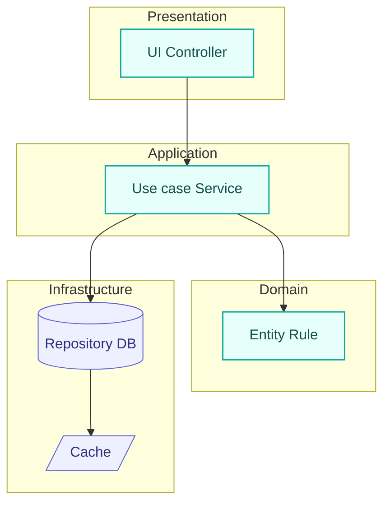
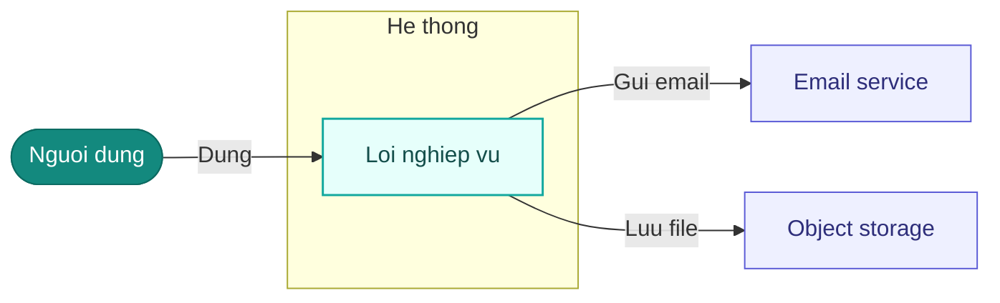
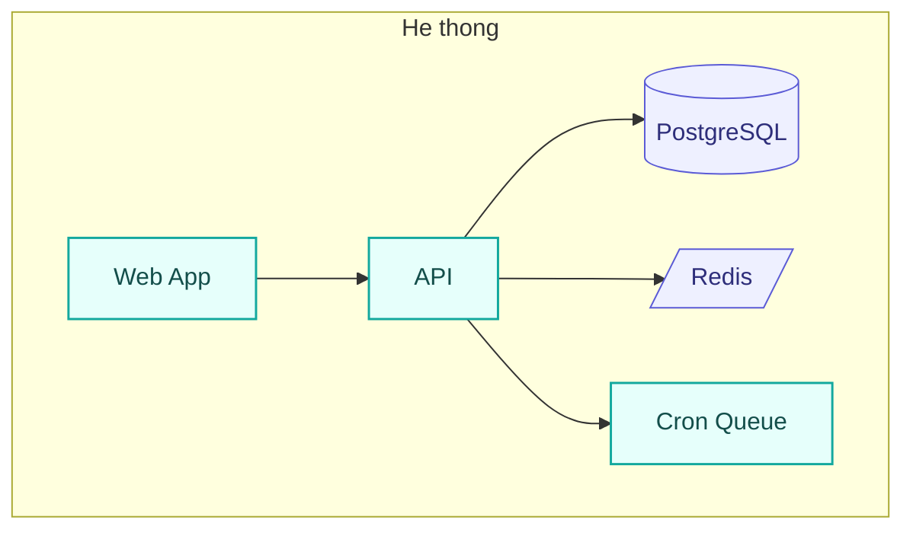

# Kiến trúc kỹ thuật — <Tên dự án>

> Solution/Technical Architecture. Mỗi quyết định trace về `NFR`/ràng buộc trong `01-requirements.md`. Tài liệu sống — đổi qua `ba-change-request` (ADR mới / ADR superseded).
> Cập nhật: <YYYY-MM-DD>.

## 1. Bối cảnh & driver kiến trúc
- **Tóm tắt hệ thống:** <1–2 câu — làm gì, cho ai>.
- **Driver từ NFR/ràng buộc** (kiến trúc phải thoả):

| Driver | Nguồn | Hệ quả kiến trúc |
|--------|-------|------------------|
| Phản hồi p95 ≤ 2s @200 concurrent | NFR-01 | Cache đọc + index + connection pool; tránh N+1 |
| Cách ly dữ liệu tenant | NFR-06 | Tách tenant ở tầng dữ liệu (row-level `org_id` + guard) |
| Dữ liệu tại VN/SG (PDPA) | Ràng buộc §7 | Region cloud ap-southeast-1 |
| MVP 3 tháng | Ràng buộc §7 | Modular-monolith, tránh microservices sớm |

## 2. Stack công nghệ

| Lớp | Công nghệ | Lý do (trace) | ADR |
|-----|-----------|---------------|-----|
| Frontend | <vd Next.js + React> | <SSR cho SEO/tốc độ; hệ sinh thái> | ADR-01 |
| Backend | <vd Node/NestJS> | <cùng ngôn ngữ FE, năng suất> | ADR-01 |
| Database | <vd PostgreSQL> | <quan hệ + tenant isolation + JSON> | ADR-02 |
| Cache | <vd Redis> | <NFR-01 phản hồi nhanh> | ADR-02 |
| Auth | <vd JWT RS256> | <NFR-02> | ADR-03 |

## 3. Kiểu kiến trúc & phân tầng
- **Kiểu:** <monolith / modular-monolith / microservices / serverless> — **lý do**: <khớp quy mô/ràng buộc>.
- **Phân tầng** (quy tắc phụ thuộc: tầng trong không biết tầng ngoài):
  - `presentation` (UI/controller) → `application` (use case/service) → `domain` (entity/rule) → `infrastructure` (DB/API ngoài).


> **`flowchart TB` + `subgraph`** (mỗi subgraph = một tầng). Node compute tô `:::task`, node lưu trữ tô `:::external` và dùng dạng trụ `[("...")]` (DB) / khe `[/"..."/]` (cache/queue) để gợi hình. Nhãn bọc `"..."` → an toàn mọi ký tự đặc biệt. **KHÔNG dùng `architecture-beta`** (render `-beta` không ổn định, không tô `classDef`).

## 4. Sơ đồ ngữ cảnh & khối triển khai

### 4.1 Ngữ cảnh (hệ thống ↔ actor/hệ ngoài — `flowchart LR` + `subgraph`)

> Mỗi actor/hệ là một node, tô theo vai: `:::startend` người dùng · `:::task` hệ mình (gom trong `subgraph`) · `:::external` hệ ngoài. Cạnh mang nhãn quan hệ. Nhãn node bọc `"..."` an toàn cú pháp; nhãn cạnh viết chữ thuần (không `.`/`&`/`()`). **KHÔNG dùng `C4Context`** (render kém ổn định).

### 4.2 Khối triển khai (container — `flowchart TB` + `subgraph`)

> `flowchart TB` + `subgraph` gom cả cụm; node compute `:::task`, lưu trữ `:::external` (DB dạng trụ, cache dạng khe). An toàn cú pháp và tô màu được — thay cho `architecture-beta`.

*(Tùy chọn 4.3 Component cho service chính khi phức tạp — cũng bằng `flowchart` + `subgraph` lồng.)*

## 5. Phân rã component/service
> Map về `F`/module trong `02-functions.md`; ranh giới rõ.

| Module/Service | Chức năng (`F..`) | Trách nhiệm | Phụ thuộc |
|----------------|-------------------|-------------|-----------|
| auth | F01, F02, F12 | Xác thực, session, đăng ký | DB, cache |
| task | F03–F06 | Vòng đời công việc | auth, DB |
| notify | F08, F09 | Thông báo in-app + email | task, queue, mail |

## 6. Dữ liệu & lưu trữ
- **Store chính:** <DB> — link `05-data-model.md`.
- **Cách ly tenant:** <row-level `org_id` + guard / schema-per-tenant> (NFR-06).
- **Migration:** <công cụ>. **Backup/retention:** <chính sách>.

## 7. API & tích hợp
- **Kiểu:** <REST/GraphQL> — link `06-api-spec.md`. **Versioning:** <cách>.
- **Auth/authz:** <JWT + RBAC vai trò Member/Team Lead/Admin> (NFR-02).
- **Hệ ngoài:** <email, storage…> + cơ chế lỗi/timeout/retry.

## 8. Cross-cutting concerns
| Mối quan tâm | Cách xử lý | Trace |
|--------------|-----------|-------|
| Xác thực/phân quyền | <JWT + guard theo vai trò> | NFR-02, FR-01 |
| Logging & observability | <structured log + trace id + metrics> | NFR-04 |
| Xử lý lỗi | <error envelope thống nhất + mã lỗi> | — |
| Bảo mật | <bcrypt cost≥12, HTTPS, rate-limit khoá 5 lần> | NFR-02, NFR-03 |
| Cache | <đối tượng cache, TTL, invalidation> | NFR-01 |

## 9. Triển khai
- **Topo:** <cloud provider + region theo ràng buộc>; môi trường dev/staging/prod.
- **CI/CD:** <pipeline: test→lint→typecheck→build→deploy>. **IaC:** <công cụ nếu có>.
- **Giám sát/cảnh báo:** <uptime NFR-04, log, alert>.

## 10. Cấu trúc thư mục chuẩn
> Nguồn cho file path trong `ba-build` plan và scaffold `dev-run`.

```
src/
  modules/<auth|task|notify>/   # theo phân rã §5
    <feature>.controller.*
    <feature>.service.*
    <feature>.repository.*
  domain/                       # entity + rule
  infrastructure/               # db, cache, mail
  shared/                       # error, logger, guard
tests/
```

## 11. Quyết định kiến trúc (ADR)
> Mỗi quyết định lớn là một ADR. **Trạng thái:** `Draft` → `Accepted` (qua **cổng chốt**) → `Superseded bởi ADR-..` (khi đổi qua CR) · `Deprecated` (không còn khuyến nghị nhưng chưa có gì thay). `ba-build`/`dev-run` chỉ dùng ADR **Accepted**. **ADR bất biến:** đổi ý thì viết ADR mới thay thế, không sửa ADR cũ — quyết định cũ vẫn đúng *với những gì biết lúc đó*. Soát hình bằng `node .claude/skills/ba-architecture/scripts/check-adr.js docs`.

<!--
  LUẬT VIẾT MỘT ADR (đối chiếu create-adr của tech-leads-club, 14/09/2026):
  1. Tiêu đề = CỤM DANH TỪ nêu điều ĐÃ CHỌN ("Stack Next.js + NestJS"), không phải câu hỏi
     ("Nên chọn stack nào?") và không phải hành động ("Chọn stack").
  2. Bối cảnh tả LỰC ép phải chọn (ràng buộc, quy mô, đội ngũ), không tả việc đã làm.
     XẤU: "Cần DB, chọn PostgreSQL."  TỐT: "Cần ACID + JSONB; đội thạo Postgres; RDS trong ngân sách."
  3. Driver = NFR/ràng buộc KÈM CÂU CHỮ — mã không tự đứng được, ba năm sau phải mở file khác.
  4. ≥2 phương án THẬT SỰ đã cân nhắc; luôn xét "(C) Giữ nguyên hiện trạng" khi có nghĩa.
  5. Mỗi phương án bị loại có một dòng "Vì sao không" — người sau sẽ hỏi đúng câu đó.
  6. Hệ quả TÁCH tốt / xấu, và PHẢI có ít nhất một hệ quả xấu. ADR một chiều là ADR không ai tin.
  7. ≤ 500 từ. Dài hơn → chi tiết sang mục kiến trúc tương ứng, ADR chỉ trỏ.
-->

### ADR-01 — <Tên quyết định: cụm danh từ nêu ĐIỀU ĐÃ CHỌN>
- **Ngày:** YYYY-MM-DD · **Trạng thái:** Draft · **Người quyết:** SH-..
- **Bối cảnh:** <tình huống + lực ép phải chọn; 2–4 câu>
- **Driver:** `NFR-..` (<câu chữ của NFR>) · Ràng buộc §7 (<câu chữ>)
- **Phương án:** (A) <..> · (B) <..> · (C) Giữ nguyên hiện trạng
- **Quyết định:** **A** — <vì sao A hơn, bám driver>. **Vì sao không B:** <1 câu>. **Vì sao không C:** <1 câu>
- **Hệ quả tốt:** <..>
- **Hệ quả xấu / phải chấp nhận:** <ít nhất một>
- **Liên kết:** <`05-data-model.md` §..> · Thay thế `ADR-..` *(nếu có)* · `CR-..` *(nếu đổi qua CR)*

### ADR-02 — <..> …

**ADR gọn** — cho quyết định nhỏ dưới ngưỡng (một thư viện, một quy ước), một đoạn theo dạng Y-statement, vẫn đủ trace và mặt xấu:

> **ADR-07 — <Tên>** · Accepted YYYY-MM-DD · SH-.. — *Trong bối cảnh* <tình huống>, *đối mặt* <ràng buộc, `NFR-..`>, *chọn* <phương án>, *để đạt* <thuộc tính chất lượng>, *chấp nhận* <mặt xấu>.

## 12. Rủi ro & đánh đổi
| Rủi ro/đánh đổi | Ảnh hưởng | Giảm thiểu / phương án dự phòng |
|-----------------|-----------|--------------------------------|
| <vd modular-monolith khó scale phần X> | <khi vượt N user> | <tách service X ra khi cần — ranh giới đã chuẩn bị> |

## Giả định
> Trạng thái: Đề xuất → Đã xác nhận / Đã sửa / Đã bỏ. Số chưa chốt gắn `⚠️ chưa xác nhận`.

| GĐ | Nội dung | Vì sao cần | Ảnh hưởng nếu sai | Trạng thái |
|----|----------|-----------|-------------------|------------|
| GĐ-01 | <vd quy mô ~1000 user tổng, 200 concurrent> | Chưa có số thật | Sizing/stack lệch | Đề xuất ⚠️ |

## Thuật ngữ
| Thuật ngữ | Giải thích |
|-----------|-----------|
| ADR (Architecture Decision Record) | Bản ghi một quyết định kiến trúc: bối cảnh, phương án, quyết định, hệ quả |
| Sơ đồ ngữ cảnh / khối triển khai | Hai mức mô tả kiến trúc (tinh thần C4): ngữ cảnh hệ thống ↔ hệ ngoài, và các khối triển khai bên trong — vẽ bằng `flowchart` + `subgraph` |
| Modular-monolith | Một khối triển khai nhưng chia module ranh giới rõ, dễ tách sau |
| Tenant isolation | Cách ly dữ liệu giữa các tổ chức trong hệ đa tổ chức |
| IaC (Infrastructure as Code) | Khai báo hạ tầng bằng code (Terraform…) |

> Từ điển đầy đủ toàn dự án: `docs/Ho-so/00-glossary.md`.
