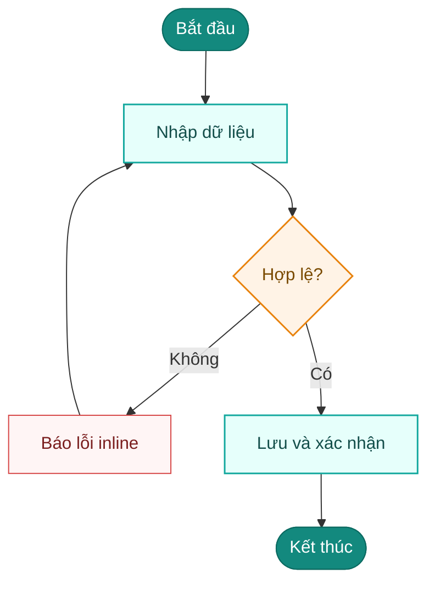
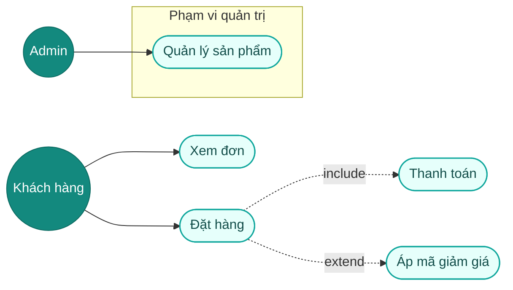
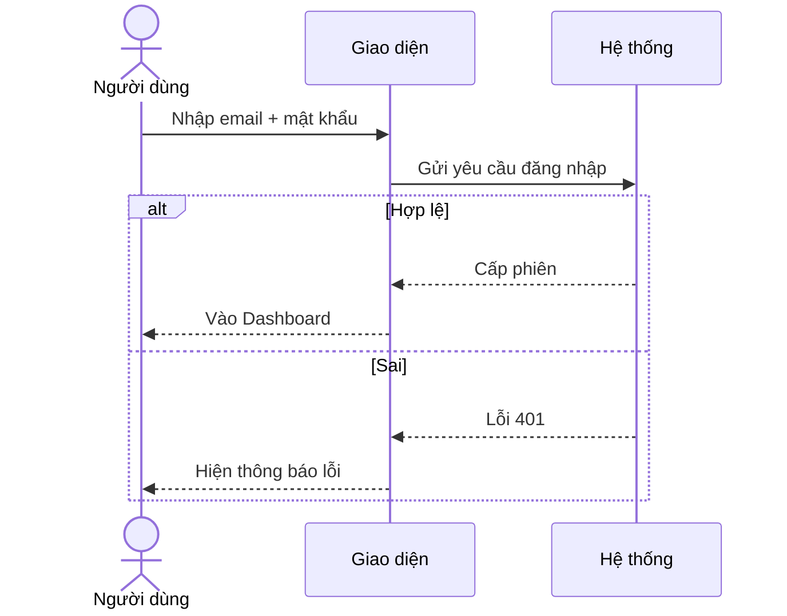
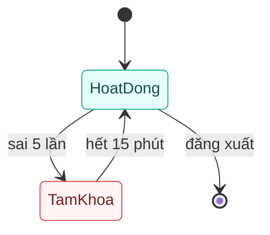
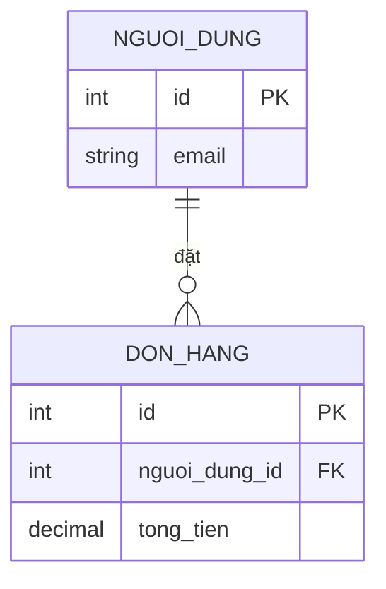
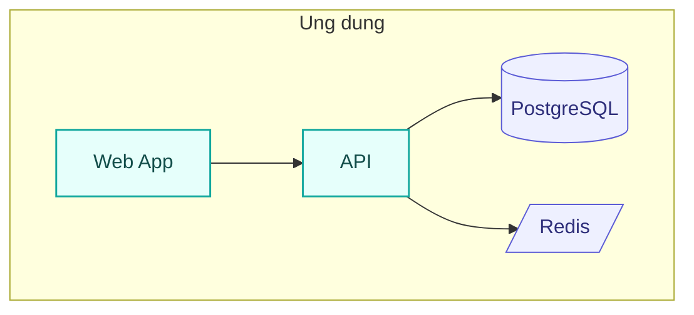
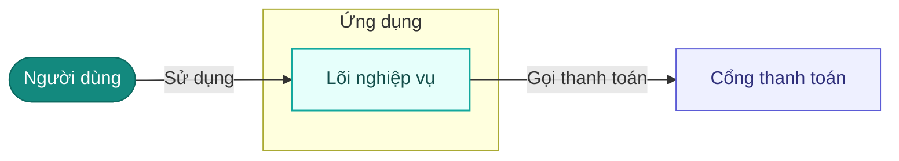
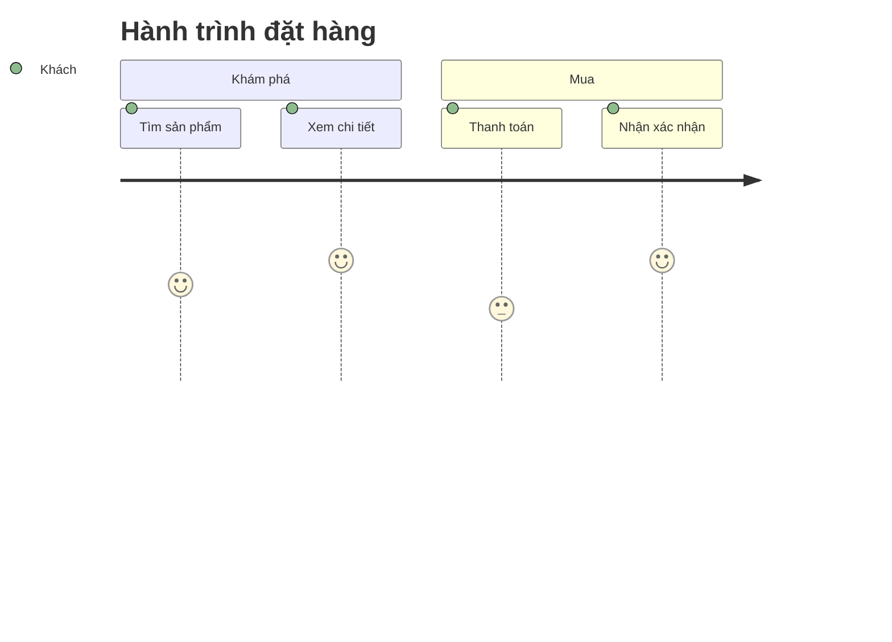
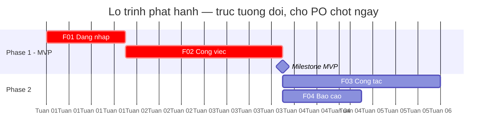

# Recipes — cách vẽ từng loại sơ đồ Mermaid

> Dùng bởi `ba-diagram` sau khi đã CHỌN loại (bước 2). Mỗi loại: *khi nào · cách vẽ · template · tô màu*. Mọi template tuân "Sơ đồ Mermaid — an toàn cú pháp" trong `conventions.md`.
>
> **Tô màu (áp cho swimlane/flowchart/state):** gắn `:::role` sau node + paste khối `classDef` cuối sơ đồ. Bộ mặc định dưới đây; **có `07-design-system.md` → thay bằng khối theo token**. `sequenceDiagram`/`erDiagram`/`journey`/`gantt` KHÔNG nhận `classDef` → chỉ house theme. *(Sơ đồ kiến trúc & ngữ cảnh nay dùng `flowchart` + `subgraph` nên tô `classDef` được — xem mục 7.)*
>
> ```
>   classDef task fill:#e6fffb,stroke:#13a89e,stroke-width:1.5px,color:#134e4a
>   classDef decision fill:#fff3e6,stroke:#e8820c,stroke-width:1.5px,color:#7a4a00
>   classDef startend fill:#13897e,stroke:#0c6b62,color:#ffffff
>   classDef external fill:#eef0ff,stroke:#5b5bd6,color:#2e2e7a
>   classDef error fill:#fff5f5,stroke:#d64545,color:#7a1f1f
> ```

---

## 1. Swimlane — `swimlane-beta` ⭐ (luồng ≥2 vai trò)
**Khi nào:** quy trình nghiệp vụ có **≥2 vai trò/tác nhân** làm bước khác nhau, có bàn giao. **KHÔNG dùng flowchart cho loại này** (giấu vai trò).
**Cách vẽ:** mỗi vai trò một `subgraph` = lane; node đặt trong lane người thực hiện; mũi tên chéo lane = bàn giao; nhãn cạnh `-->|nhãn|`. Cần Mermaid ≥ 11.16.
**Hướng — đếm node TRƯỚC khi chọn:** ≤ 8 node → `swimlane-beta LR` (lane là hàng ngang, đọc trái→phải). **> 8 node hoặc ≥ 4 lane → `swimlane-beta TD`** (lane là cột, sơ đồ dài xuống — trang cuộn dọc tự nhiên; LR với 13–25 node bị bóp bề rộng, chữ cắt, portal cuộn ngang — đo trên dự án helpdesk/dự án desktop 16/09/2026). Lint của `ba-portal` cảnh báo LR quá 8 node.
```mermaid
swimlane-beta LR
  subgraph KH[Khách hàng]
    A([Bắt đầu]):::startend --> B[Gửi yêu cầu]:::task
  end
  subgraph HT[Hệ thống]
    C[Kiểm tra hợp lệ]:::task --> D{"Cần duyệt?"}:::decision
  end
  subgraph QL[Quản lý]
    E[Duyệt]:::task --> F([Kết thúc]):::startend
  end
  B --> C
  D -->|Không| F
  D -->|Có| E
  classDef task fill:#e6fffb,stroke:#13a89e,stroke-width:1.5px,color:#134e4a
  classDef decision fill:#fff3e6,stroke:#e8820c,stroke-width:1.5px,color:#7a4a00
  classDef startend fill:#13897e,stroke:#0c6b62,color:#ffffff
```

## 2. Activity — `flowchart TD` (quy trình 1 tác nhân)
**Khi nào:** quy trình **một tác nhân** có rẽ nhánh/quyết định/loop. Đa vai → dùng swimlane.
**Cách vẽ:** `([...])` bắt đầu/kết thúc; `[...]` bước; `{...}` quyết định (≥2 nhánh có nhãn `-- Có -->`); loop nối ngược về node trước.


## 3. Use case — `flowchart LR`
**Khi nào:** tổng quan **tác nhân ↔ chức năng** (ai làm được gì), phạm vi hệ thống. Chi tiết 1 luồng → sequence/activity.
**Cách vẽ:** actor `((...))`; use case `([...])`; nối actor → use case. **`include`/`extend`** vẽ bằng cạnh dotted có nhãn `-. include .->` / `-. extend .->` (nhãn cạnh chữ thuần). **Nhóm/phạm vi** dùng `subgraph`. (Mermaid không có use-case chuẩn UML — đây là bản gần nhất; muốn native `<<include>>` phải dùng công cụ ngoài, xem mục 10.)


## 4. Sequence — `sequenceDiagram`
**Khi nào:** tương tác **theo thời gian** giữa các bên (user/hệ thống/dịch vụ ngoài); có async/callback/error path.
**Cách vẽ:** khai `actor`/`participant`; `->>'` gọi, `-->>` phản hồi; `alt/else`, `opt`, `loop` cho nhánh. **Không** `classDef` (dùng house theme). Tránh `;` và `:` thừa trong message.


## 5. State — `stateDiagram-v2`
**Khi nào:** **vòng đời trạng thái** của một đối tượng (≥3 trạng thái, có trigger). 2 trạng thái → bảng đủ.
**Cách vẽ:** `[*]` đầu/cuối; `A --> B: trigger`. Tô màu bằng `classDef` + dòng `class` (KHÔNG dùng `:::` cho state), state lỗi/khoá → `error`, còn lại → `task`; `[*]` để nguyên.


## 6. ERD — `erDiagram`
**Khi nào:** **thực thể & quan hệ** dữ liệu (≥2 thực thể, có cardinality). Có SQL DDL → theo recipe "SQL DDL → erDiagram" của `ba-data-model`.
**Cách vẽ:** quan hệ `A ||--o{ B : "nhãn"` (nhãn bọc `"..."`); khối thực thể liệt kê thuộc tính + `PK`/`FK`. **Không** `classDef`. Mỗi thực thể có PK; n-n tách bảng nối.


## 7. Kiến trúc

### 7a. Phân tầng / khối triển khai / topo service — `flowchart TB` + `subgraph` ⭐
**Khi nào:** **phân tầng** (presentation→application→domain→infra), **khối triển khai** (app/DB/cache/queue), topo service (dùng ở `10-architecture`, `11-integration`).
**Cách vẽ:** mỗi `subgraph id["Tên tầng/vùng"]` gom các node thành phần; node compute tô `:::task`, node lưu trữ tô `:::external` và dùng dạng trụ `id[("DB")]` / khe `id[/"Cache"/]` để gợi hình. Cạnh flowchart thường (`-->`).
**Vì sao KHÔNG `architecture-beta`:** render `-beta` không ổn định, nhãn vỡ với `+ . - / ( ) :`, không tô `classDef`. `flowchart` bọc `"..."` an toàn mọi ký tự và tô màu được.


### 7b. Ngữ cảnh (người dùng ↔ hệ thống ↔ hệ ngoài) — `flowchart LR` + `subgraph`
**Khi nào:** **bối cảnh** hệ thống — actor người dùng, hệ mình, hệ ngoài. Mỗi cái một node, tô `classDef` theo vai (`:::startend` người dùng · `:::task` hệ mình · `:::external` hệ ngoài); cạnh mang nhãn quan hệ (chữ thuần).
**Vì sao KHÔNG `C4Context`:** notation C4 render kém ổn định và không tô `classDef`. `flowchart` + `subgraph` cho cùng thông tin, ổn định, tô màu được.


## 8. Journey — `journey`
**Khi nào:** **hành trình người dùng** kèm mức hài lòng theo từng bước (UX). Cần rẽ nhánh logic → activity.
**Cách vẽ:** `section`; mỗi bước `Tên: điểm(1-5): actor`.


## 9. Gantt — `gantt`
**Khi nào:** **tiến độ/timeline** (giai đoạn, mốc, chạy song song). Mô tả logic quy trình → activity.
**Cách vẽ:** `dateFormat` + `axisFormat`; mỗi `section` = 1 phase; task `Tên :tag, id, start|after, dur`.
**Song song:** task độc lập trong cùng phase cho **cùng mốc `after <cái nền>`** (KHÔNG nối chuỗi) → thanh chồng thời gian = song song. Chỉ `after` cho phụ thuộc thật. Chốt phase bằng `:milestone`; đường-găng/Must gắn `:crit`.
**Trục tương đối** (không cam kết ngày): `axisFormat Tuan %W` (nhãn tuần) + title ghi "chờ chốt ngày". **`gantt` KHÔNG nhận `classDef`** — chỉ house theme + tag `:crit/:active/:done`; tránh dấu `:` trong tên task (Mermaid cắt tại `:`).

> `F03` và `F04` cùng `after f02` → chạy **song song** (không phụ thuộc nhau).

## 10. Loại cần ENGINE NGOÀI — dùng bản Mermaid thay thế
Vài loại sơ đồ phổ biến **không có trong Mermaid** (cần PlantUML/BPMN-engine/D2/DBML — toolkit này cố ý KHÔNG dùng để giữ zero-dependency). Khi người dùng yêu cầu chúng, **giải thích + vẽ bản Mermaid tương đương** (hoặc báo rõ nếu bắt buộc chuẩn gốc thì phải dùng công cụ ngoài):

| Yêu cầu (loại gốc) | Engine gốc | Bản Mermaid thay thế trong toolkit | Ghi chú |
|---|---|---|---|
| **BPMN 2.0** (gateway ◇, pool/lane chuẩn OMG, import Camunda/Bizagi) | BPMN engine | **`swimlane-beta`** (luồng đa vai, lane thật) hoặc `flowchart` + subgraph | Mermaid không xuất `.bpmn`. Bắt buộc chuẩn OMG / import workflow-engine → phải dùng công cụ BPMN ngoài. |
| **Schema DBML** (kiểu DB thật, enum/index, export SQL, dbdiagram.io) | DBML CLI | **`erDiagram`** + recipe **"SQL DDL → erDiagram"** của `ba-data-model` | Mermaid không xuất DBML/SQL. Cần bàn giao schema chạy được cho dev → dùng DBML ngoài. |
| **D2 Activity** (layout ELK đẹp standalone) | D2 binary | **`flowchart`/`swimlane-beta`** (mục 1–2) | Khác biệt chỉ là độ bóng layout; nội dung nghiệp vụ như nhau. |
| **D2 ERD** (hình đẹp PK/FK standalone) | D2 binary | **`erDiagram`** (mục 6) | — |
| **D2 Architect** (kiến trúc container lồng, icon) | D2 binary | **`flowchart` + `subgraph` lồng** (mục 7a) | Cần **icon hãng cụ thể** (AWS/K8s logo) → công cụ ngoài; bản Mermaid dùng nhãn chữ + màu phân vai, không icon. |
| **Use case native UML** (`<<include>>`/`<<extend>>`/actor/package chuẩn) | PlantUML | **`flowchart LR`** enhanced (mục 3) | Bản Mermaid mô phỏng include/extend bằng cạnh dotted; đủ cho tài liệu BA. |

> **Nguyên tắc:** đừng im lặng vẽ sai loại; nói rõ "Mermaid không có {X} gốc, em vẽ bản {Y} tương đương — nếu anh cần chuẩn {X} thật (import tool/export SQL) thì phải dùng {engine} ngoài".

---

## Chốt nhanh
> **Đếm vai trò trước.** ≥2 vai có bàn giao → **swimlane**. 1 tác nhân + rẽ nhánh → activity. Theo thời gian → sequence. Trạng thái → state. Dữ liệu → erDiagram. Kiến trúc **phân tầng/triển khai/service** **và ngữ cảnh** → **`flowchart` + `subgraph`** (tô màu phân vai; KHÔNG dùng architecture-beta/C4Context). Hành trình → journey. Tiến độ → gantt. Sau khi vẽ: tô màu (nếu là node-diagram) + đối chiếu coverage.
