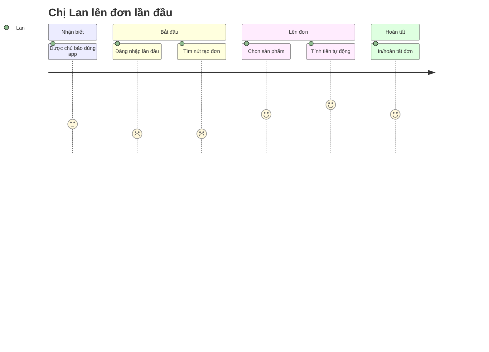

# Template — `docs/Ho-so/00-personas.md`

```markdown
# Chân dung người dùng & Hành trình (URD)

> User Requirements Document: personas + user journey. Đầu vào cho `01-requirements.md` — mỗi nỗi đau/cơ hội là ứng viên `StR`/`FR`.

## Personas

### PS-01 — Chị Lan, Nhân viên bán hàng *(persona CHÍNH)*
| | |
|---|---|
| **Bối cảnh** | 32 tuổi, cửa hàng bán lẻ, đứng quầy, dùng điện thoại nhiều hơn máy tính |
| **Mục tiêu** | Lên đơn nhanh cho khách, không để khách chờ |
| **Nỗi đau hiện tại** | Ghi tay dễ nhầm giá; cuối ngày cộng sổ mất 1 tiếng |
| **Nhu cầu** | Tạo đơn < 30 giây; xem tồn kho tức thì; tính tiền tự động |
| **Độ rành công nghệ** | Trung bình — quen app đặt đồ ăn, ngại thao tác nhiều bước |
| **Thiết bị / tần suất** | Điện thoại Android, dùng liên tục trong ca |
| **Câu nói** | *"Khách đông thì tôi không có thời gian bấm 5 màn hình."* |

→ *ứng viên:* **U-01** tạo đơn 1 màn · **U-02** tra tồn kho realtime · **U-03** tự tính tiền.

### PS-02 — Anh Minh, Chủ cửa hàng *(phụ)*
| | |
|---|---|
| **Mục tiêu** | Nắm doanh thu, tồn kho mọi lúc |
| **Nỗi đau** | Không biết lãi/lỗ tới cuối tháng |
| **Nhu cầu** | Báo cáo doanh thu theo ngày trên điện thoại |

→ *ứng viên:* **U-04** dashboard doanh thu · **U-05** cảnh báo hết hàng.

## Hành trình — PS-01 · "Lên đơn cho khách" (lần đầu dùng app)



| Giai đoạn | Hành động | Suy nghĩ | Cảm xúc | Nỗi đau | Cơ hội (→ FR) |
|-----------|-----------|----------|---------|---------|----------------|
| Bắt đầu | Đăng nhập lần đầu | "Mật khẩu ở đâu?" | 😣 2 | Không rõ đăng nhập kiểu gì | Đăng nhập bằng SĐT + OTP → FR |
| Bắt đầu | Tìm nút tạo đơn | "Nút đâu rồi?" | 😐 2 | Menu rối | Nút tạo đơn nổi bật → FR |
| Lên đơn | Tính tiền | "Ồ tự cộng luôn" | 😍 5 | — | (giữ điểm mạnh) |

## Ứng viên yêu cầu (tổng hợp)
| Mã | Ứng viên | Từ persona | Bằng chứng nguồn | Đề xuất |
|---|---|---|---|---|
| U-01 | Tạo đơn trong 1 màn | PS-01 | Journey bước "tìm nút tạo đơn" cảm xúc 2 | Đưa vào `ba-requirements` |
| U-04 | Dashboard doanh thu theo ngày | PS-02 | Nỗi đau "không biết lãi/lỗ tới cuối tháng" | Đưa vào `ba-requirements` |

> Bảng này liệt kê **ĐỦ mọi `U-..`** đã nêu rải rác ở phần personas/journey (ví dụ trên rút gọn 2 dòng cho gọn) — bước sau nhặt ở đây, không phải lục lại từng journey.
> Dự án ĐÃ có `01-requirements` (chạy bổ sung ngược): đối chiếu `FR` hiện có trước — cái nào thật sự chưa phủ thì **mở CR**, không sửa thẳng yêu cầu.

## Ma trận persona × chức năng (tùy chọn)
| | PS-01 | PS-02 |
|---|---|---|
| Tạo đơn | ✅ chính | — |
| Báo cáo doanh thu | — | ✅ chính |

## Thuật ngữ
| Thuật ngữ | Giải thích |
|-----------|-----------|
| Persona | Chân dung đại diện cho một nhóm người dùng thật |
| User journey | Bản đồ các bước + cảm xúc người dùng khi đạt mục tiêu |
| Pain point | Điểm khó chịu/cản trở trong trải nghiệm hiện tại |
| StR (Stakeholder Requirement) | Yêu cầu ở góc nhìn người dùng/bên liên quan |

> Từ điển đầy đủ toàn dự án: `docs/Ho-so/00-glossary.md`.
```

## Ghi chú khi điền
- **3–5 persona** là đủ cho hầu hết dự án; nhiều na ná nhau = chia nhóm sai.
- Journey **thuần cảm xúc** vẽ `journey`; có rẽ nhánh/quyết định thì là luồng nghiệp vụ → swimlane/flowchart.
- Mỗi nỗi đau/cơ hội gắn **"→ FR"** để `ba-requirements` nhặt — đừng để insight rơi.
