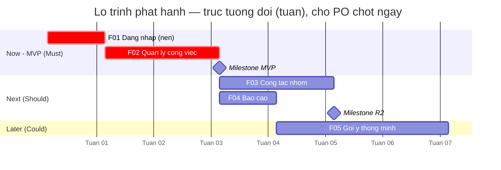
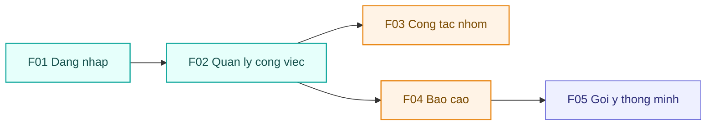

# Lộ trình phát hành — <Tên App>

## 1. Bối cảnh & mục tiêu lộ trình
- **Bối cảnh/nguồn:** <tóm tắt từ `00-vision.md` / `01-requirements.md` — vấn đề, đối tượng, scope>.
- **Mục tiêu lộ trình:** <điều roadmap muốn đạt — vd "ra MVP trong Now, mở rộng cộng tác ở Next">.
- **Chân trời thời gian:** Now (<khung>) · Next (<khung>) · Later (<khung>). *(Now/Next/Later thay cho ngày cứng — roadmap là tài liệu sống.)*
- **Thang đo RICE dùng trong tài liệu này:**
  - **Reach** — <vd số người dùng chạm/kỳ>.
  - **Impact** — <vd 3 = rất cao · 2 = cao · 1 = vừa · 0.5 = thấp · 0.25 = tối thiểu>.
  - **Confidence** — <% tin cậy: 100% / 80% / 50%>.
  - **Effort** — <vd person-week hoặc person-month>.
  - **RICE** = (Reach × Impact × Confidence) / Effort.

## 2. Bảng ưu tiên
> Mỗi chức năng `F..` trace về `docs/02-functions.md`. RICE = (Reach × Impact × Confidence) / Effort. Số chưa chốt gắn `⚠️`.

| Mã F | Chức năng | MoSCoW | Reach | Impact | Confidence | Effort | RICE | Kano | Release |
|------|-----------|--------|-------|--------|------------|--------|------|------|---------|
| F01 | <Đăng nhập> | Must | 1000 | 2 | 100% | 2 | 1000 | must-be | Now |
| F02 | <Quản lý công việc> | Must | 800 | 3 | 80% | 5 | 384 | performance | Now |
| F05 | <Gợi ý thông minh> | Could | 300 | 1 | 50% ⚠️ | 4 | 37.5 | delighter | Later |

## 3. Lộ trình phát hành (Now / Next / Later)

### Now — <tên release / MVP>
- **Mục tiêu:** <giá trị cốt lõi release này giao>.
- **Chức năng:** F01, F02, <…>.
- **Tiêu chí ra mắt:** <điều kiện phát hành — vd "luồng chính chạy end-to-end, đã test, không lỗi Chặn">.

### Next — <tên release>
- **Mục tiêu:** <…>.
- **Chức năng:** F03, F04, <…>.
- **Tiêu chí ra mắt:** <…>.

### Later — <tên release / tầm nhìn>
- **Mục tiêu:** <…>.
- **Chức năng:** F05, <…>.
- **Tiêu chí ra mắt:** <…>.

## 4. Sơ đồ lộ trình

### 4.1 Gantt đa phase (thời gian + song song)
> Mỗi phase = 1 `section`; mỗi `F..` = 1 task. **Chức năng độc lập trong cùng phase cho cùng mốc `after <cái nền>` → chạy SONG SONG** (thanh chồng thời gian). Chỉ `after` cho phụ thuộc THẬT. Trục **tương đối** (tuần) — chờ PO chốt ngày. `:crit` = đường-găng/Must, `:milestone` = mốc chốt phase. **Không** paste `classDef` vào `gantt`.

> **Song song ở đây:** `F03` và `F04` cùng `after f02` (không phụ thuộc nhau) → hai thanh khởi động cùng lúc, chạy song song trong phase Next. Nếu chúng phụ thuộc nhau thật thì mới nối `F04 :after f03`.

### 4.2 Sơ đồ phụ thuộc
> Node = chức năng `F..` (hoặc release); cạnh = "phụ thuộc vào". Tô màu theo release. Kiểm: không phụ thuộc vòng lặp, mọi `F..` có mặt. Thứ tự phase ở Gantt (4.1) phải khớp phụ thuộc ở đây.

## Giả định
> Trạng thái mỗi dòng: Đề xuất → Đã xác nhận / Đã sửa / Đã bỏ. Số chưa chốt gắn `⚠️ chưa xác nhận`.

| GĐ | Nội dung | Vì sao cần (chỗ thiếu) | Ảnh hưởng nếu sai | Trạng thái | Giá trị chốt |
|----|----------|------------------------|-------------------|------------|--------------|
| GĐ-01 | Reach F05 ≈ 300 người/tháng | Chưa có số liệu thị trường | RICE lệch → xếp sai release | Đề xuất ⚠️ | — |

## Thuật ngữ
| Thuật ngữ | Giải thích |
|-----------|-----------|
| MoSCoW | Cách xếp ưu tiên: Must / Should / Could / Won't |
| RICE | Điểm ưu tiên = (Reach × Impact × Confidence) / Effort |
| Reach / Impact / Confidence / Effort | Tầm phủ / Mức tác động / Độ tin cậy / Công sức — bốn yếu tố của RICE |
| Kano | Mô hình phân loại tính năng: must-be (phải có) / performance (càng nhiều càng tốt) / delighter (gây thích thú) |
| Now / Next / Later | Ba chân trời của lộ trình thay cho ngày cứng |
| Gantt | Sơ đồ thanh ngang theo thời gian; mỗi phase một nhóm, thanh chồng nhau = chạy song song |
| Đường-găng (critical path) | Chuỗi task quyết định tổng thời gian; chậm một task ở đây là chậm cả lộ trình |
| PO (Product Owner) | Người sở hữu sản phẩm, quyết ưu tiên backlog |

> Từ điển đầy đủ toàn dự án: `docs/Ho-so/00-glossary.md`.
