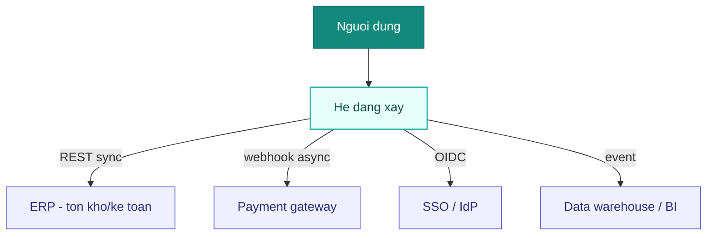
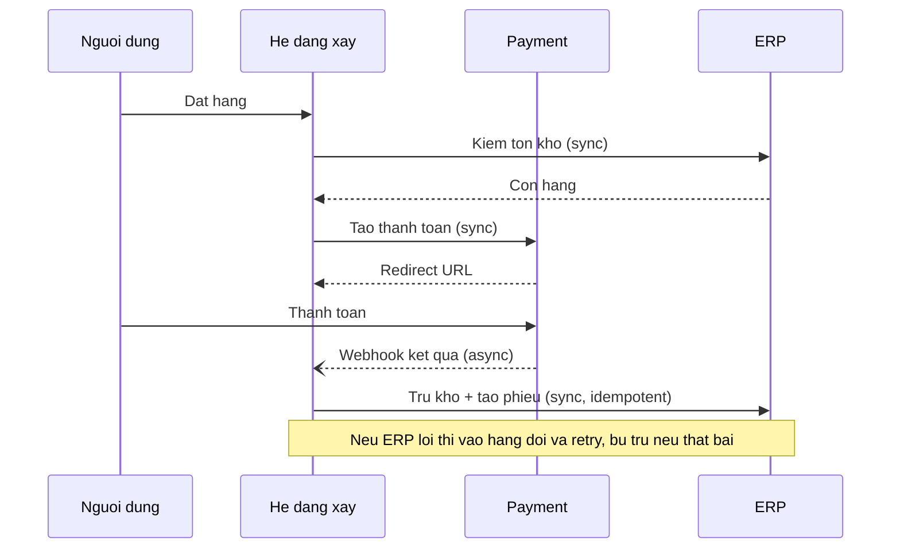

# Kiến trúc tích hợp — <Tên dự án>

> Integration Architecture cho hệ tích hợp nhiều hệ thống. Bổ trợ `10-architecture.md` (nội tại từng hệ). Mỗi tích hợp trace về `FR`/`NFR`. Tài liệu sống — đổi qua `ba-change-request`.
> Cập nhật: <YYYY-MM-DD>.

## 1. Bối cảnh tích hợp
- **Vì sao tích hợp nhiều hệ:** <1–2 câu>.
- **Driver từ NFR/ràng buộc:** <SLA đối tác, dữ liệu ở đâu, bảo mật biên, tần suất/volume>.

## 2. Kiểm kê hệ thống

| Hệ | Loại | Vai trò | Chủ sở hữu | SLA/tin cậy |
|----|------|---------|-----------|-------------|
| <Hệ đang xây> | Tự xây | <lõi nghiệp vụ> | Nội bộ | — |
| <ERP> | Ngoài | <tồn kho, kế toán> | Phòng TC | 99.5%, bảo trì CN |
| <Payment> | Đối tác | <thanh toán> | <NCC> | 99.9%, webhook |
| <SSO/IdP> | Ngoài | <xác thực> | IT | — |

## 3. System Landscape (flowchart + subgraph — zoom-out cả cụm)

## 4. Bảng hợp đồng tích hợp
> Mỗi tích hợp một dòng. Sync = request-reply; Async = event/queue/webhook/batch. Trace `FR`/`NFR`. **Trạng thái:** Draft → Accepted qua **cổng chốt** (`conventions.md`); build/dev chỉ scaffold theo bản **Accepted**.

| # | Nguồn → Đích | Giao thức | Sync/Async | Dữ liệu (chiều) | Trigger/Tần suất | SLA | Auth | Lỗi + Retry + Idempotency | Trace |
|---|--------------|-----------|-----------|-----------------|------------------|-----|------|---------------------------|-------|
| I1 | Hệ → ERP | REST/JSON | Sync | Đơn hàng → | Khi tạo đơn | p95 1s | OAuth2 CC | Retry 3× backoff; idem-key = orderId | FR-.., NFR-.. |
| I2 | Payment → Hệ | Webhook | Async | Kết quả TT ← | Sự kiện | ≤5s | HMAC chữ ký | Verify chữ ký; dedupe theo txnId; DLQ | FR-.. |
| I3 | Hệ → DWH | Event (Kafka) | Async | Sự kiện nghiệp vụ → | Realtime | — | mTLS | At-least-once; consumer idempotent | NFR-.. |

## 5. Mẫu tích hợp đã chọn
- **Kiểu tổng:** <điểm-điểm / API gateway / ESB / event-bus (pub-sub) / batch> — **lý do** (khớp quy mô): <…>.
- **Giao dịch xuyên hệ:** <orchestration (saga có điều phối) / choreography (event) / không có> — cơ chế **bù trừ (compensation)**: <…>.
- *(Đừng over-engineer: nêu rõ nếu cố ý chọn đơn giản cho số tích hợp hiện tại.)*

## 6. Sở hữu dữ liệu & Master Data (MDM)
> Mỗi thực thể chính chỉ **một** hệ nguồn-sự-thật (system of record).

| Thực thể | Nguồn-sự-thật | Hệ tiêu thụ | Chiều đồng bộ | Độ trễ chấp nhận | Xử lý xung đột |
|----------|---------------|-------------|---------------|------------------|----------------|
| Khách hàng | CRM | Hệ, ERP | CRM → * | ≤5 phút | CRM thắng |
| Tồn kho | ERP | Hệ | ERP → Hệ | realtime | — |
| Đơn hàng | Hệ | ERP, BI | Hệ → * | realtime | — |

## 7. Luồng xuyên hệ then chốt
> `sequenceDiagram` cho quy trình end-to-end qua nhiều hệ. Chỉ rõ sync/async, timeout, bù trừ.

## 8. Resilience & vận hành biên
| Mối quan tâm | Cách xử lý |
|--------------|-----------|
| Hệ ngoài chậm/sập | Timeout + circuit breaker + degrade/cache |
| Mất message | Queue bền + **DLQ** + replay |
| Trùng lặp | **Idempotency key** + dedupe |
| Contract đổi | Versioning + backward-compat + deprecation policy |
| Truy vết lỗi xuyên hệ | Correlation/trace id lan theo mọi hop |
| Quá tải | Rate-limit + backpressure |

## 9. Rủi ro tích hợp & dự phòng
| Rủi ro | Ảnh hưởng | Dự phòng |
|--------|-----------|----------|
| Payment gateway down | Không thu tiền | Hàng đợi + retry; báo người dùng; đối soát sau |
| Đối tác đổi API không báo | Vỡ tích hợp | Version pin + contract test + cảnh báo |
| Lệch dữ liệu ERP↔Hệ | Sai tồn kho | Đối soát định kỳ + nguồn-sự-thật rõ (MDM §6) |

## Giả định
| GĐ | Nội dung | Vì sao cần | Ảnh hưởng nếu sai | Trạng thái |
|----|----------|-----------|-------------------|------------|
| GĐ-01 | SLA payment webhook ≤5s | Chưa có cam kết đối tác | Thiết kế timeout/retry lệch | Đề xuất ⚠️ |

## Thuật ngữ
| Thuật ngữ | Giải thích |
|-----------|-----------|
| ESB (Enterprise Service Bus) | Trục tích hợp trung tâm định tuyến/biến đổi message giữa các hệ |
| Pub/Sub (event-bus) | Bên phát sự kiện, nhiều bên đăng ký nhận — bất đồng bộ, lỏng ghép |
| DLQ (Dead-Letter Queue) | Hàng đợi chứa message xử lý thất bại để xử lý lại/điều tra |
| Idempotency | Gọi lại nhiều lần cho cùng kết quả — chống trùng khi retry |
| MDM / System of Record | Quản trị dữ liệu chủ; hệ là nguồn-sự-thật cho một thực thể |
| Saga | Giao dịch xuyên hệ chia nhiều bước, thất bại thì bù trừ (không 2PC) |
| CDC (Change Data Capture) | Bắt thay đổi dữ liệu ở nguồn để đồng bộ sang hệ khác |

> Từ điển đầy đủ toàn dự án: `docs/Ho-so/00-glossary.md`.
