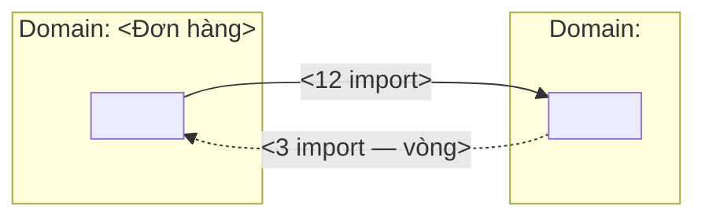
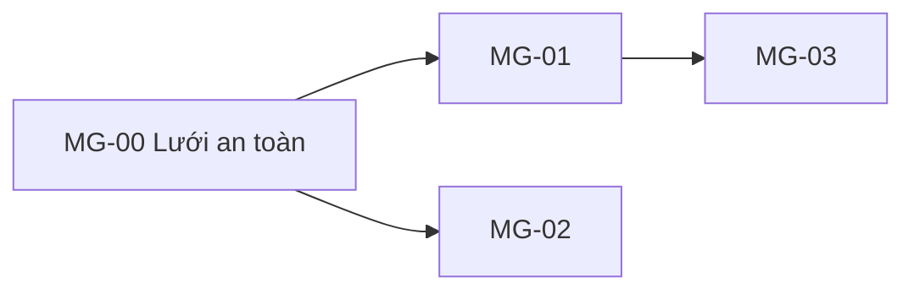

# Lộ trình tách / đổi codebase — <Tên dự án>

> **Ảnh chụp** lúc chạy `ba-migration` ngày `<YYYY-MM-DD>` · gốc code `<đường dẫn --root>` · nhánh `<git branch>` · hồ sơ `<full|lite|mini>` · phạm vi `<full|docs>`.
> Nguồn số: `scan-coupling.js` (module · cạnh import · churn `<N>` ngày · đồng-đổi). Nguồn phán: LLM đọc code + `02-functions.md` + `10-architecture.md` (nếu có).
> **Lộ trình là tài liệu bàn giao** — đội dev/đối tác cầm file này để làm; mỗi bước `MG-..` là một lát quan sát được, không phải một "tầng".
> Hướng đi (`<tách monolith | đập cũ xây mới | đổi stack | gộp service | hiện đại hoá tại chỗ>`) là **kết luận từ bằng chứng §2**, không phải lựa chọn trước.

**Mức tin cậy:** 🟢 đo được bằng script · 🔶 suy từ đọc code (cần người xác nhận) · ❓ chưa biết, cần hỏi (đội/deploy/SLA)

## 1. Bản đồ domain — code thật đang chia thế nào

> Mỗi module `scan-coupling.js` liệt kê được gán về **một** domain nghiệp vụ và các `F..` của `02-functions.md` mà nó thực thi. Module không gán được → domain `❓ chưa rõ`, không đoán. Không có `02-functions.md` → cột `F..` ghi `—` và đề nghị chạy `ba-reverse`.

| Module (thư mục) | File · dòng | Domain nghiệp vụ | Loại | `F..` thực thi | Bảng dữ liệu chạm | Tin cậy |
|---|---|---|---|---|---|---|
| `<src/orders>` | `<12 · 1 840>` | `<Đơn hàng>` | `<Lõi \| Hỗ trợ \| Chung>` | `<F03, F04>` | `<orders, order_items>` | `<🟢/🔶/❓>` |

*Loại* theo DDD chiến lược: **Lõi** (lợi thế cạnh tranh, hay đổi) · **Hỗ trợ** (nghiệp vụ riêng nhưng không khác biệt) · **Chung** (auth, mail, log — mua/ngoài được). Loại quyết định độ **hay đổi** kỳ vọng ở §2.

> Sơ đồ: mỗi domain một `subgraph`, cạnh = import có số, cạnh ngược của vòng vẽ nét đứt. Tiếng Việt có dấu ở nhãn; ID node ASCII.

**Lệch giữa code và tài liệu** (chỉ khi có `02-functions.md`): `F..` không module nào thực thi → `<danh sách>` · module không thuộc `F..` nào → `<danh sách>` → đây là đầu vào cho `ba-reverse`/`ba-change-request`, không tự sửa ở đây.

## 2. Ghép nối — ba chiều mạnh · xa · hay đổi

> Số cạnh/chiều/churn/đồng-đổi lấy **nguyên** từ script (🟢). Độ **mạnh** phải đọc code để xếp: `xâm nhập` (đọc DB/bảng của module khác, đụng biến nội bộ) > `chức năng` (cùng rule nghiệp vụ nhân đôi, phải deploy cùng lúc, transaction chung) > `mô hình` (dùng thẳng entity/enum nội bộ của bên kia) > `hợp đồng` (DTO/API riêng cho tích hợp — mức lý tưởng). **Xa** = khác container/khác deploy/khác đội (hỏi người). **Hay đổi** = churn `<N>` ngày + loại domain.

| Cặp | Cạnh A→B / B→A | Chiều | Mạnh (đọc code) | Bằng chứng | Xa | Churn A / B | Đồng-đổi | Cân bằng |
|---|---|---|---|---|---|---|---|---|
| `<src/orders ↔ src/billing>` | `<12 / 3>` | `<↔>` | `<mô hình>` | `<src/billing/invoice.ts:14 import Order entity>` | `<gần — cùng container, cùng deploy>` | `<18 / 9>` | `<7>` | `<🔴 mạnh+xa+hay đổi \| 🟠 mạnh+gần+hay đổi trộn domain \| 🟡 mạnh nhưng ổn định \| 🟢 cân bằng>` |

Bảng cân bằng (đọc từ `references/ghep-noi-3-chieu.md`): **mạnh + xa + hay đổi = 🔴 tách trước** · mạnh + gần + hay đổi = cùng domain thì 🟢 (đổi cùng, ở cùng), khác domain thì 🟠 (trộn) · mạnh + xa + ổn định = 🟡 chấp nhận được (tích hợp legacy) · yếu + xa = 🟢.

**Top 5 cặp nguy hiểm** (ưu tiên = cạnh × churn, có vòng thì lên đầu):

| # | Cặp | Vì sao nguy hiểm (một câu, có số) | Bước xử lý |
|---|---|---|---|
| 1 | `<…>` | `<↔ vòng 15 cạnh, cả hai đổi 18 và 9 lần/90 ngày — mỗi đổi ở orders kéo billing>` | `MG-01` |

## 3. Lộ trình `MG` — thứ tự tách theo ghép nối × biến động

> **Thứ tự:** cặp 🔴 trước, rồi 🟠; **bước 0 luôn là lưới an toàn** (characterization test / so sánh kết quả cũ-mới / đo baseline) vì chưa có lưới thì bước nào cũng là big-bang. Module **không ai phụ thuộc** (lá) tách trước; module **nhiều người phụ thuộc** (lõi dùng chung) tách sau. Mỗi bước là **một slice quan sát được** (một route/job/màn/bảng chạy trên đường mới) — không có bước "tách tầng repository" mà người dùng không thấy gì.

### MG-00 — Lưới an toàn trước khi tách
- **Mục tiêu:** có bằng chứng hành vi hiện tại để so sánh từng bước sau.
- **Slice quan sát được:** bộ characterization test chạy xanh trên code cũ cho `<route/luồng>`; dashboard so sánh `<chỉ số>` cũ/mới.
- **Tiêu chí xong:** `<lệnh test>` exit 0 · phủ `<N>` route/`<M>` TC của `test.md` · baseline p95 `<x>` ms ghi vào bảng.
- **Rủi ro:** test viết theo hành vi sai hiện tại → khoá cả lỗi cũ; ghi rõ lỗi cũ biết trước vào `00-backlog.md`.
- **Quay lui:** không cần — bước này không đổi code sản phẩm.
- **Trace:** `NFR-..` (hiệu năng/độ tin cậy) · `TC-S..`
- **Phụ thuộc:** không
- **Mẫu tách:** — · **Ước lượng:** `<S/M/L>` · **Cửa một chiều:** không

### MG-01 — <Tên bước: cụm động từ + slice>
- **Mục tiêu:** `<một câu — cái gì chạy trên đường mới sau bước này>`
- **Slice quan sát được:** `<route/job/màn/bảng cụ thể — người vận hành thấy ở đâu>`
- **Tiêu chí xong:** `<số hoặc lệnh: 100% traffic /orders qua service mới 14 ngày, lỗi ≤ baseline + 0,1%, \`npm run test:orders\` exit 0>`
- **Rủi ro:** `<gì hỏng, ảnh hưởng ai>`
- **Quay lui:** `<cách quay lui + mất bao lâu; nếu KHÔNG quay lui được phải ghi "không quay lui được" và trỏ cửa một chiều>`
- **Trace:** `<F.. · NFR-.. · ADR-..>`
- **Phụ thuộc:** `<không | MG-00, MG-02>`
- **Mẫu tách:** `<Strangler qua gateway | Tách service có adapter | Dual-write DB | Strangler UI | Chặn sự kiện | Branch by abstraction>` (`references/mau-tach.md`) · **Ước lượng:** `<S/M/L>` · **Cửa một chiều:** `<không | tên cửa ở §4>`

> Pha trong mỗi bước (khi có traffic thật): **bóng** (chạy song song, so kết quả, 0% người dùng) → **canary** `<5–10%>` → **tăng dần** → **100%** giữ `<≥30 ngày>` → **dọn code cũ** (bước duy nhất không quay lui được). Không sang pha sau khi pha này chưa đạt tiêu chí; kích hoạt quay lui thì lùi **một** pha, không lùi về 0.

## 4. Cửa một chiều → ADR

> Quyết định **không đảo được rẻ** (đổi DB, tách/chung DB, đổi ngôn ngữ, cắt hợp đồng API công khai, xoá code cũ, đổi mô hình tenant) phải có ADR **trước khi** bước tương ứng bắt đầu — mở theo khuôn §11 của `ba-architecture` vào `10-architecture.md`, trạng thái `Draft` cho tới cổng chốt kiến trúc. Chưa có `10-architecture.md` → ghi ADR dự kiến ở đây và route `ba-architecture`. Không có cửa nào → ghi "không có".

| Cửa một chiều | Phương án đang cân nhắc | Khi nào phải chốt (trước bước) | ADR | Trạng thái |
|---|---|---|---|---|
| `<Tách DB đơn hàng khỏi DB chung hay giữ chung>` | `<A: tách + dual-write · B: schema riêng cùng DB · C: giữ chung>` | `MG-03` | `ADR-05` | `<Draft \| Accepted>` |

## 5. Rủi ro xuyên bước & quay lui tổng

| Rủi ro | Xác suất | Ảnh hưởng | Giảm thiểu | Bước chạm |
|---|---|---|---|---|
| `<Bảng dùng chung `users` bị 4 module ghi>` | `<cao>` | `<data bleed khi tách>` | `<dual-write + đối chiếu hàng đêm>` | `MG-02, MG-03` |

**Quay lui tổng:** `<điều kiện dừng cả lộ trình + trạng thái hệ thống khi dừng ở giữa — mọi bước đã xong vẫn phải chạy được độc lập, không có "nửa chừng thì hỏng">`

**Câu hỏi chặn (❓):** `<đội nào giữ module nào · SLA · cửa sổ deploy · dữ liệu production có sao chép được ra môi trường thử không>`

## Thuật ngữ
- **Strangler (cây đa bóp nghẹt):** dựng cái mới vòng quanh cái cũ, chuyển từng lát, cái cũ teo dần rồi bỏ.
- **Ghép nối (coupling):** mức một module phải biết về module khác để chạy đúng.
- **Churn:** số commit chạm một module trong `<N>` ngày — thước đo "hay đổi".
- **Đồng-đổi (co-change):** hai module cùng nằm trong một commit — ghép nối ngầm mà import không lộ.
- **Slice quan sát được:** một mảnh hành vi người dùng/vận hành thấy được đang chạy trên đường mới.
- **Cửa một chiều:** quyết định mà quay lại tốn hơn nhiều so với đi tiếp — phải có ADR.
