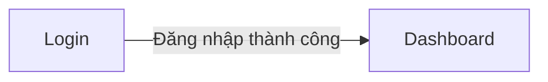

# Luồng nghiệp vụ & màn sơ bộ — <Tên dự án>

> ⚠️ **Mã `S..` trong file này là TẠM.** Baseline chính thức do `ba-screens` cấp ở bước 6 của `ba-proto-first`, sau khi nghiệp vụ đã chốt bằng prototype. **Không trace `FR`/`TC` vào mã tạm.**
> Nguồn: `<liệt kê file đã đọc>` · Ngày: `YYYY-MM-DD`

## 1. Vai trò
| Vai trò | Mô tả | Việc chính cần xong |
|---|---|---|
| Nhân viên | … | Tạo và theo dõi công việc |

## 2. Luồng theo vai trò
### L01 — <Tên việc> (<vai trò>)
| # | Bước | Màn | Ghi chú |
|---|---|---|---|
| 1 | Đăng nhập | S01 Login | |

```mermaid
swimlane-beta
  title L01 — <tên việc>
  ...
```
*(1 vai trò → dùng `flowchart`; ≥2 vai trò có bàn giao → `swimlane-beta`)*

## 3. Bảng màn sơ bộ
| Mã tạm | Màn | Vai trò dùng | Phục vụ việc | Ghi chú |
|---|---|---|---|---|
| S01 | Login | Nhân viên, Quản lý | L01, L02 | |

## 4. Sơ đồ điều hướng
> Nhãn cạnh = **hành động người dùng bấm**. `ba-proto-first html` đọc đúng nhãn này để nối nút — nhãn mơ hồ thì prototype nối sai.



## 5. Màn mồ côi (chưa nối vào luồng nào)
| Mã tạm | Màn | Vì sao đang mồ côi | Đề xuất |
|---|---|---|---|

## 6. Giả định
| Mã | Nội dung | Vì sao cần | Ảnh hưởng nếu sai | Trạng thái |
|---|---|---|---|---|
| GĐ-01 | … | … | … | ⚠️ chưa xác nhận |

## Thuật ngữ
| Thuật ngữ | Giải thích |
|-----------|-----------|

> Từ điển đầy đủ toàn dự án: `docs/Ho-so/00-glossary.md`.
