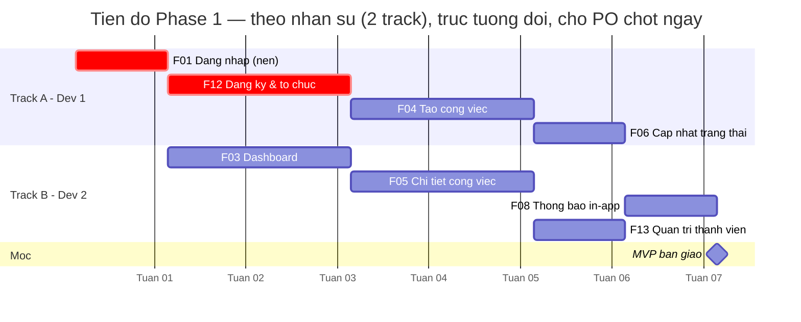

# Gói phát hành — <Phase, vd Phase 1> — <Tên dự án>

> Gói phát hành cho một phase: **kế hoạch + nghiệm thu** gộp một chỗ để stakeholder duyệt/ký. Nguồn: `08-roadmap.md` + `09-uat.md`. Render HTML: `ba-portal --single`.
>
> *(Chế độ `full` — mọi phase trong một file: lặp toàn bộ khung dưới đây cho mỗi phase dưới heading `# Phase N — …`.)*

## 1. Tổng quan phase
- **Mục tiêu phase:** <kết quả nghiệp vụ phase này đạt được>
- **Phạm vi:** <in-scope của phase — nhóm chức năng>
- **Thời gian:** <mốc bắt đầu → ra mắt; vd 07→09/2026>
- **Điều kiện tiên quyết:** <phase/chức năng nền phải xong trước>

## 2. Chức năng trong phase
> Lấy từ `08-roadmap.md` — chỉ các `F..` được xếp vào phase này.

| Mã | Chức năng | MoSCoW | RICE | Ghi chú |
|----|-----------|--------|------|---------|
| F01 | <...> | Must | <điểm> | <...> |

## 3. Kế hoạch & tiến độ
> Gantt của phase, **cắt lát từ Gantt đa phase của `08-roadmap.md` (§4.1) rồi re-level theo NHÂN SỰ**: khác Gantt roadmap (section = phase, song song lý tưởng theo phụ thuộc), Gantt release có **section = track/người** — số track = năng lực nhân sự phase này. Chức năng độc lập chia đều vào các track → **song song GIỮA track (đúng số người)**, tuần tự TRONG track; phụ thuộc thật vẫn giữ `after` (kể cả xuyên track). Trục **tương đối** (tuần) — chờ PO chốt ngày. Nhân sự chưa rõ → ghi giả định (vd 2 dev) `⚠️`.

> **Re-level theo nhân sự:** 2 track = 2 dev → tối đa 2 chức năng chạy cùng lúc (dù roadmap cho thấy 3 nhánh độc lập sau F01, chỉ 2 người nên xếp thành 2 track). Đường-găng (`:crit`) quyết thời gian tối thiểu; thêm người = thêm track (nếu còn việc song song để chia), nhưng không rút được đường-găng.

## 4. Phụ thuộc & rủi ro
- **Phụ thuộc bắt buộc:** <F.. / hệ thống ngoài phải sẵn>
- **Rủi ro & đòn bẩy cắt scope:** <rủi ro | khả năng | ảnh hưởng | hướng xử lý / phần có thể cắt nếu trễ>

## 5. Tiêu chí nghiệm thu (UAT của phase)
> Lấy từ `09-uat.md` — chỉ các kịch bản trace tới `FR/F` trong phase. Chưa có `09-uat.md` → rút tạm từ acceptance (GWT) của `userstory.md` các màn liên quan + ghi chú "nên chạy `ba-uat`".

| Mã | Kịch bản nghiệm thu | Trace F/FR | Kết quả mong đợi (đo được) | Trạng thái |
|----|---------------------|-----------|----------------------------|-----------|
| UAT-01 | <luồng end-to-end> | F01 / FR-01 | <số/trạng thái/thông báo cụ thể> | Chưa chạy |

## 6. Checklist ra mắt & ký
> Điều kiện coi phase là "xong và ký được".

- [ ] Mọi `F..` **Must** của phase có UAT **Đạt**.
- [ ] Không còn lỗi nghiêm trọng (Critical/High) đang mở.
- [ ] `NFR` then chốt của phase đạt ngưỡng.
- [ ] Dữ liệu di trú (nếu có) đã kiểm & khớp.

| Vai trò | Tên | Ngày | Kết luận (Chấp nhận / Có điều kiện / Từ chối) |
|---------|-----|------|----------------------------------------------|
| Product Owner | | | |
| BA | | | |
| Đại diện khách hàng | | | |
| QA lead | | | |

## 7. Chuyển đổi & Go-live (Transition)
> Hiện thực các `TR-..` trong `01-requirements.md` (nếu có) cho phase này. Không có gì cần chuyển đổi → ghi "Không áp dụng" kèm lý do, đừng bỏ trống.

| Hạng mục | Nội dung | Phụ trách | Trace |
|----------|----------|-----------|-------|
| Di trú dữ liệu | <nguồn → đích, cách kiểm khớp (đếm bản ghi/checksum), thời điểm> | | TR-.. |
| Kịch bản cutover | <thứ tự bật/tắt, cửa sổ dừng hệ thống (nếu có), ai bấm nút> | | TR-.. |
| Rollback | <điều kiện quay lui + các bước + dữ liệu phát sinh trong lúc lỗi xử lý sao> | | TR-.. |
| Đào tạo & bàn giao | <ai cần đào tạo, tài liệu dùng — link cẩm nang `docs/Ho-so/userguide/` nếu có> | | TR-.. |
| Chạy song song (nếu có) | <thời gian chạy song song hệ cũ/mới + tiêu chí tắt hệ cũ> | | TR-.. |

## 8. Đo lường sau phát hành
> Khép vòng Solution Evaluation: mục tiêu đặt ở `00-vision.md` phải được ĐO THẬT sau go-live — không đo thì không biết phase thành công hay không.

| Chỉ số (từ 00-vision) | Baseline trước phase | Mục tiêu | Cách đo | Khi nào đo | Kết quả thực tế |
|-----------------------|----------------------|----------|---------|------------|-----------------|
| <vd % công việc đúng hạn> | <số hiện tại / "chưa có"> | <số> | <report/query/khảo sát> | <sau 2-4 tuần> | *(điền sau khi đo)* |

- **Lịch đo:** <ngày cụ thể> — ai đo: <vai trò>. Kết quả điền ngược vào bảng trên + báo trong buổi review phase.
- Kết quả lệch xa mục tiêu → mở `ba-change-request` hoặc điều chỉnh roadmap phase sau, KHÔNG lặng lẽ bỏ qua.

## Thuật ngữ
| Thuật ngữ | Giải thích |
|-----------|-----------|
| RICE | Điểm ưu tiên = Reach × Impact × Confidence / Effort |
| UAT (User Acceptance Testing) | Nghiệm thu nghiệp vụ do người dùng/PO chạy |
| DoD (Definition of Done) | Bộ tiêu chí coi là hoàn thành/ra mắt được |
| Track (nhân sự) | Một luồng làm việc = một người/nhóm; số track = số người song song được. Trong Gantt release, section = track |
| Đường-găng (critical path) | Chuỗi task quyết thời gian tối thiểu; thêm người không rút ngắn được |

> Từ điển đầy đủ toàn dự án: `docs/Ho-so/00-glossary.md`.
