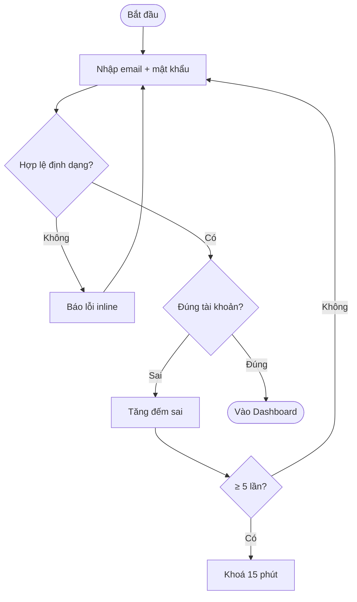
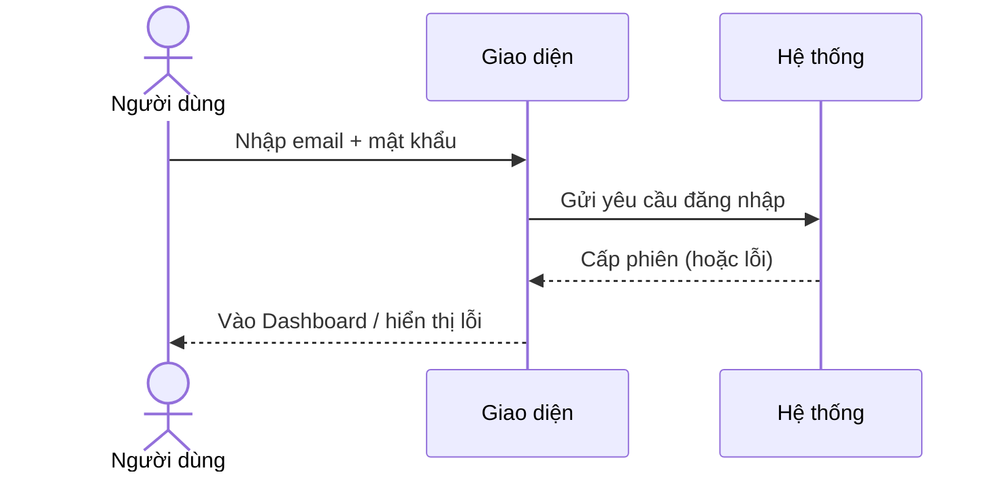
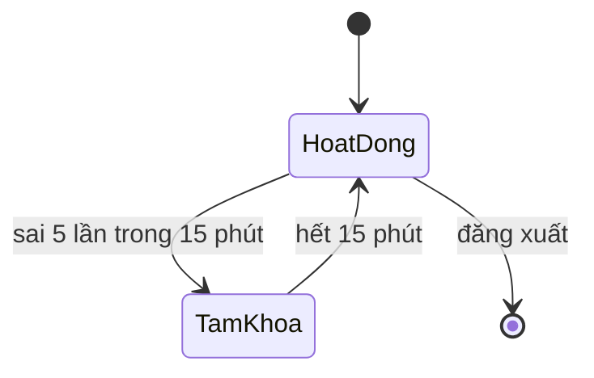
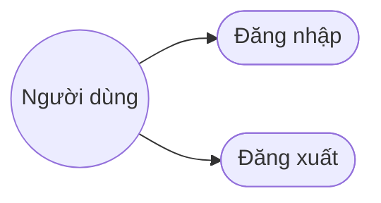
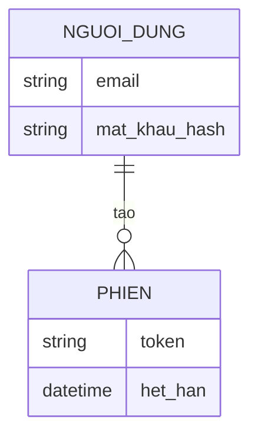
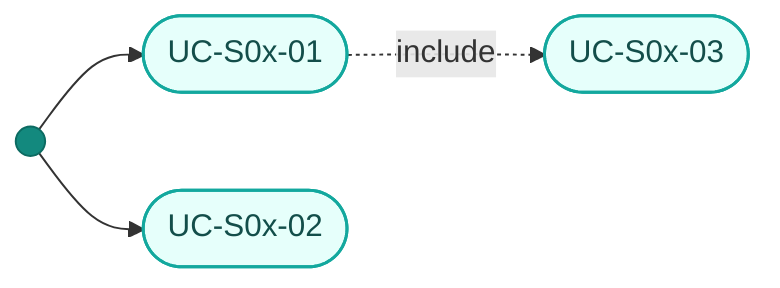

# Template 6 tài liệu phân tích màn hình

## ascii-screen.md
```
# Wireframe — <Tên màn hình>

+--------------------------------------------------+
| <Header / Logo>                      [Avatar ▾]  |
+--------------------------------------------------+
| <Vùng nội dung chính>                            |
|  [ Trường nhập ]                                 |
|  [ Nút hành động ]                               |
+--------------------------------------------------+

Chú thích các thành phần:
- <Thành phần>: <mục đích, hành vi>
```

## brainstorm.md
```
# Brainstorm — <Tên màn hình>

## Mục đích màn hình
<Người dùng đến đây để làm gì.>

## Thành phần & hành vi
- <Thành phần> → <hành vi/kết quả>

## Trạng thái & edge case
- Loading / rỗng / lỗi / không có quyền

## Câu hỏi mở
- <Điều cần làm rõ thêm>
```

## srs.md — Đặc tả yêu cầu giải pháp
```
# Đặc tả yêu cầu — <Tên màn hình> (Mã màn: S0x)

## Chức năng & truy vết nguồn
Trace: F0x → FR-0x → BR-0x.

## Phạm vi màn
**Màn này lo:** <1–3 gạch đầu dòng — việc gì thuộc về màn này>

**Màn này KHÔNG lo** *(nêu nơi xử lý thay)*:
- <việc dễ bị hiểu nhầm là của màn này> — *thuộc `S0y` / chức năng `F0z` / ngoài phạm vi giai đoạn này*

## Tác nhân & hệ thống ngoài
| Tác nhân | Loại | Vai trò ở màn này | Trong phạm vi? |
|----------|------|-------------------|----------------|
| <Người dùng cuối / vai trò> | người | <họ làm gì ở màn này> | Có |
| <Dịch vụ gửi email / cổng thanh toán…> | hệ thống ngoài | <màn cần gì từ nó> | Có — *dùng theo hợp đồng đã có, không đặc tả tích hợp ở đây* |
| <Bộ phận vận hành/hỗ trợ> | người | <can thiệp ngoài luồng tự động> | Không — *nguồn ràng buộc, không thao tác trong luồng* |

> Hệ thống ngoài xuất hiện ở đây thì phải có dòng tương ứng ở "Phụ thuộc ngoài" bên dưới.

## Yêu cầu chức năng (Functional)
| Mã | Yêu cầu (hệ thống phải...) | Trace F/FR | Nguồn | Lý do (rationale) | Acceptance criteria (đo được) | Kiểm chứng | Ưu tiên |
|----|----------------------------|------------|-------|-------------------|-------------------------------|-----------|---------|
| R-S0x-01 | <...> | F0x / FR-0x | <brainstorm mục N · họp DEC-0x · CR-0x · UE-0x (URD §6)> | <VÌ SAO yêu cầu này cần — khác Nguồn> | <điều kiện chấp nhận kiểm chứng được> | test | Must |

> **3 cột dễ lẫn:** *Trace* = phục vụ yêu cầu nào ở trên · *Nguồn* = ai/đâu nói ra (không có nguồn → hỏi lại, đừng tự đặt yêu cầu) · *Lý do* = **vì sao** yêu cầu cần tồn tại (BABOK; giúp bắt yêu cầu thừa/vàng-mạ).
> **Cột `Kiểm chứng`** (ISO/IEC/IEEE 29148) — cách sẽ chứng minh yêu cầu đạt: `inspection` (soi tài liệu/cấu hình) · `analysis` (suy luận/tính toán) · `demonstration` (thao tác thấy kết quả) · `test` (chạy ca kiểm thử). `ba-test` ưu tiên sinh `TC` (ứng viên Auto) cho mọi yêu cầu `Kiểm chứng = test`.
> **Adaptive:** màn **đơn giản** (dưới ngưỡng "màn phức tạp" ở `conventions.md`) → có thể **bỏ cột `Lý do`**, giữ `Kiểm chứng`. Màn **phức tạp** → đủ cả hai.

## Yêu cầu phi chức năng (Non-functional)
| Mã | Loại | Yêu cầu đo được | Trace |
|----|------|-----------------|-------|
| R-S0x-N01 | Bảo mật/Hiệu năng/... | <...> | NFR-0x / BR-0x |

## Quy tắc nghiệp vụ (Business Rules)
| Mã | Quy tắc | Kích hoạt khi | Trace |
|----|---------|---------------|-------|
| BRule-S0x-01 | <vd: chỉ cho đặt lịch trong giờ làm việc 8:00–17:00> | <thời điểm/sự kiện rule được áp — vd "khi người dùng bấm Lưu lịch hẹn"> | R-S0x-01 |

> Cột **Kích hoạt khi** là thứ `ba-test` cần để viết `TC` đúng thời điểm — rule không nêu trigger thì test dễ kiểm sai chỗ.

## Bảng mô tả chi tiết phần tử màn hình (BẮT BUỘC)
> Kiểm kê **MỌI phần tử người dùng nhìn thấy hoặc tương tác được** trên màn — không chỉ ô nhập liệu. Đây là bảng dev đọc để dựng UI và QC đọc để soát độ phủ. Bảng "Yêu cầu dữ liệu" ngay dưới đi sâu **luật validation** cho riêng field nhập liệu; hai bảng bổ trợ nhau, không thay nhau.

| # | Tên phần tử | Control type | Data Type | Bắt buộc | Mô tả | Trace |
|---|-------------|--------------|-----------|----------|-------|-------|
| 1 | Tìm kiếm | Input | String | Không | Tìm theo mã phiếu, người mượn, nơi đến | R-S0x-01 |
| 2 | Trạng thái | Select | Enum | Không | Lọc theo trạng thái phiếu | R-S0x-01 |
| 3 | Lọc dữ liệu | Button | Action | — | Áp dụng bộ lọc | R-S0x-01 |
| 4 | Tạo phiếu mượn mới | Button | Action | — | Mở popup lập phiếu (Mẫu 1) | R-S0x-02 |
| 5 | Danh sách phiếu | Table | List | — | Cột: Mã phiếu, Người đăng ký, Thời gian, Trạng thái, Thao tác | R-S0x-03 |

**Luật ghi bảng:**
- **Đánh số `#` liên tục** theo thứ tự người dùng gặp trên màn (trên→dưới, trái→phải) — số này là cách gọi nhanh khi trao đổi ("phần tử số 4").
- **Mọi dòng phải có `Trace`** về ≥1 `R-S..`. Phần tử không phục vụ yêu cầu nào → hoặc thiếu yêu cầu, hoặc thừa phần tử; **hỏi, đừng để trống**.
- **Cột "Bắt buộc"**: `Có`/`Không` cho phần tử nhập liệu; `—` cho phần tử không nhập (Button/Table/Label).
- **Mô tả nói NGHIỆP VỤ**, không mô tả hình dáng: *"Lọc theo trạng thái phiếu"* chứ không phải *"dropdown màu xám bo góc"*.
- Phần tử **chỉ hiện ở một trạng thái/vai trò** thì ghi rõ trong Mô tả (vd *"chỉ vai trò Quản trị thấy"*).
- Bảng phải **khớp `ascii-screen.md`**: mọi thứ vẽ trong wireframe đều có dòng ở đây và ngược lại.

**Control type — dùng đúng danh sách này, không tự chế:**
`Input` · `Textarea` · `Select` · `Multi-select` · `Checkbox` · `Radio` · `Date` · `DateTime` · `Upload` · `Button` · `Link` · `Table` · `List` · `Card` · `Tab` · `Modal` · `Toast` · `Label` · `Pagination`

**Data Type — dùng đúng danh sách này:**
`String` · `Number` · `Integer` · `Decimal` · `Boolean` · `Enum` · `Date` · `DateTime` · `File` · `Array` · `Object` · `List` · `Action` *(cho phần tử chỉ kích hoạt hành vi, không mang dữ liệu)* · `None`

## Yêu cầu dữ liệu — Validation từng field (BẮT BUỘC ghi cụ thể)
| Field | Kiểu | Bắt buộc | Định dạng/Ràng buộc | Min/Max | Thông báo lỗi |
|-------|------|----------|---------------------|---------|---------------|
| email | chuỗi | Có | đúng định dạng email | ≤ 254 ký tự | "Email không hợp lệ" |
| mat_khau | chuỗi | Có | ≥1 chữ + ≥1 số | 8–64 ký tự | "Mật khẩu tối thiểu 8 ký tự gồm chữ và số" |

- Đầu ra: <dữ liệu/kết quả màn trả về>

## Ma trận lỗi
> Gom **mọi cách màn này hỏng**, không chỉ lỗi nhập liệu: hết hạn/đã dùng, không đủ quyền, hệ ngoài chết, mất mạng, vượt hạn mức, xung đột dữ liệu. Bảng validation ở trên chỉ lo lỗi *field*; bảng này lo lỗi *luồng và hệ thống*.
> Mỗi dòng là nguồn trực tiếp cho một `TC` Negative (`ba-test`) và một mục "Xử lý sự cố" trong cẩm nang (`ba-userguide`).

| Mã | Lỗi | Xảy ra khi | Mức | Trace | Người dùng thấy gì | Lối thoát |
|----|-----|-----------|-----|-------|--------------------|-----------|
| E-S0x-01 | <tên lỗi ngắn> | <điều kiện kích hoạt cụ thể> | blocker/major/minor | R-S0x-.. / BRule-S0x-.. / UE-0x | <trạng thái màn + **nguyên văn** thông báo> | <người dùng làm gì để thoát; hoặc "chờ N phút", "liên hệ hỗ trợ"> |

**Trích ngược URD:** lỗi này xử lý một ngoại lệ người dùng ở URD §6 → thêm `UE-..` vào *Trace* (URD không trỏ xuống màn; `ba-trace` đo `UE→E-S`). Không có URD → bỏ.

**Mức:** `blocker` = không hoàn tất được việc chính, không có đường vòng · `major` = chặn luồng nhưng có lối thoát · `minor` = sửa tại chỗ rồi đi tiếp.

Kiểm khi viết xong: mọi **luồng ngoại lệ** trong `usecase.md` có dòng ở đây · mọi dòng ở đây có **lối thoát** (không để người dùng kẹt) · thông báo ghi **nguyên văn** (để `test.md`/`html-design` dùng lại đúng chữ, không diễn đạt lại).

## Phụ thuộc ngoài
> Chỉ ghi thứ **do bên khác sở hữu** mà màn này cần — không đặc tả cách tích hợp (việc của `11-integration`/`12-api-integration`).

| Phụ thuộc | Ai sở hữu | Chặn gì nếu chưa sẵn sàng |
|-----------|-----------|---------------------------|
| <dịch vụ/dữ liệu/màn khác> | <bộ phận/đối tác/nhóm> | <luồng nào của màn không chạy được> |

*(Màn không phụ thuộc gì bên ngoài → ghi "Không có" — đừng bỏ trống mục.)*

## Giả định & Ràng buộc
> 29148 tách **giả định** (điều ta *tin là đúng* nhưng chưa xác nhận — sai thì yêu cầu lung lay) khỏi **ràng buộc** (giới hạn *bắt buộc tuân*, không thương lượng). Khác "Phụ thuộc ngoài" (thứ bên khác *sở hữu* mà màn cần).

**Giả định** *(mỗi cái trạng thái `Đề xuất → Đã xác nhận / Đã sửa / Đã bỏ / 🔓 Chấp nhận rủi ro`; còn `⚠️ chưa xác nhận` → `ba-review` chấm 🟠, `Mốc = ba-build`)*
| Mã | Giả định | Vì sao cần | Ảnh hưởng nếu sai | Trạng thái |
|----|----------|-----------|-------------------|-----------|
| GĐ-S0x-01 | <điều đang giả định đúng> | <yêu cầu nào dựa vào nó> | <hỏng gì nếu sai> | ⚠️ chưa xác nhận |

**Ràng buộc** *(giới hạn bắt buộc — không phải BRule/NFR)*
| Mã | Ràng buộc | Nguồn | Ảnh hưởng tới thiết kế màn |
|----|-----------|-------|----------------------------|
| RB-S0x-01 | <vd: chỉ hỗ trợ trình duyệt khách hiện có, không thêm SDK> | <hợp đồng/hạ tầng/pháp lý> | <màn bị bó thế nào> |

*(Màn không có giả định/ràng buộc riêng → ghi "Không có" từng bảng — đừng bỏ trống.)*
*(Màn đơn giản, adaptive → mục này có thể rút còn 1 dòng "Không có" nếu thực sự không có.)*

## Quét yêu cầu ngầm
> Viết **sau** mọi bảng ở trên. Các bảng trên phủ điều người viết *nghĩ tới*; 9 chiều dưới đây là điều **không ai viết ra** cho tới khi nó hỏng. Đi đủ 9 dòng, mỗi lần — chiều bỏ trống trông y như chiều không có gì để trả lời. Hai chiều hay trốn nhất: **đồng thời/thứ tự** và **quan sát/log** (người dùng không thấy cho tới khi sự cố).

| Chiều | Rơi vào đâu |
|-------|-------------|
| Kiểm dữ liệu vào | <`R-S0x-..` / `BRule-S0x-..` / `E-S0x-..` đã viết ở trên> |
| Kiểu hỏng | <mã `E-S0x-..` · hoặc `n/a — <lý do cụ thể>`> |
| Gửi lặp / thử lại | <…> |
| Phân quyền | <…> |
| Đồng thời / thứ tự | <…> |
| Vòng đời dữ liệu | <…> |
| Hệ ngoài chết | <…> |
| Chuyển trạng thái | <…> |
| Quan sát / log | <…> |

**Câu hỏi mở từ quét** *(chỉ khi có chiều cần câu trả lời nghiệp vụ; không có → bỏ bảng)*
| Mã | Câu hỏi | Chiều | Ai trả lời |
|----|---------|-------|-----------|
| OQ-S0x-01 | <hai request cùng sửa một bản ghi thì bản nào thắng?> | Đồng thời / thứ tự | <PO / SH-..> |

**Luật điền:** mỗi ô là **một** trong ba — mã **đã viết** ở srs/tài liệu màn (không thêm yêu cầu mới cho đẹp bảng) · `n/a — <lý do cụ thể>` (webhook không có empty state; nói ra tốn một dòng) · `OQ-S0x-..` khai ở bảng ngay trên. **Chống mượn:** một mã **không** phủ hai chiều — chặn trùng bản ghi không nói gì về hai request tới cùng lúc; cần dùng chung thì ghi `dùng chung — <vì sao>` ngay trong ô. Chiều mà trả lời đúng cần **hành vi mới** → `OQ`, không tự đặt `R-S..`. **Không** ghi `UE-..` (URD) trong ô — trỏ `E-S..` đã trích `UE` ở cột Trace; ô chỉ có `UE` bị luật 9 coi là rỗng. `ba-feasible` (luật 9) soát hình bảng này.

## Sơ đồ luồng (Flow)
Vẽ MỌI luồng của màn hình bằng Mermaid; mỗi luồng chọn loại sơ đồ phù hợp (bảng & ví dụ ở "Hướng dẫn sơ đồ" ngay dưới template này). Mỗi luồng = 1 tiêu đề + 1 khối mermaid.
- <Tên luồng 1> — <Activity / Sequence / State / Use case>
- <Tên luồng 2> — <...>

## Mô hình dữ liệu màn hình (ERD)
ERD các thực thể màn này đụng tới (trích từ 05-data-model.md nếu có) — 1 khối mermaid erDiagram.

## Thuật ngữ
| Thuật ngữ | Giải thích |
|-----------|-----------|
| R-S (yêu cầu cấp màn) | Yêu cầu của riêng màn này (R-S0x-01…), truy vết F/FR |
| BRule (Business Rule) | Quy tắc nghiệp vụ áp cho màn (BRule-S0x-01…) |
| E-S (lỗi cấp màn) | Một cách màn này hỏng (E-S0x-01…) — kèm mức, thông báo và lối thoát |
| <thuật ngữ nghiệp vụ của màn> | <giải thích ngắn — điền theo màn> |

> Từ điển đầy đủ toàn dự án: `docs/Ho-so/00-glossary.md`.
```

### Hướng dẫn sơ đồ cho srs (cho mục "Sơ đồ luồng" & "ERD")

Chọn loại sơ đồ theo bản chất luồng:

| Loại luồng trong màn | Sơ đồ Mermaid |
|---|---|
| Tổng quan tác nhân ↔ chức năng | Use case → `flowchart LR` |
| Quy trình nhiều bước, có rẽ nhánh/quyết định | Activity → `flowchart TD` |
| Quy trình liên **nhiều vai trò/tác nhân**, có bàn giao (vd người dùng → duyệt → hệ thống) | Swimlane → `swimlane-beta LR` |
| Trao đổi người dùng ↔ hệ thống ↔ dịch vụ ngoài | Sequence → `sequenceDiagram` |
| Đối tượng/màn có nhiều trạng thái chuyển đổi | State → `stateDiagram-v2` |
| Dữ liệu màn đụng tới | ERD → `erDiagram` |

> **An toàn cú pháp (BẮT BUỘC):** nhãn có ký tự ngoài [chữ·số·khoảng trắng·`-`] → **bọc TRỌN trong ngoặc kép** `Z["Chặn · Mở dự án"]`. Tuyệt đối **không để `"` lẻ giữa nhãn** (`Z[Chặn "x"]` ❌ → `Z["Chặn 'x'"]` ✅); `(` `)` `[` `]` trong nhãn node phải bọc. Nhãn **cạnh** (nhất là dotted `-. .->`) không bọc được — viết chữ thuần, bỏ `.`/`&`/`()` (vd `.md` → `md`). `;` cấm dùng. Dấu tiếng Việt thì được. Chi tiết: mục "Sơ đồ Mermaid — an toàn cú pháp" trong `conventions.md`.

**Activity (flowchart):**


**Swimlane** (luồng liên nhiều vai trò — mỗi vai trò một lane; cần Mermaid ≥ 11.16; tô màu theo vai node bằng `:::role` + `classDef`, xem "Bảng màu phân vai node" trong `conventions.md`):
```mermaid
swimlane-beta LR
  subgraph ND[Người dùng]
    A([Gửi yêu cầu]):::startend --> B[Điền biểu mẫu]:::task
  end
  subgraph HT[Hệ thống]
    C[Kiểm tra hợp lệ]:::task --> D{Cần duyệt?}:::decision
  end
  subgraph QL[Quản lý]
    E[Xem và duyệt]:::task
  end
  B --> C
  D -->|Không| F([Hoàn tất]):::startend
  D -->|Có| E -->|Đồng ý| F
  classDef task fill:#e6fffb,stroke:#13a89e,stroke-width:1.5px,color:#134e4a
  classDef decision fill:#fff3e6,stroke:#e8820c,stroke-width:1.5px,color:#7a4a00
  classDef startend fill:#13897e,stroke:#0c6b62,color:#ffffff
```

**Sequence:**


**State:**


**Use case (flowchart):**


**ERD:**


## usecase.md (Use Cases & Scenarios)
```
# Use case — <Tên màn hình>

## Sơ đồ Use case (tổng quan)
> Tổng quan **tác nhân ↔ use case** của màn (nhìn nhanh phạm vi). Mỗi UC = 1 node stadium mang **mã `UC-S0x-0n`**; actor = node tròn `((...))`; quan hệ `include`/`extend` giữa các UC = cạnh dotted `-. include .->`. Màu theo "Bảng màu phân vai node" (token nếu có `07-design-system.md`, không thì bộ mặc định).



## UC-S0x-01: <Tên use case>
- Tác nhân (actor): <...>
- Trigger (kích hoạt): <sự kiện bắt đầu>
- Tiền điều kiện: <...>
- Luồng chính (happy path):
  1. <bước>
  2. <bước>
- Luồng thay thế / ngoại lệ:
  - <điều kiện> → <xử lý>
- Hậu điều kiện (postcondition): <...>
- Đảm bảo (guarantees): thành công <...> / tối thiểu <...>
- Trace: R-S0x-01
```

## userstory.md (User Story — INVEST + Given-When-Then)
```
# User story — <Tên màn hình>

## US-S0x-01: <Tên màn hình> - <Nội dung title>
Là <vai trò>, tôi muốn <mục tiêu>, để <giá trị>.

> Heading mỗi user story theo đúng format `US-S0x-NN: <Tên màn hình> - <Nội dung title>` (tên màn hình tiếng Việt + " - " + tiêu đề ngắn của story).

- Trace: R-S0x-01 / F0x
- Story point: <1/2/3/5/8>
- Tiêu chí chấp nhận (Given-When-Then):
  - GWT-1: **Given** <bối cảnh>, **When** <hành động>, **Then** <kết quả>.
  - GWT-2: **Given** <...>, **When** <...>, **Then** <...>.
- INVEST: [ ] Independent [ ] Negotiable [ ] Valuable [ ] Estimable [ ] Small [ ] Testable
```

## design-spec.md — UI brief cho Designer
> Mô tả layout bằng chữ (không vẽ ASCII), không quy định mã màu/font cụ thể, không dùng từ dev-centric.
```
# Design Spec — <Tên màn hình> (Mã màn: S0x)

## 1. Tổng quan UX
- Mục tiêu UX: <trải nghiệm hướng tới — vd thao tác nhanh, cảm giác an toàn>
- Thiết bị mục tiêu: <Mobile / Web / Desktop> (mặc định mobile-first)
- User flow tóm tắt: [Màn trước] → [Màn này] → [Màn sau]

## 2. Cấu trúc layout (anatomy)
- Header: <gồm gì>
- Body / nội dung chính: <các block thông tin>
- Footer / điều hướng dưới: <gồm gì>

## 3. Ghi chú thiết kế cho từng phần tử
> **Danh sách phần tử là ở `srs.md` → "Bảng mô tả chi tiết phần tử màn hình"** (kèm Control type · Data Type · Trace). Đừng chép lại ở đây — chép là đẻ nguồn sự thật thứ hai, rồi hai bảng lệch nhau và không ai biết tin bảng nào.
> Mục này chỉ ghi thứ **srs không nói**: mức nhấn, thứ bậc thị giác, hành vi tương tác tinh.

| # (theo srs) | Phần tử | Mức nhấn | Ghi chú thiết kế |
|---|---------|----------|------------------|
| 3 | <Nút Lọc dữ liệu> | Secondary | <đứng cạnh ô tìm kiếm, cùng hàng> |
| 4 | <Nút Tạo phiếu mới> | Primary CTA | <góc phải trên, luôn thấy khi cuộn> |

## 4. Trạng thái giao diện (UI States)
- ⚪ Empty: <hiển thị gì khi chưa có dữ liệu>
- 🔄 Loading: <skeleton / spinner>
- 🔴 Error: <thông báo lỗi ở đâu, ra sao>
- 🟢 Success: <toast / modal>

## 5. CTA & Copywriting (microcopy)
- CTA Primary: `<...>` · CTA Secondary: `<...>`
- Title: `<...>` · Helper text: `<...>`
- Wording lỗi/thành công: `<chính xác>`

## 6. Edge case (xử lý UX)
- <rớt mạng khi submit> → <giữ dữ liệu đã nhập, snackbar "Lỗi kết nối">
- <dữ liệu quá dài> → <cắt "..." + tooltip khi hover>

## 7. Animation & chuyển cảnh (BẮT BUỘC)
> Đặc tả CẢ hai nhóm dưới (xem "Animation chuyển cảnh" trong `conventions.md`). Duration/easing lấy từ Motion token `07-design-system.md` nếu có; enter = `ease-out`, exit = `ease-in`; tôn trọng `prefers-reduced-motion`.

**Chuyển màn (page transition) — vào/ra khi điều hướng:**
| Hướng | Màn lân cận | Hiệu ứng | Thời lượng · easing |
|-------|-------------|----------|---------------------|
| Vào (enter) | ← [Màn trước] | <vd slide-in từ phải + fade> | 250ms · ease-out |
| Ra (exit)   | → [Màn sau]   | <vd fade-out + scale 0.98> | 200ms · ease-in |

**Chuyển section nội màn (in/out) — panel/modal/tab/list/accordion/toast:**
| Thành phần | Sự kiện | Hiệu ứng IN | Hiệu ứng OUT | Thời lượng · easing |
|-----------|---------|-------------|--------------|---------------------|
| <Modal xác nhận> | mở / đóng | fade + scale-up | fade + scale-down | 200ms · ease-out/in |
| <Danh sách kết quả> | tải xong / xoá | stagger fade + slide-up | fade-out | 150ms · ease-out |

## 8. Ghi chú cho Designer
- Accessibility: <độ tương phản, cỡ chữ, thứ tự focus>
```
