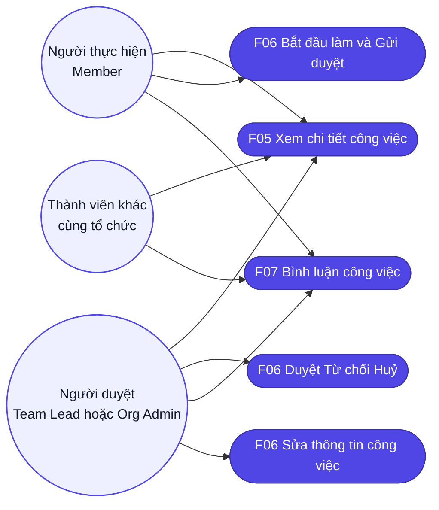
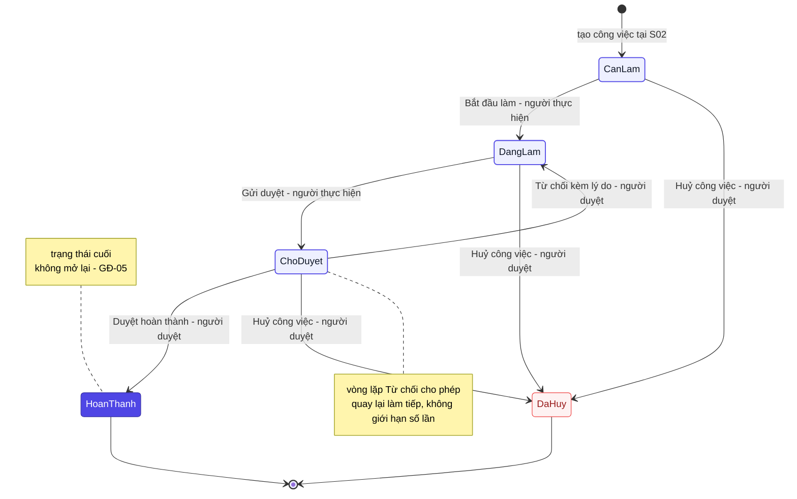
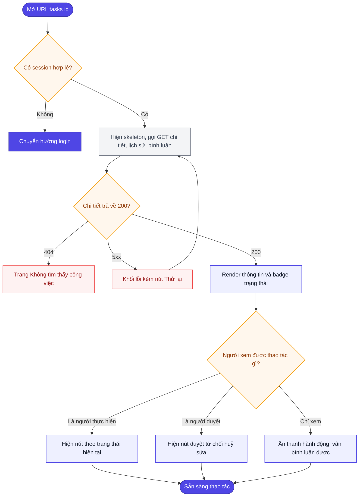
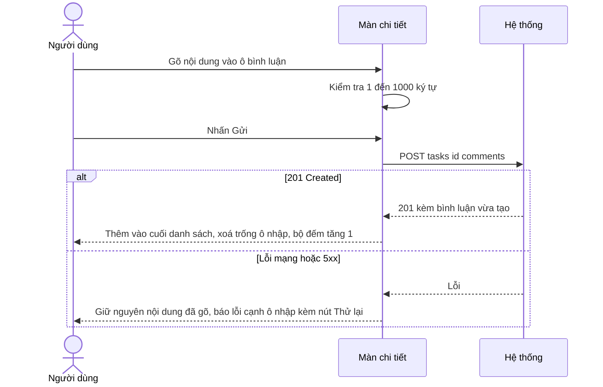
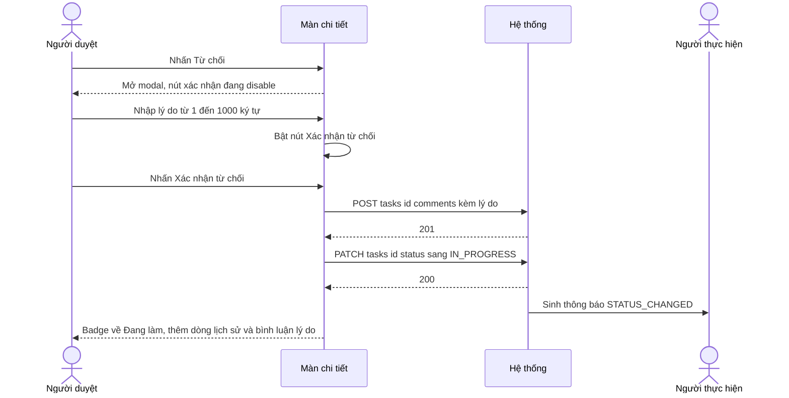
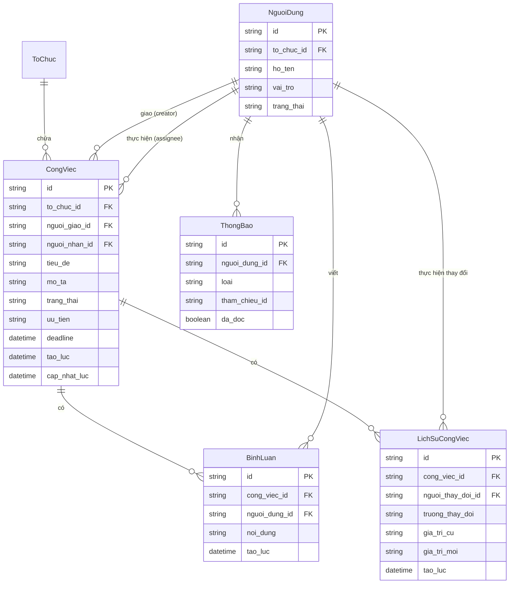

# Đặc tả yêu cầu — Chi tiết công việc (Mã màn: S03)

## Chức năng & truy vết nguồn
Trace: F05 → FR-07 → BR-01 | F06 → FR-06 → BR-01, BR-02 | F07 → FR-08 → BR-01.
Thông báo `STATUS_CHANGED` sinh từ màn này thuộc **F08** — đã đặc tả tại S02 (`R-S02-12`…`R-S02-16`); màn này chỉ là **nguồn phát sinh** sự kiện, không hiển thị panel thông báo riêng.

> **Phạm vi — không có tệp đính kèm (đã chốt 2026-07-22).** Mô tả `F05` trước đây có cụm *"…file đính kèm"* nhưng `05-data-model.md` không có thực thể tệp và `06-api-spec.md` không có endpoint tải lên/tải xuống. Đã quyết **bỏ cụm đó khỏi `F05`** (`OQ-S03-01` trong `brainstorm.md` — đã đóng); đính kèm ngoài phạm vi giai đoạn 1, muốn thêm thì mở `CR`.

## Phạm vi màn

**Màn này lo:** xem chi tiết một công việc, **điều khiển vòng đời trạng thái** (bắt đầu → gửi duyệt → duyệt/từ chối → huỷ), bình luận, sửa thông tin công việc, và dòng thời gian lịch sử thay đổi.

**Màn này KHÔNG lo** *(nêu nơi xử lý thay)*:
- Tạo công việc mới — *thuộc `S02` Dashboard (`F04`)*.
- Danh sách/thống kê nhiều công việc — *thuộc `S02`*.
- Mở lại việc đã DONE/CANCELLED — *ngoài phạm vi giai đoạn 1 (`BRule-S03-02`)*.
- Sửa/xoá bình luận — *ngoài phạm vi giai đoạn 1 (`BRule-S03-07`)*.

## Tác nhân & hệ thống ngoài

| Tác nhân | Loại | Vai trò ở màn này | Trong phạm vi? |
|----------|------|-------------------|----------------|
| Người thực hiện (Member) | người | Bắt đầu làm, gửi duyệt, bình luận | Có |
| Người giao / Team Lead / Org Admin | người | Duyệt, từ chối kèm lý do, huỷ, sửa thông tin | Có |
| Thành viên khác cùng tổ chức | người | Xem chi tiết và bình luận (`BRule-S03-10`) | Có |
| API Backend (nội bộ) | hệ thống | Kiểm luồng trạng thái hợp lệ, ghi lịch sử, sinh thông báo | Có |

> Màn này **không gọi hệ thống bên thứ ba**.

## Yêu cầu chức năng (Functional)

| Mã | Yêu cầu (hệ thống phải...) | Trace F/FR | Nguồn | Lý do (rationale) | Acceptance criteria (đo được) | Kiểm chứng | Ưu tiên |
|----|----------------------------|------------|-------|-------------------|-------------------------------|-----------|---------|
| R-S03-01 | Hiển thị đầy đủ thông tin công việc khi mở `/tasks/:id`: tiêu đề, mô tả, trạng thái, ưu tiên, deadline, người giao, người thực hiện, thời điểm tạo và cập nhật gần nhất | F05 / FR-07 | brainstorm.md (màn) | Người dùng cần thấy toàn cảnh một việc để quyết định thao tác tiếp theo (F05 xem chi tiết) | Đủ 9 trường lấy từ `GET /tasks/:id`; mô tả rỗng hiển thị "Không có mô tả" thay vì khoảng trắng | test | Must |
| R-S03-02 | Đánh dấu công việc quá hạn: deadline < hiện tại và trạng thái ∉ {DONE, CANCELLED} | F05 / FR-07 | brainstorm.md (màn) | Cảnh báo trực quan việc trễ hạn để xử lý kịp; đồng nhất định nghĩa quá hạn với Dashboard (BRule-S03-06) | Deadline tô đỏ + biểu tượng ⚠; việc DONE quá hạn **không** tô đỏ — đồng nhất với `BRule-S02-02` | test | Must |
| R-S03-03 | Hiển thị dòng thời gian lịch sử thay đổi từ `GET /tasks/:id/history`, sắp mới → cũ, mỗi dòng gồm người thay đổi, trường thay đổi, giá trị cũ → giá trị mới, thời điểm | F05 / FR-07 | brainstorm.md (màn) | Dòng lịch sử phục vụ truy vết trách nhiệm ai đổi gì lúc nào (BR-02) | Thứ tự giảm dần theo `tao_luc`; dòng cuối cùng luôn là bản ghi tạo công việc; mỗi dòng đọc được đủ 4 thành phần | test | Must |
| R-S03-04 | Hiển thị danh sách bình luận từ `GET /tasks/:id/comments`, sắp cũ → mới, mỗi bình luận gồm tác giả, nội dung, thời điểm gửi | F07 / FR-08 | brainstorm.md (màn) | Bình luận là kênh trao đổi quanh công việc giữa các thành viên (F07) | Thứ tự tăng dần theo `tao_luc`; hiển thị đúng số bình luận trong tiêu đề khu vực | test | Should |
| R-S03-05 | Cho phép mọi thành viên trong tổ chức thêm bình luận qua `POST /tasks/:id/comments`; gửi thành công thì bình luận mới xuất hiện cuối danh sách và ô nhập trống lại | F07 / FR-08 | brainstorm.md (màn) | Cho mọi thành viên trong tổ chức góp ý/trao đổi trên công việc (BRule-S03-10) | API gọi đúng 1 lần; bình luận mới hiện ≤ 300ms sau phản hồi 201; bộ đếm số bình luận +1 | test | Should |
| R-S03-06 | Không cung cấp chức năng sửa hoặc xoá bình luận | F07 | brainstorm.md (màn) | Bình luận là bản ghi bất biến ở giai đoạn 1 để giữ toàn vẹn lịch sử trao đổi (BRule-S03-07) | Không có nút sửa/xoá trong DOM ở bất kỳ bình luận nào, kể cả bình luận của chính người đang đăng nhập | inspection | Should |
| R-S03-07 | Chỉ hiển thị các nút chuyển trạng thái **hợp lệ** với trạng thái hiện tại **và** vai trò người đang xem | F06 / FR-06 | brainstorm.md (màn) | Chỉ hiện hành động hợp lệ theo trạng thái + vai trò để tránh thao tác sai hoặc không được phép | Nút không hợp lệ **không tồn tại trong DOM** (không phải bị làm mờ); đối chiếu đủ 7 biến thể ở bảng "Thanh hành động" của `ascii-screen.md` | test | Must |
| R-S03-08 | Cho phép người thực hiện chuyển TODO → IN_PROGRESS bằng nút "Bắt đầu làm" | F06 / FR-06 | brainstorm.md (màn) | Người thực hiện đánh dấu bắt đầu làm để phản ánh đúng tiến độ (GĐ-S03-02) | `PATCH /tasks/:id/status` với `IN_PROGRESS` trả 200; badge đổi sang "Đang làm"; sinh 1 dòng lịch sử | test | Must |
| R-S03-09 | Cho phép người thực hiện chuyển IN_PROGRESS → IN_REVIEW bằng nút "Gửi duyệt" | F06 / FR-06 | brainstorm.md (màn) · UE-07 | Người thực hiện gửi kết quả cho người duyệt kiểm tra (luồng duyệt) | Sau 200: badge "Chờ duyệt"; thanh hành động của người thực hiện chuyển thành chữ "Đang chờ duyệt", không còn nút | test | Must |
| R-S03-10 | Cho phép người duyệt chuyển IN_REVIEW → DONE bằng nút "Duyệt hoàn thành" | F06 / FR-06 | brainstorm.md (màn) | Người duyệt xác nhận việc đạt yêu cầu để đóng việc (GĐ-S03-01) | Sau 200: badge "Hoàn thành"; thanh hành động ẩn hẳn; sinh 1 dòng lịch sử | test | Must |
| R-S03-11 | Cho phép người duyệt chuyển IN_REVIEW → IN_PROGRESS bằng nút "Từ chối", **bắt buộc nhập lý do**; lý do được lưu thành một bình luận của người từ chối | F06 / FR-06 | brainstorm.md (màn) · UE-08 | Từ chối phải kèm lý do để người thực hiện biết cần sửa gì; lưu thành bình luận để truy vết (GĐ-S03-03) | Không nhập lý do → nút "Xác nhận từ chối" disable; sau khi xác nhận: badge về "Đang làm", **đồng thời** có 1 dòng lịch sử mới và 1 bình luận mới chứa đúng lý do | test | Must |
| R-S03-12 | Cho phép người duyệt huỷ công việc (→ CANCELLED) từ mọi trạng thái trừ DONE, có bước xác nhận trước khi gọi API | F06 / FR-06 | brainstorm.md (màn) | Cho phép dừng việc không còn cần; bước xác nhận tránh huỷ nhầm (GĐ-S03-06) | Hiện hộp xác nhận "Huỷ công việc này?"; đồng ý → badge "Đã huỷ" + banner "Công việc đã huỷ"; việc ở DONE không có nút huỷ | test | Must |
| R-S03-13 | Từ chối mọi chuyển trạng thái không hợp lệ theo `BRule-S03-01`, kể cả khi gọi thẳng API | F06 / FR-06 | brainstorm.md (màn) | Bảo vệ tính toàn vẹn vòng đời trạng thái, chặn chuyển sai kể cả gọi thẳng API (BRule-S03-01) | `PATCH /tasks/:id/status` với chuyển không hợp lệ (vd TODO → DONE) trả `400`; trạng thái trong cơ sở dữ liệu không đổi | test | Must |
| R-S03-14 | Cho phép người duyệt sửa thông tin công việc (tiêu đề, mô tả, người thực hiện, deadline, ưu tiên) qua `PATCH /tasks/:id`, dùng lại bộ validation của modal tạo việc ở S02 | F06 / FR-06 | brainstorm.md (màn) | Cho người duyệt điều chỉnh thông tin việc khi cần (GĐ-S03-04); tái dùng validation của S02 để nhất quán | Modal đủ 5 trường với ràng buộc y hệt `R-S02-08`; lưu thành công → thông tin trên màn cập nhật ngay và mỗi trường đổi sinh 1 dòng lịch sử | test | Should |
| R-S03-15 | Sau mỗi lần đổi trạng thái thành công, dòng lịch sử mới xuất hiện ở **đầu** dòng thời gian mà không cần tải lại trang | F05, F06 / FR-06, FR-07 | brainstorm.md (màn) | Phản hồi tức thì để người dùng thấy thay đổi đã ghi nhận mà không phải tải lại | Dòng mới hiện ≤ 500ms sau phản hồi 200, đúng nội dung *người thao tác · trang thái · cũ → mới* | test | Must |
| R-S03-16 | Sinh thông báo `STATUS_CHANGED` cho người thực hiện và người giao khi trạng thái đổi, trừ chính người vừa thao tác | F06, F08 / FR-06, FR-09 | brainstorm.md (màn) | Báo cho người liên quan biết trạng thái đổi, trừ chính người thao tác (BRule-S03-09) | Người thao tác không nhận thông báo; hai người còn lại (nếu khác người thao tác) mỗi người nhận đúng 1 thông báo trỏ tới công việc này | test | Should |
| R-S03-17 | Hiển thị trang "Không tìm thấy công việc" khi id không tồn tại, đã bị xoá, **hoặc thuộc tổ chức khác** — cùng một thông báo, không phân biệt | F05 / FR-07 | brainstorm.md (màn) | Không lộ sự tồn tại của việc thuộc tổ chức khác — cùng một thông báo 404 (BRule-S03-11, BR-03) | Cả ba tình huống cho ra giao diện và mã trạng thái `404` giống hệt nhau; có nút "Về Dashboard" | test | Must |
| R-S03-18 | Cung cấp nút quay lại Dashboard giữ nguyên bộ lọc người dùng đang dùng trước khi vào màn này | F05 / FR-07 | brainstorm.md (màn) | Giữ ngữ cảnh bộ lọc để người dùng quay lại danh sách đúng chỗ đang xem | Nhấn "← Quay lại Dashboard" → về `/dashboard` với đúng bộ lọc trạng thái/ưu tiên/từ khoá trước đó | test | Could |

## Yêu cầu phi chức năng (Non-functional)

| Mã | Loại | Yêu cầu đo được | Trace |
|----|------|-----------------|-------|
| R-S03-N01 | Hiệu năng | Tải màn chi tiết (thông tin + 50 bình luận + 20 dòng lịch sử) hoàn tất ≤ 2 giây ở p95 với 200 người dùng đồng thời | NFR-01 / BR-01 |
| R-S03-N02 | Bảo mật / dữ liệu | Công việc thuộc tổ chức khác **không truy cập được bằng bất kỳ đường nào** — kể cả gọi thẳng `GET /tasks/:id` với id đúng; phản hồi là `404`, không phải `403` | NFR-06 / BR-03 |
| R-S03-N03 | Bảo mật | Truy cập `/tasks/:id` khi chưa xác thực → chuyển hướng `/login` trong ≤ 100ms, không kịp render nội dung công việc | NFR-02 / BR-03 |
| R-S03-N04 | Bảo mật | Mọi ràng buộc phân quyền chuyển trạng thái kiểm lại ở máy chủ: gọi thẳng API sai vai trò trả `403` dù giao diện không hiện nút | NFR-02 / BR-03 |
| R-S03-N05 | Khả năng tiếp cận | Badge trạng thái/ưu tiên và cảnh báo quá hạn phân biệt được **không chỉ bằng màu** (kèm chữ hoặc biểu tượng); tương phản ≥ 4.5:1; thao tác đủ bằng bàn phím; thay đổi trạng thái thông báo qua `aria-live` | NFR-07 / BR-01 |
| R-S03-N06 | Hiệu năng | Bình luận tải 50 cái mới nhất; "Xem bình luận cũ hơn" phản hồi ≤ 1 giây ở điều kiện mạng bình thường | NFR-01 / BR-01 |

## Quy tắc nghiệp vụ (Business Rules)

| Mã | Quy tắc | Kích hoạt khi | Trace |
|----|---------|---------------|-------|
| BRule-S03-01 | **Luồng trạng thái hợp lệ** — chỉ 7 chuyển sau được phép: TODO → IN_PROGRESS · IN_PROGRESS → IN_REVIEW · IN_REVIEW → DONE · IN_REVIEW → IN_PROGRESS · TODO → CANCELLED · IN_PROGRESS → CANCELLED · IN_REVIEW → CANCELLED. Mọi chuyển khác bị từ chối (`400`) | Mỗi lần nhận yêu cầu đổi trạng thái công việc | R-S03-08…R-S03-13 |
| BRule-S03-02 | DONE và CANCELLED là **trạng thái cuối** — không có chuyển tiếp nào đi ra khỏi hai trạng thái này (giai đoạn 1 không hỗ trợ mở lại) | Khi công việc đang ở DONE hoặc CANCELLED và có yêu cầu đổi trạng thái | R-S03-13 |
| BRule-S03-03 | Chỉ **người thực hiện** (`nguoi_nhan_id`) được thực hiện "Bắt đầu làm" và "Gửi duyệt" — người giao không làm thay | Khi render nút "Bắt đầu làm"/"Gửi duyệt" và khi nhận yêu cầu hai chuyển này | R-S03-08, R-S03-09 |
| BRule-S03-04 | Chỉ **Team Lead và Org Admin** được "Duyệt hoàn thành", "Từ chối", "Huỷ công việc" và "Sửa thông tin" | Khi render nút Duyệt/Từ chối/Huỷ/Sửa và khi nhận các yêu cầu đó | R-S03-10…R-S03-12, R-S03-14 |
| BRule-S03-05 | "Từ chối" **bắt buộc có lý do** (1–1000 ký tự); lý do lưu thành một bình luận của người từ chối, không lưu vào `LichSuCongViec` | Khi người duyệt bấm "Từ chối" — trước lúc gửi yêu cầu lên máy chủ | R-S03-11 |
| BRule-S03-06 | Công việc "quá hạn" = deadline < thời điểm hiện tại VÀ trạng thái ∉ {DONE, CANCELLED} — cùng định nghĩa với `BRule-S02-02` | Khi hiển thị nhãn quá hạn trên khối thông tin công việc | R-S03-02 |
| BRule-S03-07 | Bình luận là bản ghi **bất biến**: không sửa, không xoá trong giai đoạn 1 | Khi render mỗi bình luận (không sinh nút sửa/xoá) và khi nhận yêu cầu sửa/xoá bình luận | R-S03-06 |
| BRule-S03-08 | Mỗi lần trạng thái **hoặc** thông tin công việc thay đổi sinh đúng **1 bản ghi `LichSuCongViec`** cho **mỗi trường** bị đổi | Ngay sau mỗi thay đổi trạng thái hoặc thông tin công việc được lưu thành công | R-S03-15, R-S03-14 |
| BRule-S03-09 | Đổi trạng thái sinh thông báo `STATUS_CHANGED` cho người thực hiện và người giao, **trừ** chính người vừa thao tác | Ngay sau khi trạng thái đổi thành công | R-S03-16 |
| BRule-S03-10 | Mọi thành viên **cùng tổ chức** đều xem được chi tiết và bình luận được, kể cả công việc không liên quan tới mình | Khi kiểm quyền truy cập trang chi tiết và quyền gửi bình luận | R-S03-01, R-S03-05 |
| BRule-S03-11 | Công việc thuộc tổ chức khác được đối xử như **không tồn tại** (`404`), không trả `403` — tránh để lộ sự tồn tại của dữ liệu tổ chức khác | Khi công việc được yêu cầu thuộc tổ chức khác với người gọi | R-S03-17, R-S03-N02 |
| BRule-S03-12 | Khi trạng thái trên máy chủ đã đổi so với lúc màn được tải (có người khác thao tác trước), thao tác gửi lên bị từ chối và màn tự nạp lại trạng thái mới | Khi máy chủ nhận thao tác mà `cap_nhat_luc` gửi lên không khớp bản ghi hiện tại | R-S03-13 |
| BRule-S03-13 | Đổi người thực hiện (`nguoi_nhan_id`) sinh `TASK_ASSIGNED` cho người mới + `STATUS_CHANGED` cho người cũ + 1 dòng lịch sử; đổi các trường khác của công việc không sinh thông báo | Khi lưu thay đổi người thực hiện ở màn chi tiết | R-S03-14 |

## Bảng mô tả chi tiết phần tử màn hình
| # | Tên phần tử | Control type | Data Type | Bắt buộc | Mô tả | Trace |
|---|-------------|--------------|-----------|----------|-------|-------|
| 1 | Quay lại Dashboard | Link | Action | — | Trở về danh sách công việc | R-S03-01 |
| 2 | Tiêu đề công việc | Label | String | — | Tên công việc đang xem | R-S03-02 |
| 3 | Nhãn trạng thái | Label | Enum | — | Trạng thái hiện tại của công việc | R-S03-03 |
| 4 | Nhãn ưu tiên | Label | Enum | — | Mức ưu tiên của công việc | R-S03-04 |
| 5 | Khối thông tin chung | Card | Object | — | Người giao, người làm, deadline, tạo lúc, cập nhật | R-S03-05 |
| 6 | Mô tả công việc | Label | String | — | Nội dung chi tiết công việc | R-S03-06 |
| 7 | Sửa thông tin | Button | Action | — | Mở chế độ sửa; chỉ người có quyền thấy | R-S03-07 |
| 8 | Thanh hành động | Card | List | — | **Chỉ hiện nút hợp lệ** theo trạng thái hiện tại | R-S03-08 |
| 9 | Lịch sử thay đổi | Table | List | — | Nhật ký chuyển trạng thái của công việc | R-S03-09 |
| 10 | Bình luận | List | List | — | Danh sách bình luận kèm số lượng | R-S03-10 |

## Yêu cầu dữ liệu — Validation từng field

**Ô bình luận (`POST /tasks/:id/comments`)**

| Field | Kiểu | Bắt buộc | Định dạng/Ràng buộc | Min/Max | Thông báo lỗi |
|-------|------|----------|---------------------|---------|---------------|
| noi_dung | văn bản | Có | không chỉ toàn khoảng trắng; giữ nguyên xuống dòng; thẻ HTML bị vô hiệu hoá khi hiển thị | 1–1000 ký tự | "Vui lòng nhập nội dung bình luận" / "Bình luận tối đa 1000 ký tự" |

**Modal "Từ chối"**

| Field | Kiểu | Bắt buộc | Định dạng/Ràng buộc | Min/Max | Thông báo lỗi |
|-------|------|----------|---------------------|---------|---------------|
| ly_do_tu_choi | văn bản | Có | không chỉ toàn khoảng trắng; lưu thành `BinhLuan` nên chịu chung ràng buộc | 1–1000 ký tự | "Vui lòng nhập lý do từ chối" / "Lý do tối đa 1000 ký tự" |

**Modal "Sửa thông tin"** — dùng lại nguyên bộ ràng buộc của modal tạo việc ở S02 (`R-S02-08`):

| Field | Kiểu | Bắt buộc | Định dạng/Ràng buộc | Min/Max | Thông báo lỗi |
|-------|------|----------|---------------------|---------|---------------|
| tieu_de | chuỗi | Có | không chỉ toàn khoảng trắng | 1–200 ký tự | "Vui lòng nhập tiêu đề" / "Tiêu đề tối đa 200 ký tự" |
| mo_ta | văn bản | Không | — | ≤ 5000 ký tự | "Mô tả tối đa 5000 ký tự" |
| nguoi_nhan_id | chọn 1 (UUID) | Có | thành viên ACTIVE cùng tổ chức | 1 người | "Vui lòng chọn người thực hiện" |
| deadline | datetime | Có | **khi sửa được phép đặt deadline quá khứ** nếu công việc đã quá hạn thực tế — khác lúc tạo mới; cảnh báo chứ không chặn | — | "Vui lòng chọn deadline" |
| uu_tien | enum | Không (giữ giá trị cũ) | LOW / MEDIUM / HIGH / URGENT | — | — |

- **Đầu ra màn hình:** một bản ghi `CongViec` đầy đủ, mảng `LichSuCongViec`, mảng `BinhLuan`.
- **API sử dụng:** `GET /tasks/:id` · `GET /tasks/:id/history` · `GET /tasks/:id/comments` · `POST /tasks/:id/comments` · `PATCH /tasks/:id/status` · `PATCH /tasks/:id`.

## Ma trận lỗi

| Mã | Lỗi | Xảy ra khi | Mức | Trace | Người dùng thấy gì | Lối thoát |
|----|-----|-----------|-----|-------|--------------------|-----------|
| E-S03-01 | Công việc không tồn tại | Mở `/tasks/:id` với mã không có thật | major | R-S03-17 | Trang "Không tìm thấy công việc" + "Công việc không tồn tại hoặc bạn không có quyền truy cập." + nút "Về Dashboard" | Bấm "Về Dashboard" |
| E-S03-02 | Công việc thuộc tổ chức khác | Mở công việc của tổ chức khác | major | R-S03-N02 / BRule-S03-11 | **Giao diện giống hệt `E-S03-01`** (không phân biệt được); API trả `404` chứ không phải `403` — không lộ sự tồn tại của dữ liệu tổ chức khác | Về Dashboard; đây là hành vi bảo mật có chủ đích |
| E-S03-03 | Phiên hết hạn khi đang xem | Access token hết hạn lúc tải chi tiết | major | R-S03-N03 | Chuyển `/login` trong ≤ 100ms; tiêu đề công việc không kịp render | Đăng nhập lại (`S01`) |
| E-S03-04 | Không tải được chi tiết công việc | API chi tiết lỗi/timeout | major | R-S03-01 | Khối lỗi giữa trang + nút "Thử lại"; header vẫn còn, không vỡ layout | Bấm "Thử lại" |
| E-S03-05 | Không tải được khu bình luận | API bình luận lỗi (chi tiết vẫn OK) | minor | R-S03-04 | Khối thông tin + lịch sử hiện bình thường; **chỉ** khu bình luận hiện lỗi cục bộ + "Thử lại" | Bấm "Thử lại" ở khu bình luận — phần còn lại vẫn dùng được |
| E-S03-06 | Từ chối mà chưa nhập lý do | Bấm "Xác nhận từ chối" với ô lý do rỗng | minor | R-S03-11 / BRule-S03-05 / UE-08 | Nút "Xác nhận từ chối" vẫn disable; **không có lời gọi API nào** | Nhập lý do (1–1000 ký tự) |
| E-S03-07 | Lý do từ chối vượt 1000 ký tự | Nhập lý do dài hơn 1000 ký tự | minor | R-S03-11 | Lỗi inline "Lý do tối đa 1000 ký tự"; bộ đếm `1001/1000` chuyển đỏ; nút disable | Rút ngắn lý do |
| E-S03-08 | Chuyển trạng thái không hợp lệ | Gửi chuyển trạng thái ngoài 7 chuyển được phép | major | R-S03-13 / BRule-S03-01 | HTTP `400`; trạng thái trong dữ liệu **không đổi**; không sinh bản ghi lịch sử | Chọn hành động hợp lệ theo trạng thái hiện tại |
| E-S03-09 | Thao tác trên trạng thái cuối | Gửi chuyển trạng thái khi việc đang DONE hoặc CANCELLED | major | R-S03-13 / BRule-S03-02 | HTTP `400`; trạng thái giữ nguyên (giai đoạn 1 không có luồng mở lại) | Không có — cần tạo công việc mới nếu muốn làm tiếp |
| E-S03-10 | Không đủ quyền thao tác | Người không phải người thực hiện gọi "Bắt đầu làm"/"Gửi duyệt", hoặc Member gọi Duyệt/Huỷ | major | R-S03-N04 / BRule-S03-03, BRule-S03-04 | Nút **không tồn tại trong DOM**; nếu gọi thẳng API thì HTTP `403`, trạng thái không đổi | Nhờ đúng vai trò thao tác — quyền được kiểm lại ở máy chủ |
| E-S03-11 | Xung đột do người khác vừa đổi | `cap_nhat_luc` gửi lên không khớp bản ghi hiện tại | major | R-S03-13 / BRule-S03-12 / UE-06 | Thao tác bị từ chối, màn tự nạp lại trạng thái mới nhất | Xem lại trạng thái vừa cập nhật rồi thao tác lại |
| E-S03-12 | Mất kết nối khi đổi trạng thái | Mạng ngắt lúc gửi yêu cầu đổi trạng thái | major | R-S03-07 | Badge **bật lại** trạng thái cũ (không nói dối là đã đổi), toast "Lỗi kết nối — thử lại"; không sinh lịch sử | Thao tác lại khi có mạng |
| E-S03-13 | Mất kết nối khi gửi bình luận | Mạng ngắt lúc gửi bình luận | minor | R-S03-05 / UE-05 | Nội dung **còn nguyên** trong ô nhập, lỗi hiện dưới ô + nút "Thử lại"; không thêm bình luận rỗng | Bấm "Thử lại" — không mất nội dung đã gõ |
| E-S03-14 | Bình luận rỗng hoặc vượt 1000 ký tự | Bấm "Gửi" khi ô rỗng, hoặc nội dung > 1000 ký tự | minor | R-S03-05 | Nút "Gửi" disable; nếu vượt độ dài thì "Bình luận tối đa 1000 ký tự" + bộ đếm đỏ | Sửa nội dung bình luận |
| E-S03-15 | Sửa công việc thiếu tiêu đề | Submit form sửa với tiêu đề rỗng | minor | R-S03-14 | Lỗi inline "Vui lòng nhập tiêu đề"; nút "Lưu" disable; không gọi API | Nhập tiêu đề |

## Phụ thuộc ngoài

| Phụ thuộc | Ai sở hữu | Chặn gì nếu chưa sẵn sàng |
|-----------|-----------|---------------------------|
| API chi tiết công việc, đổi trạng thái, bình luận (`06-api-spec.md`) | Đội backend nội bộ | Toàn màn không dùng được |
| Danh sách thành viên ACTIVE từ `S05` (`F13`) | Cùng dự án — `S05` | Không đổi được người thực hiện khi sửa công việc |
| Công việc phải được tạo ở `S02` (`F04`) | Cùng dự án — `S02` | Không có dữ liệu để màn này hiển thị |

*(Không phụ thuộc dịch vụ bên thứ ba nào.)*

## Giả định & Ràng buộc

> 29148 tách **giả định** (điều ta *tin là đúng* nhưng chưa xác nhận — sai thì yêu cầu lung lay) khỏi **ràng buộc** (giới hạn *bắt buộc tuân*, không thương lượng). Khác "Phụ thuộc ngoài" (thứ bên khác *sở hữu* mà màn cần).

**Giả định** *(mỗi cái trạng thái `Đề xuất → Đã xác nhận / Đã sửa / Đã bỏ / 🔓 Chấp nhận rủi ro`; còn `⚠️ chưa xác nhận` → `ba-review` chấm 🟠, `Mốc = ba-build`)*

| Mã | Giả định | Vì sao cần | Ảnh hưởng nếu sai | Trạng thái |
|----|----------|-----------|-------------------|-----------|
| GĐ-S03-01 | **Org Admin có quyền duyệt/từ chối** như Team Lead | `02-functions.md` để `❓` ở ô F06 × Org Admin; cần chốt để render đúng nút cho Org Admin | Sai → Org Admin thấy nút không được phép, hoặc bị chặn oan khi Team Lead vắng | Đã xác nhận (2026-07-22) *(brainstorm GĐ-01)* |
| GĐ-S03-02 | Chỉ **người thực hiện** được "Bắt đầu làm" và "Gửi duyệt"; người giao không làm thay | `FR-06` ghi "thành viên cập nhật trạng thái" nhưng không nói rõ đúng người thực hiện | Sai → Team Lead tự đẩy trạng thái hộ, lịch sử mất ý nghĩa trách nhiệm (BR-02) | Đã xác nhận (2026-07-22) *(brainstorm GĐ-02)* |
| GĐ-S03-03 | **Từ chối bắt buộc nhập lý do**, lý do lưu thành **một bình luận** của người từ chối | `LichSuCongViec` không có chỗ chứa lý do; tái dùng `BinhLuan` tránh đổi mô hình dữ liệu | Sai (muốn lý do là trường riêng) → phải bổ sung cột/bảng → chạm `05-data-model.md` | Đã xác nhận (2026-07-22) *(brainstorm GĐ-03)* |
| GĐ-S03-04 | **Sửa thông tin công việc** dành cho Team Lead / Org Admin (không cho người thực hiện tự sửa deadline/ưu tiên của mình) | `F06` không nêu vai trò được sửa; `PATCH /tasks/:id` không ghi quyền | Sai → người thực hiện tự nới deadline (mất kiểm soát), hoặc Lead phải sửa hộ mọi thứ | Đã xác nhận (2026-07-22) *(brainstorm GĐ-04)* |
| GĐ-S03-05 | **DONE và CANCELLED là trạng thái cuối** — giai đoạn 1 không có "mở lại" (reopen) | `06-api-spec.md` chỉ liệt kê luồng tiến, không nói chiều ngược từ DONE | Sai → cần thêm chuyển `DONE → IN_PROGRESS` + luật ai được mở lại | Đã xác nhận (2026-07-22) *(brainstorm GĐ-05)* |
| GĐ-S03-06 | **Huỷ công việc không hồi lại được**; việc đã DONE thì không huỷ | Cùng lý do `GĐ-S03-05` | Sai → huỷ nhầm là mất việc, phải tạo lại từ đầu | Đã xác nhận (2026-07-22) *(brainstorm GĐ-06)* |
| GĐ-S03-07 | Mọi người trong **cùng tổ chức** đều xem được chi tiết mọi công việc (kể cả việc không liên quan mình) | `F07` mở comment trong tổ chức → suy ra chi tiết cũng mở; nhưng `BRule-S02-01` giới hạn danh sách của Member | Sai → Member vào thẳng URL `/tasks/:id` việc không liên quan sẽ xem thứ đáng lẽ bị chặn | Đã xác nhận (2026-07-22) *(brainstorm GĐ-07 — `BRule-S02-01` chỉ giới hạn danh sách, không giới hạn chi tiết)* |

**Ràng buộc** *(giới hạn bắt buộc — không phải BRule/NFR)*

| Mã | Ràng buộc | Nguồn | Ảnh hưởng tới thiết kế màn |
|----|-----------|-------|----------------------------|
| RB-S03-01 | Giai đoạn 1 **không hỗ trợ tệp đính kèm** cho công việc | Mục "Phạm vi" (đã chốt 2026-07-22, `OQ-S03-01`): `05-data-model.md` không có thực thể tệp và `06-api-spec.md` không có endpoint tải lên/xuống | Màn không có vùng đính kèm/tải tệp; muốn thêm phải mở `CR` |

## Quét yêu cầu ngầm

> 9 chiều không ai viết ra cho tới khi hỏng — mỗi chiều rơi vào mã đã viết ở trên, `n/a — lý do`, hoặc câu hỏi mở `OQ-S03-..` (template `ba-screen-spec`, soát bởi `ba-feasible` luật 9).

| Chiều | Rơi vào đâu |
|-------|-------------|
| Kiểm dữ liệu vào | `E-S03-07` · `E-S03-14` · `E-S03-15` — lý do từ chối quá 1000, bình luận rỗng/quá 1000, sửa thiếu tiêu đề đều chặn trước khi gọi API |
| Kiểu hỏng | `E-S03-04` · `E-S03-05` · `E-S03-12` — lỗi tải chi tiết (Thử lại), lỗi cục bộ khu bình luận, mất mạng khi đổi trạng thái thì badge bật lại trạng thái cũ |
| Gửi lặp / thử lại | `R-S03-05` · `E-S03-13` — gửi bình luận gọi API đúng 1 lần; mất mạng thì giữ nguyên nội dung để Thử lại, không thêm bình luận rỗng |
| Phân quyền | `BRule-S03-03` · `BRule-S03-04` · `E-S03-10` · `BRule-S03-11` — đúng người thực hiện / Lead-Admin mới có nút, gọi thẳng API sai vai trò nhận `403`; khác tổ chức nhận `404` |
| Đồng thời / thứ tự | `BRule-S03-12` · `E-S03-11` — `cap_nhat_luc` không khớp (người khác vừa đổi) thì thao tác bị từ chối và màn tự nạp lại |
| Vòng đời dữ liệu | `BRule-S03-07` · `BRule-S03-08` — bình luận bất biến (không sửa/xoá); mỗi trường đổi sinh đúng 1 bản ghi `LichSuCongViec` |
| Hệ ngoài chết | n/a — màn không gọi hệ thống bên thứ ba (bảng Tác nhân và Phụ thuộc ngoài chỉ có backend nội bộ, `S02`, `S05`); backend nội bộ lỗi đã nằm ở chiều Kiểu hỏng |
| Chuyển trạng thái | `BRule-S03-01` · `BRule-S03-02` · `R-S03-13` — đúng 7 chuyển hợp lệ, DONE/CANCELLED là trạng thái cuối, chuyển sai trả `400` kể cả gọi thẳng API |
| Quan sát / log | `R-S03-03` (dòng thời gian ai đổi gì lúc nào cho thao tác thành công) · `OQ-S03-02` (ghi vết thao tác bị từ chối) |

**Câu hỏi mở từ quét**

| Mã | Câu hỏi | Chiều | Ai trả lời |
|----|---------|-------|-----------|
| OQ-S03-02 | Thao tác bị máy chủ từ chối — gọi thẳng API sai vai trò (`403`, `E-S03-10`) hay chuyển trạng thái không hợp lệ (`400`, `E-S03-08`) — có cần ghi vết (ai, lúc nào, thao tác gì) để quản trị phát hiện dò quyền không? `R-S03-03` chỉ ghi lịch sử thay đổi thành công, `E-S03-08` nói rõ không sinh bản ghi lịch sử | Quan sát / log | PO + Org Admin |

## Sơ đồ luồng (Flow)

### 1. Tổng quan tác nhân ↔ chức năng (Use case)



### 2. Vòng đời trạng thái công việc (State) — `BRule-S03-01`, `BRule-S03-02`



### 3. Làm việc và duyệt — luồng 3 vai trò (Swimlane)

> Ba vai trò có bàn giao qua lại (người thực hiện → hệ thống → người duyệt → quay lại người thực hiện) nên phải dùng swimlane, không dùng flowchart (`conventions.md` §Luật ưu tiên vai trò).

```mermaid
swimlane-beta TD
  subgraph NT[Người thực hiện]
    A([Mở chi tiết công việc]):::startend --> B[Nhấn Bắt đầu làm]:::task
    B --> C[Làm việc rồi nhấn Gửi duyệt]:::task
    K[Sửa theo lý do từ chối]:::task --> C
  end
  subgraph HT[Hệ thống]
    D{"Chuyển trạng thái hợp lệ?"}:::decision
    E[Ghi lịch sử và sinh thông báo]:::task
    F["Trả lỗi 400 hoặc 403"]:::error
  end
  subgraph ND[Người duyệt]
    G{"Kết quả có đạt?"}:::decision
    H([Duyệt hoàn thành]):::startend
    I[Từ chối và nhập lý do]:::task
  end
  C --> D
  D -->|Không hợp lệ| F
  F --> A
  D -->|Hợp lệ| E
  E --> G
  G -->|Đạt| H
  G -->|Chưa đạt| I
  I --> K
  classDef task fill:#EEF0FF,stroke:#4F46E5,stroke-width:1.5px,color:#111827
  classDef decision fill:#FFF7ED,stroke:#F59E0B,stroke-width:1.5px,color:#92400E
  classDef startend fill:#4F46E5,stroke:#3730A3,color:#FFFFFF
  classDef external fill:#F3F4F6,stroke:#6B7280,color:#374151
  classDef error fill:#FEF2F2,stroke:#EF4444,color:#991B1B
```

### 4. Tải màn chi tiết (Activity — một tác nhân)



### 5. Thêm bình luận (Sequence)



### 6. Từ chối kèm lý do (Sequence) — `BRule-S03-05`



## Mô hình dữ liệu màn hình (ERD)

Trích từ `05-data-model.md` — các thực thể màn này đụng tới:



## Đối chiếu coverage sơ đồ

| Mục kiểm | Kết quả |
|---|---|
| Vai trò trong fact-list (người thực hiện · người duyệt · thành viên khác · hệ thống) | Đủ — sơ đồ 1 có 3 tác nhân, sơ đồ 3 có 3 lane gồm hệ thống |
| 5 trạng thái + 7 chuyển hợp lệ (`BRule-S03-01`) | Đủ ở sơ đồ 2 — 5 state, 7 cạnh chuyển, 2 state cuối nối `[*]` |
| Mỗi điểm quyết định có ≥2 hướng ra có nhãn | Đạt — sơ đồ 3: `D` (2 nhánh), `G` (2 nhánh); sơ đồ 4: `B` (2), `E` (3), `I` (3) |
| Vòng lặp Từ chối → làm lại | Có ở sơ đồ 2 (`ChoDuyet → DangLam`) và sơ đồ 3 (`I → K → C`) |
| Không dead-end | Đạt — mọi nhánh dẫn tới `M`/`H`/state cuối; nhánh lỗi `F`/`G` quay lại điểm trước |
| Mỗi thực thể ERD có PK, mỗi quan hệ có cardinality | Đạt — 5 thực thể đều có `PK`, 8 quan hệ đều ghi `||--o{` |
| Ngưỡng gate sơ đồ phức tạp (≥3 vai trò / ≥5 quyết định / có loop) | **Vượt ngưỡng** — nên chạy `ba-review diagram` cho file này để soát độc lập trước khi chốt |

## Microcopy — câu chữ hiện cho người dùng
> Nguồn cho mục wording của `design-spec.md`. Mỗi câu phải nói rõ **hiện khi nào** và **trace về đâu**: câu chữ đứng một mình trong bản thiết kế thì lúc code không ai biết điều kiện hiển thị, và câu nào hàm ý một luật thì luật đó phải tồn tại ở trên.

| Câu (nguyên văn) | Hiện khi nào | Trace |
|---|---|---|
| `Nhấn Gửi để đăng. Bình luận đã đăng không sửa hoặc xoá được.` | Gợi ý dưới ô soạn bình luận, hiện thường trực | `R-S03-04` |
| `Thao tác không hoàn tác được. Người thực hiện sẽ nhận được thông báo.` | Trong hộp xác nhận Huỷ công việc, trước khi gọi API | `R-S03-12` |
| `Công việc sẽ quay lại trạng thái Đang làm.` | Trong hộp xác nhận Từ chối (IN_REVIEW → IN_PROGRESS) | `R-S03-11` |
| `Công việc đã huỷ — không thể bình luận thêm.` | Thay chỗ ô soạn bình luận khi trạng thái = `CANCELLED` | `R-S03-04 / BRule-S03-01` |

## Thuật ngữ
| Thuật ngữ | Giải thích |
|---|---|
| SRS (Software Requirements Specification) | Đặc tả yêu cầu chi tiết cho một màn hình |
| R-S.. | Mã yêu cầu cấp màn; `-N..` là yêu cầu phi chức năng của màn |
| BRule (Business Rule) | Quy tắc nghiệp vụ ràng buộc hành vi màn này |
| E-S (lỗi cấp màn) | Một cách màn này hỏng (E-S03-01…) — kèm mức, thông báo nguyên văn và lối thoát |
| Trạng thái cuối (terminal state) | Trạng thái không còn chuyển tiếp nào đi ra — ở đây là Hoàn thành và Đã huỷ |
| Người thực hiện (assignee) | Người được giao làm công việc — trường `nguoi_nhan_id` |
| Người giao (creator) | Người tạo và giao công việc — trường `nguoi_giao_id` |
| Người duyệt | Vai trò Team Lead hoặc Org Admin — người có quyền duyệt, từ chối, huỷ, sửa |
| Bất biến (immutable) | Bản ghi đã tạo thì không sửa, không xoá — áp cho bình luận ở giai đoạn 1 |
| Audit trail (dòng thời gian lịch sử) | Chuỗi bản ghi ai đổi gì lúc nào, dùng để truy vết trách nhiệm |
| UI State | Trạng thái giao diện (mặc định, đang tải, lỗi, rỗng…) |
| Validation | Luật kiểm tra dữ liệu nhập (bắt buộc, định dạng, min-max) |
| Enum | Tập giá trị định sẵn của một trường |

> Từ điển đầy đủ toàn dự án: `docs/00-glossary.md`.
