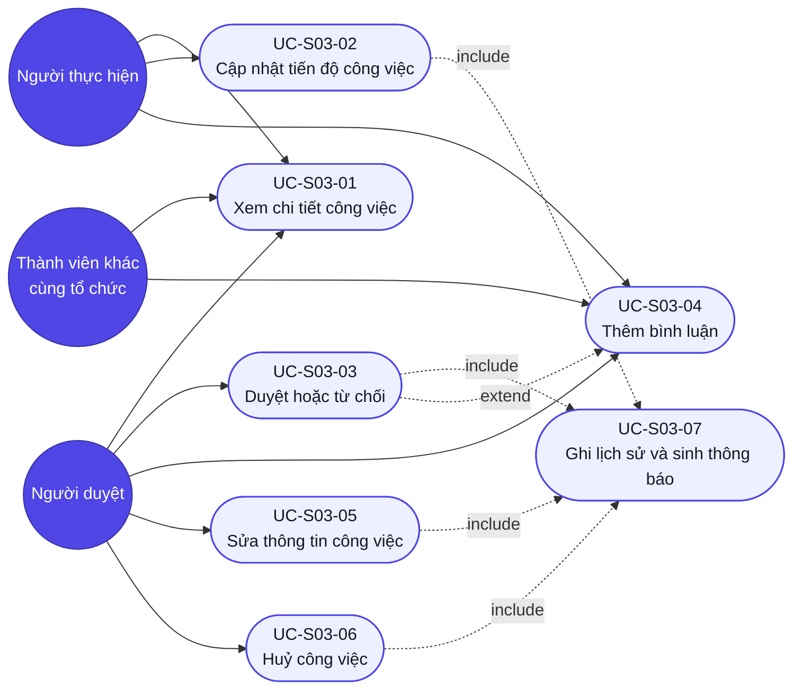

# Use case — Chi tiết công việc

## Sơ đồ Use case (tổng quan)

> Tổng quan tác nhân ↔ use case của màn S03. `UC-S03-07` (ghi lịch sử) được `include` bởi mọi use case làm thay đổi dữ liệu — tách ra để không lặp lại ở từng luồng.

> Cạnh `uc3 -. extend .-> uc4`: nhánh "Từ chối" của `UC-S03-03` **mở rộng** sang `UC-S03-04` vì lý do từ chối được lưu thành một bình luận (`BRule-S03-05`).

## UC-S03-01: Xem chi tiết công việc

- **Tác nhân (actor):** mọi thành viên cùng tổ chức (người thực hiện, người giao, người duyệt, thành viên khác).
- **Trigger (kích hoạt):** nhấn một dòng công việc ở Dashboard (S02), nhấn một thông báo in-app, hoặc mở trực tiếp URL `/tasks/:id`.
- **Tiền điều kiện:** đã đăng nhập; công việc tồn tại và thuộc tổ chức của người dùng.
- **Luồng chính (happy path):**
  1. Người dùng mở `/tasks/:id`.
  2. Hệ thống kiểm tra phiên đăng nhập và phạm vi tổ chức của công việc.
  3. Hệ thống hiển thị skeleton rồi gọi song song `GET /tasks/:id`, `GET /tasks/:id/history`, `GET /tasks/:id/comments`.
  4. Hệ thống hiển thị đầy đủ thông tin công việc, badge trạng thái và ưu tiên, đánh dấu quá hạn nếu có.
  5. Hệ thống hiển thị dòng thời gian lịch sử (mới → cũ) và danh sách bình luận (cũ → mới).
  6. Hệ thống chỉ render các nút hành động hợp lệ với trạng thái hiện tại và vai trò người xem.
- **Luồng thay thế / ngoại lệ:**
  - 2a. Chưa đăng nhập → chuyển hướng `/login` trong ≤ 100ms.
  - 2b. Công việc không tồn tại, đã bị xoá, hoặc thuộc tổ chức khác → trang "Không tìm thấy công việc" + nút "Về Dashboard" (cả ba trường hợp giống hệt nhau — `BRule-S03-11`).
  - 3a. `GET /tasks/:id` trả `5xx` → khối lỗi + nút "Thử lại"; nhấn "Thử lại" gọi lại toàn bộ.
  - 3b. Chỉ `GET /tasks/:id/comments` lỗi → khối thông tin và lịch sử vẫn hiển thị, riêng khu bình luận hiện lỗi cục bộ + "Thử lại".
  - 5a. Chưa có bình luận nào → hiện "Chưa có bình luận nào. Hãy là người đầu tiên trao đổi về công việc này."
  - 5b. Có hơn 50 bình luận → hiển thị 50 cái mới nhất + nút "Xem bình luận cũ hơn".
  - 4a. Mô tả rỗng → hiện "Không có mô tả".
- **Hậu điều kiện (postcondition):** màn ở trạng thái sẵn sàng thao tác; không dữ liệu nào bị thay đổi.
- **Đảm bảo (guarantees):** thành công — người dùng thấy đúng và đủ dữ liệu công việc trong phạm vi tổ chức mình; tối thiểu — không bao giờ hiển thị dữ liệu của tổ chức khác, kể cả khi lỗi.
- **Trace:** R-S03-01, R-S03-02, R-S03-03, R-S03-04, R-S03-07, R-S03-17, R-S03-N02, R-S03-N03.

## UC-S03-02: Cập nhật tiến độ công việc

- **Tác nhân:** người thực hiện (`nguoi_nhan_id`) của công việc.
- **Trigger:** nhấn "Bắt đầu làm" (khi trạng thái TODO) hoặc "Gửi duyệt" (khi trạng thái IN_PROGRESS).
- **Tiền điều kiện:** đã mở màn chi tiết; người dùng đúng là người thực hiện; trạng thái hiện tại cho phép chuyển tiếp.
- **Luồng chính:**
  1. Người thực hiện nhấn nút hành động đang hiện.
  2. Hệ thống gọi `PATCH /tasks/:id/status` với trạng thái đích.
  3. Hệ thống xác thực chuyển trạng thái theo `BRule-S03-01` và vai trò theo `BRule-S03-03`.
  4. Hệ thống ghi một bản ghi `LichSuCongViec` và sinh thông báo `STATUS_CHANGED` cho người giao (`include UC-S03-07`).
  5. Màn cập nhật badge trạng thái, thêm dòng lịch sử mới ở đầu dòng thời gian, đổi lại thanh hành động cho khớp trạng thái mới.
- **Luồng thay thế / ngoại lệ:**
  - 3a. Chuyển trạng thái không hợp lệ (vd gọi thẳng API TODO → DONE) → `400`; trạng thái không đổi; màn báo "Không thể chuyển trạng thái này".
  - 3b. Người gọi không phải người thực hiện → `403`; màn báo "Bạn không có quyền thực hiện thao tác này".
  - 3c. Trạng thái trên máy chủ đã bị người khác đổi trước đó → `400`/`409`; màn tự nạp lại dữ liệu mới và báo "Công việc vừa được cập nhật bởi người khác" (`BRule-S03-12`).
  - 2a. Mất mạng → badge giữ nguyên giá trị cũ, toast "Lỗi kết nối — thử lại"; không tạo bản ghi lịch sử nào.
- **Hậu điều kiện:** trạng thái công việc chuyển đúng một bậc theo luồng; có đúng 1 bản ghi lịch sử mới.
- **Đảm bảo:** thành công — trạng thái, lịch sử và thông báo nhất quán với nhau; tối thiểu — thất bại thì không đổi gì cả (không có lịch sử mồ côi, không có thông báo sai).
- **Trace:** R-S03-08, R-S03-09, R-S03-13, R-S03-15, R-S03-16, R-S03-N04.

## UC-S03-03: Duyệt hoặc từ chối công việc

- **Tác nhân:** người duyệt (Team Lead hoặc Org Admin).
- **Trigger:** công việc đang ở trạng thái IN_REVIEW và người duyệt nhấn "Duyệt hoàn thành" hoặc "Từ chối".
- **Tiền điều kiện:** đã mở màn chi tiết; trạng thái hiện tại là IN_REVIEW; người dùng có vai trò duyệt.
- **Luồng chính (nhánh duyệt):**
  1. Người duyệt xem thông tin và bình luận để đánh giá kết quả.
  2. Người duyệt nhấn "Duyệt hoàn thành".
  3. Hệ thống gọi `PATCH /tasks/:id/status` với `DONE`.
  4. Hệ thống ghi lịch sử và sinh thông báo cho người thực hiện (`include UC-S03-07`).
  5. Màn hiện badge "Hoàn thành" và ẩn hẳn thanh hành động (trạng thái cuối).
- **Luồng thay thế / ngoại lệ:**
  - 2a. **Nhánh từ chối** → hệ thống mở modal "Từ chối"; nút xác nhận đang disable.
    - 2a-1. Người duyệt nhập lý do 1–1000 ký tự → nút xác nhận bật.
    - 2a-2. Nhấn "Xác nhận từ chối" → hệ thống tạo bình luận chứa lý do (`extend UC-S03-04`) rồi chuyển trạng thái về IN_PROGRESS.
    - 2a-3. Màn hiện badge "Đang làm", thêm **cả** dòng lịch sử **và** bình luận lý do.
  - 2b. Bỏ trống lý do hoặc chỉ nhập khoảng trắng → nút xác nhận vẫn disable, không gọi API.
  - 2c. Nhập quá 1000 ký tự → lỗi inline "Lý do tối đa 1000 ký tự", nút xác nhận disable.
  - 2d. Đóng modal giữa chừng → không thay đổi gì, trạng thái vẫn IN_REVIEW.
  - 3a. Người gọi không có vai trò duyệt (gọi thẳng API) → `403`.
  - 3b. Tạo bình luận lý do thành công nhưng chuyển trạng thái thất bại → màn báo lỗi và nạp lại; **bình luận lý do đã tồn tại** — người duyệt thao tác lại, không nhập lại lý do lần hai.
- **Hậu điều kiện:** duyệt → trạng thái DONE (cuối); từ chối → trạng thái IN_PROGRESS kèm một bình luận lý do.
- **Đảm bảo:** thành công — kết quả duyệt phản ánh đủ ở trạng thái, lịch sử, bình luận và thông báo; tối thiểu — không bao giờ chuyển sang DONE mà thiếu bản ghi lịch sử.
- **Trace:** R-S03-10, R-S03-11, R-S03-15, R-S03-16, R-S03-N04; `BRule-S03-04`, `BRule-S03-05`.

## UC-S03-04: Thêm bình luận

- **Tác nhân:** mọi thành viên cùng tổ chức.
- **Trigger:** gõ nội dung vào ô bình luận và nhấn "Gửi".
- **Tiền điều kiện:** đã mở màn chi tiết; nội dung 1–1000 ký tự, không chỉ toàn khoảng trắng.
- **Luồng chính:**
  1. Người dùng gõ nội dung; hệ thống hiện bộ đếm ký tự `n/1000`.
  2. Người dùng nhấn "Gửi".
  3. Hệ thống gọi `POST /tasks/:id/comments`.
  4. Hệ thống thêm bình luận mới vào **cuối** danh sách, xoá trống ô nhập, tăng bộ đếm số bình luận.
- **Luồng thay thế / ngoại lệ:**
  - 1a. Nội dung rỗng hoặc toàn khoảng trắng → nút "Gửi" disable, không gọi API.
  - 1b. Vượt 1000 ký tự → bộ đếm chuyển đỏ, lỗi inline "Bình luận tối đa 1000 ký tự", nút "Gửi" disable.
  - 3a. Lỗi mạng hoặc `5xx` → **giữ nguyên nội dung đã gõ**, báo lỗi cạnh ô nhập + nút "Thử lại"; không thêm bình luận rỗng vào danh sách.
  - 3b. Công việc vừa bị xoá bởi người khác → `404`; màn chuyển sang trang "Không tìm thấy công việc".
  - 4a. Nội dung chứa thẻ HTML → hiển thị dưới dạng văn bản thuần, không thực thi.
- **Hậu điều kiện:** một bản ghi `BinhLuan` mới; không sinh bản ghi lịch sử (bình luận không phải thay đổi công việc).
- **Đảm bảo:** thành công — bình luận hiển thị đúng tác giả và thời điểm; tối thiểu — thất bại thì nội dung người dùng đã gõ không bị mất.
- **Trace:** R-S03-04, R-S03-05, R-S03-06; `BRule-S03-07`, `BRule-S03-10`.

## UC-S03-05: Sửa thông tin công việc

- **Tác nhân:** người duyệt (Team Lead hoặc Org Admin).
- **Trigger:** nhấn "Sửa thông tin".
- **Tiền điều kiện:** đã mở màn chi tiết; người dùng có vai trò duyệt; công việc chưa ở trạng thái DONE hoặc CANCELLED.
- **Luồng chính:**
  1. Người duyệt nhấn "Sửa thông tin" → hệ thống mở modal điền sẵn giá trị hiện tại của 5 trường.
  2. Người duyệt sửa một hoặc nhiều trường.
  3. Hệ thống kiểm tra từng trường theo bảng Validation của `srs.md`.
  4. Người duyệt nhấn "Lưu" → hệ thống gọi `PATCH /tasks/:id`.
  5. Hệ thống ghi **một bản ghi lịch sử cho mỗi trường bị đổi** (`include UC-S03-07`, `BRule-S03-08`).
  6. Màn cập nhật thông tin hiển thị và thêm các dòng lịch sử mới.
- **Luồng thay thế / ngoại lệ:**
  - 3a. Tiêu đề rỗng hoặc quá 200 ký tự → lỗi inline, nút "Lưu" disable.
  - 3b. Chọn người thực hiện là thành viên INACTIVE → người đó không xuất hiện trong danh sách chọn.
  - 3c. Đặt deadline ở quá khứ → **cảnh báo nhưng vẫn cho lưu** (khác lúc tạo mới — công việc có thể đã quá hạn thật).
  - 4a. Không sửa trường nào rồi nhấn "Lưu" → không gọi API, đóng modal, không sinh dòng lịch sử nào.
  - 4b. Đổi người thực hiện → người mới nhận thông báo `TASK_ASSIGNED`; người cũ nhận `STATUS_CHANGED`.
  - 5a. Lỗi mạng → modal không đóng, mọi giá trị đã nhập còn nguyên, báo lỗi trên modal.
- **Hậu điều kiện:** thông tin công việc cập nhật; số dòng lịch sử mới = số trường thực sự đổi.
- **Đảm bảo:** thành công — mọi thay đổi đều truy vết được về người sửa; tối thiểu — không ghi lịch sử cho trường không đổi.
- **Trace:** R-S03-14, R-S03-15; `BRule-S03-04`, `BRule-S03-08`.

## UC-S03-06: Huỷ công việc

- **Tác nhân:** người duyệt (Team Lead hoặc Org Admin).
- **Trigger:** nhấn "Huỷ công việc".
- **Tiền điều kiện:** trạng thái hiện tại ∈ {TODO, IN_PROGRESS, IN_REVIEW}; người dùng có vai trò duyệt.
- **Luồng chính:**
  1. Người duyệt nhấn "Huỷ công việc".
  2. Hệ thống hiện hộp xác nhận "Huỷ công việc này? Thao tác không hoàn tác được."
  3. Người duyệt xác nhận → hệ thống gọi `PATCH /tasks/:id/status` với `CANCELLED`.
  4. Hệ thống ghi lịch sử và sinh thông báo cho người thực hiện (`include UC-S03-07`).
  5. Màn hiện badge "Đã huỷ", banner "Công việc đã huỷ", ẩn hẳn thanh hành động; khu bình luận **vẫn đọc được** nhưng không gửi thêm được.
- **Luồng thay thế / ngoại lệ:**
  - 2a. Người duyệt chọn "Không" → đóng hộp xác nhận, không gọi API.
  - 3a. Công việc đang ở DONE → nút "Huỷ công việc" không render; gọi thẳng API trả `400` (`BRule-S03-02`).
  - 3b. Người gọi không có vai trò duyệt → `403`.
- **Hậu điều kiện:** trạng thái CANCELLED (trạng thái cuối, không hoàn tác — `GĐ-06`).
- **Đảm bảo:** thành công — người thực hiện được thông báo việc đã huỷ; tối thiểu — không huỷ được nếu chỉ nhấn một lần (luôn có bước xác nhận).
- **Trace:** R-S03-12, R-S03-13, R-S03-16; `BRule-S03-02`, `BRule-S03-04`.

## UC-S03-07: Ghi lịch sử và sinh thông báo *(use case dùng chung — include)*

- **Tác nhân:** hệ thống (không có tác nhân người trực tiếp).
- **Trigger:** bất kỳ thao tác nào làm thay đổi dữ liệu công việc thành công (`UC-S03-02`, `UC-S03-03`, `UC-S03-05`, `UC-S03-06`).
- **Tiền điều kiện:** thao tác nghiệp vụ đã qua kiểm tra hợp lệ và phân quyền.
- **Luồng chính:**
  1. Hệ thống ghi một bản ghi `LichSuCongViec` cho mỗi trường bị đổi, đóng băng `gia_tri_cu` và `gia_tri_moi` tại thời điểm đó.
  2. Hệ thống xác định tập người nhận thông báo: người thực hiện và người giao, **trừ** chính người vừa thao tác.
  3. Hệ thống tạo bản ghi `ThongBao` loại `STATUS_CHANGED` (hoặc `TASK_ASSIGNED` khi đổi người thực hiện) trỏ tới công việc này.
- **Luồng thay thế / ngoại lệ:**
  - 2a. Người thao tác đồng thời là người thực hiện và người giao → không sinh thông báo nào.
  - 3a. Tạo thông báo thất bại → **không** cuộn ngược thay đổi nghiệp vụ; ghi log lỗi và bỏ qua (thông báo là phụ trợ, không chặn luồng chính).
- **Hậu điều kiện:** lịch sử phản ánh đủ mọi thay đổi; người liên quan được báo.
- **Đảm bảo:** thành công — lịch sử và thông báo khớp thay đổi thực tế; tối thiểu — lịch sử luôn được ghi kể cả khi thông báo lỗi.
- **Trace:** R-S03-15, R-S03-16; `BRule-S03-08`, `BRule-S03-09`.
