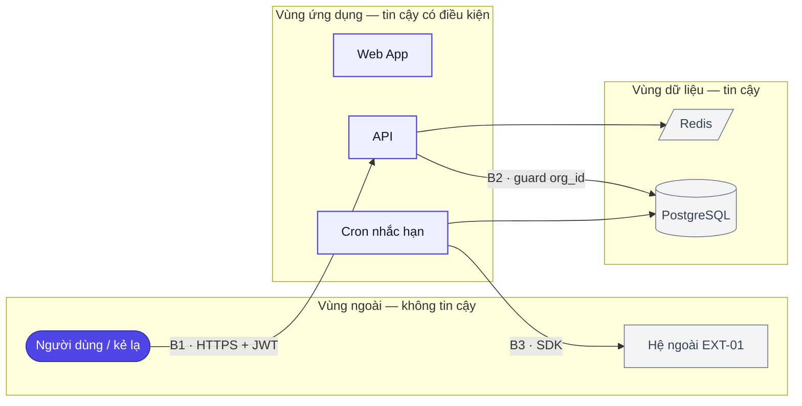

# Mô hình đe doạ — <Tên dự án>

> Ngày: `<YYYY-MM-DD>` · Hồ sơ: `<full|lite|mini>` · Phạm vi: `<full|docs>` · Kiến trúc: `10-architecture.md` (<ADR-.. Accepted>) · Dữ liệu: `05-data-model.md` · Yêu cầu: `01-requirements.md` · Màn: `<S01…S06>` · Hệ ngoài: `12-api-integration.md`
> **Ảnh chụp kiến trúc tại thời điểm chạy `ba-threat-model`.** ADR mới/supersede, thực thể mới, hệ ngoài mới, màn mới có phân quyền → chạy lại. Trạng thái từng `TM` là phần **sống** — cập nhật tại chỗ, không xoá dòng (`Chấp nhận` ghi ai + ngày).
> Mức = khả năng × tác động, đã trừ kiểm soát **đang có trong tài liệu** (không tính kiểm soát "sẽ làm"). Thang ở `.claude/skills/ba-threat-model/references/stride-hints.md`.

## Tóm tắt

- Chủ đề rủi ro lớn nhất: <1–2 câu — vd "mọi cách ly tenant dựa vào kỷ luật guard `org_id` ở tầng repository (ADR-02); quên một truy vấn là lộ dữ liệu tổ chức khác">
- <N> đe doạ: <a> Cao · <b> Vừa · <c> Thấp — <x> Giảm nhẹ · <y> Mở (đã mở `WI`/`OQ`) · <z> Chấp nhận
- Giả định ảnh hưởng nhất tới xếp mức: <GĐ-..>

## 1. Ranh giới tin cậy

> Mỗi dòng là một **cạnh** giữa hai vùng tin cậy khác nhau — lấy từ cạnh xuyên vùng của sơ đồ ngữ cảnh/triển khai (`scan-threat.js` (e)), cộng ranh giới mà sơ đồ không vẽ nhưng tài liệu nói tới (cron ↔ DB, migration, CI/CD, backup). Ký hiệu `B1…` dùng để bảng §4 trỏ tới.

| Ký hiệu | Ranh giới (từ → đến) | Kênh / giao thức | Ai đi qua | Kiểm soát đã chốt (trace) | Nguồn |
|---|---|---|---|---|---|
| B1 | <Trình duyệt người dùng → API> | <HTTPS · JSON · JWT Bearer> | <Member, Team Lead, Org Admin, kẻ lạ chưa đăng nhập> | <`NFR-02` HTTPS + JWT RS256 · `NFR-03` khoá 5 lần sai · `ADR-03`> | `10-architecture.md` §4.1 |
| B2 | <API → PostgreSQL> | <TCP nội bộ · ORM> | <mọi module qua repository> | <`NFR-06` guard `org_id` · `ADR-02`> | `10-architecture.md` §4.2, §6 |
| B3 | <API → Hệ ngoài `EXT-01`> | <HTTPS · SDK> | <cron notify> | <`ADR-..` của `12-api-integration.md`> | `12-api-integration.md` §5 |

> Mỗi `subgraph` = một vùng tin cậy; cạnh xuyên vùng mang ký hiệu `B..`. Nhãn bọc `"…"`, tiếng Việt **có dấu**, ID nút ASCII.

## 2. Tài sản

> Từ `scan-threat.js` (a) — đã **loại** trường trúng từ khoá mà không nhạy cảm (ghi lý do ở cuối bảng). Thêm tài sản không phải dữ liệu: khoá ký JWT, bí mật cấu hình, nhật ký, tính sẵn sàng của thành phần. Mục tiêu: **C** (bí mật) · **I** (toàn vẹn) · **A** (sẵn sàng).

| Ký hiệu | Tài sản | Ở đâu | Vì sao quan trọng | Mục tiêu | Nguồn |
|---|---|---|---|---|---|
| A1 | <Mật khẩu người dùng (hash)> | <`NguoiDung.mat_khau_hash`> | <lộ = chiếm tài khoản hàng loạt; cost 12 chỉ làm chậm, không chặn> | C | `05-data-model.md` · `NFR-02` |
| A2 | <Refresh token> | <`PhienDangNhap.refresh_token_hash`> | <giữ phiên 30 ngày — trộm được là đăng nhập không cần mật khẩu> | C, I | `05-data-model.md` · `BRule-S01-06` |
| A3 | <Dữ liệu công việc của tổ chức> | <`CongViec`, `BinhLuan` theo `to_chuc_id`> | <đa tổ chức — lộ chéo là vi phạm `NFR-06`, PDPA> | C, I | `05-data-model.md` · `NFR-06` |
| A4 | <Khoá ký JWT (private key)> | <cấu hình môi trường API> | <mất = giả được token mọi người dùng> | C | `ADR-03` |

*Loại khỏi danh sách quét:* <`phai_doi_mat_khau` — cờ, không phải bí mật · …>

## 3. Kẻ tấn công theo vai

> Vai lấy từ `StR`/`SH`/enum vai trò (`scan-threat.js` "Vai trò"). Ghi cả **KHÔNG có năng lực** — để không thổi mức (kẻ lạ không có tài khoản thì không đi qua được `B1` đã xác thực).

| Vai | Năng lực thực tế | KHÔNG có năng lực | Tài sản với tới | Nguồn |
|---|---|---|---|---|
| <Kẻ lạ (chưa đăng nhập)> | <gọi API công khai: đăng nhập, đăng ký; dò mật khẩu; đoán email> | <không có token; không truy cập mạng nội bộ> | <A1 (dò), A3 (nếu lọt B1)> | `S01`, `S06` |
| <Member (tài khoản hợp lệ)> | <mọi endpoint sau đăng nhập; sửa tham số `id` trong request> | <không có quyền Org Admin theo `BRule-S05-01`> | <A3 của tổ chức mình; A3 tổ chức khác nếu guard hụt> | `BRule-S02-01`, `BRule-S03-11` |
| <Org Admin (nội gián)> | <tạo/vô hiệu hoá thành viên, đặt mật khẩu tạm> | <không đọc DB trực tiếp> | <A1 của thành viên (mật khẩu tạm)> | `BRule-S05-07` |
| <Vận hành (SH-04)> | <đọc DB, biến môi trường, log> | <—> | <A1, A2, A4, toàn bộ A3> | `04-stakeholders.md` |
| <Hệ ngoài `EXT-01` bị chiếm> | <trả lỗi/chậm; nhận nội dung email> | <không gọi ngược vào API> | <A (sẵn sàng của nhắc hạn), PII trong email> | `12-api-integration.md` |

## 4. Bảng đe doạ

> **STRIDE là khung, không phải danh mục phải điền đủ.** Chỉ ghi đe doạ có **ranh giới cụ thể (B..)** + **tài sản cụ thể (A..)** + **kẻ tấn công có năng lực với tới**. Cột "Đường lạm dụng" viết dạng `<ai> → <bước 1> → <bước 2> → <hậu quả>` (phải có `→`). Mức: `Cao` / `Vừa` / `Thấp`. Trạng thái: `Giảm nhẹ` (biện pháp đã chốt trong `NFR`/`BRule`/`ADR`) · `Mở` (chưa có — đã mở `WI-..`/`OQ-..`/`PD-..`) · `Chấp nhận — <Ai> · <YYYY-MM-DD>` (có người chịu).
> STRIDE: **S** giả mạo danh tính · **T** sửa trái phép dữ liệu · **R** chối bỏ hành vi · **I** lộ thông tin · **D** từ chối dịch vụ · **E** leo thang đặc quyền.

| Mã | Ranh giới | Tài sản | STRIDE | Đường lạm dụng | Mức | Biện pháp (trace) | Trạng thái |
|---|---|---|---|---|---|---|---|
| TM-01 | B1 | A1 | S | <Kẻ lạ → dò mật khẩu email đã biết → khoá 5 lần/15 phút chỉ khoá **tài khoản**, không khoá IP → đổi email, dò tiếp → chiếm tài khoản yếu> | Cao | <`NFR-03` khoá tài khoản · `BRule-S01-05` không lộ email tồn tại · **thiếu** rate-limit theo IP → `WI-..`> | Mở |
| TM-02 | B2 | A3 | I | <Member → gọi `GET /tasks/{id}` với id tổ chức khác → repository quên guard `org_id` → đọc công việc tổ chức khác> | Cao | <`NFR-06` · `ADR-02` guard ở repository · `BRule-S03-11` trả 404> | Giảm nhẹ |
| TM-03 | B1 | A2 | S | <Kẻ có XSS/đọc được storage → lấy refresh token → dùng 30 ngày không cần mật khẩu> | Vừa | <`BRule-S01-06` trần 7 ngày không dùng · `BRule-S04-06` đổi mật khẩu thu hồi phiên · nơi lưu token: `OQ-..`> | Mở |
| TM-04 | B3 | A3 | I | <Email nhắc hạn chứa tiêu đề công việc → gửi nhầm địa chỉ / nhà cung cấp lưu nội dung → lộ nội dung công việc ra ngoài> | Thấp | <`12-api-integration.md` §4 chỉ gửi tiêu đề + hạn, không gửi mô tả> | Chấp nhận — SH-06 · <YYYY-MM-DD> |

## 5. Biện pháp & nợ

**Đã có (Giảm nhẹ):** <TM-02 ← `NFR-06`/`ADR-02` · …> — nhắc `ac-judge`/`ac-verify` rằng các kiểm soát này **phải thấy trong code** (guard, rate-limit, hash), không chỉ trong tài liệu.

**Còn nợ (Mở) — mỗi dòng đã có `WI`/`OQ`/`PD`:**

| Mã | Việc còn phải làm | Sổ | Mốc phải sạch |
|---|---|---|---|
| TM-01 | <Rate-limit đăng nhập theo IP/thiết bị bên cạnh khoá tài khoản> | <`WI-..`> | <`dev-run` S01> |
| TM-03 | <Chốt nơi lưu token phía trình duyệt (cookie HttpOnly hay memory)> | <`OQ-..` / `PD-..`> | <`ba-build`> |

**Chấp nhận (có người chịu):** <TM-04 — SH-06, <ngày>, lý do: …>

## 6. Checklist bảo mật cho review code

> Rút từ `.claude/skills/ba-toolkit/references/security-checklist.md` — **chỉ** nhóm áp cho stack đã chốt: <chung · node-backend · nextjs · data · external>. `ac-judge` lượt B (Bảo mật) đối chiếu diff với bảng này; mục nào có `TM` liên quan thì finding thừa kế mức của `TM` đó.

| Mục | Kiểm gì | Soi ở đâu | TM liên quan |
|---|---|---|---|
| <SEC-AUTHZ-01> | <Mọi truy vấn nghiệp vụ có điều kiện `org_id` từ token, không từ request> | <`*.repository.ts` · grep `where` không có `org_id`> | TM-02 |
| <SEC-AUTH-03> | <Endpoint đăng nhập/đăng ký có rate-limit ngoài khoá tài khoản> | <`auth.controller.ts` · middleware throttle> | TM-01 |
| <SEC-SECRET-01> | <Khoá ký JWT, chuỗi kết nối chỉ từ biến môi trường; không có trong repo/log> | <grep `PRIVATE_KEY`, `password=` trong `src/`> | — |

## Giả định & câu hỏi mở

| Mã | Giả định / câu hỏi | Ảnh hưởng tới mức | Trạng thái |
|---|---|---|---|
| <GĐ-..> | <API chỉ nhận request qua reverse proxy có TLS; không mở cổng trực tiếp> | <sai → TM-01, TM-03 lên Cao> | <chưa xác nhận> |
| <OQ-..> | <Token lưu ở đâu phía trình duyệt?> | <quyết TM-03> | <mở> |
