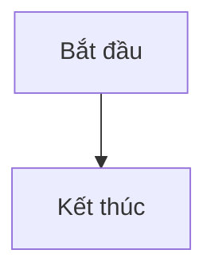

# Đối chứng âm cho bước render Mermaid của CI

Fixture này CỐ Ý có đúng 1 khối hỏng. CI dựng portal từ thư mục này và đòi bước render báo
**≥ 1 lỗi** và **1 sơ đồ vẽ được** — nếu render check trả "0 lỗi" ở đây thì nó không nhìn thấy gì
(Chrome chưa chạy xong script, selector đổi, mermaid không nạp), và con số 0 lỗi của portal thật
cũng không đọc được thành "sạch". Đừng sửa khối thứ hai.



```mermaid
flowchart TD
  A[Hỏng --> 
  B((( ]]
```
