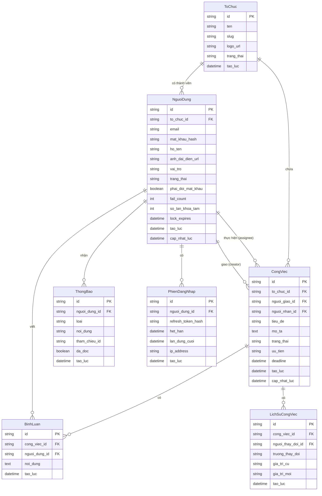

# Mô hình dữ liệu — TeamTasks

## 1. Danh sách thực thể

| Thực thể | Mô tả | Chức năng dùng (F..) |
|----------|-------|----------------------|
| NguoiDung (User) | Tài khoản người dùng trong hệ thống; có vai trò, trạng thái và thuộc về một tổ chức | F01, F02, F10, F11 |
| ToChuc (Organization) | Đơn vị tổ chức; là tenant trong hệ thống; chứa nhiều thành viên và nhiều công việc | F01, F03, F11 |
| CongViec (Task) | Đơn vị công việc; có người giao, người thực hiện, deadline, trạng thái và lịch sử | F03, F04, F05, F06, F08, F09 |
| BinhLuan (Comment) | Ghi chú thảo luận gắn với một công việc | F07 |
| LichSuCongViec (TaskHistory) | Bản ghi mỗi lần trạng thái/thông tin công việc thay đổi; dùng cho audit trail | F05, F06 |
| ThongBao (Notification) | Thông báo in-app gắn với một người dùng; có trạng thái đã đọc/chưa đọc | F08 |
| PhienDangNhap (Session) | Refresh token của người dùng; dùng để thu hồi phiên khi đăng xuất | F01, F02 |

## 2. Sơ đồ quan hệ (ERD)

## 3. Từ điển dữ liệu

### Thực thể: ToChuc (Organization)
| Thuộc tính | Kiểu | Ràng buộc | Mô tả |
|------------|------|-----------|-------|
| id | chuỗi (UUID) | PK, bắt buộc | Định danh duy nhất |
| ten | chuỗi | bắt buộc, 1–100 ký tự | Tên hiển thị của tổ chức |
| slug | chuỗi | duy nhất, bắt buộc, [a-z0-9-] | Định danh URL-friendly |
| logo_url | chuỗi | tuỳ chọn | URL ảnh logo |
| trang_thai | enum | ACTIVE, SUSPENDED | Trạng thái tổ chức; mặc định ACTIVE |
| tao_luc | datetime | bắt buộc | Thời điểm tạo |

### Thực thể: NguoiDung (User)
| Thuộc tính | Kiểu | Ràng buộc | Mô tả |
|------------|------|-----------|-------|
| id | chuỗi (UUID) | PK, bắt buộc | Định danh duy nhất |
| to_chuc_id | chuỗi (UUID) | FK → ToChuc, bắt buộc | Tổ chức thuộc về |
| email | chuỗi | duy nhất, bắt buộc, ≤254 ký tự | Email đăng nhập |
| mat_khau_hash | chuỗi | bắt buộc | Bcrypt hash (cost≥12); không lưu plaintext |
| ho_ten | chuỗi | bắt buộc, 1–100 ký tự | Tên hiển thị |
| anh_dai_dien_url | chuỗi | tuỳ chọn | URL ảnh đại diện |
| vai_tro | enum | MEMBER, TEAM_LEAD, ORG_ADMIN | Vai trò trong tổ chức |
| trang_thai | enum | ACTIVE, TEMP_LOCKED, PERM_LOCKED, INACTIVE | Trạng thái tài khoản |
| phai_doi_mat_khau | boolean | mặc định `false` | *(CR-02)* Cờ buộc đổi mật khẩu ở lần đăng nhập kế tiếp. Đặt `true` khi tài khoản được tạo qua `POST /organizations/me/members` (mật khẩu tạm do Org Admin đặt); đặt `false` sau khi đổi mật khẩu thành công lần đầu. Chặn mọi màn khác cho tới khi cờ về `false`. |
| fail_count | số nguyên | ≥0, mặc định 0 | Số lần nhập sai liên tiếp; reset về 0 khi hết khoá tạm (`BRule-S01-02`) hoặc đăng nhập thành công |
| so_lan_khoa_tam | số nguyên | ≥0, mặc định 0 | Số **chu kỳ khoá tạm liên tiếp** đã trải qua. `BRule-S01-03` khoá vĩnh viễn khi giá trị này đạt 3 và người dùng sai tiếp; **không** reset cùng `fail_count` (nếu reset thì luật 3-lần-khoá không bao giờ đạt), chỉ reset khi đăng nhập thành công hoặc Admin mở khoá. Thiếu trường này thì `BRule-S01-03` không kiểm chứng được (`G67`) |
| lock_expires | datetime | tuỳ chọn, null khi không khoá | Thời điểm hết khoá tạm |
| tao_luc | datetime | bắt buộc | Thời điểm tạo |
| cap_nhat_luc | datetime | bắt buộc | Thời điểm cập nhật gần nhất |

### Thực thể: CongViec (Task)
| Thuộc tính | Kiểu | Ràng buộc | Mô tả |
|------------|------|-----------|-------|
| id | chuỗi (UUID) | PK, bắt buộc | Định danh duy nhất |
| to_chuc_id | chuỗi (UUID) | FK → ToChuc, bắt buộc | Tổ chức sở hữu công việc |
| nguoi_giao_id | chuỗi (UUID) | FK → NguoiDung, bắt buộc | Người tạo/giao việc |
| nguoi_nhan_id | chuỗi (UUID) | FK → NguoiDung, bắt buộc | Người thực hiện |
| tieu_de | chuỗi | bắt buộc, 1–200 ký tự | Tiêu đề công việc |
| mo_ta | văn bản | tuỳ chọn, ≤5000 ký tự | Mô tả chi tiết |
| trang_thai | enum | TODO, IN_PROGRESS, IN_REVIEW, DONE, CANCELLED | Trạng thái hiện tại |
| uu_tien | enum | LOW, MEDIUM, HIGH, URGENT | Mức ưu tiên; mặc định MEDIUM |
| deadline | datetime | bắt buộc | Ngày giờ đến hạn |
| tao_luc | datetime | bắt buộc | Thời điểm tạo |
| cap_nhat_luc | datetime | bắt buộc | Thời điểm cập nhật gần nhất |

### Thực thể: BinhLuan (Comment)
| Thuộc tính | Kiểu | Ràng buộc | Mô tả |
|------------|------|-----------|-------|
| id | chuỗi (UUID) | PK, bắt buộc | Định danh duy nhất |
| cong_viec_id | chuỗi (UUID) | FK → CongViec, bắt buộc | Công việc được bình luận |
| nguoi_dung_id | chuỗi (UUID) | FK → NguoiDung, bắt buộc | Người viết bình luận |
| noi_dung | văn bản | bắt buộc, 1–1000 ký tự | Nội dung bình luận |
| tao_luc | datetime | bắt buộc | Thời điểm gửi |

### Thực thể: LichSuCongViec (TaskHistory)
| Thuộc tính | Kiểu | Ràng buộc | Mô tả |
|------------|------|-----------|-------|
| id | chuỗi (UUID) | PK, bắt buộc | Định danh duy nhất |
| cong_viec_id | chuỗi (UUID) | FK → CongViec, bắt buộc | Công việc liên quan |
| nguoi_thay_doi_id | chuỗi (UUID) | FK → NguoiDung, bắt buộc | Người thực hiện thay đổi |
| truong_thay_doi | chuỗi | bắt buộc | Tên trường bị thay đổi (vd: `trang_thai`) |
| gia_tri_cu | chuỗi | tuỳ chọn | Giá trị trước khi thay đổi |
| gia_tri_moi | chuỗi | bắt buộc | Giá trị sau khi thay đổi |
| tao_luc | datetime | bắt buộc | Thời điểm thay đổi |

### Thực thể: ThongBao (Notification)
| Thuộc tính | Kiểu | Ràng buộc | Mô tả |
|------------|------|-----------|-------|
| id | chuỗi (UUID) | PK, bắt buộc | Định danh duy nhất |
| nguoi_dung_id | chuỗi (UUID) | FK → NguoiDung, bắt buộc | Người nhận thông báo |
| loai | enum | TASK_ASSIGNED, STATUS_CHANGED, COMMENT_ADDED, DEADLINE_REMINDER | Loại thông báo |
| noi_dung | chuỗi | bắt buộc, ≤500 ký tự | Nội dung thông báo |
| tham_chieu_id | chuỗi (UUID) | tuỳ chọn | ID đối tượng liên quan (vd: task_id) |
| da_doc | boolean | bắt buộc, mặc định false | Trạng thái đã đọc |
| tao_luc | datetime | bắt buộc | Thời điểm tạo thông báo |

### Thực thể: PhienDangNhap (Session)
| Thuộc tính | Kiểu | Ràng buộc | Mô tả |
|------------|------|-----------|-------|
| id | chuỗi (UUID) | PK, bắt buộc | Định danh duy nhất |
| nguoi_dung_id | chuỗi (UUID) | FK → NguoiDung, bắt buộc | Người dùng sở hữu phiên |
| refresh_token_hash | chuỗi | bắt buộc, duy nhất | SHA-256 hash của refresh token |
| het_han | datetime | bắt buộc | Trần tuyệt đối của phiên — 30 ngày kể từ lúc đăng nhập bằng mật khẩu; không gia hạn theo hoạt động |
| lan_dung_cuoi | datetime | bắt buộc | *(CR-04)* Lần gần nhất refresh token được dùng. `POST /auth/refresh` chỉ cấp token mới khi mốc này cách hiện tại **≤ 7 ngày** (`BRule-S01-06`); mỗi lần refresh thành công thì cập nhật về hiện tại. Không có trường này thì luật 7 ngày **không kiểm chứng được** |
| ip_address | chuỗi | tuỳ chọn | IP địa chỉ khi đăng nhập (audit) |
| tao_luc | datetime | bắt buộc | Thời điểm tạo phiên |

## 4. Quan hệ

| Từ | Đến | Loại | Ý nghĩa |
|----|-----|------|---------|
| ToChuc | NguoiDung | 1-n | Một tổ chức có nhiều thành viên |
| ToChuc | CongViec | 1-n | Một tổ chức có nhiều công việc |
| NguoiDung (creator) | CongViec | 1-n | Một người có thể giao nhiều công việc |
| NguoiDung (assignee) | CongViec | 1-n | Một người có thể được giao nhiều công việc |
| CongViec | BinhLuan | 1-n | Một công việc có nhiều bình luận |
| CongViec | LichSuCongViec | 1-n | Một công việc có nhiều bản ghi lịch sử |
| NguoiDung | BinhLuan | 1-n | Một người có thể viết nhiều bình luận |
| NguoiDung | ThongBao | 1-n | Một người nhận nhiều thông báo |
| NguoiDung | PhienDangNhap | 1-n | Một người có thể có nhiều phiên (đa thiết bị) |

## 5. Mức chuẩn hoá & lý do

**Toàn bộ mô hình đạt 3NF (Third Normal Form)** — mỗi thuộc tính phi khoá phụ thuộc hoàn toàn và chỉ phụ thuộc vào khoá chính:

- **1NF:** mọi thuộc tính đều nguyên tử — không có trường nào chứa danh sách. *(Ví dụ: không nhét nhiều người thực hiện vào một trường; `CongViec.nguoi_nhan_id` là một khoá ngoại duy nhất.)*
- **2NF:** không có khoá chính tổ hợp trong mô hình (mọi thực thể dùng `id` UUID đơn), nên không phát sinh phụ thuộc bộ phận.
- **3NF:** không lưu giá trị suy diễn được từ khoá ngoại. *(Ví dụ: `CongViec` **không** lưu `ten_nguoi_nhan` hay `ten_to_chuc` — đọc qua quan hệ; `BinhLuan` không lưu `ten_nguoi_dung`.)*

**Các điểm phi chuẩn hoá có chủ đích (denormalization):**

| Chỗ | Vi phạm | Lý do giữ |
|---|---|---|
| `CongViec.to_chuc_id` | Suy được qua `nguoi_giao_id → NguoiDung.to_chuc_id` | **Bắt buộc cho cách ly tenant** (`BR-03`, `NFR-06`): mọi truy vấn lọc thẳng theo `to_chuc_id`, không phải join. Bỏ trường này thì một lỗi join là một lần rò dữ liệu giữa tổ chức. |
| `LichSuCongViec.gia_tri_cu` / `gia_tri_moi` | Lặp lại giá trị đã có ở `CongViec` tại thời điểm đó | Bản chất nhật ký: phải **đóng băng** giá trị lúc thay đổi, không được đổi theo bản ghi gốc. |
| `ThongBao.noi_dung` | Có thể sinh lại từ `loai` + `tham_chieu_id` | Nội dung thông báo phải giữ nguyên như lúc gửi, kể cả khi công việc bị đổi tiêu đề hoặc xoá sau đó. |

**Quan hệ n-n:** hiện **không có** quan hệ nhiều-nhiều nào trong phạm vi giai đoạn 1 (một công việc chỉ có **một** người thực hiện — `FR-04`). Nếu sau này cho phép nhiều người thực hiện, phải **tách bảng nối** `CongViec_NguoiThucHien`, không thêm cột lặp.

## Thuật ngữ
| Thuật ngữ | Giải thích |
|---|---|
| ERD (Entity-Relationship Diagram) | Sơ đồ thực thể — quan hệ giữa các bảng dữ liệu |
| Thực thể (Entity) | Một loại đối tượng được lưu trữ (Người dùng, Công việc…) |
| PK (Primary Key) | Khoá chính — định danh duy nhất một bản ghi |
| FK (Foreign Key) | Khoá ngoại — trỏ tới bản ghi của thực thể khác |
| UUID | Chuỗi định danh duy nhất toàn cục, không đoán được như số tăng dần |
| enum | Kiểu dữ liệu chỉ nhận một tập giá trị định sẵn (vd TODO/IN_PROGRESS/DONE) |
| 3NF (Third Normal Form) | Mức chuẩn hoá: không lưu dữ liệu suy diễn được từ khoá |
| Denormalization (phi chuẩn hoá) | Cố ý lặp dữ liệu để đổi lấy hiệu năng hoặc an toàn truy vấn |
| Bảng nối | Bảng trung gian tách một quan hệ nhiều-nhiều thành hai quan hệ một-nhiều |
| Tenant | Một tổ chức trong hệ thống nhiều tổ chức; dữ liệu cách ly theo `to_chuc_id` |

> Từ điển đầy đủ toàn dự án: `docs/00-glossary.md`.
