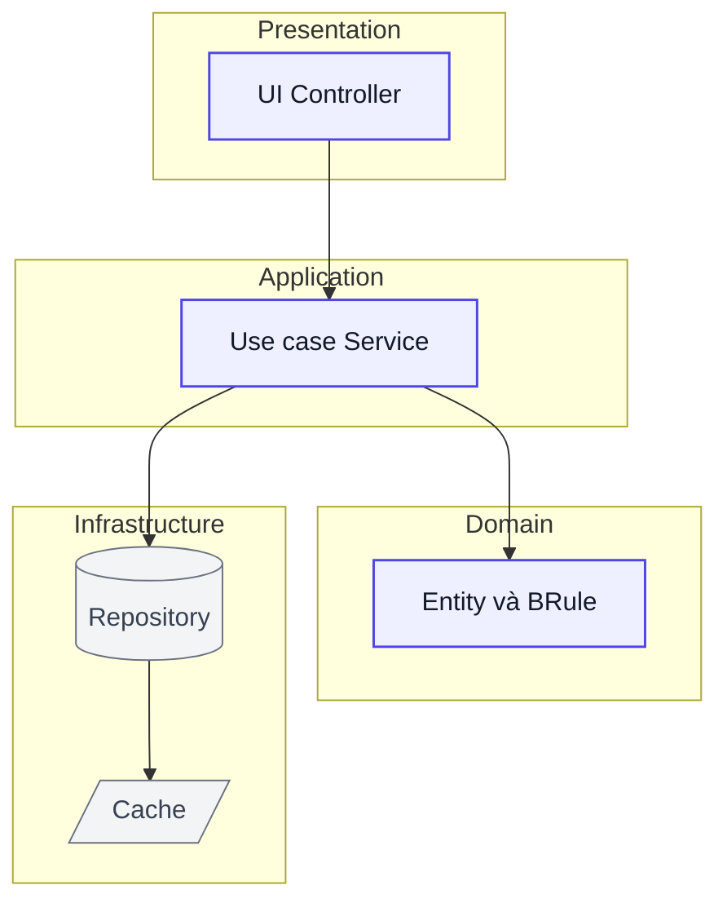
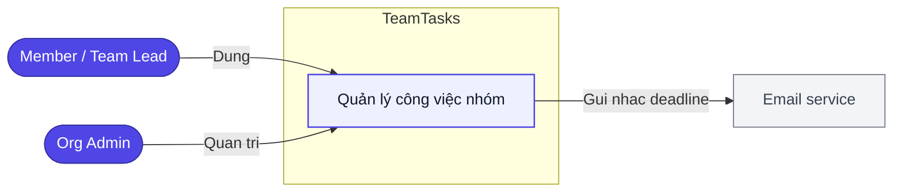
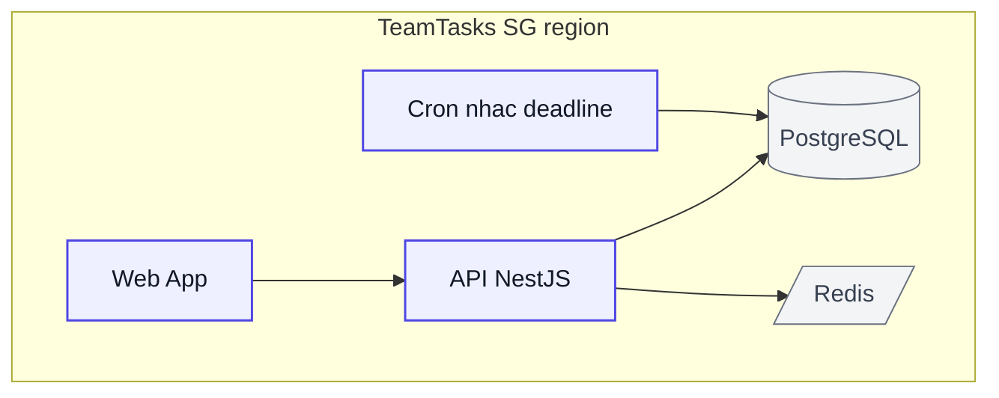

# Kiến trúc kỹ thuật — TeamTasks

> Solution/Technical Architecture. Mỗi quyết định trace về `NFR`/ràng buộc trong `01-requirements.md`. Tài liệu sống — đổi qua `ba-change-request` (ADR mới / ADR superseded).
> Cập nhật: 2026-07-17. **ADR đã qua cổng chốt = Accepted** (được `ba-build`/`dev-run` bám).

## 1. Bối cảnh & driver kiến trúc
- **Tóm tắt hệ thống:** nền web quản lý công việc nhóm đa tổ chức (tối đa 5 tổ chức × 200 thành viên, ~1.000 người dùng tổng, cao điểm ~200 đồng thời).
- **Driver từ NFR/ràng buộc:**

| Driver | Nguồn | Hệ quả kiến trúc |
|--------|-------|------------------|
| Phản hồi p95 ≤ 2s @200 đồng thời | NFR-01 | Index + connection pool + cache đọc dashboard; tránh N+1 |
| Cách ly dữ liệu tenant | NFR-06 | Row-level `org_id` + guard mọi truy vấn |
| Mật khẩu bcrypt ≥12, JWT RS256, HTTPS | NFR-02 | Auth service + bí mật xoay khóa |
| Khoá 5 lần sai/15 phút | NFR-03 | Rate-limit + đếm ở Redis |
| Uptime ≥ 99,5% | NFR-04 | 1 region, health-check, backup |
| Dữ liệu tại VN/SG (PDPA) | Ràng buộc §7 | Cloud region ap-southeast-1 (Singapore) |
| MVP 3 tháng, web-only, không OAuth GĐ1 | Ràng buộc §7 | Modular-monolith, tránh microservices/SSO sớm |

## 2. Stack công nghệ

| Lớp | Công nghệ | Lý do (trace) | ADR |
|-----|-----------|---------------|-----|
| Frontend | Next.js + React (web) | SSR nhanh, web-only GĐ1, hệ sinh thái lớn | ADR-01 |
| Backend | NestJS (Node.js/TypeScript) | Cùng ngôn ngữ FE, modular sẵn, năng suất cho MVP 3 tháng | ADR-01 |
| Database | PostgreSQL | Quan hệ + tenant row-level + JSONB; giao dịch chắc | ADR-02 |
| Cache/khoá | Redis | Dashboard cache (NFR-01) + đếm đăng nhập sai (NFR-03) | ADR-02 |
| Nền tảng nền | Cron worker (in-process) | Nhắc deadline email 08:00 (F09) — chưa cần queue riêng | ADR-04 |
| Auth | JWT RS256 + bcrypt cost 12 | NFR-02 | ADR-03 |

## 3. Kiểu kiến trúc & phân tầng
- **Kiểu:** **Modular-monolith** — một khối triển khai, chia module ranh giới rõ (auth · task · notify · org). **Lý do:** MVP 3 tháng, ~200 concurrent, đội nhỏ → microservices là over-engineer; giữ ranh giới module để **tách service sau** khi cần.
- **Phân tầng** (quy tắc phụ thuộc: tầng trong không biết tầng ngoài; domain không phụ thuộc infrastructure — nối qua interface):


> `flowchart TB` + `subgraph` (mỗi subgraph = một tầng). Node compute tô `:::task`, node lưu trữ tô `:::external` (DB dạng trụ, cache dạng khe). Nhãn bọc `"..."` an toàn cú pháp — thay cho `architecture-beta` vốn render `-beta` không ổn định.

## 4. Sơ đồ kiến trúc

### 4.1 Ngữ cảnh (hệ thống ↔ actor/hệ ngoài — `flowchart LR` + `subgraph`)

> Actor tô `:::startend`, hệ mình `:::task` (gom trong `subgraph`), hệ ngoài `:::external`; cạnh mang nhãn quan hệ. Thay cho `C4Context`.

### 4.2 Khối triển khai (container — `flowchart TB` + `subgraph`)


## 5. Phân rã module (modular-monolith)
> Map về `F` trong `02-functions.md`.

| Module | Chức năng (`F..`) | Trách nhiệm | Phụ thuộc |
|--------|-------------------|-------------|-----------|
| auth | F01, F02, F12 | Đăng nhập/xuất, đăng ký & tạo tổ chức, JWT, khoá brute-force | db, cache |
| task | F03–F07 | Dashboard, tạo/giao/cập nhật trạng thái/chi tiết/bình luận | auth, db |
| notify | F08, F09 | Thông báo in-app + email nhắc deadline (cron) | task, cron, mail |
| org | F10, F11, F13 | Hồ sơ cá nhân, thông tin tổ chức, quản trị thành viên | auth, db |

## 6. Dữ liệu & lưu trữ
- **Store chính:** PostgreSQL — link `05-data-model.md`.
- **Cách ly tenant:** row-level cột `org_id` trên mọi bảng nghiệp vụ + guard tự động ở tầng repository (NFR-06). Không data bleed giữa tổ chức.
- **Migration:** công cụ migration của ORM. **Backup:** snapshot hằng ngày, giữ 30 ngày.

## 7. API & tích hợp
- **Kiểu:** REST/JSON — link `06-api-spec.md`. **Versioning:** prefix `/api/v1`.
- **Auth/authz:** JWT RS256 (access ngắn + refresh), **RBAC** theo vai trò Member/Team Lead/Org Admin (NFR-02, FR-01).
- **Hệ ngoài:** email service (nhắc deadline) — gọi bất đồng bộ, lỗi thì retry + log; không chặn luồng chính. *(Tích hợp ít → chưa cần `ba-integration`.)*

## 8. Cross-cutting concerns
| Mối quan tâm | Cách xử lý | Trace |
|--------------|-----------|-------|
| Xác thực/phân quyền | JWT RS256 + guard RBAC theo vai trò | NFR-02, FR-01 |
| Chống brute-force | Đếm lần sai ở Redis, khoá 15 phút sau 5 lần | NFR-03 |
| Cách ly tenant | Guard `org_id` mọi truy vấn | NFR-06 |
| Logging & observability | Structured log + correlation id + health-check | NFR-04 |
| Xử lý lỗi | Error envelope thống nhất `{code,message}` | — |
| Bảo mật | bcrypt cost 12, HTTPS bắt buộc, secret ngoài repo | NFR-02 |
| Cache | Cache thẻ thống kê dashboard (TTL ngắn) | NFR-01 |

## 9. Triển khai
- **Topo:** cloud (AWS/GCP) **region ap-southeast-1 (Singapore)** — PDPA. Môi trường dev/staging/prod.
- **CI/CD:** pipeline `test → lint → typecheck → build → deploy`. **Giám sát:** uptime NFR-04, alert lỗi.

## 10. Cấu trúc thư mục chuẩn
> Nguồn cho file path trong `ba-build` plan và scaffold `dev-run`.

**Backend (NestJS):**
```
src/
  modules/
    auth/      task/      notify/      org/
      *.controller.ts  *.service.ts  *.repository.ts
  domain/            # entity + BRule
  infrastructure/    # db, redis, mail
  shared/            # guard, error envelope, logger
tests/
```

**Frontend (Next.js App Router)** — *bổ sung 2026-08-31, đóng gap `G79`.* Cây này thiếu từ đầu: `ADR-01` chốt Next.js + NestJS nhưng §10 chỉ vẽ phần backend, nên mọi `plan.md` có phần giao diện đều phải tự bịa đường dẫn — `ba-build` lại buộc "file path bám cấu trúc đã chốt". Không có quyết định mới nào ở đây, chỉ viết ra quy ước App Router mặc định mà `ADR-01` đã hàm ý:
```
src/
  app/
    (auth)/login/page.tsx        # route group, không vào URL
    (app)/dashboard/page.tsx
    layout.tsx
  components/
    auth/  task/  org/           # component theo miền, không theo kiểu
    ui/                          # primitive dùng chung (07-design-system.md)
  shared/
    http/                        # client gọi API
    hooks/
  middleware.ts                  # guard điều hướng — chạy trước mọi route
tests/
  modules/  components/  shared/ # gương theo cây src/
```
> **Vì sao `middleware.ts` ở gốc `src/`:** Next.js chỉ nhận file này ở đúng vị trí đó. Guard điều hướng (`R-S01-08`, `BRule-S01-07`) phải chặn **trước khi** route render — đặt trong component là quá muộn, màn đã hiện một khung hình rồi.

## 11. Quyết định kiến trúc (ADR)
> Trạng thái: `Draft → Accepted` (qua cổng chốt) → `Superseded`. `ba-build`/`dev-run` chỉ dùng ADR **Accepted**.

### ADR-01 — Stack Next.js + NestJS (TypeScript full-stack)
- **Ngày:** 2026-07-17 · **Trạng thái:** Accepted · **Người quyết:** SH-06 (BA/PM), SH-04 (Dev lead)
- **Bối cảnh:** MVP phải ra trong 3 tháng, chỉ web, đội 2–3 người; chia FE/BE hai ngôn ngữ là chia đôi năng lực của một đội vốn đã nhỏ.
- **Driver:** Ràng buộc §7 (MVP 3 tháng, web-only, không OAuth GĐ1) · `NFR-07` (Chrome/Firefox/Safari/Edge gần đây)
- **Phương án:** (A) Next.js + NestJS · (B) React SPA + Express · (C) Rails
- **Quyết định:** **A** — một ngôn ngữ cho cả FE/BE, NestJS có module sẵn nên ranh giới auth/task/notify/org rõ ngay từ đầu. **Vì sao không B:** Express không ép cấu trúc, với đội nhỏ và 3 tháng thì ranh giới module sẽ mờ rất nhanh. **Vì sao không C:** đội không có ai thạo Ruby; SSR của Rails không đổi được gì so với Next.js cho web-only.
- **Hệ quả tốt:** dễ tuyển; tách module thành service sau này thuận; SSR sẵn.
- **Hệ quả xấu / phải chấp nhận:** phụ thuộc hệ Node (nâng cấp major của Next/Nest hay gãy); NestJS dùng decorator + DI, người mới mất 1–2 tuần làm quen.
- **Liên kết:** §2 Stack · §3 Phân tầng

### ADR-02 — PostgreSQL + Redis trên một khối modular-monolith
- **Ngày:** 2026-07-17 · **Trạng thái:** Accepted · **Người quyết:** SH-04, SH-06
- **Bối cảnh:** ~200 người đồng thời, dữ liệu 5 tổ chức phải cách ly tuyệt đối, giao dịch cần chắc; đội nhỏ, 3 tháng.
- **Driver:** `NFR-01` (p95 ≤ 2 s @200 đồng thời) · `NFR-06` (cách ly dữ liệu tenant, không data bleed) · `NFR-03` (đếm đăng nhập sai 5 lần/15 phút) · Ràng buộc §7 (MVP 3 tháng)
- **Phương án:** (A) PostgreSQL row-level `org_id` + Redis, một khối modular-monolith · (B) PostgreSQL schema-per-tenant · (C) Microservices ngay từ đầu, mỗi service một DB
- **Quyết định:** **A** — row-level đủ cho 5 tổ chức và giữ được migration một chỗ; Redis vừa đệm dashboard (`NFR-01`) vừa đếm đăng nhập sai (`NFR-03`); modular-monolith giữ ranh giới module để tách sau. **Vì sao không B:** schema-per-tenant nhân số migration theo số tổ chức, quá sức đội 2–3 người ở GĐ1. **Vì sao không C:** microservices cho 200 đồng thời và một đội nhỏ là chi phí vận hành/gỡ lỗi trả ngay, lợi ích thì ở quy mô chưa tới.
- **Hệ quả tốt:** một lần deploy, một bộ migration; cache và bộ đếm dùng chung một Redis.
- **Hệ quả xấu / phải chấp nhận:** cách ly tenant phụ thuộc **kỷ luật guard `org_id` ở mọi truy vấn** — quên một chỗ là data bleed; Redis là điểm hỏng đơn cho cả cache lẫn khoá tài khoản (mất Redis = mất khoá brute-force tạm thời).
- **Liên kết:** `05-data-model.md` · §7 Dữ liệu

### ADR-03 — Xác thực JWT RS256 + bcrypt, đếm brute-force ở Redis
- **Ngày:** 2026-07-17 · **Trạng thái:** Accepted · **Người quyết:** SH-04
- **Bối cảnh:** Đăng nhập email/mật khẩu nội bộ, không OAuth ở GĐ1; phải chống dò mật khẩu và giữ được phiên qua nhiều tab/thiết bị.
- **Driver:** `NFR-02` (bcrypt cost ≥ 12, JWT RS256, HTTPS) · `NFR-03` (khoá 5 lần sai/15 phút) · `FR-01`
- **Phương án:** (A) JWT RS256 + refresh token, bcrypt cost 12, bộ đếm sai ở Redis · (B) Session cookie lưu server (PostgreSQL) · (C) JWT HS256 ký đối xứng
- **Quyết định:** **A** — RS256 cho phép dịch vụ khác xác minh token bằng public key mà không giữ bí mật; Redis có TTL sẵn nên cửa sổ 15 phút không cần cron dọn. **Vì sao không B:** mỗi request đọc DB phiên, đụng `NFR-01` khi 200 đồng thời. **Vì sao không C:** HS256 chia sẻ một secret cho mọi bên xác minh — rò một chỗ là giả được token ở mọi chỗ; `NFR-02` đã chốt RS256.
- **Hệ quả tốt:** không truy vấn DB để xác thực mỗi request; khoá tạm tự hết hạn.
- **Hệ quả xấu / phải chấp nhận:** phải quản lý cặp khoá và xoay khoá; thu hồi token trước hạn cần blocklist `jti` (thêm một đường đọc Redis); mất Redis thì bộ đếm sai reset — kẻ dò mật khẩu được thêm 5 lần.
- **Liên kết:** §8 Cross-cutting · `S01` `BRule-S01-01..06`

### ADR-04 — Nhắc deadline bằng cron trong tiến trình, chưa dựng hàng đợi
- **Ngày:** 2026-07-17 · **Trạng thái:** Accepted · **Người quyết:** SH-04
- **Bối cảnh:** `F09` chạy 08:00 mỗi ngày, quét ~1 000 người dùng; khối lượng nhỏ, tần suất thấp, chưa có tác vụ nền nào khác.
- **Driver:** `NFR-04` (uptime ≥ 99,5 % — thêm thành phần là thêm chỗ hỏng) · Ràng buộc §7 (MVP 3 tháng) · `F09`
- **Phương án:** (A) Cron worker in-process trong chính khối API · (B) Hàng đợi riêng (BullMQ/Redis) + worker tách · (C) Cron của cloud (EventBridge/Cloud Scheduler) gọi endpoint nội bộ
- **Quyết định:** **A** — một tác vụ/ngày không đáng một thành phần triển khai riêng; ranh giới module `notify` giữ sẵn để tách. **Vì sao không B:** thêm worker + queue là thêm hai thứ để giám sát cho một job chạy 1 lần/ngày. **Vì sao không C:** buộc mở endpoint nội bộ và phụ thuộc cấu hình cloud ngoài repo, khó chạy local.
- **Hệ quả tốt:** không thêm thành phần; chạy được local y hệt production.
- **Hệ quả xấu / phải chấp nhận:** chạy **nhiều replica** API sẽ gửi email trùng — GĐ1 chỉ 1 replica, nhưng scale ngang là phải đổi ADR này (ứng viên supersede: B); job chạy lâu chiếm event loop của API.
- **Liên kết:** `F09` · §9 Triển khai

## 12. Rủi ro & đánh đổi
| Rủi ro/đánh đổi | Ảnh hưởng | Giảm thiểu / dự phòng |
|-----------------|-----------|------------------------|
| Modular-monolith khó scale phần thông báo khi volume lớn | Khi vượt ~1.000 concurrent | Ranh giới module `notify` rõ → tách service + queue (ADR-04 supersede) |
| Cron in-process trùng lịch khi chạy nhiều instance | Gửi email trùng | Khoá phân tán ở Redis + idempotency theo (user, ngày) |

## Thuật ngữ
| Thuật ngữ | Giải thích |
|-----------|-----------|
| ADR (Architecture Decision Record) | Bản ghi một quyết định kiến trúc: bối cảnh, phương án, quyết định, hệ quả |
| Modular-monolith | Một khối triển khai nhưng chia module ranh giới rõ, dễ tách sau |
| Tenant isolation | Cách ly dữ liệu giữa các tổ chức trong hệ đa tổ chức |
| RBAC | Phân quyền theo vai trò (Member/Team Lead/Org Admin) |
| RS256 | Thuật toán ký JWT bằng khóa bất đối xứng (RSA + SHA-256) |

> Từ điển đầy đủ toàn dự án: `docs/00-glossary.md`.
