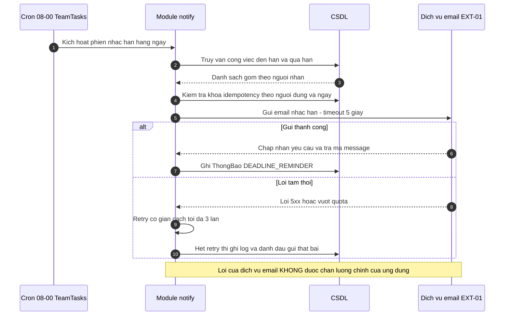

# Tích hợp API đối tác ngoài — TeamTasks

> Đánh giá & đặc tả **tiêu thụ API của hệ ngoài**. Bổ trợ `06-api-spec.md` (API TeamTasks tự phát) và `10-architecture.md` §7 (kiến trúc nội tại). Dự án chỉ có **một** hệ ngoài nên chưa cần `11-integration.md`.
> Ngày lập: 2026-07-21 · Người lập: Nhóm BA/PM (SH-06) · **Nguồn: họp 2026-07-21 · DEC-02 · ACT-01**
> **Trạng thái cổng chốt: 🟢 CHỐT (2026-07-27)** — `ADR-01` mua dịch vụ · `ADR-02` **Amazon SES**, cả hai `Accepted`. `dev-run` được bám (Phase 2/F09). Xem §7.

> ⚠️ **Chưa nạp tài liệu API gốc của nhà cung cấp** (dự án mẫu, không truy cập mạng). Phần digest §3 dựa trên hiểu biết chung về hai dịch vụ, **phải đối chiếu lại với tài liệu chính thức trước khi code** — mọi mục chưa kiểm chứng đều được đánh `GĐ`/`OQ`. Giá cả **không ghi con số** vì chưa có báo giá (xem `OQ-01`).

## 1. Kiểm kê hệ ngoài

| Mã | Đối tác / Dịch vụ | Vai trò | Nhà cung cấp | Mô hình giá | Tài liệu | Sandbox |
|----|-------------------|---------|--------------|-------------|----------|---------|
| EXT-01 | Dịch vụ gửi email giao dịch (transactional email) | Gửi email nhắc deadline cho **F09** (`FR-10`) — cron 08:00 hằng ngày | **Chưa chốt**: SendGrid *hoặc* Amazon SES | Theo số email gửi (chưa có báo giá — `OQ-01`) | SendGrid: `docs.sendgrid.com` · SES: `docs.aws.amazon.com/ses` | Cả hai đều có (SES ở dạng **sandbox bắt buộc lúc đầu**) |

**Phạm vi tiêu thụ:** chỉ **gửi ra** (outbound) email nhắc hạn. TeamTasks **không** nhận email vào, **không** dùng dịch vụ cho email marketing. Thông báo in-app (**F08**, `FR-09`) là nội bộ — không thuộc `EXT-01`.

## 2. Build-vs-buy

### ADR-01 — EXT-01: Mua dịch vụ gửi email thay vì tự dựng SMTP

- **Bối cảnh & ràng buộc:** `FR-10` yêu cầu email nhắc hạn hằng ngày; `BR-05` (không để việc trễ vì quên). Ràng buộc trực tiếp: **NFR-04** (uptime ≥ 99,5% — email không tới thì tính năng vô nghĩa), **ràng buộc PDPA / lưu trú dữ liệu VN–SG** (`01-requirements.md` §7, `10-architecture.md` §1), **MVP 3 tháng** (`00-vision.md` BO-06).
- **Phương án:** (A) tự dựng SMTP server · (B) mua dịch vụ gửi email của bên thứ ba.
- **So sánh:**

| Tiêu chí | (A) Tự dựng SMTP | (B) Mua dịch vụ |
|---|---|---|
| Thời gian tới production | Lâu — phải làm queue, retry, bounce, warm-up IP | Ngắn — gọi API là gửi được |
| Deliverability (email vào được hộp thư) | Rủi ro cao: IP mới dễ bị đánh spam, phải tự xây uy tín | Nhà cung cấp đã có hạ tầng + uy tín IP |
| Vận hành | Đội nội bộ tự trực; SH-04 phải lo SPF/DKIM, bounce, blacklist | Nhà cung cấp lo; ta chỉ lo cấu hình domain |
| Chi phí | Chi phí ẩn (thời gian đội) cao | Phí theo lượng gửi (chưa có báo giá — `OQ-01`) |
| Khoá nhà cung cấp (lock-in) | Không | Trung bình — giảm bằng lớp adapter nội bộ (§6) |
| Phù hợp ràng buộc PDPA | Kiểm soát hoàn toàn | **Tuỳ nhà cung cấp** — xem ADR-02 |

- **Quyết định:** **(B) — mua dịch vụ gửi email.** Lý do: rủi ro deliverability của (A) đánh thẳng vào giá trị của `FR-10`, còn ràng buộc MVP 3 tháng không cho phép đầu tư hạ tầng mail. Khớp **DEC-02** của họp 2026-07-21.
- **Hệ quả tốt:** deliverability do nhà cung cấp lo; đội không vận hành SMTP/DKIM/danh tiếng IP.
- **Hệ quả xấu / phải chấp nhận:** phụ thuộc bên thứ ba (giá, hạn mức, khu vực dữ liệu); mọi email nhắc hạn đi qua hệ ngoài nên `FR-10` có một điểm hỏng ngoài tầm kiểm soát — cần retry + cảnh báo khi gửi lỗi.
- **Vì sao không (A):** tự dựng SMTP thì deliverability là rủi ro đánh thẳng vào giá trị của `FR-10`, và không đội nào rảnh để nuôi danh tiếng IP trong 3 tháng MVP.
- **Trạng thái:** **Accepted (2026-07-27)** — cổng chốt lần 2. Kết luận "mua" không phụ thuộc báo giá (`OQ-01`) nên không lý do gì hoãn tiếp. `dev-run` được bám từ đây (theo ADR-02 cho nhà cung cấp cụ thể).

### ADR-02 — EXT-01: Chọn nhà cung cấp — **Amazon SES** (Accepted)

- **Bối cảnh:** hai ứng viên SendGrid và Amazon SES (nêu trong họp). Ràng buộc quyết định: **PDPA / dữ liệu ở VN–SG** và **hạ tầng đã chọn** — `10-architecture.md` §9 chốt triển khai **region `ap-southeast-1` (Singapore)**.
- **Phương án:** (A) Amazon SES · (B) SendGrid
- **So sánh:**

| Tiêu chí | SendGrid | Amazon SES |
|---|---|---|
| Lưu trú dữ liệu | Hạ tầng chủ yếu ngoài khu vực SG → **email chứa họ tên + tiêu đề công việc rời khỏi khu vực** | Có endpoint tại chính **ap-southeast-1**, cùng region với hệ thống |
| Ăn khớp hạ tầng | Nhà cung cấp thứ hai (thêm tài khoản, thêm hoá đơn) | Cùng nhà cung cấp cloud → dùng IAM sẵn có, không thêm nhà cung cấp |
| Soạn mẫu email | Có trình soạn mẫu trực quan — thuận cho người không phải dev | Phải tự quản mẫu (API template hoặc render trong ứng dụng) |
| Rào cản khởi động | Tạo API key là gửi được | **Sandbox bắt buộc**: chỉ gửi tới địa chỉ đã xác minh + quota thấp cho tới khi được duyệt thoát sandbox |
| Chi phí | Cao hơn (chưa có báo giá) | Thấp hơn (chưa có báo giá) — `OQ-01` |

- **Quyết định (đề xuất):** **Amazon SES**, vì tiêu chí **lưu trú dữ liệu** chính là lý do dự án chọn tự xây thay vì mua SaaS ngoại (`00-vision.md` §3, Option C). Chọn SendGrid sẽ **tự mâu thuẫn với luận điểm PDPA** đã dùng để bảo vệ ngân sách dự án. Đổi lại phải chấp nhận: tự làm mẫu email + xin thoát sandbox sớm.
- **Điều kiện kèm theo:** nếu đội chấp nhận rủi ro dữ liệu ra ngoài khu vực (cần SH-01 + SH-05 đồng ý bằng văn bản) thì SendGrid mới là lựa chọn hợp lệ.
- **Hệ quả tốt:** cùng nhà cung cấp với hạ tầng đã chọn (AWS ap-southeast-1) — dữ liệu email không rời khu vực, IAM dùng chung.
- **Hệ quả xấu / phải chấp nhận:** SES phải xin ra khỏi sandbox và nuôi danh tiếng gửi; giao diện thống kê nghèo hơn SendGrid, muốn dashboard bounce/complaint phải tự dựng từ SNS. **Vì sao không (B):** SendGrid host ngoài khu vực → cần SH-01 + SH-05 chấp nhận rủi ro PDPA bằng văn bản, mà chưa có.
- **Trạng thái:** **Accepted (2026-07-27) — Amazon SES.** Cổng chốt lần 2 quyết chốt sớm hơn lịch 28/07 vì tiêu chí quyết định là **lưu trú dữ liệu PDPA**, không phải giá — chờ báo giá không lật được kết luận (SES vốn rẻ hơn SendGrid). Xem §7 để rõ điều kiện mở lại.
- **Điều kiện ràng buộc kèm quyết định Accepted:**
  1. `OQ-01` (báo giá) chuyển từ "điều kiện chốt" thành **việc theo dõi sau chốt**: nếu báo giá SES vận hành **vượt ngân sách được duyệt**, mở `ba-change-request` đánh giá lại — **không** tự động lật sang SendGrid (vẫn vướng PDPA).
  2. `GĐ-01` (digest §3 khớp tài liệu gốc) vẫn **🔓 Chấp nhận rủi ro**: `dev-run` **phải đối chiếu tài liệu API chính thức của Amazon SES trước khi viết client**, không code thẳng từ digest §3.
  3. Nộp **đơn xin thoát sandbox SES ngay** (không đợi tới lúc code) — xem rủi ro đường găng ở §7.

## 3. Digest tài liệu API đối tác — EXT-01

> ⚠️ Toàn bộ mục này **chưa đối chiếu tài liệu gốc** (`GĐ-01`). Đánh dấu ✅ sau khi BA nạp doc chính thức của nhà cung cấp được chọn.

### 3.1 Amazon SES *(phương án đề xuất)*
- **Base URL / môi trường:** endpoint theo region — `email.ap-southeast-1.amazonaws.com` (API v2). Môi trường: **sandbox** (mặc định) → **production** (sau khi được duyệt).
- **Auth:** ký request bằng **AWS Signature v4** với IAM credential (không phải API key tĩnh) → dùng IAM role gắn cho service, **không đặt khoá trong mã nguồn**.
- **Endpoint dùng:** gửi email giao dịch qua API v2 (`.../v2/email/outbound-emails`) — **một request một người nhận** cho ca dùng của ta (mỗi người một danh sách việc riêng).
- **Sự kiện ngược (bounce/complaint/delivery):** SES đẩy qua dịch vụ thông báo của AWS (SNS) — **cần một endpoint nhận** phía TeamTasks. `OQ-02`: có làm ở Phase 2 không, hay chỉ đọc báo cáo trên console?
- **Rate limit & quota:** SES giới hạn **số email/giây** và **số email/24 giờ**, khác nhau giữa sandbox và production — con số cụ thể `OQ-03`.
- **Idempotency:** SES **không có khoá idempotency** cho lời gọi gửi → gọi lại = gửi trùng. Chống trùng phải làm **phía TeamTasks** (xem §5, mục "khoá theo (người dùng, ngày)" — khớp `10-architecture.md` §rủi ro "cron in-process trùng lịch").
- **Lỗi hay gặp cần xử lý:** vượt quota gửi · địa chỉ chưa xác minh (khi còn sandbox) · địa chỉ bị chặn do bounce/complaint trước đó · lỗi tạm thời của dịch vụ. Ánh xạ sang lỗi hệ mình ở §5.
- **Versioning:** API v2. Chính sách ngừng hỗ trợ (deprecation) — `OQ-04`.

### 3.2 SendGrid *(phương án thay thế)*
- **Auth:** API key dạng Bearer token trong header `Authorization`.
- **Endpoint dùng:** `POST /v3/mail/send` — nhận `202 Accepted` khi đã nhận yêu cầu (**không** đồng nghĩa đã gửi tới hộp thư).
- **Mẫu email:** hỗ trợ **dynamic template** — gửi `template_id` + dữ liệu động thay vì nhồi HTML trong mã.
- **Sự kiện ngược:** Event Webhook (delivered/bounce/spam report…), **có chữ ký để xác thực** — bắt buộc verify nếu dùng.
- **Idempotency / rate limit / mã lỗi:** `OQ-05` — chưa đối chiếu doc.

## 4. Mapping field 3 tầng — EXT-01 (email nhắc deadline hằng ngày)

Ca dùng: cron 08:00 quét công việc **đến hạn trong ngày hoặc đã quá hạn chưa hoàn thành**, gom **theo người nhận**, mỗi người **một** email.

> ⚠️ Cột "Màn hình" trỏ tới **S03 TaskDetail** và **S04 UserProfile** — cả hai **chưa được đặc tả** (`00-tracking.md`: Chưa bắt đầu). Nhãn hiển thị ghi ở đây là **dự kiến**, phải rà lại khi hai màn đó có `design-spec.md`.

| API đối tác (field · kiểu) | Mô hình dữ liệu (`05-data-model.md`) | Màn hình | Biến đổi | Bắt buộc | Chiều |
|---|---|---|---|---|---|
| `Destination.ToAddresses[0]` · chuỗi | `NguoiDung.email` · chuỗi | S04 UserProfile — "Email" (chỉ đọc) | 1-1 | ✅ | Gửi |
| `FromEmailAddress` · chuỗi | *(không có trong mô hình)* — hằng số cấu hình `no-reply@<domain>` | — | Lấy từ biến môi trường | ✅ | Gửi |
| `Content…Subject` · chuỗi | Sinh ra: `"Bạn có N công việc đến hạn hôm nay"` — `N` = số dòng `CongViec` | — | Ghép chuỗi; `N` = đếm | ✅ | Gửi |
| Dữ liệu mẫu: `ho_ten` · chuỗi | `NguoiDung.ho_ten` | S04 — "Họ tên" | 1-1 | ✅ | Gửi |
| Dữ liệu mẫu: `danh_sach[].tieu_de` · chuỗi | `CongViec.tieu_de` | S03 TaskDetail — "Tiêu đề" | Cắt ≤200 ký tự (đúng ràng buộc mô hình) | ✅ | Gửi |
| Dữ liệu mẫu: `danh_sach[].deadline` · chuỗi | `CongViec.deadline` · datetime | S02 Dashboard / S03 — "Hạn" | **datetime (UTC) → chuỗi `dd/MM/yyyy HH:mm` giờ Việt Nam (UTC+7)** | ✅ | Gửi |
| Dữ liệu mẫu: `danh_sach[].uu_tien` · chuỗi | `CongViec.uu_tien` · enum `LOW/MEDIUM/HIGH/URGENT` | S02/S03 — nhãn ưu tiên | **Enum → nhãn tiếng Việt: `LOW`→Thấp · `MEDIUM`→Trung bình · `HIGH`→Cao · `URGENT`→Khẩn cấp** (đã thống nhất `02-functions.md` theo nhãn giao diện — `OQ-08` **đã đóng**) | ✅ | Gửi |
| Dữ liệu mẫu: `danh_sach[].qua_han` · boolean | Suy ra: `CongViec.deadline < now` **và** `trang_thai ∉ {DONE, CANCELLED}` | S02 — badge "Quá hạn" | Tính lúc chạy cron | ✅ | Gửi |
| Dữ liệu mẫu: `danh_sach[].link` · chuỗi | `CongViec.id` | → mở **S03 TaskDetail** | Ghép `<base_url>/tasks/<id>` | ✅ | Gửi |
| *(phản hồi)* mã định danh message của nhà cung cấp · chuỗi | **KHÔNG CÓ CHỖ LƯU** | — | — | — | Nhận |
| *(sự kiện ngược)* trạng thái gửi: delivered / bounce / complaint | **KHÔNG CÓ CHỖ LƯU** | — | — | — | Nhận |

**Trường không map được — phải quyết:**
- Thực thể `ThongBao` hiện có `loai = DEADLINE_REMINDER` nhưng **không có trường nào lưu**: mã message của nhà cung cấp, trạng thái gửi (đã gửi / bị trả lại), thời điểm gửi. Hệ quả: **không trả lời được câu hỏi "email nhắc hôm qua có tới không?"** — mà đây chính là lý do chọn mua dịch vụ (deliverability).
  → **Đề xuất:** bổ sung 3 thuộc tính vào `ThongBao` (`kenh`, `nha_cung_cap_message_id`, `trang_thai_gui`) — **là thay đổi `05-data-model.md`, phải qua `ba-change-request`**, không sửa lặng ở đây. Ghi thành `OQ-06`.
- `NguoiDung` **không có trường tuỳ chọn nhận email** → không thể tôn trọng yêu cầu "đừng làm phiền" (ứng viên **U-02** ở `00-personas.md`) và **không có cơ chế opt-out** khi người dùng nhấn "hủy nhận". Cần quyết trước khi lên production (`OQ-07`).

## 5. Luồng gọi & xử lý lỗi

**Ánh xạ lỗi đối tác → hệ mình:**

| Lỗi phía đối tác | Ý nghĩa | Hệ mình xử lý |
|---|---|---|
| Vượt quota gửi | Chạm trần ngày/giây | Hoãn phần còn lại sang phiên sau + cảnh báo vận hành |
| Địa chỉ chưa xác minh *(sandbox)* | Còn trong sandbox | **Chặn phát hành production** — xem readiness §6 |
| Địa chỉ bị chặn do bounce/complaint | Email hỏng hoặc bị báo spam | Đánh dấu người dùng, ngừng gửi, báo Org Admin |
| Lỗi tạm thời của dịch vụ | Sự cố phía đối tác | Retry có giãn cách; hết retry → ghi log, **không** làm hỏng phiên cron |

## 6. Readiness gate — trước production

| Hạng mục | EXT-01 | Ghi chú |
|---|---|---|
| Test sandbox pass | ❌ | Nhà cung cấp đã chốt (**Amazon SES**, ADR-02 Accepted 2026-07-27); còn phải chạy test trên sandbox SES |
| Thoát sandbox / credential prod | ❌ | SES phải xin duyệt; cần làm sớm vì có thời gian chờ |
| SPF/DKIM cho domain gửi | ⚠️ | **ACT-03** của họp 2026-07-21, hạn 2026-07-30 (SH-04) |
| Secrets ở vault, không hardcode | ⚠️ | Chọn SES → dùng IAM role, không có khoá tĩnh (tốt hơn); chọn SendGrid → phải có chỗ cất API key |
| Retry + timeout lời gọi ra | ⚠️ | Đã thiết kế ở §5, **chưa** hiện thực |
| Idempotency (không gửi trùng) | ❌ | Phải tự làm: khoá theo `(người dùng, ngày)` — trùng đúng rủi ro đã nêu ở `10-architecture.md` (cron in-process nhiều instance) |
| Fallback khi đối tác sập | ⚠️ | Thông báo in-app (**F08**) vẫn chạy → người dùng không mất thông tin hoàn toàn |
| Verify chữ ký webhook | — | Chưa dùng webhook (`OQ-02`) |
| Tôn trọng rate-limit | ❌ | Chưa biết hạn mức (`OQ-03`) |
| Correlation id trong log | ⚠️ | Theo quy ước log của `10-architecture.md`, cần bổ sung id phiên cron |
| Map mã lỗi đối tác → lỗi hệ mình | ✅ | Bảng §5 |
| PII & tuân thủ | ⚠️ | Email chứa **họ tên + tiêu đề công việc** = dữ liệu nội bộ tổ chức → là căn cứ chính của ADR-02; cần SH-01 xác nhận |
| Lớp adapter chống lock-in | ⚠️ | Thiết kế `EmailSender` nội bộ, nhà cung cấp là một hiện thực → đổi nhà cung cấp không lan ra module `notify` |
| Dự phòng khi đối tác đổi API | ⚠️ | Theo dõi changelog; đổi lớn → `ba-change-request` |

**Kết luận readiness: CHƯA đủ điều kiện production** (nhưng nhà cung cấp **đã chốt**). Chặn còn lại: chưa thoát sandbox · chưa có idempotency · chưa hiện thực retry/timeout. Đây là việc của Phase 2 (F09), không ảnh hưởng Phase 1 (MVP). Chốt ADR chỉ mở khoá cho `dev-run` **bắt đầu** làm client theo SES, không có nghĩa đã sẵn sàng production.

## 7. Cổng chốt

### Lịch sử cổng chốt

| Lần | Ngày | Trình gì | Kết quả | Ghi chú |
|---|---|---|---|---|
| 1 | **2026-07-21** | `ADR-01` (mua vs tự dựng) · `ADR-02` (SES vs SendGrid) · bảng mapping §4 · readiness §6 | **🟠 HOÃN** — cả hai ADR giữ **Draft** | Người quyết: SH-01 (chủ trì cổng chốt). Lý do: chờ `OQ-01` (báo giá) và kết quả `ACT-01` để quyết một lượt, không chốt từng phần |
| 2 | **2026-07-27** | Trình lại `ADR-01` + `ADR-02`; đối chiếu 3 điều kiện mở lại | **🟢 CHỐT** — `ADR-01` **Accepted (mua)**, `ADR-02` **Accepted (Amazon SES)** | Chốt **sớm hơn lịch 28/07**. Lý do chốt dù 3 điều kiện chưa thoả đủ: tiêu chí quyết định của cả hai ADR **không phải giá** mà là deliverability (ADR-01) và lưu trú dữ liệu PDPA (ADR-02) — báo giá không lật được kết luận. `OQ-01` chuyển thành việc theo dõi sau chốt (xem điều kiện ràng buộc ở ADR-02). Rủi ro đường găng sandbox (§ dưới) là lý do **không nên hoãn thêm**. |

**Vì sao chốt khi 3 điều kiện mở lại (lần 1 đặt ra) chưa thoả đủ:**
1. `OQ-01` (báo giá) — **không còn là điều kiện chặn**: giá chỉ là tiêu chí phụ ở ADR-02, và SES rẻ hơn SendGrid nên báo giá gần như chắc chắn không đảo kết luận. Hạ xuống thành ràng buộc theo dõi (ADR-02, điều kiện 1).
2. `GĐ-01` (tài liệu API gốc / `ACT-01`) — **chuyển thành ràng buộc thực thi**: `dev-run` phải đối chiếu tài liệu SES chính thức trước khi viết client (ADR-02, điều kiện 2). Digest §3 vẫn giữ dấu `⚠️`.
3. Xác nhận ngân sách — gộp vào (1): nếu vượt ngân sách thì mở CR, không lật nhà cung cấp.

### Hệ quả sau khi chốt (đang có hiệu lực từ 2026-07-27)

- 🔓 **`dev-run` được scaffold client email** (`EmailSender` adapter, cấu hình SDK, credential) theo **Amazon SES** — nhưng **phải đối chiếu tài liệu SES chính thức trước khi viết** (ADR-02 điều kiện 2, `GĐ-01` chưa đóng). Vẫn là công việc **Phase 2** (F09); Phase 1 không đụng `EXT-01`.
- ⏳ **Rủi ro đường găng — hành động ngay:** Amazon SES cần **xin duyệt thoát sandbox**, có thời gian chờ. Đã chốt nhà cung cấp ⇒ **nộp đơn thoát sandbox ngay bây giờ**, đừng đợi lúc code — nếu để tới sát Phase 2 (tháng 4) mới nộp thì thời gian chờ duyệt thành đường găng. → nên mở một `ACT` mới giao SH-04 nộp đơn.
- 💰 **Theo dõi ngân sách:** khi có báo giá SES (`OQ-01`), đối chiếu ngân sách được duyệt; vượt ngưỡng → `ba-change-request`, **không** tự lật sang SendGrid (vẫn vướng PDPA).
- ✅ **Song song:** `ACT-03` (cấu hình SPF/DKIM, hạn 30/07) đúng cho SES, tiếp tục làm.

### Các câu hỏi mở đã quyết trong lần này

| Mã | Quyết định 2026-07-21 |
|---|---|
| `OQ-06` — `ThongBao` thiếu chỗ lưu trạng thái gửi / message-id của nhà cung cấp | **Để lại, KHÔNG mở CR bây giờ.** Đội dev quyết khi triển khai F09 ở Phase 2. ⚠️ **Rủi ro đã ghi nhận:** nếu làm xong mới phát hiện thiếu chỗ lưu thì không đo được deliverability — mà chính deliverability là lý do mua dịch vụ (ADR-01). Khi triển khai F09, **kiểm mục này trước khi viết code gửi mail**. |
| `OQ-07` — cơ chế opt-out cho người dùng | Chưa quyết; gắn cùng ứng viên **`U-02`** (tuỳ chọn tần suất/kênh thông báo) đang nằm ở backlog Later. |

## 8. Rủi ro & Giả định

**Rủi ro**

| Rủi ro | Khi nào lộ | Giảm thiểu |
|---|---|---|
| Email vào hộp thư rác → `FR-10` mất tác dụng mà không ai biết | Ngay sau phát hành F09 | Cấu hình SPF/DKIM (ACT-03) + theo dõi tỷ lệ gửi thành công; cần chỗ lưu trạng thái gửi (`OQ-06`) |
| Chưa thoát sandbox kịp lúc Phase 2 tới | Tháng 4 | Nộp yêu cầu thoát sandbox **ngay khi chốt nhà cung cấp**, không đợi tới lúc dev |
| Cron chạy nhiều instance → gửi trùng | Khi scale ngang | Khoá phân tán + idempotency theo `(người dùng, ngày)` |
| Nhà cung cấp tăng giá / đổi điều khoản | Bất kỳ lúc nào | Lớp adapter nội bộ; đánh giá lại qua `ba-change-request` |
| Dữ liệu người dùng rời khỏi khu vực SG (nếu chọn SendGrid) | Ngay khi gửi email đầu tiên | ADR-02 chọn SES; nếu chọn khác phải có văn bản chấp thuận của SH-01 + SH-05 |

**Giả định**

| Mã | Giả định | Cơ sở | Ảnh hưởng nếu sai | Trạng thái |
|---|---|---|---|---|
| GĐ-01 | Digest API §3 phản ánh đúng tài liệu hiện hành của nhà cung cấp | Hiểu biết chung, **chưa nạp doc gốc** | Sai auth/endpoint → phải làm lại phần client | 🔓 Chấp nhận rủi ro |
| GĐ-02 | Mỗi người nhận **một** email/ngày (gộp danh sách việc), không phải mỗi việc một email | Suy từ `FR-10` "email nhắc nhở deadline hàng ngày" | Nếu mỗi việc một email → lượng gửi tăng nhiều lần, đổi cả chi phí lẫn trải nghiệm | 🔓 Chấp nhận rủi ro |
| GĐ-03 | Lượng gửi tối đa ≈ số người dùng (~1 000/ngày theo `00-vision.md` §1) | Quy mô giai đoạn 1 | Nếu vượt xa → chạm rate limit, phải chia lô | 🔓 Chấp nhận rủi ro |
| GĐ-04 | Múi giờ hiển thị trong email là giờ Việt Nam (UTC+7) | Người dùng tại Việt Nam | Sai giờ hạn trong email = nhắc sai | 🔓 Chấp nhận rủi ro |

> **🔓 Quyết định chấp nhận rủi ro — 2026-08-04, SH-06 (BA/PM) — chủ sở hữu dự án mẫu.**
> *Vì sao chưa xác nhận được:* digest tài liệu API và hạn mức gửi chỉ xác nhận được khi nạp tài liệu gốc của nhà cung cấp và có tài khoản production — đang chờ `WI-03` (spike, Blocked) và `ACT-06` (thoát sandbox).
> *Điều kiện rà lại:* **trước khi `dev-run` viết client email cho F09** — bắt buộc đối chiếu tài liệu API chính thức của Amazon SES, không code theo digest này; khi đó các dòng trên quay lại `⚠️ chưa xác nhận`.

**Câu hỏi mở:** `OQ-01` ngân sách (từ họp) · `OQ-02` có nhận sự kiện ngược không · `OQ-03` hạn mức gửi · `OQ-04` chính sách deprecation · `OQ-05` chi tiết SendGrid · `OQ-06` bổ sung trường vào `ThongBao` · `OQ-07` cơ chế opt-out · ~~`OQ-08` nhãn mức ưu tiên không nhất quán~~ — **đã đóng 2026-07-21**: thống nhất dùng nhãn giao diện *Thấp/Trung bình/Cao/Khẩn cấp*, `02-functions.md` đã sửa theo.

## Thuật ngữ

| Thuật ngữ | Giải thích |
|---|---|
| Build-vs-buy | Quyết định tự xây hay mua/dùng dịch vụ có sẵn |
| Transactional email | Email hệ thống gửi theo sự kiện/lịch (nhắc hạn, xác nhận), khác email marketing |
| Deliverability | Khả năng email thực sự vào được hộp thư đến thay vì hộp thư rác |
| SPF / DKIM | Hai cơ chế xác thực domain gửi mail, giúp email không bị coi là giả mạo |
| Bounce / Complaint | Email bị trả lại (địa chỉ hỏng) / người nhận báo cáo là thư rác |
| Sandbox | Chế độ hạn chế của dịch vụ, chỉ gửi tới địa chỉ đã xác minh cho tới khi được duyệt |
| Idempotency | Gọi lại nhiều lần cho cùng một kết quả, không nhân đôi tác dụng (ở đây: không gửi trùng email) |
| Lock-in (khoá nhà cung cấp) | Bị phụ thuộc một nhà cung cấp, khó chuyển đổi |
| Adapter | Lớp trung gian trong mã nguồn giúp thay nhà cung cấp mà không sửa nghiệp vụ |
| SigV4 | Cách ký request của AWS bằng thông tin xác thực IAM |

> Từ điển đầy đủ toàn dự án: `docs/00-glossary.md`.
