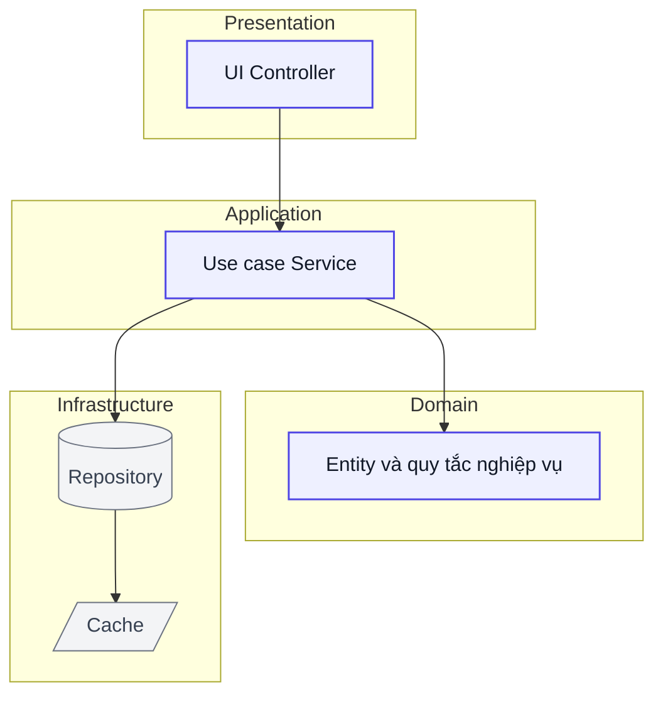
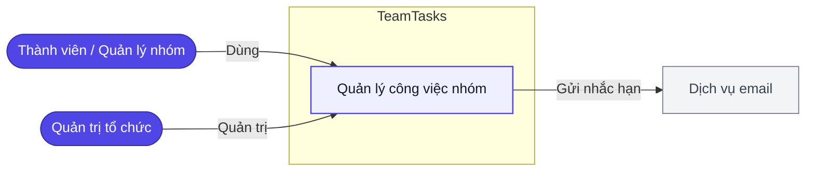
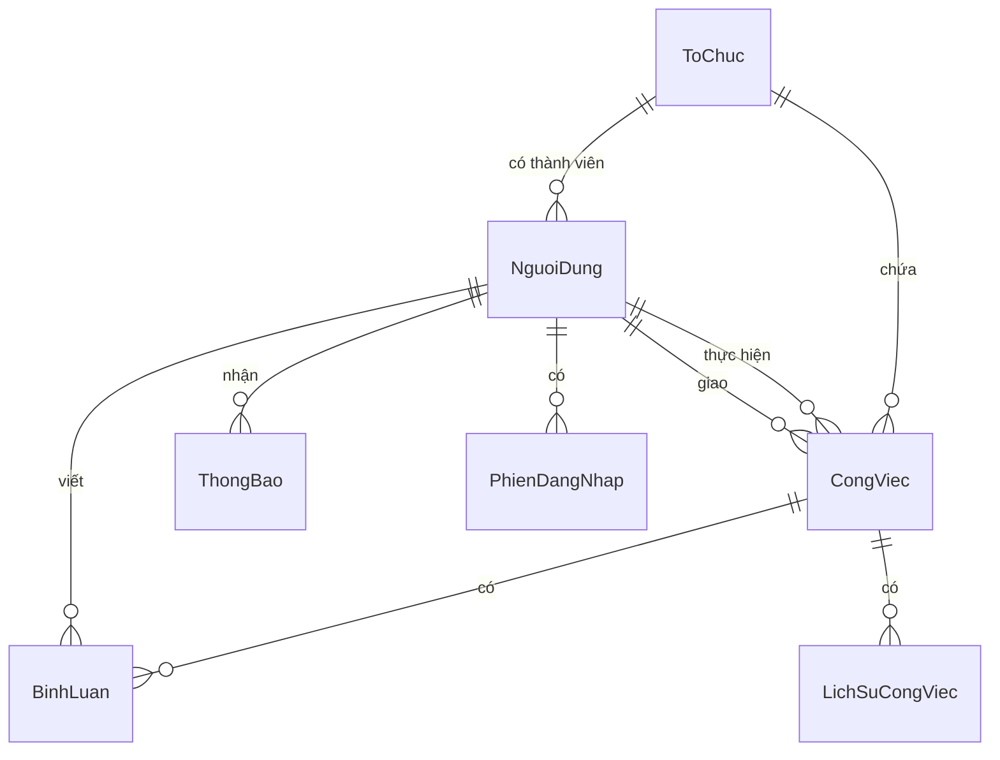

# TeamTasks — Đặc tả tổng thể

> Phiên bản 1.0 — 10/09/2026 · Tài liệu sinh từ bộ hồ sơ BA của dự án (`docs/`).
> Dành cho người **quyết**: ban lãnh đạo, chủ đầu tư, đối tác thẩm định. Đọc một mạch từ đầu đến cuối là nắm được dự án làm gì, vì sao đáng làm, làm thế nào và còn gì chưa chốt.

**Mục lục:** [1. Tóm tắt](#sec1) · [2. Bối cảnh](#sec2) · [3. Mục tiêu và phạm vi](#sec3) · [4. Người dùng](#sec4) · [5. Kiến trúc](#sec5) · [6. Dữ liệu](#sec6) · [7. Chức năng](#sec7) · [8. Màn hình](#sec8) · [9. Giao diện](#sec9) · [10. Tích hợp](#sec10) · [11. Phi chức năng](#sec11) · [12. Lộ trình](#sec12) · [13. Chỉ số](#sec13) · [14. Rủi ro](#sec14) · [15. Cần chốt](#sec15) · [Phụ lục](#appA)

---

## 1. Tóm tắt điều hành {#sec1}

Các nhóm làm việc trong tổ chức đã vượt ngưỡng mười người và vẫn đang mở rộng, nhưng công việc vẫn được giao qua chat và theo dõi bằng bảng tính. Ở quy mô này cách làm đó hết dùng được: thông tin nằm rải trên nhiều kênh, không có một nguồn sự thật duy nhất, và câu hỏi đơn giản nhất — *việc này của ai, hạn khi nào, đang tới đâu* — thường không ai trả lời ngay được.

TeamTasks là nền tảng web quản lý công việc nhóm cho các tổ chức quy mô vừa tại Việt Nam. Mọi công việc đều có người thực hiện, có hạn, và theo dõi được theo thời gian thực mà không cần họp cập nhật thủ công. Ba vai trò rõ ràng — thành viên, quản lý nhóm, quản trị tổ chức — với dữ liệu của mỗi tổ chức tách biệt hoàn toàn.

Dự án chọn **tự xây thay vì mua phần mềm dịch vụ có sẵn**. Hai lý do quyết định: yêu cầu lưu dữ liệu trong biên giới Việt Nam hoặc Singapore để tương thích luật bảo vệ dữ liệu cá nhân — điều phần lớn nhà cung cấp nước ngoài không đáp ứng được; và ở quy mô khoảng một nghìn người dùng, phí thuê bao theo đầu người vượt chi phí tự vận hành sau khi khấu hao đầu tư ban đầu.

Phạm vi lần này là bản khả dụng tối thiểu, ra mắt trong ba tháng, chỉ trên web. Đăng nhập bằng danh tính của nhà cung cấp ngoài, ứng dụng di động và tự phục hồi mật khẩu đều nằm ngoài đợt này — có chủ đích, để giữ được mốc ba tháng.

## 2. Bối cảnh và hiện trạng {#sec2}

Hiện trạng có bốn chỗ hỏng, và cả bốn đều là hệ quả của cùng một nguyên nhân: không có nơi tập trung.

**Trách nhiệm mờ nhạt.** Việc được giao trong một cuộc trò chuyện rồi trôi lên trên. Không truy vết được ai giao cho ai, hạn khi nào, ai đang làm. Câu "không ai biết việc đó của ai" là mô tả đúng nghĩa đen của hiện trạng, không phải cách nói.

**Công việc bị bỏ sót.** Không có danh sách tập trung nên việc rơi qua khe hở giữa các kênh — nhắn ở nhóm này, nhớ ở nhóm khác, và không ai chịu trách nhiệm rà lại.

**Hạn chót phụ thuộc trí nhớ.** Không có gì nhắc, nên trễ hạn là chuyện thường, và nó chỉ lộ ra khi đã trễ.

**Không có phân quyền.** Bảng tính thì ai có link cũng sửa được. Dữ liệu nội bộ nhạy cảm không được bảo vệ, và không có cách nào phân biệt người xem với người sửa.

Chi phí của việc không làm gì không nằm ở một khoản chi nhìn thấy được, mà nằm ở thời gian họp cập nhật trạng thái định kỳ, ở rủi ro giao hàng sản phẩm theo quý khi công việc trễ, và ở hiệu suất nhóm giảm dần khi trách nhiệm không rõ. *(Baseline định lượng cho các con số này chưa được khảo sát — xem mục 15.)*

## 3. Mục tiêu và phạm vi {#sec3}

Sáu mục tiêu kinh doanh, tất cả đo được và có mốc thời gian tính từ ngày ra mắt bản khả dụng tối thiểu:

- **Tập trung công việc về một chỗ** — ít nhất tám mươi phần trăm công việc của nhóm được tạo và theo dõi trên hệ thống, sau một tháng.
- **Xoá bỏ công việc mồ côi** — toàn bộ công việc có người thực hiện và có hạn, ràng buộc bắt buộc ngay từ lúc tạo nên đạt được từ ngày đầu.
- **Bảo vệ dữ liệu theo tổ chức** — không sự cố truy cập chéo nào trong sáu tháng vận hành đầu.
- **Giảm họp cập nhật trạng thái** — giảm ít nhất một nửa số cuộc họp hàng tuần, sau hai tháng.
- **Giảm trễ hạn** — giảm ít nhất ba mươi phần trăm tỷ lệ công việc trễ, sau hai tháng.
- **Ra mắt đúng hạn** — bản khả dụng tối thiểu trong ba tháng kể từ khởi động.

**Trong phạm vi đợt này:** xác thực và phân quyền theo ba vai trò; tự đăng ký và tạo tổ chức; tạo, giao và theo dõi công việc qua vòng đời cần làm → đang làm → chờ duyệt → hoàn thành, kèm nhánh từ chối và huỷ; bảng điều khiển tổng quan; cô lập dữ liệu theo tổ chức; thông báo trong ứng dụng; quản trị thành viên. Ở mức nên có: bình luận trên công việc, nhắc hạn qua email, quản lý hồ sơ cá nhân và thông tin tổ chức.

**Ngoài phạm vi — và đây là phần quan trọng ngang phần trong phạm vi:** đăng nhập một lần qua Google hoặc Microsoft, ứng dụng di động, tự phục hồi mật khẩu (đợt này quản trị viên đặt lại thủ công), cập nhật đẩy theo thời gian thực (đợt này chấp nhận hỏi lại máy chủ mỗi phút), nhiều người thực hiện cho một công việc, khôi phục biểu mẫu khi mất kết nối, và triển khai tại chỗ. Mỗi mục ở đây là một quyết định có chủ đích để giữ mốc ba tháng, không phải một chỗ bị bỏ quên.

## 4. Người dùng và nhu cầu {#sec4}

Ba nhóm người dùng trực tiếp, phân biệt bằng **việc họ cần làm**, không phải bằng cấp bậc:

**Thành viên** nhận việc, cập nhật tiến độ, và cần biết hôm nay mình phải làm gì mà không phải hỏi ai. Nỗi đau lớn nhất là bị nhắc việc vào lúc không cần và không được nhắc vào lúc cần.

**Quản lý nhóm** giao việc, duyệt kết quả, và cần một bức tranh tiến độ đủ chính xác để báo cáo lên trên mà không phải đi hỏi từng người. Đây là vai trò chịu chi phí lớn nhất của hiện trạng — phần lớn các cuộc họp cập nhật tồn tại là để phục vụ vai trò này.

**Quản trị tổ chức** mời người vào, đặt vai trò, vô hiệu hoá tài khoản khi có người nghỉ, và chịu trách nhiệm cuối cùng về việc dữ liệu tổ chức không lọt ra ngoài.

Quy mô đợt một: tối đa năm tổ chức, mỗi tổ chức tối đa hai trăm thành viên — khoảng một nghìn người dùng tổng, cao điểm khoảng hai trăm người truy cập cùng lúc.

## 5. Kiến trúc tổng thể {#sec5}

Hệ thống là một **khối triển khai duy nhất chia module rõ ranh giới** — xác thực, công việc, thông báo, tổ chức. Đây là quyết định kiến trúc lớn nhất của dự án, và nó là một đánh đổi có ý thức: với ba tháng, hai trăm người dùng đồng thời và một đội nhỏ, chia thành nhiều dịch vụ độc lập là làm quá mức cần thiết — chi phí vận hành và gỡ lỗi tăng ngay, còn lợi ích thì chỉ đến ở quy mô chưa tới. Ranh giới module vẫn được giữ chặt để **tách ra thành dịch vụ riêng sau này** khi thật sự cần, mà không phải viết lại.

Giao diện web dựng trên Next.js và React; phần máy chủ dùng NestJS trên Node.js — cùng một ngôn ngữ với giao diện, giúp đội nhỏ không phải chia đôi năng lực. Dữ liệu lưu ở PostgreSQL vì bản chất nghiệp vụ là quan hệ và cần giao dịch chắc chắn; Redis giữ hai việc cụ thể: đệm dữ liệu bảng điều khiển để đạt ngưỡng phản hồi, và đếm số lần đăng nhập sai để khoá tài khoản. Nhắc hạn qua email chạy bằng tiến trình định giờ ngay trong khối chính — chưa cần hàng đợi riêng ở quy mô này.

Toàn bộ đặt tại vùng Singapore, đúng ràng buộc lưu trú dữ liệu.

Quy tắc phụ thuộc: tầng trong không biết tầng ngoài, và tầng nghiệp vụ không phụ thuộc hạ tầng — nối với nhau qua giao diện trừu tượng. Đây là thứ giữ cho việc tách dịch vụ sau này khả thi.

## 6. Mô hình dữ liệu {#sec6}

Bảy thực thể. **Tổ chức** là gốc của mọi thứ — mỗi người dùng thuộc đúng một tổ chức, và mọi truy vấn đều bị chặn theo tổ chức đó; đây là cách cô lập dữ liệu được cài đặt, không phải bằng quy ước mà bằng ràng buộc ở tầng truy cập dữ liệu.

**Công việc** có hai quan hệ khác nhau tới người dùng — người giao và người thực hiện — và đó là lý do bảng công việc giữ hai khoá riêng chứ không gộp. **Bình luận** và **lịch sử công việc** treo dưới công việc; lịch sử là nhật ký chỉ ghi thêm, không sửa, không xoá. **Thông báo** và **phiên đăng nhập** treo dưới người dùng.

Ba chỗ đáng chú ý trong mô hình: tài khoản người dùng mang sẵn bộ đếm đăng nhập sai và mốc hết hạn khoá, nên luật khoá tài khoản có chỗ lưu thật chứ không phải tính lại mỗi lần; công việc **không có thao tác xoá** — chỉ chuyển sang trạng thái huỷ, để giữ truy vết; và tài khoản người dùng cũng không xoá vật lý mà chuyển sang trạng thái vô hiệu, giữ nguyên lịch sử công việc đã giao cho người đó.

## 7. Danh mục chức năng {#sec7}

| Nhóm | Chức năng | Ưu tiên | Ghi chú |
|---|---|---|---|
| Xác thực | Đăng nhập bằng email và mật khẩu | Must | Khoá tài khoản sau năm lần sai trong mười lăm phút |
| Xác thực | Đăng xuất | Must | Thu hồi phiên hiện tại |
| Xác thực | Đăng ký tài khoản và tạo tổ chức | Must | Email duy nhất toàn hệ thống; người đăng ký thành quản trị tổ chức |
| Công việc | Xem bảng điều khiển tổng quan | Must | Phạm vi dữ liệu khác nhau theo vai trò |
| Công việc | Tạo và giao công việc | Must | Chỉ quản lý nhóm và quản trị tổ chức |
| Công việc | Xem chi tiết công việc | Must | Mở được trong toàn tổ chức |
| Công việc | Cập nhật trạng thái | Must | Thành viên làm, quản lý duyệt |
| Công việc | Bình luận | Should | Bản ghi bất biến ở đợt này — chưa sửa, chưa xoá được |
| Công việc | Xuất báo cáo tiến độ | Should | Phát sinh từ yêu cầu thay đổi, chờ duyệt |
| Thông báo | Thông báo trong ứng dụng | Must | Khi được giao việc, khi trạng thái đổi |
| Thông báo | Nhắc hạn qua email | Should | Chạy nền lúc tám giờ sáng hàng ngày |
| Hồ sơ | Quản lý hồ sơ cá nhân | Should | Đổi mật khẩu thu hồi mọi phiên khác |
| Hồ sơ | Quản lý thông tin tổ chức | Should | Quản lý nhóm và quản trị tổ chức |
| Hồ sơ | Quản trị thành viên | Must | Mời, đổi vai trò, vô hiệu hoá |

## 8. Đặc tả chức năng theo màn {#sec8}

Sáu màn, chia làm hai nhóm.

**Nhóm xác thực** gồm hai màn không cần đăng nhập. **Màn đăng nhập** nhận email và mật khẩu; sai năm lần trong mười lăm phút thì tài khoản bị khoá tạm mười lăm phút, và khoá tạm ba lần liên tiếp thì khoá vĩnh viễn cho tới khi quản trị viên mở lại. Thông báo lỗi luôn là một câu duy nhất không phân biệt email sai hay mật khẩu sai — có chủ đích, để không ai dò được email nào tồn tại trong hệ thống. **Màn đăng ký** tạo tài khoản mới kèm một tổ chức mới; người đăng ký trở thành quản trị tổ chức đó. Tổ chức tạo ra là độc lập, không gộp vào tổ chức có sẵn qua luồng này.

**Nhóm sau đăng nhập** gồm bốn màn. **Bảng điều khiển** là nơi người dùng vào đầu tiên: danh sách công việc theo trạng thái, vài thẻ thống kê nhanh, nút tạo việc mới và chuông thông báo. Phạm vi dữ liệu khác nhau theo vai trò — thành viên chỉ thấy việc mình làm hoặc mình giao, quản lý nhóm và quản trị tổ chức thấy toàn tổ chức. Nút tạo việc không hiện với thành viên, và máy chủ cũng từ chối nếu có ai gọi thẳng.

**Màn chi tiết công việc** là nơi công việc thật sự chạy: xem đầy đủ thông tin, chuyển trạng thái theo vòng đời, thêm bình luận, và xem lịch sử thay đổi. Quyền duyệt thuộc quản lý nhóm và quản trị tổ chức; thành viên chuyển được việc sang chờ duyệt nhưng không tự duyệt. Có nhánh từ chối đưa việc quay lại đang làm.

**Màn hồ sơ cá nhân** cho đổi họ tên, ảnh và mật khẩu. Ba ràng buộc đáng nói: email không sửa được vì đó là định danh đăng nhập; vai trò không tự sửa được — nếu không thì mọi thành viên đều tự nâng quyền; và đổi mật khẩu thành công sẽ thu hồi mọi phiên đăng nhập khác, giữ lại phiên hiện tại.

**Màn tổ chức** gồm hai phần: thông tin tổ chức (tên, logo) và danh sách thành viên với các thao tác mời, đổi vai trò, vô hiệu hoá. Vô hiệu hoá một tài khoản sẽ thu hồi mọi phiên của người đó ngay lập tức. Màn này chỉ hiện trong menu với quản lý nhóm và quản trị tổ chức.

Mọi đường dẫn khi chưa đăng nhập đều bị đưa về màn đăng nhập; sau khi đăng nhập thành công thì quay lại đúng đường dẫn ban đầu, mặc định là bảng điều khiển.

## 9. Giao diện và hệ thống thiết kế {#sec9}

Dự án có một bộ style chuẩn dùng chung cho mọi màn: thang màu, kiểu chữ, khoảng cách, độ nổi, bộ thành phần giao diện, mẫu bố cục và các điểm ngắt khi thu nhỏ màn hình. Mọi màn bám bộ này thay vì mỗi màn tự chọn màu và cỡ chữ riêng — đây là thứ quyết định sáu màn trông như một sản phẩm hay như sáu sản phẩm ghép lại. Hệ thống hỗ trợ Chrome, Firefox, Safari và Edge ở các phiên bản gần đây.

## 10. Tích hợp và API {#sec10}

Hệ thống tự phát một bộ giao diện lập trình theo kiểu REST cho chính giao diện web của nó — xác thực, công việc, bình luận, thông báo, tổ chức và thành viên. Toàn bộ đi qua HTTPS bắt buộc, dùng thẻ định danh ký bằng thuật toán bất đối xứng.

Hệ ngoài duy nhất ở đợt này là **dịch vụ gửi email**, phục vụ nhắc hạn hàng ngày. Đây là phụ thuộc một chiều và không chặn nghiệp vụ: dịch vụ email hỏng thì người dùng mất phần nhắc, nhưng mọi thao tác trên hệ thống vẫn chạy bình thường.

Không có tích hợp đăng nhập bên ngoài ở đợt này — đó là quyết định phạm vi, không phải giới hạn kỹ thuật.

## 11. Yêu cầu phi chức năng và tuân thủ {#sec11}

| Nhóm | Yêu cầu | Ngưỡng |
|---|---|---|
| Hiệu năng | Thời gian phản hồi máy chủ | Tối đa hai giây ở phân vị chín mươi lăm, với hai trăm người dùng đồng thời |
| Bảo mật | Lưu mật khẩu | Băm bcrypt, chi phí tối thiểu mười hai |
| Bảo mật | Thẻ phiên | Ký RS256; bắt buộc HTTPS |
| Bảo mật | Chống dò mật khẩu | Khoá tài khoản sau năm lần sai trong mười lăm phút; khoá tạm mười lăm phút |
| Khả dụng | Thời gian hoạt động | Tối thiểu 99,5 phần trăm mỗi tháng, không tính bảo trì có lịch |
| Khả dụng dùng | Luồng tạo và giao việc | Tối đa ba bước tính từ bảng điều khiển |
| Dữ liệu | Cô lập theo tổ chức | Không rò rỉ dữ liệu chéo giữa các tổ chức |
| Tương thích | Trình duyệt | Chrome, Firefox, Edge từ phiên bản 110; Safari từ 16 |

**Tuân thủ:** dữ liệu lưu tại Việt Nam hoặc Singapore để tương thích luật bảo vệ dữ liệu cá nhân. Ràng buộc này là lý do chính khiến phương án mua phần mềm dịch vụ nước ngoài bị loại ở mục 3, nên nó không phải một dòng thủ tục — nó là một trong hai trụ của quyết định đầu tư.

## 12. Lộ trình triển khai {#sec12}

| Giai đoạn | Nội dung | Điều kiện hoàn thành |
|---|---|---|
| **Đợt 1 — Bản khả dụng tối thiểu** *(tháng 1–3)* | Đăng ký, đăng nhập, tạo và giao việc, theo dõi tiến độ, cập nhật trạng thái, thông báo trong ứng dụng, quản trị thành viên | Luồng giao và duyệt công việc chạy trọn từ đầu đến cuối; khoá tài khoản hoạt động; cô lập dữ liệu giữa các tổ chức đạt yêu cầu; đạt ngưỡng phản hồi và bảo mật; mỗi màn có bộ kiểm thử và không còn lỗi mức chặn |
| **Đợt 2 — Cộng tác và tiện ích** *(tháng 4–5)* | Bình luận trên công việc, nhắc hạn qua email, tự quản hồ sơ cá nhân và thông tin tổ chức, xuất báo cáo tiến độ | Bình luận cập nhật bằng cách hỏi lại máy chủ mỗi ba mươi giây; email nhắc gửi đúng tám giờ sáng cho việc đến hạn và quá hạn; người dùng tự đổi hồ sơ và mật khẩu |
| **Đợt 3 — Mở rộng** *(sau tháng 5)* | Đăng nhập một lần qua nhà cung cấp ngoài, ứng dụng di động, tự phục hồi mật khẩu, tìm kiếm và lọc nâng cao, báo cáo phân tích | Xác định lại khi từng ứng viên được nâng thành chức năng có đặc tả riêng |

Đợt 3 **chưa được cấp mã chức năng chính thức** — đó là chủ đích: đây là danh sách ứng viên, không phải cam kết. Mỗi ứng viên sẽ đi qua quy trình mở rộng phạm vi khi được chốt.

Lộ trình dùng **trục thời gian tương đối tính theo tuần**, chưa gắn ngày cụ thể — chờ chủ sản phẩm chốt.

## 13. Chỉ số đo lường {#sec13}

| Chỉ số | Ngưỡng | Đo bằng cách nào | Kỳ rà |
|---|---|---|---|
| Tỷ lệ công việc quản lý trên hệ thống | Từ 80 phần trăm | Đếm công việc tạo trên hệ thống trên tổng công việc nhóm | Sau 1 tháng |
| Tỷ lệ công việc có đủ người thực hiện và hạn | 100 phần trăm | Ràng buộc bắt buộc khi tạo, đối chiếu bằng truy vấn dữ liệu | Liên tục |
| Số sự cố truy cập chéo tổ chức | 0 | Nhật ký bảo mật và rà soát truy cập theo tổ chức | 6 tháng đầu |
| Số cuộc họp cập nhật mỗi tuần | Giảm từ 50 phần trăm | Khảo sát nhóm định kỳ | Sau 2 tháng |
| Tỷ lệ công việc trễ hạn | Giảm từ 30 phần trăm | So dữ liệu trễ hạn trước và sau khi dùng hệ thống | Sau 2 tháng |
| Ngày ra mắt đạt nghiệm thu | Trong 3 tháng | Cột mốc dự án và tiêu chí nghiệm thu người dùng | Một lần |

**Bốn trong sáu chỉ số trên chưa có số nền.** Hệ thống hiện tại là chat và bảng tính nên không ai từng đo. Khảo sát số nền phải làm **ngay đầu dự án, trước khi ra mắt** — làm sau thì không còn gì để so, và hai mục tiêu về giảm họp và giảm trễ hạn sẽ không chứng minh được.

## 14. Rủi ro chính {#sec14}

| Rủi ro | Khả năng | Tác động | Cách giảm |
|---|---|---|---|
| Phạm vi phình làm trễ mốc ba tháng | Trung bình | Cao | Khoá phạm vi theo mục 3; mọi thay đổi đi qua sổ yêu cầu thay đổi, không sửa lén |
| Thiếu số nền nên không chứng minh được hiệu quả | Cao | Trung bình | Khảo sát ngay đầu dự án, trước ra mắt |
| Người dùng vẫn quay lại chat, không nhập việc lên hệ thống | Trung bình | Cao | Đào tạo và tài liệu hướng dẫn trước ra mắt; nhắc hạn để tạo thói quen; đo tỷ lệ sử dụng sau một tháng |
| Rò rỉ dữ liệu chéo giữa các tổ chức | Thấp | Cao | Chặn theo tổ chức ở tầng truy cập dữ liệu; khoá chống dò mật khẩu; rà soát bảo mật trong sáu tháng đầu |
| Thiếu đăng nhập một lần và tự phục hồi mật khẩu gây ma sát | Trung bình | Trung bình | Quản trị viên đặt lại thủ công ở đợt này; đã ghi nhận để cân nhắc đợt sau |
| Tài khoản khoá vĩnh viễn mà không tự phục hồi được | Thấp | Trung bình | Quy trình quản trị viên mở khoá thủ công, có ghi nhật ký |

Rủi ro đầu bảng đáng chú ý nhất vì nó là loại **tự gây ra**: mốc ba tháng chỉ giữ được nếu danh sách ngoài phạm vi ở mục 3 được tôn trọng.

## 15. Quyết định cần chốt {#sec15}

Đây là phần cần người đọc tài liệu này quyết, không phải phần báo cáo.

| Cần chốt | Vì sao chưa chốt được | Ai quyết |
|---|---|---|
| Ngân sách phát triển và vận hành | So sánh phương án ở mục 3 dựa trên ước lượng định hướng, chưa có báo giá chính thức cho hạ tầng và đội ngũ | Chủ đầu tư |
| Số nền cho hai mục tiêu giảm họp và giảm trễ hạn | Chưa ai đo hiện trạng; đo sau ra mắt là quá muộn | Quản lý nhóm, làm ngay đầu dự án |
| Mốc ngày cụ thể của từng đợt | Lộ trình đang dùng trục tương đối theo tuần | Chủ sản phẩm |
| Có cho một công việc nhiều người thực hiện không | Đợt này giả định mỗi việc một người; đổi sẽ chạm mô hình dữ liệu và luồng phân công | Chủ sản phẩm |
| Quản trị tổ chức có nhận email nhắc hạn không | Tài liệu nguồn chỉ nêu thành viên và quản lý nhóm | Chủ sản phẩm |
| Yêu cầu xuất báo cáo tiến độ có vào đợt 2 không | Phát sinh sau khi chốt phạm vi, đang chờ bên đề xuất duyệt | Ban lãnh đạo |

---

## Phụ lục A · Nguồn {#appA}

| Mục | Tài liệu nguồn |
|---|---|
| §1, §3, §13, §14 | `docs/Ho-so/00-vision.md` |
| §2 | `docs/Ho-so/00-process.md`, `docs/Ho-so/00-vision.md` |
| §4 | `docs/Ho-so/00-personas.md`, `docs/Ho-so/00-urd.md` |
| §5 | `docs/10-architecture.md` |
| §6 | `docs/05-data-model.md` |
| §7 | `docs/02-functions.md` |
| §8 | `docs/03-overview.md` + `srs.md` của 6 màn |
| §9 | `docs/07-design-system.md` |
| §10 | `docs/06-api-spec.md`, `docs/12-api-integration.md` |
| §11 | `docs/01-requirements.md` |
| §12 | `docs/Ho-so/08-roadmap.md` |
| §15 | `docs/Ho-so/00-gaps.md`, `docs/00-cr.md` |

## Phụ lục B · Ánh xạ truy vết {#appB}

| Đoạn | Mã nguồn |
|---|---|
| §1 Tóm tắt · §3 Mục tiêu | BO-01 · BO-02 · BO-03 · BO-04 · BO-05 · BO-06 · BR-01 · BR-02 · BR-03 · BR-04 · BR-05 |
| §3 Ngoài phạm vi | OQ-01 · OQ-02 · OQ-04 |
| §4 Người dùng | SH-01 · SH-02 · SH-03 · SH-05 · SH-06 · PS-01 · PS-02 · PS-03 · U-02 · U-04 · U-05 · U-06 |
| §5 Kiến trúc | ADR-01 · ADR-02 · ADR-03 · ADR-04 · NFR-01 · NFR-06 |
| §6 Dữ liệu | BRule-S02-05 · BRule-S05-03 · BRule-S05-04 · BRule-S01-01 · BRule-S01-02 |
| §7 Danh mục chức năng | F01 · F02 · F03 · F04 · F05 · F06 · F07 · F08 · F09 · F10 · F11 · F12 · F13 · F14 |
| §8.1 Đăng nhập | FR-01 · BRule-S01-01 · BRule-S01-03 · BRule-S01-05 · BRule-S01-08 |
| §8.2 Đăng ký | FR-13 · BRule-S06-01 · BRule-S06-02 |
| §8.3 Bảng điều khiển | FR-03 · FR-04 · BRule-S02-01 · BRule-S02-03 |
| §8.4 Chi tiết công việc | FR-06 · FR-07 · FR-08 · BRule-S03-04 · BRule-S03-10 |
| §8.5 Hồ sơ cá nhân | FR-11 · BRule-S04-02 · BRule-S04-03 · BRule-S04-06 |
| §8.6 Tổ chức | FR-02 · FR-12 · BRule-S05-01 · BRule-S05-06 |
| §10 Tích hợp | FR-10 · EXT-01 |
| §11 Phi chức năng | NFR-01 · NFR-02 · NFR-03 · NFR-04 · NFR-05 · NFR-06 · NFR-07 · TR-01 · TR-02 |
| §12 Lộ trình | DEC-04 · DEC-05 |
| §13 Chỉ số | BO-01 · BO-02 · BO-03 · BO-04 · BO-05 · GĐ-02 · GĐ-03 |
| §15 Quyết định cần chốt | GĐ-01 · GĐ-02 · GĐ-03 · GĐ-05 · GĐ-06 · OQ-04 · CR-01 |
