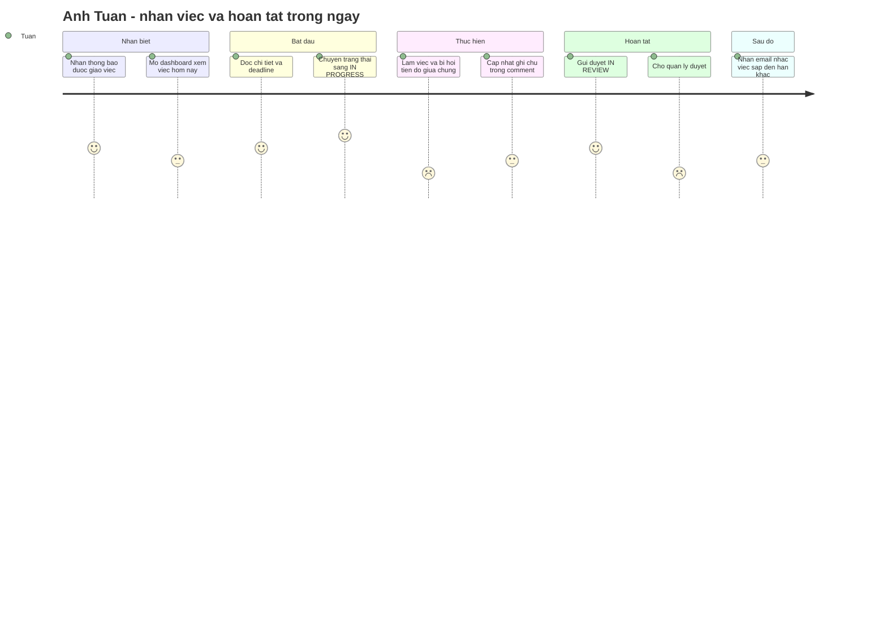
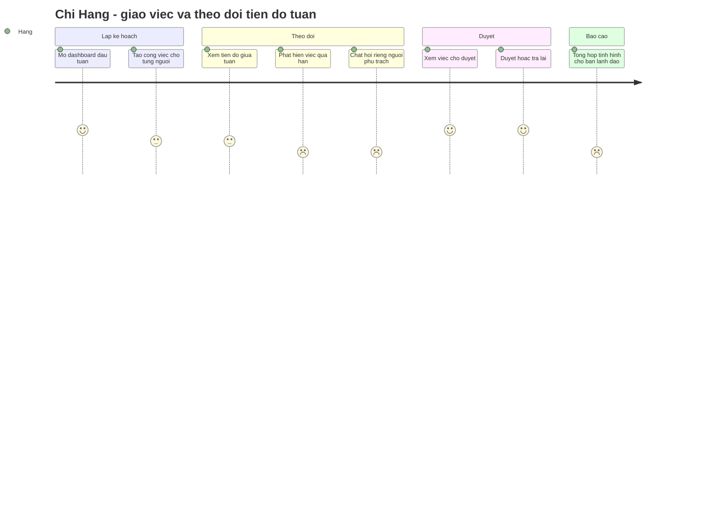
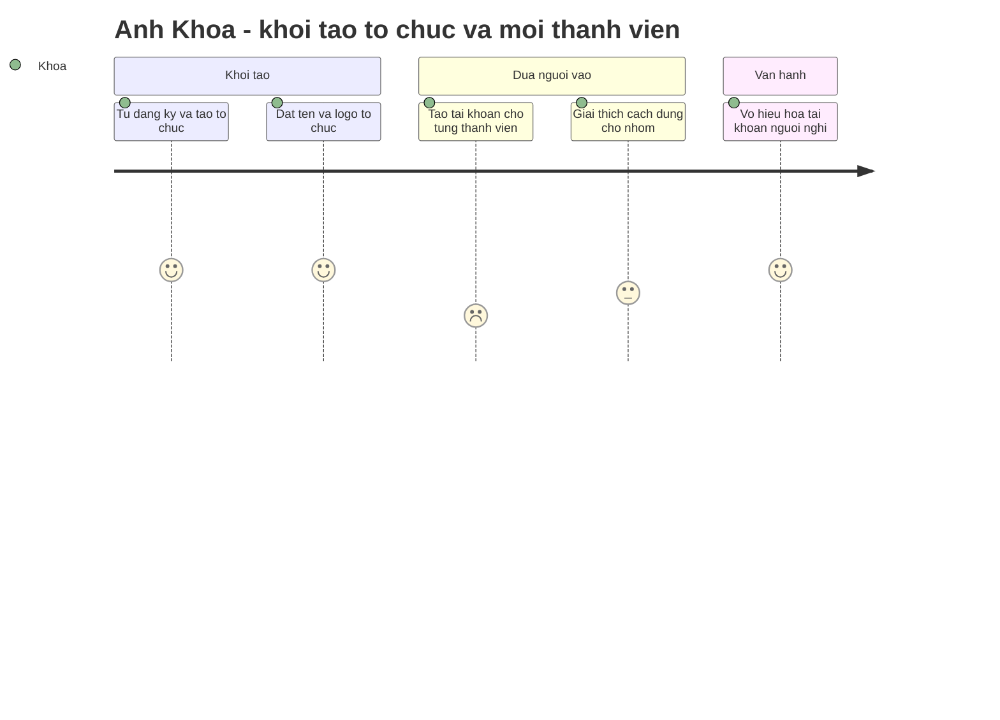

# Chân dung người dùng & Hành trình — TeamTasks

> **Personas + user journey (bản đồ hành trình)** — trả lời *người dùng LÀ AI, đi qua những bước nào, cảm xúc ra sao*. Mỗi nỗi đau/cơ hội là ứng viên `U-..`, đầu vào cho `docs/00-urd.md` (nhu cầu `UN-..`) rồi tới `docs/01-requirements.md`.
> *Họ CẦN GÌ* là việc của URD `docs/00-urd.md` — đừng tìm ở đây.
> Ngày lập: 2026-07-21 · Người lập: Nhóm BA/PM (SH-06) · Trạng thái: Đề xuất

> ⚠️ **Thứ tự chạy trong dự án mẫu này:** `00-personas` được lập **sau** `01-requirements` (bổ sung ngược để hoàn thiện bộ tài liệu discovery). Vì vậy cột "ứng viên FR" **đối chiếu với `FR` đã có**; những insight **chưa** được yêu cầu nào phủ được đánh 🔶 *(ứng viên mới — chưa cấp mã `FR`, chờ `ba-requirements`/`ba-change-request` quyết)*. Dự án mới nên chạy skill này **trước** `ba-requirements`.

> **Nguồn:** `00-vision.md` §1 (vấn đề & đối tượng), `04-stakeholders.md` (SH-01/02/03), `00-brainstorm.md`, `01-requirements.md` (FR đối chiếu). **Chưa có phỏng vấn/khảo sát người dùng thật** → toàn bộ personas là **giả thuyết làm việc**, xem mục Giả định.

---

## 1. Personas

Ba nhóm người dùng trực tiếp trong `00-vision.md` §1 → ba persona. Không tách thêm: các biến thể khác (vd Team Lead kiêm Member) chỉ là tổ hợp quyền, không đổi mục tiêu/nỗi đau.

### PS-01 — Anh Tuấn, Thành viên *(Member)* — **persona CHÍNH**

| | |
|---|---|
| **Bối cảnh** | 28 tuổi, nhân viên trong nhóm ~15 người; ngồi máy tính cả ngày, xen kẽ Zalo và email |
| **Mục tiêu** | Biết hôm nay phải làm gì, làm xong báo được ngay, không bị hỏi "việc đó tới đâu rồi?" |
| **Nỗi đau hiện tại** | Việc được giao rải rác trong chat, trôi mất; không nhớ deadline; sếp hỏi thì phải lục lại lịch sử tin nhắn |
| **Nhu cầu** | Một danh sách việc của riêng mình xếp theo hạn; cập nhật trạng thái trong 1–2 cú nhấp; được nhắc trước khi trễ |
| **Độ rành công nghệ** | Trung bình — dùng thành thạo web/app phổ thông, ngại quy trình nhiều bước |
| **Thiết bị / tần suất** | Laptop (Chrome), mở nhiều lần trong ngày; xem thông báo trên email |
| **Câu nói** | *"Tôi không sợ nhiều việc, tôi sợ không biết việc nào tới hạn trước."* |

→ *đối chiếu:* danh sách việc theo vai trò → **FR-03** · cập nhật trạng thái → **FR-06** · thông báo được giao việc → **FR-09** · nhắc deadline qua email → **FR-10**.
→ 🔶 *ứng viên mới:* **nhắc TRƯỚC hạn** (FR-10 hiện chỉ nhắc *trong ngày đến hạn hoặc đã quá hạn*) · **tuỳ chọn tần suất/kênh thông báo** (kỳ vọng SH-03: "thông báo kịp thời nhưng không làm phiền" — chưa yêu cầu nào phủ).

### PS-02 — Chị Hằng, Quản lý nhóm *(Team Lead)* — **persona CHÍNH**

| | |
|---|---|
| **Bối cảnh** | 35 tuổi, phụ trách nhóm 12–20 người, họp nhiều, thường mở dashboard đầu giờ sáng |
| **Mục tiêu** | Giao việc rõ chủ — rõ hạn, nhìn một màn biết nhóm đang tắc ở đâu, không phải họp để hỏi tiến độ |
| **Nỗi đau hiện tại** | Phải chat từng người để cập nhật; bảng tính không ai buồn sửa; đến hạn mới biết việc chưa ai làm |
| **Nhu cầu** | Tạo & giao việc dưới 3 bước; dashboard tiến độ nhóm; thấy ngay việc quá hạn và việc chờ duyệt |
| **Độ rành công nghệ** | Khá — từng dùng Trello, so sánh trải nghiệm |
| **Thiết bị / tần suất** | Laptop, ngày vài lần; hay mở trước cuộc họp |
| **Câu nói** | *"Mỗi tuần tôi mất một buổi chỉ để hỏi xem việc tới đâu."* |

→ *đối chiếu:* tạo công việc → **FR-04** · giao việc → **FR-05** · dashboard theo vai trò → **FR-03** · chi tiết + lịch sử thay đổi → **FR-07** · duyệt (`IN_REVIEW → DONE`) → **FR-06**.
→ 🔶 *ứng viên mới:* **lọc/sắp xếp dashboard theo hạn & trạng thái** (FR-03 mới nêu "thống kê nhanh") · **bàn giao hàng loạt khi thành viên nghỉ** (đổi assignee nhiều việc một lần).

### PS-03 — Anh Khoa, Quản trị viên tổ chức *(Org Admin)* — **persona phụ, nhưng là người khởi tạo**

| | |
|---|---|
| **Bối cảnh** | 40 tuổi, trưởng phòng kiêm quản trị công cụ nội bộ; không dùng hằng ngày nhưng là người mở tổ chức và mời người vào |
| **Mục tiêu** | Dựng tổ chức xong trong một buổi, kiểm soát ai vào được, dữ liệu không lọt sang tổ chức khác |
| **Nỗi đau hiện tại** | Bảng tính ai cũng sửa được; nhân sự nghỉ vẫn còn quyền truy cập; không biết ai đang xem gì |
| **Nhu cầu** | Tự đăng ký & tạo tổ chức; thêm/vô hiệu hoá tài khoản; sửa thông tin tổ chức |
| **Độ rành công nghệ** | Khá — không phải dân IT nhưng quen công cụ quản trị |
| **Thiết bị / tần suất** | Laptop, thưa (lúc onboarding và khi có biến động nhân sự) |
| **Câu nói** | *"Người nghỉ việc hôm nay thì chiều nay phải hết quyền vào."* |

→ *đối chiếu:* tự đăng ký + tạo tổ chức → **FR-13** · quản trị thành viên (tạo/sửa/vô hiệu hoá) → **FR-02** · thông tin tổ chức → **FR-12** · cách ly dữ liệu theo tenant → **BR-03** + NFR bảo mật.
→ 🔶 *ứng viên mới:* **nhật ký truy cập/hoạt động quản trị** (audit log) để trả lời "ai đã xem/sửa gì" — kỳ vọng kiểm soát của SH-01 hiện chỉ được phủ ở mức phân quyền.

---

## 2. Hành trình — PS-01 · "Một ngày làm việc: nhận việc → hoàn tất"

| Giai đoạn | Hành động | Suy nghĩ | Cảm xúc | Nỗi đau | Cơ hội (→ yêu cầu) |
|---|---|---|---|---|---|
| Nhận biết | Nhận thông báo được giao việc | *"Ai giao, hạn khi nào?"* | 😊 4 | — | Thông báo nêu đủ người giao + hạn → **FR-09** |
| Nhận biết | Mở dashboard xem việc hôm nay | *"Việc nào gấp nhất?"* | 😐 3 | Danh sách không xếp theo mức gấp | 🔶 Lọc/sắp xếp theo hạn & ưu tiên |
| Bắt đầu | Chuyển `TODO → IN_PROGRESS` | *"Bấm một cái là xong"* | 😍 5 | — | Giữ điểm mạnh → **FR-06** |
| Thực hiện | Bị hỏi tiến độ giữa chừng | *"Tôi vừa mới cập nhật mà"* | 😣 **2** | Quản lý không thấy cập nhật kịp | Dashboard nhóm phản ánh ngay → **FR-03**; comment ghi tiến độ → **FR-08** |
| Hoàn tất | Gửi duyệt và **chờ duyệt** | *"Không biết sếp xem chưa"* | 😣 **2** | Việc treo ở `IN_REVIEW` không rõ bao lâu | 🔶 Nhắc người duyệt khi việc chờ quá N ngày |
| Sau đó | Nhận email nhắc deadline | *"May mà nhắc"* | 😐 3 | Nhắc **đúng ngày đến hạn** thì đã sát nút | 🔶 Nhắc trước hạn (T-1) — bổ sung cho **FR-10** |

**Hai điểm cảm xúc thấp (😣 2)** — cũng là hai cơ hội thiết kế đáng giá nhất của persona này: *"cập nhật rồi mà vẫn bị hỏi"* và *"gửi duyệt xong rơi vào im lặng"*.

---

## 3. Hành trình — PS-02 · "Tuần làm việc: giao việc → theo dõi → duyệt"

| Giai đoạn | Hành động | Suy nghĩ | Cảm xúc | Nỗi đau | Cơ hội (→ yêu cầu) |
|---|---|---|---|---|---|
| Lập kế hoạch | Tạo việc cho từng người | *"Lặp đi lặp lại"* | 😐 3 | Nhập tay lại các trường giống nhau | 🔶 Nhân bản việc / mẫu công việc |
| Theo dõi | Phát hiện việc quá hạn | *"Sao giờ tôi mới biết?"* | 😣 **2** | Chỉ biết khi tự vào xem | 🔶 Cảnh báo cho Team Lead khi có việc quá hạn (FR-10 hiện nhắc *người thực hiện*) |
| Theo dõi | Chat hỏi riêng người phụ trách | *"Lại đi hỏi thủ công"* | 😣 **2** | Trao đổi ngoài hệ thống, không lưu vết | Comment trong việc → **FR-08**; lịch sử thay đổi → **FR-07** |
| Duyệt | Duyệt hoặc trả lại | *"Rõ ràng, nhanh"* | 😊 4 | — | **FR-06** (`IN_REVIEW → DONE`) |
| Báo cáo | Tổng hợp cho ban lãnh đạo | *"Lại copy tay sang slide"* | 😣 **2** | Không xuất được báo cáo | 🔶 **Xuất báo cáo tiến độ** — kỳ vọng SH-05 trong `04-stakeholders.md` ("dashboard có thể xuất báo cáo") **chưa có `FR` nào phủ**, dù gắn `BR-04` |

---

## 4. Hành trình — PS-03 · "Khởi tạo tổ chức lần đầu"

| Giai đoạn | Hành động | Cảm xúc | Nỗi đau | Cơ hội (→ yêu cầu) |
|---|---|---|---|---|
| Khởi tạo | Tự đăng ký + tạo tổ chức | 😊 4 | — | **FR-13** |
| Đưa người vào | Tạo tài khoản **từng người một** | 😣 **2** | Tổ chức 50–200 người thì thao tác lặp rất lâu | 🔶 Mời hàng loạt qua email / nhập danh sách |
| Vận hành | Vô hiệu hoá tài khoản người nghỉ | 😊 4 | — | **FR-02** |

---

## 5. Ma trận persona × chức năng

| Chức năng | PS-01 Member | PS-02 Team Lead | PS-03 Org Admin |
|---|---|---|---|
| F01 Đăng nhập · F02 Đăng xuất | ✅ chính | ✅ chính | ✅ chính |
| F12 Đăng ký & tạo tổ chức | — | — | ✅ chính |
| F03 Xem dashboard | ✅ chính | ✅ chính | 🔸 phụ |
| F04 Tạo công việc *(gồm giao việc)* | — | ✅ chính | — |
| F05 Xem chi tiết công việc | ✅ chính | ✅ chính | 🔸 phụ |
| F06 Cập nhật trạng thái | ✅ chính | ✅ duyệt | — |
| F07 Bình luận công việc | ✅ chính | ✅ chính | 🔸 phụ |
| F08 Thông báo in-app | ✅ chính | 🔸 phụ | 🔸 phụ |
| F09 Email nhắc deadline | ✅ chính | 🔸 phụ | — |
| F10 Quản lý hồ sơ cá nhân | ✅ | ✅ | ✅ |
| F11 Quản lý thông tin tổ chức | — | 🔸 phụ | ✅ chính |
| F13 Quản trị thành viên | — | — | ✅ chính |

> Ma trận này bám **`02-functions.md`** (mã `F`) — phân quyền chi tiết xem "Ma trận phân quyền" trong chính `02-functions.md`, đây chỉ là góc nhìn *ai coi chức năng nào là trọng tâm*.

---

## 6. Ứng viên yêu cầu mới (chưa có `FR` phủ)

Tổng hợp các 🔶 ở trên để `ba-requirements` (dự án mới) hoặc `ba-change-request` (dự án đang chạy) quyết. **Chưa cấp mã `FR`** — đây là đầu vào, không phải yêu cầu đã chốt.

| # | Ứng viên | Từ persona | Bằng chứng nguồn | Đề xuất |
|---|---|---|---|---|
| U-01 | Xuất báo cáo tiến độ (PDF/Excel) từ dashboard | PS-02 | `04-stakeholders.md` SH-05 kỳ vọng "dashboard có thể xuất báo cáo"; `BR-04` | **Nên mở CR** — kỳ vọng stakeholder quyền lực cao đang hở |
| U-02 | Tuỳ chọn tần suất/kênh thông báo | PS-01 | SH-03 "thông báo kịp thời nhưng không làm phiền" | Cân nhắc Phase 2 cùng F09/F10 |
| U-03 | Nhắc **trước** hạn (T-1) | PS-01 | Nỗi đau "nhắc đúng ngày thì đã sát nút" | Mở rộng nhỏ của FR-10 |
| U-04 | Lọc/sắp xếp dashboard theo hạn & ưu tiên | PS-01, PS-02 | Cảm xúc thấp ở bước "việc nào gấp nhất" | Rẻ, tăng giá trị FR-03 |
| U-05 | Cảnh báo quá hạn cho Team Lead | PS-02 | FR-10 chỉ nhắc người thực hiện | Cân nhắc Phase 2 |
| U-06 | Mời thành viên hàng loạt | PS-03 | Tổ chức tới 200 người (`00-vision` §1) | Ảnh hưởng onboarding ở quy mô lớn |
| U-07 | Nhắc người duyệt khi việc chờ quá N ngày | PS-01 | Việc treo `IN_REVIEW` | Nhỏ, gắn F06 |
| U-08 | Nhật ký hoạt động quản trị (audit log) | PS-03 | Kỳ vọng kiểm soát SH-01 | Cân nhắc cùng yêu cầu bảo mật |
| U-09 | Nhân bản việc / mẫu công việc | PS-02 | Nhập lặp khi giao việc tuần | Ưu tiên thấp |
| U-10 | Bàn giao hàng loạt khi thành viên nghỉ | PS-02, PS-03 | Biến động nhân sự | Ưu tiên thấp |

---

## Giả định

| Mã | Giả định | Cơ sở | Ảnh hưởng nếu sai | Trạng thái | Người xác nhận |
|---|---|---|---|---|---|
| GĐ-01 | Ba nhóm vai trò (Member/Team Lead/Org Admin) phản ánh đúng cách người dùng thật tự phân vai | Suy từ `04-stakeholders.md`, chưa phỏng vấn | Chia persona sai → thiết kế lệch trọng tâm | 🔓 Chấp nhận rủi ro | — |
| GĐ-02 | Member chủ yếu dùng **laptop**, không phải điện thoại | `00-vision` nêu phạm vi **web-only** GĐ1 | Nếu thực tế dùng điện thoại nhiều → ưu tiên responsive/mobile sớm hơn | 🔓 Chấp nhận rủi ro | — |
| GĐ-03 | Điểm đau lớn nhất của Team Lead là **theo dõi tiến độ**, không phải giao việc | `00-vision` §1 (họp cập nhật thủ công) | Nếu sai → dashboard không phải nơi đáng đầu tư nhất | 🔓 Chấp nhận rủi ro | — |
| GĐ-04 | Org Admin dùng thưa (chỉ lúc onboarding & biến động nhân sự) | Suy luận vai trò | Nếu dùng hằng ngày → cần công cụ quản trị sâu hơn | 🔓 Chấp nhận rủi ro | — |
| GĐ-05 | Không có persona "khách vãng lai" — mọi người dùng đều thuộc một tổ chức | `BR-03` cách ly theo tenant | Nếu có chia sẻ việc ra ngoài tổ chức → phát sinh vai trò mới | 🔓 Chấp nhận rủi ro | — |

> **🔓 Quyết định chấp nhận rủi ro — 2026-08-04, SH-06 (BA/PM) — chủ sở hữu dự án mẫu.**
> *Vì sao chưa xác nhận được:* Personas dựng từ vai trò trong tài liệu, **chưa có phỏng vấn/khảo sát/analytics người dùng thật** — dự án mẫu không có người dùng.
> *Điều kiện rà lại:* MVP chạy được 1 tháng (có analytics), hoặc thực hiện được 2–3 buổi phỏng vấn mỗi nhóm — khi điều đó xảy ra, các dòng dưới quay lại `⚠️ chưa xác nhận` và phải rà theo vòng "Xác nhận giả định" (`conventions.md`).

> Personas vẫn là **giả thuyết làm việc** — `ba-discover persona` là tài liệu sống, cập nhật lại bằng dữ liệu thật khi có.

---

## Thuật ngữ

| Thuật ngữ | Giải thích |
|---|---|
| Persona (chân dung người dùng) | Chân dung đại diện cho một nhóm người dùng thật, dùng để thiết kế xoay quanh |
| User journey (bản đồ hành trình) | Bản đồ các bước + cảm xúc người dùng khi đạt một mục tiêu |
| Pain point (điểm đau) | Điểm khó chịu/cản trở trong trải nghiệm hiện tại |
| URD (User Requirements Document) | Tài liệu yêu cầu người dùng — nhu cầu `UN-..` + tiêu chí `USC-..`; nằm ở `docs/00-urd.md`, không phải tài liệu này |
| StR (Stakeholder Requirement) | Yêu cầu ở góc nhìn người dùng/bên liên quan |
| FR (Functional Requirement) | Yêu cầu chức năng — điều hệ thống phải làm |
| Tenant | Một tổ chức trong hệ thống nhiều tổ chức; dữ liệu các tenant cách ly nhau |

> Từ điển đầy đủ toàn dự án: `docs/00-glossary.md`.
