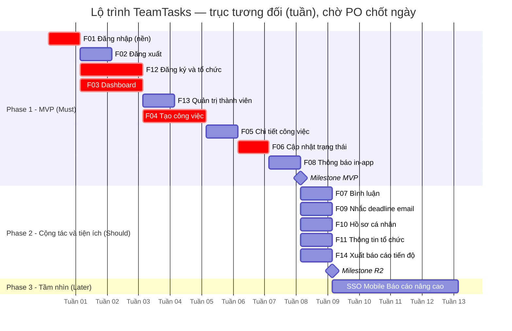
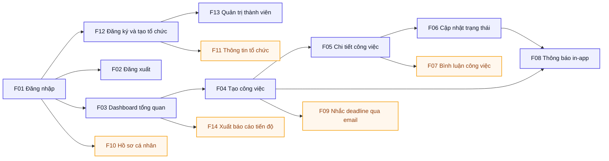

# Lộ trình phát hành — TeamTasks

> Backlog ưu tiên + lộ trình phát hành cho TeamTasks. Mỗi chức năng `F..` trace về `docs/02-functions.md`; ưu tiên MoSCoW giữ nhất quán với `01-requirements.md` và `02-functions.md`.
> Tài liệu **cấp tổng, 1 file/dự án** và là **tài liệu sống** — cập nhật lại khi ưu tiên đổi (phản hồi người dùng, CR, ràng buộc mới).

## 1. Bối cảnh & mục tiêu lộ trình
- **Bối cảnh/nguồn:** Nhóm 10–200 người theo dõi công việc bằng chat/bảng tính → thiếu minh bạch trách nhiệm, việc bị bỏ sót, deadline không được nhắc (`01-requirements.md` §1). TeamTasks là nền quản lý công việc nhóm tập trung, phân quyền rõ, theo dõi tiến độ realtime.
- **Mục tiêu lộ trình:**
  - **Now (Phase 1 = MVP):** giao đủ luồng cốt lõi *đăng ký → đăng nhập → tạo & giao việc → cập nhật trạng thái → thông báo* để một tổ chức chạy được end-to-end trong ràng buộc **MVP 3 tháng** (`01-requirements.md` §7).
  - **Next (Phase 2):** bổ sung cộng tác & tiện ích (bình luận, nhắc email, hồ sơ, quản trị tổ chức) làm mượt trải nghiệm và giảm việc trễ hạn.
  - **Later (Phase 3 = tầm nhìn):** mở rộng ngoài phạm vi giai đoạn 1 (SSO, mobile, tự phục vụ mật khẩu, báo cáo nâng cao) — chưa cấp mã `F` chính thức.
- **Chân trời thời gian:** Now (Phase 1 — tháng 1–3, MVP) · Next (Phase 2 — tháng 4–5) · Later (Phase 3 — sau tháng 5, tầm nhìn). *(Now/Next/Later thay cho ngày cứng — roadmap là tài liệu sống.)*
- **Ràng buộc chi phối:** MVP ra mắt trong **3 tháng**; không OAuth/SSO, không mobile, không "quên mật khẩu" tự phục vụ ở giai đoạn 1 (`01-requirements.md` §7) → các mục này rơi về **Later**.
- **Thang đo RICE dùng trong tài liệu này** *(số là ước lượng — xem mục Giả định, dòng `⚠️` chưa chốt):*
  - **Reach** — số người dùng chạm chức năng mỗi tháng (chuẩn hoá trên tập pilot ~1.000 người dùng đang hoạt động; chức năng của riêng Team Lead/Admin có Reach thấp hơn).
  - **Impact** — mức tác động lên giá trị nghiệp vụ: `3 = rất cao · 2 = cao · 1 = vừa · 0.5 = thấp · 0.25 = tối thiểu`.
  - **Confidence** — độ tin cậy ước lượng: `100% / 90% / 80% / 70% / 50%`.
  - **Effort** — công sức, đơn vị **person-week (pw)**.
  - **RICE** = (Reach × Impact × Confidence) / Effort. Điểm càng cao → càng ưu tiên *trong cùng một release*.
- **Lưu ý xếp phase:** thứ tự phase do **MoSCoW + phụ thuộc** quyết trước; **RICE** chỉ để xếp hạng *bên trong* một phase. Vì vậy một `F` Should có RICE cao (vd F07) vẫn nằm ở Phase 2, không nhảy lên Phase 1.

## 2. Bảng ưu tiên
> Mỗi chức năng `F..` trace về `docs/02-functions.md`. RICE = (Reach × Impact × Confidence) / Effort. Số ước lượng chưa chốt gắn `⚠️` (chi tiết ở mục Giả định).

| Mã F | Chức năng | MoSCoW | Reach | Impact | Confidence | Effort (pw) | RICE | Kano | Release |
|------|-----------|--------|-------|--------|------------|-------------|------|------|---------|
| F01 | Đăng nhập | Must | 1000 | 3 | 100% | 2 | 1500 | must-be | Now (P1) |
| F02 | Đăng xuất | Must | 1000 | 1 | 100% | 0.5 | 2000 | must-be | Now (P1) |
| F12 | Đăng ký tài khoản & tạo tổ chức | Must | 200 ⚠️ | 3 | 90% | 3 | 180 | must-be | Now (P1) |
| F03 | Xem dashboard tổng quan | Must | 900 ⚠️ | 3 | 90% | 5 | 486 | performance | Now (P1) |
| F04 | Tạo công việc | Must | 400 ⚠️ | 3 | 90% | 4 | 270 | must-be | Now (P1) |
| F05 | Xem chi tiết công việc | Must | 900 ⚠️ | 2 | 90% | 3 | 540 | performance | Now (P1) |
| F06 | Cập nhật trạng thái công việc | Must | 800 ⚠️ | 3 | 90% | 3 | 720 | performance | Now (P1) |
| F08 | Thông báo in-app | Must | 900 ⚠️ | 2 | 80% ⚠️ | 4 | 360 | performance | Now (P1) |
| F13 | Quản trị thành viên | Must | 200 ⚠️ | 2 | 80% | 3 | 106.7 | must-be | Now (P1) |
| F07 | Bình luận công việc | Should | 700 ⚠️ | 1 | 80% | 2 | 280 | performance | Next (P2) |
| F09 | Nhắc nhở deadline qua email | Should | 600 ⚠️ | 2 | 70% ⚠️ | 3 | 280 | delighter | Next (P2) |
| F10 | Quản lý hồ sơ cá nhân | Should | 500 ⚠️ | 0.5 | 90% | 2 | 112.5 | must-be | Next (P2) |
| F11 | Quản lý thông tin tổ chức (tên, logo) | Should | 200 ⚠️ | 1 | 80% | 3 | 53.3 | must-be | Next (P2) |
| F14 | Xuất báo cáo tiến độ *(CR-01)* | Should | 300 ⚠️ | 1 | 70% ⚠️ | 3 | 70 | delighter | Next (P2) |

**Đọc bảng:**
- **9 chức năng Must** (F01, F02, F12, F03, F04, F05, F06, F08, F13) → **Now / Phase 1 (MVP)**, khớp đúng ưu tiên Must ở `02-functions.md`.
- **5 chức năng Should** (F07, F09, F10, F11, F14) → **Next / Phase 2**, khớp đúng ưu tiên Should ở `02-functions.md`. *(F14 thêm qua `CR-01` — xuất báo cáo cơ bản PDF/Excel; **khác** "báo cáo nâng cao" ở Phase 3 §3 vốn là biểu đồ/phân tích sâu.)*
- Không có chức năng Could/Won't ở giai đoạn hiện tại; **Later / Phase 3** dành cho ý tưởng tầm nhìn chưa cấp mã `F` (xem §3).

## 3. Lộ trình phát hành (Now / Next / Later)

### Now — Phase 1: MVP TeamTasks (tháng 1–3)
- **Mục tiêu:** một tổ chức có thể tự đăng ký, đăng nhập, tạo & giao việc, theo dõi và cập nhật tiến độ, nhận thông báo — **chạy end-to-end** đúng ràng buộc MVP 3 tháng. Đây là **tập chức năng MVP Must**, sẽ được `ba-accept release phase-1` ghép với UAT Phase 1.
- **Chức năng (9, tất cả Must):** F01 Đăng nhập, F02 Đăng xuất, F12 Đăng ký & tạo tổ chức, F03 Dashboard tổng quan, F04 Tạo công việc, F05 Chi tiết công việc, F06 Cập nhật trạng thái, F08 Thông báo in-app, F13 Quản trị thành viên.
- **Màn liên quan (trace `03-overview.md`):** S01 Đăng nhập, S06 Đăng ký, S02 Dashboard, S03 Chi tiết công việc, S05 Tổ chức (phần quản trị thành viên — F13).
- **Tiêu chí ra mắt:**
  - Luồng nghiệp vụ chính *Giao và duyệt công việc* (`01-requirements.md` §4.1) chạy end-to-end: tạo việc → giao → cập nhật trạng thái TODO→IN_PROGRESS→IN_REVIEW→DONE → thông báo in-app.
  - Đăng ký tạo tổ chức mới + đăng nhập/đăng xuất hoạt động; khoá tài khoản sau 5 lần sai (NFR-03).
  - Org Admin quản trị được thành viên (mời/sửa vai trò/vô hiệu hoá — F13, FR-02) với dữ liệu cô lập giữa các tổ chức.
  - Đạt các NFR bắt buộc cho MVP: p95 ≤ 2s @200 user (NFR-01), cách ly tenant (NFR-06), bảo mật mật khẩu/JWT (NFR-02).
  - Đã có test cho từng màn, **không còn lỗi mức Chặn**; gate `ba-review` sạch (không 🔴/🟡).

### Next — Phase 2: Cộng tác & tiện ích (tháng 4–5)
- **Mục tiêu:** làm mượt trải nghiệm và giảm việc trễ hạn — thêm trao đổi trên công việc, nhắc deadline chủ động, và tự quản hồ sơ/tổ chức để giảm phụ thuộc thao tác thủ công của Admin.
- **Chức năng (5, tất cả Should):** F07 Bình luận công việc, F09 Nhắc nhở deadline qua email, F10 Quản lý hồ sơ cá nhân, F11 Quản lý thông tin tổ chức (tên, logo), **F14 Xuất báo cáo tiến độ** *(CR-01)*.
- **Màn liên quan:** S03 Chi tiết công việc (bổ sung comment — F07), S04 Hồ sơ cá nhân (F10), S05 Tổ chức (bổ sung cập nhật tên/logo — F11), **S02 Dashboard** (bổ sung nút xuất báo cáo — F14); F09 chạy nền (cron 08:00), không có màn riêng.
- **Tiêu chí ra mắt:**
  - Comment cập nhật qua **polling ~30s** (không đẩy real-time — theo ràng buộc giai đoạn 1) trên chi tiết công việc; email nhắc deadline gửi đúng 08:00 cho việc đến hạn/quá hạn (FR-10, BR-05).
  - Người dùng tự đổi hồ sơ/mật khẩu (F10); Team Lead/Admin cập nhật tên/logo tổ chức (F11, FR-12). *(Quản trị thành viên — F13/FR-02 — đã ra ở Phase 1.)*
  - Đã có test cho các màn mới; gate `ba-review` sạch.

### Later — Phase 3: Tầm nhìn mở rộng (sau tháng 5)
- **Mục tiêu:** mở rộng ngoài phạm vi giai đoạn 1 khi MVP đã ổn định và có phản hồi thực tế. **Chưa cấp mã `F` chính thức** — sẽ được đưa qua `ba-add-screen feature`/CR khi chốt phạm vi từng increment.
- **Ứng viên (ngoài phạm vi giai đoạn 1 theo `01-requirements.md` §7):**
  - Đăng nhập SSO/OAuth (Google/Microsoft) — bỏ ràng buộc "không OAuth ở GĐ1".
  - Ứng dụng mobile (hiện chỉ web).
  - "Quên mật khẩu" tự phục vụ (hiện Admin reset thủ công).
  - Tìm kiếm/lọc nâng cao, báo cáo & analytics tiến độ, cấu hình thông báo chi tiết (mở rộng StR-04).
- **Ứng viên từ nghiên cứu người dùng** (`00-personas.md` §6 — đưa vào Later theo **`DEC-05`**, họp 2026-07-21):

  | Mã | Ứng viên | Từ persona | Ghi chú xếp hạng |
  |---|---|---|---|
  | U-02 | Tuỳ chọn tần suất/kênh thông báo | PS-01 Member | Gắn với F08/F09; kỳ vọng SH-03 "kịp thời nhưng không làm phiền" |
  | U-04 | Lọc/sắp xếp dashboard theo hạn & ưu tiên | PS-01, PS-02 | Rẻ, tăng giá trị F03 — ứng viên **kéo lên Phase 2** nếu còn dư năng lực |
  | U-05 | Cảnh báo quá hạn cho Team Lead | PS-02 Team Lead | Mở rộng F09 (hiện chỉ nhắc người thực hiện) |
  | U-06 | Mời thành viên hàng loạt | PS-03 Org Admin | Ảnh hưởng onboarding tổ chức lớn (tới 200 người) |
  | U-07 | Nhắc người duyệt khi việc chờ quá N ngày | PS-01 | Nhỏ, gắn F06 |
  | U-08 | Nhật ký hoạt động quản trị (audit log) | PS-03 | Cân nhắc cùng yêu cầu bảo mật/tuân thủ |
  | U-09 | Nhân bản việc / mẫu công việc | PS-02 | Ưu tiên thấp |
  | U-10 | Bàn giao hàng loạt khi thành viên nghỉ | PS-02, PS-03 | Ưu tiên thấp |

  > `U-01` (xuất báo cáo tiến độ) **không nằm ở đây** — đã tách thành **`CR-01`** trong `00-cr.md` vì là hở phạm vi so với kỳ vọng SH-05, chờ SH-05 duyệt. `U-03` (nhắc trước hạn T-1) đã được gộp vào `FR-10`/F09 của Phase 2 theo `DEC-04`.
- **Tiêu chí ra mắt:** xác định lại khi từng ứng viên được nâng thành chức năng có mã `F` + đặc tả riêng.

## 4. Sơ đồ lộ trình

### 4.1 Gantt đa phase (thời gian + song song)
> Mỗi phase = 1 `section`; mỗi `F..` = 1 task. Chức năng độc lập trong cùng phase cho **cùng mốc `after`** → chạy **song song**. Trục **tương đối** (tuần) — chờ PO chốt ngày. `:crit` = đường-găng, `:milestone` = mốc chốt phase.

> **Song song thể hiện ở đây:** Phase 1 — `F02`, `F12`, `F03` cùng `after f01` → ba nhánh khởi động song song ngay sau xác thực. Phase 2 — `F07/F09/F10/F11/F14` cùng `after m1` → năm tiện ích chạy song song. Chỉ nối `after` cho phụ thuộc thật (vd `F13 after f12`: phải có tổ chức trước khi quản trị thành viên). Đường-găng (`:crit`): F01 → F12/F03 → F04 → F06.

### 4.2 Sơ đồ phụ thuộc
> Node = chức năng `F..`; cạnh = "phụ thuộc vào" (mũi tên trỏ từ nền → chức năng dựa trên nó). Tô màu theo release. Đã kiểm: đủ 14 `F..`, không node treo, không phụ thuộc vòng lặp; thứ tự phase ở Gantt (4.1) khớp phụ thuộc ở đây. Màu lấy từ token `docs/07-design-system.md` (`brand/primary` cho Now, `state/warning` cho Next).

**Diễn giải phụ thuộc chính:**
- **F01 Đăng nhập là nền cho toàn hệ thống** — mọi chức năng đều sau xác thực (thể hiện qua F01 → F12/F02/F03/F10; các nhánh còn lại nối tiếp từ F03).
- **F12 Đăng ký** dựng trên cơ chế session/JWT của F01, và tạo ra tổ chức để **F11 Quản lý tổ chức** và **F13 Quản trị thành viên** vận hành → F12 → F11, F12 → F13 (phải có tổ chức trước khi quản trị thành viên).
- **Chuỗi công việc:** F03 Dashboard → F04 Tạo việc → F05 Chi tiết → F06 Cập nhật trạng thái (đúng gợi ý *F04 trước F06*). F05 cũng là nơi đặt **F07 Bình luận**.
- **F08 Thông báo in-app** kích hoạt từ sự kiện *giao việc* (F04) và *đổi trạng thái* (F06) → F04/F06 → F08.
- **F09 Nhắc email** cần công việc có deadline (F04) → F04 → F09.
- Không có phụ thuộc vòng (không A↔B); mọi chức năng Next đều nối về một chức năng Now đã có → không đảo thứ tự release.

## Giả định
> **🔓 Quyết định chấp nhận rủi ro — 2026-08-04, SH-06 (BA/PM) — chủ sở hữu dự án mẫu.**
> *Vì sao chưa xác nhận được:* Reach/Impact/Confidence/Effort là ước lượng tương đối, **chưa có dữ liệu tăng trưởng thật** để định lượng.
> *Điều kiện rà lại:* cam kết lịch phát hành với khách hàng — trước đó PO phải xác nhận lại các số RICE — khi điều đó xảy ra, các dòng dưới quay lại `⚠️ chưa xác nhận` và phải rà theo vòng "Xác nhận giả định" (`conventions.md`).

| GĐ | Nội dung | Vì sao cần (chỗ thiếu) | Ảnh hưởng nếu sai | Trạng thái | Giá trị chốt |
|----|----------|------------------------|-------------------|------------|--------------|
| GĐ-01 | Tập pilot ~1.000 người dùng hoạt động/tháng làm mốc chuẩn hoá Reach | Chưa có số liệu người dùng thực (dự án mẫu) | Reach lệch tỉ lệ → RICE lệch nhưng thứ hạng tương đối ít đổi | Đề xuất ⚠️ | — |
| GĐ-02 | Reach F12 ≈ 200/tháng (đăng ký là hành động một lần/người, chủ yếu lúc onboarding) | Chưa có dữ liệu tăng trưởng tổ chức | Nếu tăng trưởng nhanh, F12 đáng ưu tiên hơn trong Phase 1 | Đề xuất ⚠️ | — |
| GĐ-03 | Reach chức năng tạo/giao việc & quản trị (F04, F11, F13) thấp hơn vì chỉ Team Lead/Admin dùng | Chưa biết tỉ lệ vai trò trong tổ chức | Effort/Reach lệch → xếp hạng trong phase đổi nhẹ | Đề xuất ⚠️ | — |
| GĐ-04 | Confidence F08/F09 ≤ 80% do phụ thuộc hạ tầng realtime & gửi email/cron | Chưa chốt giải pháp kỹ thuật thông báo/email | Nếu khó hơn dự kiến, Effort tăng → có thể trượt phase | Đề xuất ⚠️ | — |
| GĐ-05 | Effort (person-week) theo ước lượng tương đối giữa các chức năng, chưa lập kế hoạch chi tiết | Chưa có `plan.md`/breakdown kỹ thuật | Sai Effort làm RICE và lịch 3 tháng lệch | Đề xuất ⚠️ | — |
| GĐ-06 | Kano F09 = delighter (nhắc deadline chủ động là điểm gây thích thú, giảm việc trễ) | Chưa khảo sát kỳ vọng người dùng | Nếu người dùng coi là must-be, cần cân nhắc kéo lên Phase 1 | Đề xuất ⚠️ | — |

## Thuật ngữ
| Thuật ngữ | Giải thích |
|-----------|-----------|
| MoSCoW | Cách xếp ưu tiên: Must / Should / Could / Won't |
| RICE | Điểm ưu tiên = (Reach × Impact × Confidence) / Effort |
| Reach / Impact / Confidence / Effort | Tầm phủ / Mức tác động / Độ tin cậy / Công sức — bốn yếu tố của RICE |
| Kano | Mô hình phân loại tính năng: must-be (phải có) / performance (càng nhiều càng tốt) / delighter (gây thích thú) |
| Gantt | Sơ đồ thanh ngang theo thời gian; mỗi phase một section, thanh chồng nhau = chạy song song |
| Đường-găng (critical path) | Chuỗi task quyết định tổng thời gian; chậm một task ở đây là chậm cả lộ trình |
| Now / Next / Later | Ba chân trời của lộ trình thay cho ngày cứng; ở đây ánh xạ Phase 1 / Phase 2 / Phase 3 |
| Phase (P1/P2/P3) | Đợt phát hành có tên rõ; `ba-accept release` ghép roadmap(phase) + UAT(phase) thành gói phát hành |
| PO (Product Owner) | Người sở hữu sản phẩm, quyết ưu tiên backlog |
| pw (person-week) | Đơn vị công sức: số tuần-người ước tính cho một chức năng |
| MVP (Minimum Viable Product) | Sản phẩm khả dụng tối thiểu — tập chức năng cốt lõi ra mắt trước |

> Từ điển đầy đủ toàn dự án: `docs/00-glossary.md`.
</content>
</invoke>
