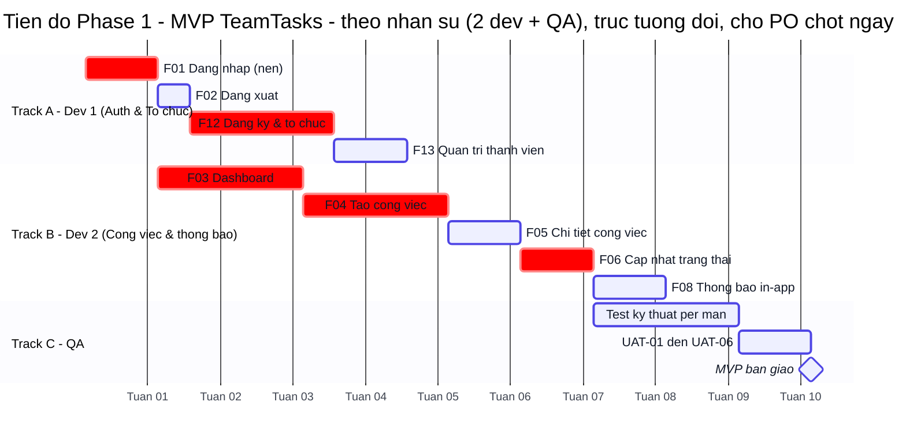
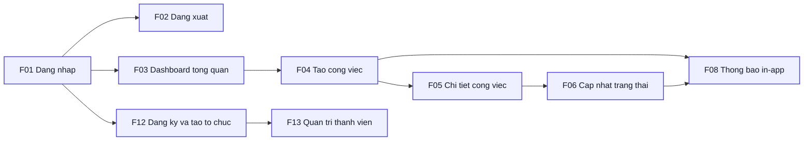

# Gói phát hành — Phase 1 (MVP) — TeamTasks

> Gói phát hành cho **Phase 1 (Now / MVP)**: **kế hoạch + nghiệm thu** gộp một chỗ để stakeholder duyệt/ký. Nguồn: `docs/08-roadmap.md` (mục tiêu, bảng ưu tiên, phụ thuộc, rủi ro của Phase 1) + `docs/09-uat.md` (kịch bản UAT-01…UAT-06). Render HTML: `ba-portal --single`.
>
> Chỉ chứa phần **Phase 1** — không nhồi Phase 2/3. Mỗi `F..` trace về `docs/02-functions.md`; mỗi kịch bản nghiệm thu trace về `FR/F` của Phase 1.

## 1. Tổng quan phase

- **Mục tiêu phase:** một tổ chức có thể **tự đăng ký → đăng nhập → tạo & giao việc → cập nhật trạng thái → nhận thông báo**, chạy **end-to-end** đúng ràng buộc MVP 3 tháng (`08-roadmap.md` §3 Now; `01-requirements.md` §7). Đây là tập chức năng **MVP Must** — nền để một tổ chức vận hành thực tế.
- **Phạm vi (in-scope):** **9 chức năng ưu tiên Must** — Xác thực (đăng nhập/đăng xuất/đăng ký & tạo tổ chức), vòng đời công việc (tạo → xem chi tiết → cập nhật trạng thái), Dashboard tổng quan, thông báo in-app, và quản trị thành viên tổ chức (mời/sửa vai trò/vô hiệu hoá — F13). Kèm cô lập dữ liệu theo tenant (NFR-06) và bảo mật đăng nhập (NFR-02/03) — nghiệm thu lồng trong UAT.
- **Thời gian:** Now / MVP — **3 tháng** kể từ khởi động (dự kiến ra mắt **Q4/2026**, mốc T0 theo `00-vision.md` BO-06/GĐ-05). Roadmap dùng chân trời Now/Next/Later thay ngày cứng — mốc dưới đây là kế hoạch tương đối, PO chốt khi cam kết lịch.
- **Điều kiện tiên quyết:** không phụ thuộc phase trước (Phase 1 là nền). Nội bộ phase: **F01 Đăng nhập là nền cho toàn hệ thống** — mọi chức năng còn lại chạy sau xác thực (xem §4 Sơ đồ phụ thuộc).

## 2. Chức năng trong phase

> Lấy từ `docs/08-roadmap.md` §2 (Bảng ưu tiên) — chỉ các `F..` xếp **Now / Phase 1**. Mỗi mã trace về `docs/02-functions.md`. RICE = (Reach × Impact × Confidence) / Effort; điểm chỉ để xếp hạng *trong* phase. Số gắn `⚠️` là ước lượng chưa chốt (xem `08-roadmap.md` §Giả định).

| Mã | Chức năng | Module | MoSCoW | RICE | Kano | Trace 02-functions | Ghi chú |
|----|-----------|--------|--------|------|------|--------------------|---------|
| F01 | Đăng nhập | Xác thực | Must | 1500 | must-be | F01 (FR-01, BR-03) | Nền xác thực; khoá tài khoản sau 5 lần sai/15 phút (NFR-03) |
| F02 | Đăng xuất | Xác thực | Must | 2000 | must-be | F02 (FR-01, BR-03) | Huỷ session, revoke refresh token, về màn Đăng nhập |
| F12 | Đăng ký tài khoản & tạo tổ chức | Xác thực | Must | 180 ⚠️ | must-be | F12 (FR-13, BR-01, BR-03) | Người dùng mới tạo tổ chức, thành Org Admin; email duy nhất toàn hệ thống |
| F03 | Xem dashboard tổng quan | Quản lý công việc | Must | 486 ⚠️ | performance | F03 (FR-03, BR-01, BR-04) | Danh sách theo trạng thái + 5 thẻ thống kê nhanh |
| F04 | Tạo công việc | Quản lý công việc | Must | 270 ⚠️ | must-be | F04 (FR-04, FR-05, BR-01, BR-02) | Bắt buộc assignee + deadline — không "công việc mồ côi" |
| F05 | Xem chi tiết công việc | Quản lý công việc | Must | 540 ⚠️ | performance | F05 (FR-07, BR-01) | Thông tin đầy đủ + lịch sử thay đổi trạng thái |
| F06 | Cập nhật trạng thái công việc | Quản lý công việc | Must | 720 ⚠️ | performance | F06 (FR-06, BR-01, BR-02) | TODO → IN_PROGRESS → IN_REVIEW → DONE (+ từ chối, CANCELLED) |
| F08 | Thông báo in-app | Thông báo | Must | 360 ⚠️ | performance | F08 (FR-09, BR-05) | Badge + panel khi được giao việc / đổi trạng thái / có comment |
| F13 | Quản trị thành viên | Hồ sơ & Tổ chức | Must | 106.7 ⚠️ | must-be | F13 (FR-02, BR-03) | Mời thành viên, sửa vai trò, vô hiệu hoá tài khoản; tách từ F11 để khớp ưu tiên Must của FR-02 |

**Màn liên quan (trace `03-overview.md`):** S01 Đăng nhập, S06 Đăng ký, S02 Dashboard, S03 Chi tiết công việc, S05 Tổ chức (phần quản trị thành viên — F13).

> Ghi chú xếp phase: 9 chức năng trên đều **Must** → thứ tự phase do MoSCoW + phụ thuộc quyết; RICE chỉ xếp hạng nội bộ. F07/F09/F10/F11 (Should) thuộc **Phase 2**, không đưa vào gói này.

## 3. Kế hoạch & tiến độ

> Tiến độ Phase 1 (MVP 3 tháng) — cắt lát Gantt đa phase của `08-roadmap.md` §4.1 rồi **re-level theo nhân sự**: `section` = **track/người** (không phải phase). Giả định **2 dev + 1 QA** (GĐ-NS ⚠️ — PO chốt): tối đa 2 chức năng chạy song song. Task trong một track **tuần tự** (một người làm lần lượt); song song **giữa** track. Phụ thuộc thật giữ `after` (kể cả xuyên track). Trục tương đối (tuần), PO chốt ngày. Màu token brand TeamTasks (`07-design-system.md`).

> **Đọc song song theo nhân sự:** sau `F01`, Track A (đăng ký/tổ chức) và Track B (công việc) chạy **song song trên 2 dev**; QA vào cuộc khi lõi công việc xong (`after f06`). Roadmap §4.1 cho thấy 3 nhánh độc lập sau F01 (F02/F12/F03) — nhưng chỉ 2 dev nên xếp thành **2 track**, F02+F12 dồn vào Track A tuần tự. Đường-găng (`:crit`) F01→F03→F04→F06→(QA) quyết thời gian tối thiểu ≈ MVP 3 tháng; thêm dev thứ 3 chỉ rút được nếu còn nhánh song song để chia.

## 4. Phụ thuộc & rủi ro

### 4.1 Sơ đồ phụ thuộc (Phase 1)

> Node = chức năng `F..` trong Phase 1; cạnh = "phụ thuộc vào" (mũi tên trỏ từ nền → chức năng dựa trên nó). Trích từ `08-roadmap.md` §4, **lọc chỉ các node/cạnh thuộc Phase 1** (bỏ nhánh trỏ sang F07/F09/F10/F11 của Phase 2). Đã kiểm: đủ 9 `F..`, không node treo, không phụ thuộc vòng. Màu token brand TeamTasks (`brand/primary` cho Now).

**Diễn giải phụ thuộc chính:**
- **F01 Đăng nhập là nền** — mọi chức năng đều sau xác thực (F01 → F12/F02/F03); các nhánh còn lại nối tiếp từ F03.
- **Chuỗi công việc:** F03 Dashboard → F04 Tạo việc → F05 Chi tiết → F06 Cập nhật trạng thái.
- **F08 Thông báo in-app** kích hoạt từ sự kiện *giao việc* (F04) và *đổi trạng thái* (F06) → F04/F06 → F08.
- **F13 Quản trị thành viên** cần có tổ chức trước (đăng ký tạo tổ chức) → F12 → F13.
- Không phụ thuộc vòng; mọi cạnh nằm trọn trong Phase 1 → có thể build theo đúng thứ tự trên.

### 4.2 Phụ thuộc bắt buộc

- **Nội bộ phase:** F01 (xác thực/JWT session) phải xong trước mọi chức năng còn lại; F03 (Dashboard) là cửa vào chuỗi tạo/giao việc.
- **Hạ tầng:** cơ chế thông báo in-app (F08) cần hạ tầng đẩy/polling ~30 giây (giai đoạn 1 chấp nhận polling, không WebSocket real-time — `00-vision.md` §4).
- **NFR nền của phase:** bcrypt cost ≥ 12 + JWT RS256 + HTTPS (NFR-02), cô lập tenant (NFR-06) — phải sẵn trước khi mở dữ liệu thật.

### 4.3 Rủi ro & đòn bẩy cắt scope

| Rủi ro | Khả năng | Ảnh hưởng | Hướng xử lý / phần có thể cắt nếu trễ |
|--------|----------|-----------|----------------------------------------|
| Phạm vi phình làm trễ MVP 3 tháng | TB | Cao | Khoá phạm vi theo §2; thay đổi đi qua sổ CR `00-cr.md`; giữ đúng 8 Must, không kéo Should lên |
| Confidence F08 ≤ 80% do phụ thuộc hạ tầng thông báo (`08-roadmap.md` GĐ-04) | TB | TB | Giai đoạn 1 dùng polling thay real-time; nếu trễ, F08 có thể thu hẹp còn badge số + panel (bỏ realtime auto-tăng) mà vẫn đạt luồng chính |
| Ước lượng Effort/Reach chưa chốt (`08-roadmap.md` GĐ-01…GĐ-05, `⚠️`) | Cao | TB | PO xác nhận số RICE/Effort trước khi cam kết lịch; kế hoạch §3 là tương đối |
| Bảo mật / rò rỉ dữ liệu chéo tổ chức | Thấp | Cao | Tenant isolation (NFR-06) + khoá brute force (NFR-03); nghiệm thu bắt buộc qua UAT-06 trước ra mắt |
| Rủi ro adoption — người dùng vẫn dùng chat, không nhập việc lên hệ thống | TB | Cao | Tài liệu/hướng dẫn trước ra mắt (TR-01); thông báo in-app tạo thói quen; đo BO-01 sau 1 tháng |

## 5. Tiêu chí nghiệm thu (UAT của phase)

> Lấy từ `docs/09-uat.md` §2 — chỉ các kịch bản **Phase 1 (UAT-01 … UAT-06)**, trace tới `FR/F` trong phase. Mỗi kịch bản chạy **xuyên nhiều màn**, do người dùng/PO chạy tay; kết quả mong đợi ghi **số/trạng thái/thông báo cụ thể** để nghiệm thu khách quan.

| Mã | Kịch bản nghiệm thu (end-to-end) | Trace F / FR / BR | Kết quả mong đợi (đo được) | Trạng thái |
|----|----------------------------------|-------------------|----------------------------|-----------|
| UAT-01 | Đăng ký tài khoản và khởi tạo tổ chức (kèm nhánh email trùng) | F12 / FR-13, BR-01, BR-03 | Tạo 1 tài khoản + 1 tổ chức `Cong ty ABC`, tự đăng nhập tới Dashboard **≤ 3 giây**, vai trò **Org Admin**; email trùng → lỗi inline "Email đã được sử dụng…", **không** tạo mới, focus về ô Email | Chưa chạy |
| UAT-02 | Đăng nhập, khoá tài khoản khi bị dò mật khẩu, và đăng xuất an toàn | F01, F02 / FR-01, BR-03, NFR-03 | Đăng nhập đúng → Dashboard **≤ 2 giây**; sai 5 lần → TEMP_LOCKED + đồng hồ đếm ngược "15 phút", nút bị disable; trong thời gian khoá dù nhập đúng vẫn **bị từ chối**; đăng xuất về Login **≤ 500ms**, token cũ bị từ chối | Chưa chạy |
| UAT-03 | Giao việc → thực hiện → gửi duyệt → duyệt/trả lại (vòng đời công việc) | F04, F05, F06, F08 / FR-04, FR-05, FR-06, FR-07, FR-09, BR-01, BR-02 | Việc tạo trạng thái **TODO** đúng assignee + deadline; Member nhận **1 thông báo in-app**; mỗi lần chuyển trạng thái ghi **lịch sử thay đổi**; trả lại → **IN_PROGRESS** + thông báo kèm lý do; duyệt đạt → **DONE** đếm vào "Hoàn thành"; **không** có "công việc mồ côi" (BR-02) | Chưa chạy |
| UAT-04 | Theo dõi tiến độ nhóm trên Dashboard (không cần họp thủ công) | F03 / FR-03, BR-01, BR-04 | 5 thẻ (Tổng/Cần làm/Đang làm/Hoàn thành/Quá hạn) đúng số; thấy việc **toàn tổ chức**; lọc "Đang làm" + tìm `API` không reload trang; việc quá hạn tô đỏ ⚠ khớp thẻ "Quá hạn"; nắm tổng quan **không cần họp cập nhật** (BR-04) | Chưa chạy |
| UAT-05 | Nhận và đọc thông báo in-app (không bỏ lỡ công việc) | F08 / FR-09, BR-05 | Chuông hiện badge "3" (>99 → "99+"); mở thông báo → **đã đọc** + badge **giảm 1** + điều hướng tới đúng công việc (S03); "Đọc tất cả" → badge **ẩn**; việc mới giao → badge **tự tăng ≤ 60 giây** không cần reload | Chưa chạy |
| UAT-06 | Quản trị thành viên tổ chức và cô lập dữ liệu giữa các tổ chức | F13 / FR-02, BR-03, NFR-06 | Mời thành viên → xuất hiện trạng thái đúng; vô hiệu hoá → không được giao việc mới; thành viên bị vô hiệu hoá **không đăng nhập được**; Org Admin `Cong ty ABC` **không** thấy dữ liệu `Cong ty XYZ` qua UI lẫn API trực tiếp (**không data bleed** — NFR-06, BR-03) | Chưa chạy |

**Ghi chú trace UAT-06:** kịch bản này nghiệm thu **F13 Quản trị thành viên (FR-02) — ưu tiên Must** và **NFR-06 (cô lập tenant)**, đều thuộc Phase 1. Mâu thuẫn ưu tiên cũ (FR-02 Must ↔ F11 Should) **đã được giải quyết** bằng cách **tách F13 (Must, Phase 1, trace FR-02) khỏi F11 (Should, Phase 2, trace FR-12)** — xem `02-functions.md` và `09-uat.md` GĐ-05. Phần *cập nhật tên/logo tổ chức* (F11/FR-12) vẫn ở **Phase 2 (UAT-10)** — không nghiệm thu ở đây.

**Kiểm độ phủ Phase 1:** 9 FR/quan-hệ Must chạm Phase 1 (FR-01, FR-02, FR-03, FR-04, FR-05, FR-06, FR-07, FR-09, FR-13) đều có ≥ 1 kịch bản; cả 6 kịch bản UAT-01…UAT-06 đều trace ngược về ≥ 1 FR/BR. NFR then chốt nghiệm thu qua §6: NFR-03 lồng trong UAT-02, NFR-06 lồng trong UAT-06.

## 6. Checklist ra mắt & ký

> Điều kiện coi Phase 1 là "xong và ký được" (Definition of Done / Release readiness — trích `09-uat.md` §4.1, lọc phần thuộc Phase 1).

- [ ] Mọi `F..` **Must** của Phase 1 (F01, F02, F12, F03, F04, F05, F06, F08, F13) có UAT **Đạt** — đối chiếu §5; tương ứng FR-01/02/03/04/05/06/07/09/13.
- [ ] Không còn lỗi nghiêm trọng (Critical/High) đang mở trên các luồng thuộc phase.
- [ ] **Cô lập dữ liệu tổ chức:** UAT-06 `Đạt` — không data bleed giữa tenant (NFR-06, BR-03).
- [ ] **Bảo mật đăng nhập:** khoá tài khoản sau 5 lần sai/15 phút đúng (NFR-03); mật khẩu bcrypt cost ≥ 12, JWT RS256, HTTPS bắt buộc (NFR-02) — qua UAT-02 + rà cấu hình.
- [ ] **Hiệu năng:** API ≤ 2 giây ở p95 với 200 người dùng đồng thời (NFR-01) — đo tải.
- [ ] **Khả dụng luồng chính:** tạo & giao việc hoàn tất ≤ 3 bước từ Dashboard (NFR-05) — qua UAT-03.
- [ ] **Không "công việc mồ côi":** 100% công việc có assignee + deadline (BR-02) — rà dữ liệu + UAT-03.
- [ ] Tài liệu hướng dẫn người dùng (video + tài liệu) sẵn sàng trước ra mắt (TR-01).
- [ ] Tương thích trình duyệt: Chrome ≥ 110, Firefox ≥ 110, Safari ≥ 16, Edge ≥ 110 (NFR-07).
- [ ] Gate `ba-review` sạch (không 🔴/🟡) cho các màn thuộc phase.

| Vai trò | Họ tên | Ngày | Kết luận (Chấp nhận / Có điều kiện / Từ chối) | Ghi chú/điều kiện |
|---------|--------|------|-----------------------------------------------|-------------------|
| Product Owner (PO) | | | | |
| Business Analyst (BA) | | | | |
| Đại diện khách hàng/người dùng | | | | |
| QA Lead | | | | |

## Thuật ngữ

| Thuật ngữ | Giải thích |
|-----------|-----------|
| MVP (Minimum Viable Product) | Sản phẩm khả dụng tối thiểu — tập chức năng cốt lõi ra mắt trước |
| MoSCoW | Cách xếp ưu tiên: Must / Should / Could / Won't |
| RICE | Điểm ưu tiên = (Reach × Impact × Confidence) / Effort |
| Kano | Phân loại tính năng: must-be / performance / delighter |
| UAT (User Acceptance Testing) | Nghiệm thu nghiệp vụ do người dùng/PO chạy trước ra mắt |
| DoD (Definition of Done) | Bộ tiêu chí đo được coi là hoàn thành / ra mắt được |
| FR / BR / NFR | Yêu cầu chức năng / nghiệp vụ / phi chức năng |
| Tenant / data bleed | Một tổ chức = một tenant (không gian dữ liệu riêng); data bleed = rò rỉ dữ liệu giữa các tổ chức |
| JWT (JSON Web Token) | Thẻ phiên xác thực có chữ ký; giai đoạn 1 dùng thuật toán RS256 |

> Từ điển đầy đủ toàn dự án: `docs/00-glossary.md`.
