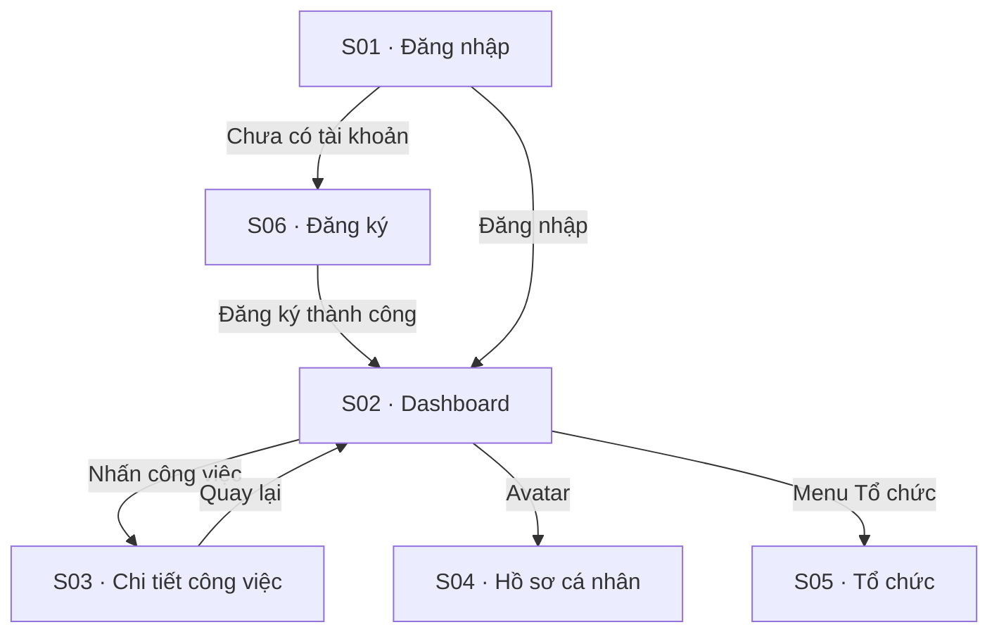

### Sơ đồ tổng quan hành trình

### Hành trình 1: Đăng ký & vào việc lần đầu

*Ai:* Người dùng mới (chưa có tài khoản) · *Mục tiêu:* Có tổ chức riêng và tới được bảng công việc.

1. **[S01 — Đăng nhập]** Mở hệ thống khi chưa đăng nhập → bị đưa về màn Đăng nhập. Chưa có tài khoản → bấm "Đăng ký".
2. **[S06 — Đăng ký]** Nhập email, mật khẩu (thấy thanh đo độ mạnh), đặt tên tổ chức → bấm Đăng ký.
3. Hệ thống tạo tài khoản + tổ chức, tự đăng nhập → chuyển thẳng **[S02 — Dashboard]**.
4. **[S02 — Dashboard]** Thấy bảng công việc còn trống + các thẻ thống kê 0 → sẵn sàng tạo công việc đầu tiên.

> *Nhánh phụ:* email đã tồn tại → báo lỗi tại chỗ, ở lại S06; đã có tài khoản → từ S01 đăng nhập thẳng vào S02.

### Hành trình 2: Tạo và giao một công việc

*Ai:* Team Lead / Org Admin · *Mục tiêu:* Giao việc cho một thành viên.

1. **[S02 — Dashboard]** Bấm "Tạo công việc" → mở hộp thoại tạo việc.
2. Nhập tiêu đề, mô tả, chọn **người thực hiện** (chỉ thành viên đang hoạt động cùng tổ chức), đặt hạn (không được ở quá khứ) → Lưu.
3. Hệ thống tạo việc, gửi thông báo cho người được giao → việc mới hiện trên bảng, badge thông báo của người nhận +1.

> *Nhánh phụ:* Member (không phải Lead/Admin) không thấy nút tạo việc; bỏ trống tiêu đề/người thực hiện → lỗi tại chỗ, không gọi máy chủ.

### Hành trình 3: Xem & cập nhật một công việc

*Ai:* Thành viên được giao việc · *Mục tiêu:* Cập nhật tiến độ và trao đổi.

1. **[S02 — Dashboard]** Nhấn vào một công việc trong danh sách → mở **[S03 — Chi tiết công việc]**.
2. **[S03 — Chi tiết công việc]** Xem thông tin việc, đổi **trạng thái** (vd Đang làm → Xong) → hệ thống ghi 1 dòng lịch sử + thông báo cho người liên quan.
3. Thêm **bình luận** để trao đổi → bình luận hiện cuối danh sách.
4. Bấm "Quay lại" → về **[S02 — Dashboard]**, thấy trạng thái việc đã cập nhật.

### Hành trình 4: Quản trị tổ chức & thành viên

*Ai:* Org Admin · *Mục tiêu:* Mời thành viên, phân vai, xử lý tài khoản bị khoá.

1. **[S02 — Dashboard]** Mở menu → **[S05 — Tổ chức]** (chỉ Team Lead/Org Admin thấy mục này).
2. **[S05 — Tổ chức]** Mời thành viên mới (tài khoản tạo ra buộc đổi mật khẩu ở lần đăng nhập đầu), đổi vai trò, hoặc **mở khoá** một tài khoản bị khoá vĩnh viễn về hoạt động lại.
3. Bấm "Quay lại" → về **[S02 — Dashboard]**.

> *Nhánh phụ:* Người không phải Org Admin gọi thẳng thao tác quản trị → bị chặn ở máy chủ (403). Hồ sơ cá nhân của chính mình sửa ở **[S04 — Hồ sơ cá nhân]** (vào qua avatar ở header).
