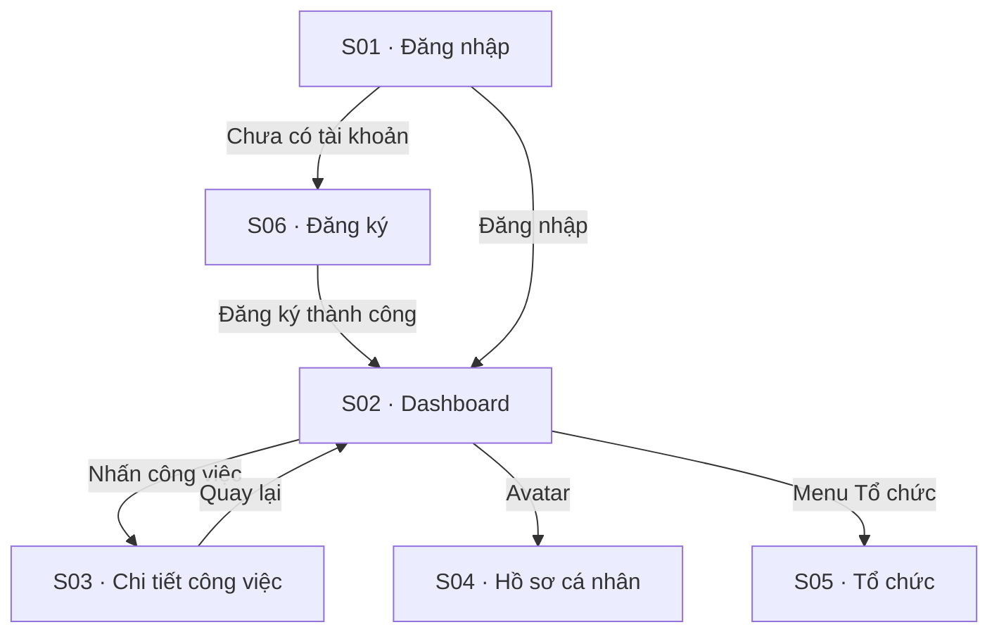

# Sơ đồ luồng màn hình — cho người dùng cuối

> Một vòng đi qua các màn của hệ thống: bản đồ điều hướng, các hành trình chính, và khung giao diện (wireframe) từng màn. Đọc từ trên xuống để hiểu "làm việc gì thì đi qua những màn nào".

## Bản đồ điều hướng

```
[Bất kỳ URL nào khi chưa đăng nhập]
        |
        v (redirect)
[S01: Đăng nhập] <──[Đã có tài khoản?]── [S06: Đăng ký]
        |   └──[Chưa có tài khoản? Đăng ký]──> [S06: Đăng ký]
        |                                           |
        |                       (đăng ký thành công → tạo tổ chức)
        |<──────────────────────────────────────────┘
        v (đăng nhập thành công)
[S02: Dashboard] <─────────────────────────────────────────────────┐
        |                                                           |
        |── [Nhấn vào công việc] ──────────> [S03: Chi tiết CV]    |
        |                                           |               |
        |                                           v               |
        |                                    [Cập nhật trạng thái] |
        |                                    [Thêm comment]        |
        |                                    [← Quay lại] ─────────┘
        |
        |── [Avatar / Menu cá nhân] ──────> [S04: Hồ sơ cá nhân]
        |                                           |
        |                                           v
        |                                    [← Quay lại] ─────────┐
        |                                                           |
        |── [Menu: Tổ chức] ─────────────> [S05: Tổ chức]          |
        |           (Team Lead/Admin)               |               |
        |                                           v               |
        |                                    [← Quay lại] ──────────┘
        |
        └── [Đăng xuất] ────────────────> [S01: Đăng nhập]
```

**Ghi chú luồng:**
- Mọi URL khi chưa xác thực → redirect về S01.
- Sau đăng nhập thành công → redirect về URL gốc (nếu có), mặc định là S02.
- S04 và S05 chỉ truy cập qua menu header; không có deep link trực tiếp từ Dashboard.
- S05 hiển thị trong menu chỉ với vai trò Team Lead và Org Admin.

## Hành trình người dùng chính

### Sơ đồ tổng quan hành trình



### Hành trình 1: Đăng ký & vào việc lần đầu

*Ai:* Người dùng mới (chưa có tài khoản) · *Mục tiêu:* Có tổ chức riêng và tới được bảng công việc.

1. **[S01 — Đăng nhập]** Mở hệ thống khi chưa đăng nhập → bị đưa về màn Đăng nhập. Chưa có tài khoản → bấm "Đăng ký".
2. **[S06 — Đăng ký]** Nhập email, mật khẩu (thấy thanh đo độ mạnh), đặt tên tổ chức → bấm Đăng ký.
3. Hệ thống tạo tài khoản + tổ chức, tự đăng nhập → chuyển thẳng **[S02 — Dashboard]**.
4. **[S02 — Dashboard]** Thấy bảng công việc còn trống + các thẻ thống kê 0 → sẵn sàng tạo công việc đầu tiên.

> *Nhánh phụ:* email đã tồn tại → báo lỗi tại chỗ, ở lại S06; đã có tài khoản → từ S01 đăng nhập thẳng vào S02.

### Hành trình 2: Tạo và giao một công việc

*Ai:* Team Lead / Org Admin · *Mục tiêu:* Giao việc cho một thành viên.

1. **[S02 — Dashboard]** Bấm "Tạo công việc" → mở hộp thoại tạo việc.
2. Nhập tiêu đề, mô tả, chọn **người thực hiện** (chỉ thành viên đang hoạt động cùng tổ chức), đặt hạn (không được ở quá khứ) → Lưu.
3. Hệ thống tạo việc, gửi thông báo cho người được giao → việc mới hiện trên bảng, badge thông báo của người nhận +1.

> *Nhánh phụ:* Member (không phải Lead/Admin) không thấy nút tạo việc; bỏ trống tiêu đề/người thực hiện → lỗi tại chỗ, không gọi máy chủ.

### Hành trình 3: Xem & cập nhật một công việc

*Ai:* Thành viên được giao việc · *Mục tiêu:* Cập nhật tiến độ và trao đổi.

1. **[S02 — Dashboard]** Nhấn vào một công việc trong danh sách → mở **[S03 — Chi tiết công việc]**.
2. **[S03 — Chi tiết công việc]** Xem thông tin việc, đổi **trạng thái** (vd Đang làm → Xong) → hệ thống ghi 1 dòng lịch sử + thông báo cho người liên quan.
3. Thêm **bình luận** để trao đổi → bình luận hiện cuối danh sách.
4. Bấm "Quay lại" → về **[S02 — Dashboard]**, thấy trạng thái việc đã cập nhật.

### Hành trình 4: Quản trị tổ chức & thành viên

*Ai:* Org Admin · *Mục tiêu:* Mời thành viên, phân vai, xử lý tài khoản bị khoá.

1. **[S02 — Dashboard]** Mở menu → **[S05 — Tổ chức]** (chỉ Team Lead/Org Admin thấy mục này).
2. **[S05 — Tổ chức]** Mời thành viên mới (tài khoản tạo ra buộc đổi mật khẩu ở lần đăng nhập đầu), đổi vai trò, hoặc **mở khoá** một tài khoản bị khoá vĩnh viễn về hoạt động lại.
3. Bấm "Quay lại" → về **[S02 — Dashboard]**.

> *Nhánh phụ:* Người không phải Org Admin gọi thẳng thao tác quản trị → bị chặn ở máy chủ (403). Hồ sơ cá nhân của chính mình sửa ở **[S04 — Hồ sơ cá nhân]** (vào qua avatar ở header).

## Wireframe từng màn

### S01 — Login — *Đăng nhập / Đăng xuất* (F01, F02)

```
+----------------------------------------------------------+
|                                                          |
|                  [Logo TeamTasks]                        |
|               Quản lý công việc nhóm                    |
|                                                          |
+----------------------------------------------------------+
|                                                          |
|   +--------------------------------------------------+   |
|   |           Đăng nhập vào tài khoản               |   |
|   +--------------------------------------------------+   |
|                                                          |
|   Email *                                                |
|   +--------------------------------------------------+   |
|   | nguyen.van.a@cty.vn                              |   |
|   +--------------------------------------------------+   |
|                                                          |
|   Mật khẩu *                                             |
|   +--------------------------------------------------+   |
|   | ••••••••••••••••                        [👁 Ẩn] |   |
|   +--------------------------------------------------+   |
|                                                          |
|   ! Sai email hoặc mật khẩu. Còn 3 lần thử.            |
|     (chỉ hiển thị khi có lỗi)                           |
|                                                          |
|   +--------------------------------------------------+   |
|   |              [  Đăng nhập  ]                    |   |
|   +--------------------------------------------------+   |
|     (disable + spinner khi đang gọi API)                 |
|                                                          |
+----------------------------------------------------------+
|  Phiên bản 1.0 · © 2026 TeamTasks                       |
+----------------------------------------------------------+
```

### S02 — Dashboard — *Dashboard / Tạo công việc / Thông báo / Xuất báo cáo* (F03, F04, F08, F14)

```
+----------------------------------------------------------------------------------+
| [TeamTasks]                                              [🔔 3]  [Avatar ▾]      |
+----------------------------------------------------------------------------------+
| Chào, Nguyễn Văn A!                                  [+ Tạo công việc]           |
|                                                      (chỉ Team Lead / Org Admin) |
| +----------+ +----------+ +----------+ +----------+ +----------+                 |
| | Tổng     | | Cần làm  | | Đang làm | | Hoàn thành| | Quá hạn |                 |
| |   24     | |    8     | |    6     | |    9      | |   1 ⚠   |                 |
| +----------+ +----------+ +----------+ +----------+ +----------+                 |
|                                                                                  |
| [Lọc trạng thái ▾] [Lọc ưu tiên ▾]              [🔍 Tìm theo tiêu đề.......]    |
|                                                                                  |
| +------------------------------------------------------------------------------+|
| | Tiêu đề                  | Người thực hiện | Deadline    | Ưu tiên | Trạng thái||
| |--------------------------|-----------------|-------------|---------|-----------||
| | Thiết kế trang chủ       | (av) Trần B     | 14/06 17:00 | Cao     | Đang làm  ||
| | Viết tài liệu API        | (av) Lê C       | 12/06 09:00 | Khẩn cấp| Cần làm ⚠ ||
| | Sửa lỗi đăng nhập        | (av) Ng. V. A   | 20/06 17:00 | Trung   | Đang duyệt||
| | ...                      |                 |             |         |           ||
| +------------------------------------------------------------------------------+|
|                                       [Tải thêm]                                 |
+----------------------------------------------------------------------------------+
```

### S03 — TaskDetail — *Chi tiết công việc / Trạng thái / Comment* (F05, F06, F07)

```
+----------------------------------------------------------------------+
| [TeamTasks]                                      [🔔 3]  [Avatar ▾]  |
+----------------------------------------------------------------------+
| [← Quay lại Dashboard]                                               |
+----------------------------------------------------------------------+
|                                                                      |
|  Viết tài liệu API cho module thanh toán            [Sửa thông tin]  |
|  [ĐANG LÀM]  [Ưu tiên: Cao]                                          |
|                                                                      |
|  Người giao   : Nguyễn A (Team Lead)                                 |
|  Người làm    : Lê C                                                 |
|  Deadline     : 20/06/2026 17:00                                     |
|  Tạo lúc      : 12/06/2026 09:15                                     |
|  Cập nhật     : 14/06/2026 10:02                                     |
|                                                                      |
|  +----------------------------------------------------------------+  |
|  | Mô tả                                                          |  |
|  | Viết tài liệu mô tả toàn bộ endpoint của module thanh toán,    |  |
|  | kèm ví dụ request/response cho từng mã lỗi.                     |  |
|  +----------------------------------------------------------------+  |
|                                                                      |
|  +--- Thanh hành động (chỉ hiện nút HỢP LỆ) ----------------------+  |
|  |  [ Gửi duyệt ]                          [ Huỷ công việc ]      |  |
|  +----------------------------------------------------------------+  |
|                                                                      |
+----------------------------------------------------------------------+
|  ┌── Lịch sử thay đổi ──────────┐  ┌── Bình luận (4) ─────────────┐  |
|  │ ● 14/06 10:02 · Lê C         │  │ Nguyễn A · 12/06 09:20       │  |
|  │   Trạng thái                 │  │ Ưu tiên làm trước phần lỗi.  │  |
|  │   Cần làm → Đang làm         │  │                              │  |
|  │                              │  │ Lê C · 13/06 14:30           │  |
|  │ ● 12/06 09:18 · Nguyễn A     │  │ Đã xong phần endpoint chính. │  |
|  │   Deadline                   │  │                              │  |
|  │   18/06 17:00 → 20/06 17:00  │  │ [ Xem bình luận cũ hơn ]     │  |
|  │                              │  ├──────────────────────────────┤  |
|  │ ● 12/06 09:15 · Nguyễn A     │  │ [ Viết bình luận...        ] │  |
|  │   Tạo công việc              │  │                    [ Gửi ]   │  |
|  └──────────────────────────────┘  └──────────────────────────────┘  |
+----------------------------------------------------------------------+
```

### S04 — UserProfile — *Hồ sơ cá nhân* (F10)

```
+----------------------------------------------------------------------+
| [TeamTasks]                                      [🔔 3]  [Avatar ▾]  |
+----------------------------------------------------------------------+
| [← Quay lại Dashboard]                                               |
+----------------------------------------------------------------------+
|                                                                      |
|   +--------+                                                         |
|   |        |   Lê Văn C                                              |
|   |  Ảnh   |   le.c@acme.vn                                          |
|   |  ĐD    |   [Thành viên]  ·  Tổ chức: Acme                        |
|   |        |   Tham gia: 02/06/2026                                  |
|   +--------+                                                         |
|                                                                      |
+----------------------------------------------------------------------+
|  ┌── Thông tin cá nhân ────────────────────────────────────────────┐ |
|  │                                                                 │ |
|  │  Họ tên *                                                       │ |
|  │  [ Lê Văn C                                          ]  8/100   │ |
|  │                                                                 │ |
|  │  Ảnh đại diện (đường dẫn ảnh)                                   │ |
|  │  [ https://cdn.acme.vn/avatar/le-c.png               ]          │ |
|  │  ⓘ Dán đường dẫn ảnh công khai (https). Bỏ trống để dùng chữ    │ |
|  │    cái đầu tên bạn.                                             │ |
|  │                                                                 │ |
|  │  Email          le.c@acme.vn          🔒 không đổi được         │ |
|  │  Vai trò        Thành viên            🔒 do quản trị viên đặt   │ |
|  │  Tổ chức        Acme                  🔒                        │ |
|  │                                                                 │ |
|  │                                     [ Huỷ ]  [ Lưu thay đổi ]   │ |
|  └─────────────────────────────────────────────────────────────────┘ |
|                                                                      |
|  ┌── Đổi mật khẩu ─────────────────────────────────────────────────┐ |
|  │                                                                 │ |
|  │  Mật khẩu hiện tại *                                            │ |
|  │  [ ••••••••••                                        ]  [👁]    │ |
|  │                                                                 │ |
|  │  Mật khẩu mới *                                                 │ |
|  │  [ ••••••••••                                        ]  [👁]    │ |
|  │  ▓▓▓▓▓▓▓▓░░░░░░  Trung bình                                     │ |
|  │  ⓘ Tối thiểu 8 ký tự, gồm ít nhất một chữ cái và một chữ số.    │ |
|  │                                                                 │ |
|  │  Xác nhận mật khẩu mới *                                        │ |
|  │  [ ••••••••••                                        ]  [👁]    │ |
|  │                                                                 │ |
|  │  ⚠ Đổi mật khẩu sẽ đăng xuất bạn khỏi mọi thiết bị khác.        │ |
|  │                                                                 │ |
|  │                                      [ Đổi mật khẩu ]           │ |
|  └─────────────────────────────────────────────────────────────────┘ |
+----------------------------------------------------------------------+
```

### S05 — Organization — *Quản lý tổ chức / Quản trị thành viên* (F11, F13)

```
+------------------------------------------------------------------------------+
| [TeamTasks]                                              [🔔 3]  [Avatar ▾]  |
+------------------------------------------------------------------------------+
| [← Quay lại Dashboard]                                                       |
+------------------------------------------------------------------------------+
|  ┌── Thông tin tổ chức ──────────────────────────────────────────────────┐   |
|  │                                                                       │   |
|  │   +--------+    Tên tổ chức *                                         │   |
|  │   |  LOGO  |    [ Acme                                    ]  4/100    │   |
|  │   |        |                                                          │   |
|  │   +--------+    Logo (đường dẫn ảnh)                                  │   |
|  │                 [ https://cdn.acme.vn/logo.png           ]            │   |
|  │                                                                       │   |
|  │   Định danh (slug)   acme            🔒 không đổi được                │   |
|  │   Ngày tạo           02/06/2026                                       │   |
|  │   Tổng thành viên    12                                               │   |
|  │                                                                       │   |
|  │                                        [ Huỷ ]  [ Lưu thay đổi ]      │   |
|  └───────────────────────────────────────────────────────────────────────┘   |
+------------------------------------------------------------------------------+
|  ┌── Thành viên (12) ────────────────────────────────────────────────────┐   |
|  │  [🔍 Tìm theo tên hoặc email    ]  [Vai trò ▾] [Trạng thái ▾]         │   |
|  │                                            [ + Mời thành viên ]       │   |
|  ├───────────────────────────────────────────────────────────────────────┤   |
|  │ Họ tên           Email             Vai trò      T.thái   Tham gia  ⋮  │   |
|  ├───────────────────────────────────────────────────────────────────────┤   |
|  │ (A) Nguyễn A     lead1@acme.vn     Quản lý     Hoạt động 02/06   [⋮] │   |
|  │ (B) Trần B       member2@acme.vn   Thành viên  Hoạt động 05/06   [⋮] │   |
|  │ (L) Lê C         le.c@acme.vn      Thành viên  Hoạt động 02/06   [⋮] │   |
|  │ (P) Phạm D       member3@acme.vn   Thành viên  Vô hiệu   08/06   [⋮] │   |
|  │ (Q) Quản Trị     admin@acme.vn     Quản trị    Hoạt động 02/06   [⋮] │   |
|  ├───────────────────────────────────────────────────────────────────────┤   |
|  │                       [ Tải thêm ]        Hiển thị 5 / 12             │   |
|  └───────────────────────────────────────────────────────────────────────┘   |
+------------------------------------------------------------------------------+
```

### S06 — Register — *Đăng ký tài khoản* (F12)

```
+----------------------------------------------------------+
|                                                          |
|                  [Logo TeamTasks]                        |
|               Quản lý công việc nhóm                    |
|                                                          |
+----------------------------------------------------------+
|                                                          |
|   +--------------------------------------------------+   |
|           Tạo tài khoản mới                             |
|   +--------------------------------------------------+   |
|                                                          |
|   Email *                                                |
|   +--------------------------------------------------+   |
|   | nguyen.van.a@cty.vn                              |   |
|   +--------------------------------------------------+   |
|   ! Email đã được sử dụng. (chỉ hiển thị khi lỗi)      |
|                                                          |
|   Mật khẩu *                                             |
|   +--------------------------------------------------+   |
|   | ••••••••••••••••                        [👁 Ẩn] |   |
|   +--------------------------------------------------+   |
|   [==============----] Độ mạnh: Trung bình               |
|   ! Mật khẩu phải có ít nhất 8 ký tự. (khi lỗi)        |
|                                                          |
|   Xác nhận mật khẩu *                                   |
|   +--------------------------------------------------+   |
|   | ••••••••••••••••                        [👁 Ẩn] |   |
|   +--------------------------------------------------+   |
|   ! Mật khẩu xác nhận không khớp. (khi lỗi)            |
|                                                          |
|   Tên tổ chức *                                          |
|   +--------------------------------------------------+   |
|   | Công ty TNHH ABC                                 |   |
|   +--------------------------------------------------+   |
|   ! Tên tổ chức không được để trống. (khi lỗi)         |
|                                                          |
|   +--------------------------------------------------+   |
|   |            [  Tạo tài khoản  ]                  |   |
|   +--------------------------------------------------+   |
|     (disable + spinner khi đang gọi API)                 |
|                                                          |
|   Đã có tài khoản? [Đăng nhập]                          |
|                                                          |
+----------------------------------------------------------+
|  Phiên bản 1.0 · © 2026 TeamTasks                       |
+----------------------------------------------------------+
```
