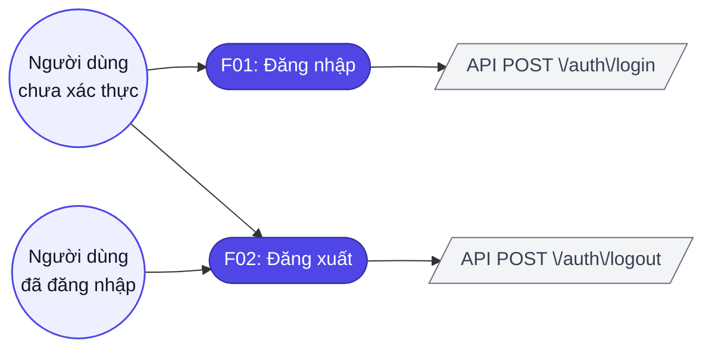
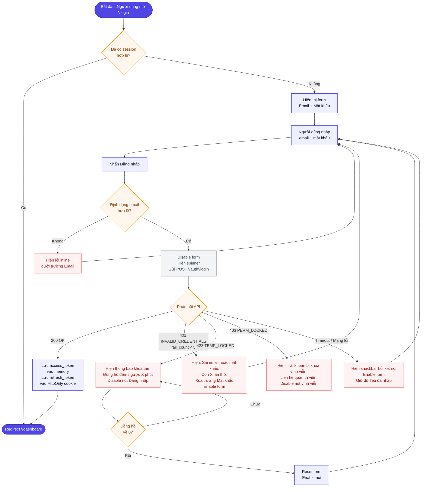
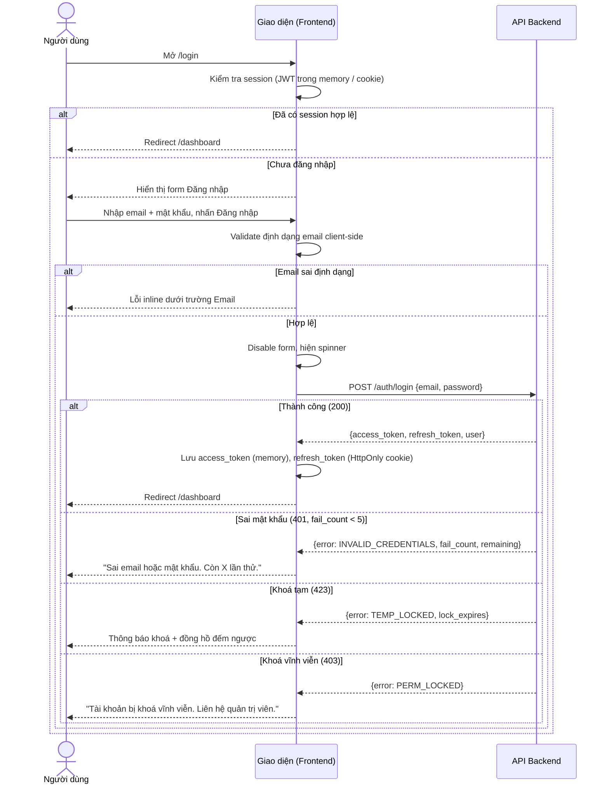
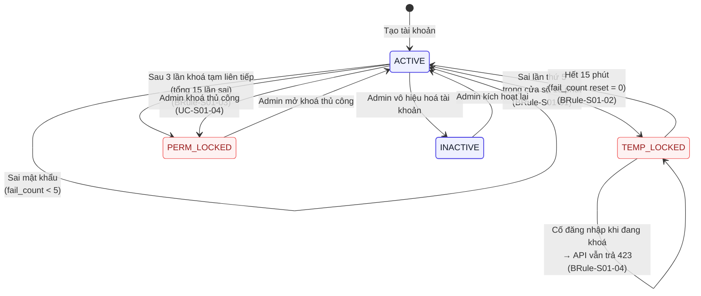
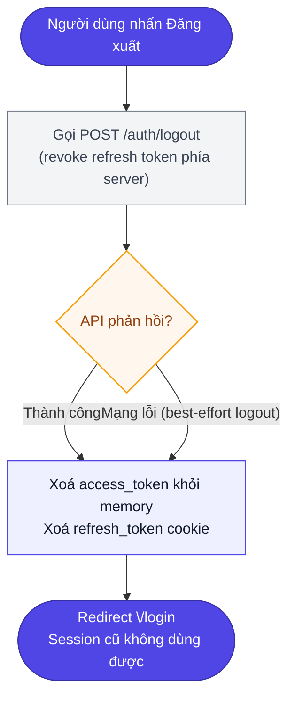
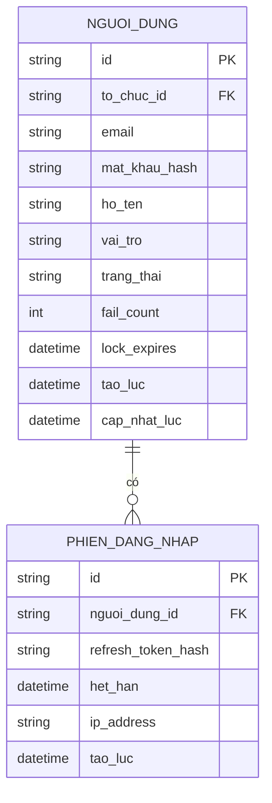

# Đặc tả yêu cầu — Đăng nhập (Mã màn: S01)

## Chức năng & truy vết nguồn
Trace: F01 → FR-01 → BR-03 | F02 → FR-01 → BR-03

## Phạm vi màn

**Màn này lo:** xác thực danh tính bằng email + mật khẩu, bảo vệ chống dò mật khẩu (khoá tạm/vĩnh viễn), tạo và thu hồi phiên đăng nhập, và **chặn điều hướng khi tài khoản còn cờ buộc đổi mật khẩu** (`CR-02`).

**Màn này KHÔNG lo** *(nêu nơi xử lý thay)*:
- Tạo tài khoản mới — *thuộc `S06` Đăng ký (`F12`)*.
- **Đổi mật khẩu** (kể cả lúc bị buộc đổi) — *form đổi nằm ở `S04` Hồ sơ cá nhân (`R-S04-14`); S01 chỉ chặn đường ra*.
- Cấp/thu hồi tài khoản, mở khoá tài khoản `PERM_LOCKED` — *thuộc `S05` Tổ chức (`F13`), thao tác của Org Admin*.
- "Quên mật khẩu" tự phục vụ — *ngoài phạm vi giai đoạn 1 (`00-vision.md` §4); Admin reset thủ công*.

## Tác nhân & hệ thống ngoài

| Tác nhân | Loại | Vai trò ở màn này | Trong phạm vi? |
|----------|------|-------------------|----------------|
| Người dùng chưa xác thực (mọi vai trò) | người | Nhập email + mật khẩu để vào hệ thống | Có |
| Người dùng đã đăng nhập | người | Đăng xuất phiên hiện tại (`F02`) | Có |
| Org Admin | người | Mở khoá tài khoản `PERM_LOCKED`, cấp mật khẩu tạm | Không — *thao tác ở `S05`, ngoài luồng của màn này* |
| API Backend (nội bộ) | hệ thống | Xác thực thông tin, cấp/thu hồi token, đếm số lần sai | Có |

> Màn này **không gọi hệ thống của bên thứ ba** (giai đoạn 1 không có OAuth/SSO — `00-vision.md` §4).

## Yêu cầu chức năng (Functional)

| Mã | Yêu cầu (hệ thống phải...) | Trace F/FR | Nguồn | Lý do (rationale) | Acceptance criteria (đo được) | Kiểm chứng | Ưu tiên |
|----|----------------------------|------------|-------|-------------------|-------------------------------|-----------|---------|
| R-S01-01 | Hiển thị form đăng nhập với trường Email và Mật khẩu khi người dùng chưa xác thực | F01 / FR-01 | brainstorm §3 bước 1–2 | Đây là điểm vào duy nhất của ứng dụng; người dùng cần ô nhập để xác thực danh tính (F01) | Form xuất hiện với 2 trường input và nút Đăng nhập; không yêu cầu thông tin khác | demonstration | Must |
| R-S01-02 | Xác thực email theo định dạng RFC 5321 client-side khi người dùng rời khỏi trường email | F01 / FR-01 | brainstorm §5 (giới hạn field) | Bắt lỗi định dạng sớm phía client để phản hồi tức thì và tránh gọi API vô ích | Nhập sai định dạng (thiếu @, thiếu domain) → thông báo lỗi inline xuất hiện ngay; không gửi API | test | Must |
| R-S01-03 | Gửi thông tin đăng nhập đến API POST /auth/login và nhận token khi nhấn nút Đăng nhập | F01 / FR-01 | brainstorm §3 bước 2 | Xác thực thật do backend làm; màn phải gửi thông tin và hiện trạng thái chờ để người dùng biết hệ đang xử lý | API được gọi đúng 1 lần; nút chuyển sang trạng thái loading; cả 2 trường bị disable | test | Must |
| R-S01-04 | Chuyển hướng về Dashboard (hoặc URL gốc trước redirect) sau khi API trả về 200 thành công | F01 / FR-01 | brainstorm §3 bước 2–3 | Đưa người dùng vào việc ngay sau khi xác thực, giữ mạch thao tác (về đúng URL họ định tới) | Trong vòng 300ms sau response 200, trình duyệt điều hướng về route đích | test | Must |
| R-S01-05 | Hiển thị thông báo "Sai email hoặc mật khẩu. Còn [X] lần thử." khi API trả về 401 và fail_count < 5 | F01 / FR-01 | brainstorm §4.1 bảng state + §5 wording | Cho người dùng biết còn mấy lần thử trước khi bị khoá, giảm hoảng loạn; phục vụ chống dò mật khẩu (BR-03) | Thông báo xuất hiện dưới form; X = 5 − fail_count; trường Mật khẩu bị xoá; Email giữ nguyên | test | Must |
| R-S01-06 | Hiển thị thông báo khoá tạm và đồng hồ đếm ngược khi API trả về 423 (TEMP_LOCKED) | F01 / FR-01 | brainstorm §4.1 (5 lần / 15 phút) | Khoá tạm là cơ chế chống brute force; đồng hồ cho người dùng biết khi nào thử lại được | Thông báo "Tài khoản đang bị khoá. Vui lòng thử lại sau [X] phút [Y] giây." + đồng hồ đếm thời gian thực; nút Đăng nhập disable | test | Must |
| R-S01-07 | Hiển thị thông báo khoá vĩnh viễn khi API trả về 403 (PERM_LOCKED) | F01 / FR-01 | brainstorm §4.1 (khoá vĩnh viễn) | Khoá vĩnh viễn chặn triệt để tài khoản bị tấn công kéo dài; phải chỉ đường liên hệ admin vì người dùng không tự thoát | Thông báo "Tài khoản của bạn bị khoá vĩnh viễn. Liên hệ quản trị viên để được hỗ trợ." xuất hiện; nút Đăng nhập disable | test | Must |
| R-S01-08 | *(CR-05)* Redirect về Dashboard nếu người dùng đã có **session hợp lệ** — nghĩa là access token còn hạn trong bộ nhớ, **hoặc** cookie `refresh_token` còn hạn và chưa quá 7 ngày không hoạt động (`BRule-S01-06`), vì tab mới luôn có bộ nhớ trống nên chỉ xét access token là sai — và cố mở /login — **trừ khi** cờ `phai_doi_mat_khau = true`, khi đó đi màn đổi mật khẩu theo `R-S01-11` (xem luật ưu tiên ở `BRule-S01-07`) | F01 / FR-01 | brainstorm §3 bước 1 (gating) | Tránh hiển thị lại form cho người đã có phiên hợp lệ — bớt bước thừa | Mở /login khi có JWT hợp lệ **và không có cờ đổi mật khẩu** → redirect /dashboard trong vòng 100ms, form không hiện; nếu còn cờ `phai_doi_mat_khau = true` → redirect màn đổi mật khẩu, **không** vào /dashboard | test | Must |
| R-S01-09 | Cho phép người dùng đăng xuất từ bất kỳ màn hình nào; revoke session và redirect về /login | F02 / FR-01 | brainstorm §2 (điểm vào/ra) | Cho phép kết thúc phiên an toàn từ mọi nơi để bảo vệ tài khoản trên thiết bị dùng chung | Gọi POST /auth/logout; **xoá access token khỏi memory và xoá cookie `refresh_token`** (dự án không dùng localStorage — xem §Dữ liệu lưu client); redirect /login; session cũ không dùng được | test | Must |
| R-S01-10 | Toggle hiển thị/ẩn nội dung trường Mật khẩu qua icon mắt | F01 / FR-01 | design-spec (đề xuất UX) | Giúp người dùng kiểm tra mật khẩu đã gõ đúng chưa, giảm lỗi nhập sai | Nhấn icon mắt → chuyển giữa type="password" và type="text"; icon đổi trạng thái tương ứng | demonstration | Should |
| R-S01-11 | *(CR-02)* Khi API trả `phai_doi_mat_khau = true`, buộc người dùng sang màn đổi mật khẩu **trước khi vào bất kỳ màn nào khác**; chặn ở tầng điều hướng, không chỉ ở màn đăng nhập | F01 / FR-01 | **`CR-02`** (đã duyệt) | Không để mật khẩu tạm mà Org Admin biết tồn tại lâu trên tài khoản người khác (BR-03) | Đăng nhập bằng mật khẩu tạm chưa đổi → không vào được `/dashboard` (kể cả gõ URL trực tiếp); chỉ tới được form đổi mật khẩu; đổi thành công (`PATCH /users/me/password` xoá cờ) → mới vào được các màn khác. Trace `CR-02`, `BR-03` | test | Must |

## Yêu cầu phi chức năng (Non-functional)

| Mã | Loại | Yêu cầu đo được | Trace |
|----|------|-----------------|-------|
| R-S01-N01 | Bảo mật | API /auth/login phản hồi HTTP 429 khi cùng IP gửi > 20 request/phút (rate limit ở tầng API) | NFR-02 / BR-03 |
| R-S01-N02 | Bảo mật | Mật khẩu không bao giờ log ra console hay gửi trong URL; chỉ gửi qua HTTPS trong request body | NFR-02 / BR-03 |
| R-S01-N03 | Hiệu năng | Thời gian từ nhấn nút Đăng nhập đến khi redirect Dashboard ≤ 2 giây ở điều kiện mạng bình thường | NFR-01 / BR-01 |
| R-S01-N04 | Khả năng sử dụng | Thứ tự focus mặc định: Email → Mật khẩu → **icon mắt (`R-S01-10`)** → Nút Đăng nhập (Tab key); nhấn Enter trong trường Mật khẩu = submit. Icon mắt là element tương tác nên **phải** nằm trong tab order — `design-spec` §8 đòi focus visible trên mọi element tương tác (`G72`) | NFR-05 / BR-04 |
| R-S01-N05 | Khả năng tiếp cận | Tất cả trường input và thông báo lỗi có label/aria-label rõ ràng; tương phản màu nền/chữ ≥ 4.5:1 | NFR-07 / BR-01 |

## Quy tắc nghiệp vụ

| Mã | Quy tắc | Kích hoạt khi | Trace |
|----|---------|---------------|-------|
| BRule-S01-01 | Khoá tài khoản tạm thời sau **5 lần nhập sai** trong cửa sổ **15 phút** (tính từ lần sai đầu tiên). Thời gian khoá tạm: **15 phút** | `fail_count` của một tài khoản đạt 5 trong cửa sổ 15 phút | R-S01-06 / NFR-03 |
| BRule-S01-02 | Hết thời gian khoá tạm thì `fail_count` reset về 0 — người dùng thử lại từ đầu. **`so_lan_khoa_tam` KHÔNG reset ở đây** (`G67`): nó đếm số chu kỳ khoá liên tiếp cho `BRule-S01-03`, reset cùng lúc thì luật 3-lần-khoá không bao giờ đạt tới | Đồng hồ khoá tạm về 0 (`lock_expires <= now`) | R-S01-06 |
| BRule-S01-03 | Sai tiếp khi `so_lan_khoa_tam = 3` (**3 lần khoá tạm liên tiếp**) → khoá vĩnh viễn cho tới khi Admin mở thủ công. `so_lan_khoa_tam` tăng 1 mỗi lần vào `TEMP_LOCKED`, về 0 khi đăng nhập thành công hoặc Admin mở khoá. **Mốc là lần sai thứ 16**: 5+5+5 lần sai gây 3 lần khoá tạm (`BRule-S01-01`), lần sai TIẾP THEO mới khoá vĩnh viễn. Lần thứ 15 vẫn là khoá tạm — nếu đặt mốc ở 15 thì cùng một sự kiện vừa trả `423` vừa trả `403` | Lần sai đầu tiên **sau khi** chu kỳ khoá tạm thứ 3 kết thúc (lần sai thứ 16) | R-S01-07 |
| BRule-S01-04 | Tài khoản khoá tạm **không đăng nhập được dù nhập đúng mật khẩu** trong thời gian khoá | Có yêu cầu đăng nhập vào tài khoản đang `TEMP_LOCKED` | R-S01-06 |
| BRule-S01-05 | Thông báo luôn là "Sai email hoặc mật khẩu" — không phân biệt email không tồn tại hay sai mật khẩu (chống user enumeration). **Ngoại lệ có ý thức:** khi tài khoản đang `TEMP_LOCKED`/`PERM_LOCKED` thì hiện thông báo khoá (`E-S01-05`/`E-S01-06`) — người dùng hợp lệ cần biết vì sao không vào được. **⚠️ Xung đột CHƯA giải quyết:** `TC-S01-21` cho thấy tài khoản `PERM_LOCKED` trả `403` ngay ở **request đầu tiên với mật khẩu bất kỳ** — tức dò tài khoản chỉ tốn **1 request**, không hề đắt. Hai lựa chọn (đều là quyết định nghiệp vụ, phải mở `CR`): *(a)* giữ thông báo chung cho mọi trường hợp, người dùng bị khoá không biết vì sao; *(b)* chấp nhận kênh dò này và ghi thành rủi ro đã chấp nhận đủ bốn vế. **Chưa chốt — đừng viết code theo bên nào** | Mọi lần đăng nhập thất bại do sai thông tin | R-S01-05 / NFR-02 |
| BRule-S01-06 | *(CR-04)* Access token hết hạn sau **8 giờ**, refresh token **30 ngày**; hết hạn access token thì dùng refresh token lấy token mới (silent refresh). **Phiên kết thúc khi chạm MỘT trong hai mốc, tuỳ mốc nào đến trước: (a) 7 ngày không hoạt động** — `POST /auth/refresh` chỉ cấp token mới nếu `lan_dung_cuoi` cách hiện tại **≤ 7 ngày**, quá thì trả `401` và thu hồi refresh token (`E-S01-12`); **(b) trần tuyệt đối 30 ngày** kể từ lần đăng nhập bằng mật khẩu — hoạt động đều cũng không gia hạn quá mốc này. Con số 8 giờ là tuổi thọ **access token**, KHÔNG phải tuổi thọ phiên — nhầm hai thứ này chính là gốc của `G66`. **Đăng xuất thu hồi refresh token VÀ đưa `jti` của access token vào danh sách chặn phía server tới khi nó hết hạn tự nhiên** — nên token cũ dùng lại nhận `401` ngay. Không có danh sách chặn thì `R-S01-09`, `UC-S01-06` và `GWT-12` đều không thoả | Access token quá 8 giờ kể từ lúc cấp · hoặc `lan_dung_cuoi` quá 7 ngày · hoặc phiên quá 30 ngày kể từ lúc đăng nhập | R-S01-03 / NFR-02 / CR-04 |
| BRule-S01-08 | Tài khoản `INACTIVE` **không đăng nhập được** bằng bất kỳ mật khẩu nào; API trả `403` với mã phân biệt được với `PERM_LOCKED`. Trạng thái này chỉ Admin đặt và chỉ Admin gỡ — người dùng không có thao tác tự thoát | Đăng nhập vào tài khoản `INACTIVE` | R-S01-07 / E-S01-13 |
| BRule-S01-07 | *(CR-02)* Tài khoản có `phai_doi_mat_khau = true` đăng nhập thành công nhưng **bị giữ ở trạng thái "buộc đổi mật khẩu"** — mọi điều hướng tới màn khác bị chặn cho tới khi đổi xong. Bảo vệ `BR-03`: mật khẩu tạm mà Org Admin biết không được tồn tại lâu trên tài khoản người khác. Đường gỡ cờ **duy nhất** là `PATCH /users/me/password` (`R-S04-14`). *(CR-05)* **Luật ưu tiên:** khi luật này và `R-S01-08` cùng áp (người có phiên hợp lệ mở `/login` mà còn cờ), **luật này thắng** — CR-02 sinh ra chính để bịt đường đó, để `R-S01-08` thắng là vô hiệu hoá nó | Đăng nhập thành công mà cờ `phai_doi_mat_khau` còn `true` | R-S01-11 / CR-02 / BR-03 |

## Bảng mô tả chi tiết phần tử màn hình
| # | Tên phần tử | Control type | Data Type | Bắt buộc | Mô tả | Trace |
|---|-------------|--------------|-----------|----------|-------|-------|
| 1 | Logo & tên sản phẩm | Label | String | — | Nhận diện thương hiệu TeamTasks | R-S01-01 |
| 2 | Email | Input | String | Có | Email đăng nhập của tài khoản công ty | R-S01-02 |
| 3 | Mật khẩu | Input | String | Có | Mật khẩu; hiển thị dạng chấm tròn | R-S01-03 |
| 4 | Hiện/ẩn mật khẩu | Button | Action | — | Bật tắt hiển thị mật khẩu dạng chữ | R-S01-10 |
| 5 | Thông báo lỗi đăng nhập | Label | String | — | Sai thông tin + số lần thử còn lại; chỉ hiện khi có lỗi | R-S01-05 |
| 6 | Đăng nhập | Button | Action | — | Gửi thông tin đăng nhập; disable + spinner khi đang gọi API | R-S01-03 |
| 7 | Cảnh báo khoá tạm thời | Label | String | — | Tài khoản bị khoá kèm đồng hồ đếm ngược | R-S01-06 |
| 8 | Cảnh báo khoá vĩnh viễn | Label | String | — | Tài khoản bị khoá vĩnh viễn, hướng dẫn liên hệ quản trị | R-S01-07 |
| 9 | Chân trang phiên bản | Label | String | — | Phiên bản ứng dụng và bản quyền | R-S01-01 |

## Yêu cầu dữ liệu

- **Đầu vào:**
  - `email`: chuỗi, định dạng RFC 5321, tối đa 254 ký tự, bắt buộc
  - `password`: chuỗi, 8–128 ký tự, bắt buộc
- **Đầu ra (khi thành công):**
  - `access_token`: JWT chuỗi, hết hạn sau 8 giờ
  - `refresh_token`: chuỗi opaque, hết hạn sau 30 ngày (trần tuyệt đối); *(CR-04)* chỉ đổi được token mới khi `lan_dung_cuoi` ≤ 7 ngày
  - `user.id`, `user.ho_ten`, `user.email`, `user.vai_tro`, `user.to_chuc_id`
- **Dữ liệu lưu client:**
  - Access token: memory (không localStorage)
  - Refresh token: HttpOnly cookie (không truy cập JS)

## Ma trận lỗi

| Mã | Lỗi | Xảy ra khi | Mức | Trace | Người dùng thấy gì | Lối thoát |
|----|-----|-----------|-----|-------|--------------------|-----------|
| E-S01-01 | Email sai định dạng | Rời trường Email với giá trị không đúng RFC 5321 (thiếu `@`, thiếu domain). **Khoảng trắng đầu/cuối được cắt (trim) TRƯỚC khi kiểm** nên không tính là sai định dạng — khớp `design-spec` §6 và `TC-S01-03` | minor | R-S01-02 | Lỗi inline ngay dưới ô Email: "Vui lòng nhập địa chỉ email hợp lệ."; **không gọi API** | Sửa lại email tại chỗ |
| E-S01-02 | Thiếu trường bắt buộc | Bấm Đăng nhập khi Email hoặc Mật khẩu rỗng | minor | R-S01-01 | Lỗi inline "Vui lòng nhập địa chỉ email hợp lệ." hoặc "Trường này là bắt buộc."; không gọi API | Điền nốt trường còn thiếu |
| E-S01-03 | Email vượt độ dài cho phép | Nhập email dài hơn 254 ký tự | minor | R-S01-02 | Chặn nhập từ ký tự thứ 255, hoặc báo "Email tối đa 254 ký tự"; không gọi API | Rút ngắn email |
| E-S01-04 | Mật khẩu ngoài khoảng 8–128 ký tự | Nhập mật khẩu < 8 hoặc > 128 ký tự | minor | R-S01-01 | Chặn, không gọi API. **Hai thông báo riêng:** `< 8` → "Mật khẩu tối thiểu 8 ký tự"; `> 128` → "Mật khẩu tối đa 128 ký tự" (khớp `TC-S01-13`/`TC-S01-14`) | Nhập lại đúng độ dài |
| E-S01-05 | Sai email hoặc mật khẩu | API trả 401 `INVALID_CREDENTIALS` và `fail_count < 5` | major | R-S01-05 / BRule-S01-05 / UE-01 | "Sai email hoặc mật khẩu. Còn [X] lần thử." dưới form; ô Mật khẩu bị xoá, Email giữ nguyên | Nhập lại; còn `X` lần trước khi bị khoá tạm |
| E-S01-06 | Tài khoản bị khoá tạm | Sai lần thứ 5 trong 15 phút, **hoặc** đăng nhập vào tài khoản đang `TEMP_LOCKED` (kể cả mật khẩu đúng) | major | R-S01-06 / BRule-S01-01, BRule-S01-04 / UE-01 | "Tài khoản đang bị khoá. Vui lòng thử lại sau [X] phút [Y] giây." + đồng hồ đếm ngược; nút Đăng nhập disable | **Chờ hết 15 phút** — hệ thống tự mở, `fail_count` reset về 0 |
| E-S01-07 | Tài khoản bị khoá vĩnh viễn | Sai tiếp sau 3 lần khoá tạm liên tiếp (tổng 15 lần sai) | blocker | R-S01-07 / BRule-S01-03 / UE-02 | "Tài khoản của bạn bị khoá vĩnh viễn. Liên hệ quản trị viên để được hỗ trợ."; nút Đăng nhập disable vĩnh viễn | **Liên hệ Org Admin mở khoá thủ công** (thao tác ở `S05`) — người dùng không tự thoát được |
| E-S01-08 | Mất kết nối khi đang đăng nhập | Mạng ngắt giữa lúc gọi `POST /auth/login` | major | R-S01-03 / UE-05 | Snackbar "Lỗi kết nối. Vui lòng thử lại."; **form giữ nguyên nội dung đã nhập**; nút Đăng nhập enable lại | Bấm Đăng nhập lại khi có mạng — không mất dữ liệu đã gõ |
| E-S01-09 | Vượt hạn mức gọi API từ một IP | Cùng IP gửi > 20 request/phút tới `/auth/login` | major | R-S01-N01 / NFR-02 | Request thứ 21 trở đi nhận HTTP 429 Too Many Requests | Chờ hết cửa sổ 1 phút rồi thử lại |
| E-S01-10 | Mất kết nối khi đăng xuất | Mạng ngắt lúc gọi `POST /auth/logout` | minor | R-S01-09 | Vẫn xoá token phía client và redirect `/login` — logout "best-effort" hoàn tất | Không cần làm gì; phiên phía server hết hạn theo `BRule-S01-06` |
| E-S01-13 | Tài khoản đã bị vô hiệu hoá | Đăng nhập vào tài khoản ở trạng thái `INACTIVE` (Admin vô hiệu hoá — xem sơ đồ trạng thái) | blocker | R-S01-07 / BRule-S01-08 / UE-02 | Thông báo **"Tài khoản của bạn đã bị vô hiệu hoá. Liên hệ quản trị viên để được hỗ trợ."**; nút Đăng nhập disable. Phân biệt với `E-S01-07` (khoá vĩnh viễn do sai mật khẩu) — cùng lối thoát nhưng khác nguyên nhân, người dùng cần biết mình không làm gì sai | Liên hệ Org Admin kích hoạt lại (`INACTIVE → ACTIVE`) |
| E-S01-12 | Phiên đăng nhập hết hạn | *(CR-04)* `POST /auth/refresh` trả `401` — quá **7 ngày không hoạt động**, hoặc chạm trần **30 ngày**, hoặc refresh token đã bị thu hồi (đăng xuất ở thiết bị khác) | major | BRule-S01-06 / R-S01-08 / CR-04 / UE-04 | Thông báo **"Phiên đăng nhập đã hết hạn. Vui lòng đăng nhập lại."** trên form đăng nhập; xoá token phía client và về `/login`. Đây là nguồn cho microcopy `design-spec` §5 (trước đó không có `E-S01-*` nào đỡ) | Đăng nhập lại bằng email + mật khẩu |
| E-S01-11 | Cố vào màn khác khi đang bị buộc đổi mật khẩu | Có cờ `phai_doi_mat_khau = true` mà điều hướng tới màn bất kỳ (kể cả gõ URL trực tiếp) | major | R-S01-11 / BRule-S01-07 / CR-02 | Bị đưa lại form đổi mật khẩu; **không màn nào khác render dù một khung hình** | Đổi mật khẩu thành công (`R-S04-14`) — đây là đường ra **duy nhất** |

## Phụ thuộc ngoài

| Phụ thuộc | Ai sở hữu | Chặn gì nếu chưa sẵn sàng |
|-----------|-----------|---------------------------|
| API `POST /auth/login` · `POST /auth/logout` (`06-api-spec.md`) | Đội backend nội bộ | Toàn bộ màn không hoạt động — không đăng nhập lẫn đăng xuất được |
| Cơ chế mở khoá tài khoản `PERM_LOCKED` ở `S05` (`F13`) | Org Admin (nghiệp vụ) | Người dùng dính `E-S01-07` **không có đường thoát** — kẹt vĩnh viễn |
| Màn đổi mật khẩu `S04` (`R-S04-14`) | Cùng dự án — `S04` | Người dùng dính `E-S01-11` không thoát được cờ buộc đổi (`CR-02`) |

*(Màn không phụ thuộc dịch vụ của bên thứ ba nào — giai đoạn 1 không có OAuth/SSO.)*

## Giả định & Ràng buộc

> 29148 tách **giả định** (điều ta *tin là đúng* nhưng chưa xác nhận — sai thì yêu cầu lung lay) khỏi **ràng buộc** (giới hạn *bắt buộc tuân*, không thương lượng). Khác "Phụ thuộc ngoài" (thứ bên khác *sở hữu* mà màn cần).

**Giả định** *(mỗi cái trạng thái `Đề xuất → Đã xác nhận / Đã sửa / Đã bỏ / 🔓 Chấp nhận rủi ro`; còn `⚠️ chưa xác nhận` → `ba-review` chấm 🟠, `Mốc = ba-build`)*

| Mã | Giả định | Vì sao cần | Ảnh hưởng nếu sai | Trạng thái |
|----|----------|-----------|-------------------|-----------|
| — | Không có giả định riêng của màn — tiền đề về khoá/đổi mật khẩu tạm đã thành quy tắc (`BRule-S01-*`) hoặc thuộc màn `S05` (`GĐ-S05-02`) | — | — | — |

**Ràng buộc** *(giới hạn bắt buộc — không phải BRule/NFR)*

| Mã | Ràng buộc | Nguồn | Ảnh hưởng tới thiết kế màn |
|----|-----------|-------|----------------------------|
| RB-S01-01 | Giai đoạn 1 chỉ xác thực bằng email + mật khẩu, không OAuth/SSO/đăng nhập bên thứ ba | `00-vision.md` §4 (phạm vi giai đoạn 1) — đã nêu trong "Tác nhân & hệ thống ngoài" và "Phụ thuộc ngoài" | Màn chỉ có form email + mật khẩu; không nút "đăng nhập với Google/SSO", không luồng liên kết tài khoản ngoài |

## Quét yêu cầu ngầm

> 9 chiều không ai viết ra cho tới khi hỏng — mỗi chiều rơi vào mã đã viết ở trên, `n/a — lý do`, hoặc câu hỏi mở `OQ-S01-..` (template `ba-screen-spec`, soát bởi `ba-feasible` luật 9).

| Chiều | Rơi vào đâu |
|-------|-------------|
| Kiểm dữ liệu vào | `R-S01-02` · `E-S01-01` · `E-S01-04` — định dạng/độ dài email và mật khẩu, kiểm phía client trước khi gọi API |
| Kiểu hỏng | `E-S01-08` · `E-S01-10` — mất kết nối giữa lúc đăng nhập (giữ nội dung form) và lúc đăng xuất (best-effort) |
| Gửi lặp / thử lại | `R-S01-03` — API gọi đúng 1 lần, nút và hai trường disable khi đang chờ nên bấm lặp không sinh request thứ hai |
| Phân quyền | `BRule-S01-08` · `E-S01-11` — tài khoản `INACTIVE` không vào được; còn cờ buộc đổi mật khẩu thì mọi màn khác bị chặn |
| Đồng thời / thứ tự | `OQ-S01-01` |
| Vòng đời dữ liệu | `BRule-S01-02` · `BRule-S01-06` — `fail_count` reset khi hết khoá tạm; access 8 giờ · refresh 7 ngày không hoạt động / trần 30 ngày |
| Hệ ngoài chết | n/a — màn không gọi hệ thống của bên thứ ba (`RB-S01-01`: giai đoạn 1 không OAuth/SSO); backend nội bộ không phản hồi đã nằm ở chiều Kiểu hỏng |
| Chuyển trạng thái | `BRule-S01-01` · `BRule-S01-03` — `ACTIVE → TEMP_LOCKED → PERM_LOCKED` và điều kiện từng bước |
| Quan sát / log | `R-S01-N02` (cấm ghi mật khẩu vào log) · `OQ-S01-02` (ghi vết lần khoá cho quản trị) |

**Câu hỏi mở từ quét**

| Mã | Câu hỏi | Chiều | Ai trả lời |
|----|---------|-------|-----------|
| OQ-S01-01 | Hai lần sai mật khẩu tới gần như cùng lúc (hai tab/hai thiết bị) có được đếm đủ cả hai vào `fail_count` không — tức lần sai thứ 5 và thứ 6 đồng thời thì cả hai nhận `423`, hay một cái lọt thành `401`? `BRule-S01-01` chỉ nói "đạt 5", không nói thứ tự | Đồng thời / thứ tự | PO + đội backend |
| OQ-S01-02 | Khi tài khoản vào `TEMP_LOCKED`/`PERM_LOCKED`, có cần ghi vết (ai, lúc nào, từ IP nào) để Org Admin tra lúc mở khoá ở `S05` không? Hiện không yêu cầu nào nói tới | Quan sát / log | PO + Org Admin |

## Sơ đồ luồng (Flow)

### 1. Tổng quan tác nhân ↔ chức năng (Use case)

### 2. Quy trình đăng nhập — nhánh thành công, sai mật khẩu, khoá tạm, khoá vĩnh viễn (Activity)

### 3. Trao đổi người dùng ↔ giao diện ↔ hệ thống khi xác thực (Sequence)

### 4. Trạng thái tài khoản người dùng (State)

### 5. Quy trình đăng xuất (Activity)

## Mô hình dữ liệu màn hình (ERD)

Các thực thể mà màn Đăng nhập (S01) đụng tới: **NguoiDung** (đọc email, mat_khau_hash, trang_thai, fail_count, lock_expires) và **PhienDangNhap** (tạo khi đăng nhập thành công, thu hồi khi đăng xuất).

## Microcopy — câu chữ hiện cho người dùng
> Nguồn cho mục wording của `design-spec.md`. Mỗi câu phải nói rõ **hiện khi nào** và **trace về đâu**: câu chữ đứng một mình trong bản thiết kế thì lúc code không ai biết điều kiện hiển thị, và câu nào hàm ý một luật thì luật đó phải tồn tại ở trên.

| Câu (nguyên văn) | Hiện khi nào | Trace |
|---|---|---|
| `Đang đăng nhập...` | Trong lúc chờ `POST /auth/login` trả về; nút disable, hai trường disable | `R-S01-03` |

## Thuật ngữ
| Thuật ngữ | Giải thích |
|-----------|-----------|
| R-S (yêu cầu cấp màn) | Yêu cầu của riêng màn Đăng nhập (R-S01-01…), truy vết F/FR |
| BRule (Business Rule) | Quy tắc nghiệp vụ áp cho màn (BRule-S01-01…) |
| E-S (lỗi cấp màn) | Một cách màn này hỏng (E-S01-01…) — kèm mức, thông báo nguyên văn và lối thoát |
| fail_count | Bộ đếm số lần nhập sai liên tiếp của một tài khoản |
| TEMP_LOCKED / PERM_LOCKED | Trạng thái khoá tạm thời / khoá vĩnh viễn của tài khoản |
| Phiên (session) | Phiên đăng nhập do server cấp sau khi xác thực thành công |
| Brute force | Tấn công dò mật khẩu bằng cách thử nhiều lần liên tiếp |

> Từ điển đầy đủ toàn dự án: `docs/00-glossary.md`.
