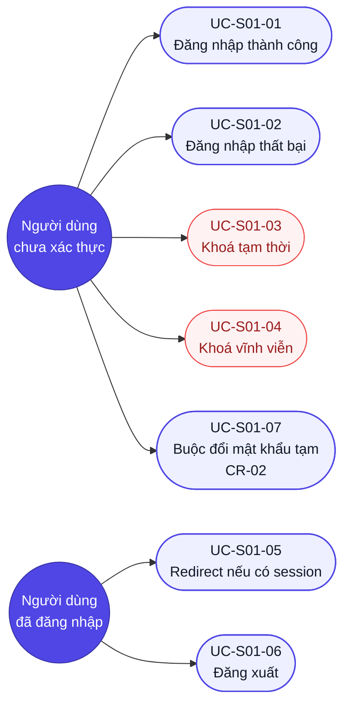

# Use case — Đăng nhập (Mã màn: S01)

## Sơ đồ Use case (tổng quan)
> Tác nhân ↔ use case của màn Đăng nhập. UC khoá tài khoản tô màu lỗi.

---

## UC-S01-01: Đăng nhập thành công
- **Tác nhân (actor):** Người dùng chưa xác thực (Member / Team Lead / Org Admin)
- **Trigger (kích hoạt):** Người dùng mở URL ứng dụng hoặc bị redirect về /login
- **Tiền điều kiện:** Người dùng có tài khoản đang hoạt động (ACTIVE), chưa đăng nhập
- **Luồng chính (happy path):**
  1. Hệ thống hiển thị form đăng nhập với trường Email và Mật khẩu.
  2. Người dùng nhập email hợp lệ vào trường Email.
  3. Người dùng nhập mật khẩu đúng vào trường Mật khẩu.
  4. Người dùng nhấn nút "Đăng nhập" (hoặc nhấn Enter).
  5. Hệ thống validate định dạng email client-side — hợp lệ.
  6. Hệ thống disable nút và trường input, hiển thị spinner.
  7. Hệ thống gửi POST /auth/login với `{email, password}`.
  8. API trả về 200 với access_token, refresh_token, thông tin user.
  9. Hệ thống lưu access_token vào memory, refresh_token vào HttpOnly cookie.
  10. Hệ thống redirect về Dashboard (hoặc URL gốc trước redirect).
- **Luồng thay thế / ngoại lệ:**
  - **[5a] Email sai định dạng:** Hệ thống hiển thị lỗi inline dưới trường Email "Vui lòng nhập địa chỉ email hợp lệ."; không gọi API; quay lại bước 2.
  - **[7a] Mất mạng khi gửi request:** API không phản hồi (timeout 10s); hệ thống hiển thị snackbar "Lỗi kết nối. Vui lòng thử lại."; enable lại form; dữ liệu nhập được giữ nguyên.
  - **[8a] *(CR-02)* Tài khoản buộc đổi mật khẩu:** API trả 200 kèm `phai_doi_mat_khau = true` → chuyển sang **UC-S01-07** thay vì redirect Dashboard.
- **Hậu điều kiện (postcondition):** Người dùng có session hợp lệ; trình duyệt ở Dashboard.
- **Đảm bảo (guarantees):** Thành công — người dùng truy cập được Dashboard; Tối thiểu — không có dữ liệu nhạy cảm bị lộ trong URL hoặc log.
- **Trace:** R-S01-01, R-S01-03, R-S01-04

---

## UC-S01-02: Đăng nhập thất bại — sai mật khẩu (chưa khoá)
- **Tác nhân:** Người dùng
- **Trigger:** Người dùng nhập sai mật khẩu
- **Tiền điều kiện:** Tài khoản ACTIVE, fail_count < 5
- **Luồng chính:**
  1. Người dùng nhập email và mật khẩu sai, nhấn "Đăng nhập".
  2. Hệ thống gửi POST /auth/login.
  3. API trả về 401 với `{error: "INVALID_CREDENTIALS", fail_count: N, remaining: 5-N}`.
  4. Hệ thống hiển thị: "Sai email hoặc mật khẩu. Còn [5-N] lần thử."
  5. Hệ thống xoá nội dung trường Mật khẩu; Email giữ nguyên; focus vào trường Mật khẩu.
  6. Nút Đăng nhập được enable lại.
- **Luồng thay thế / ngoại lệ:** *(không có)*
- **Hậu điều kiện:** fail_count tăng 1; tài khoản vẫn ACTIVE.
- **Đảm bảo:** Thành công — người dùng được thông báo còn X lần; Tối thiểu — mật khẩu đúng/sai không phân biệt được qua thông báo (chống enumeration).
- **Trace:** R-S01-05

---

## UC-S01-03: Tài khoản bị khoá tạm thời
- **Tác nhân:** Người dùng
- **Trigger:** Người dùng nhập sai lần thứ 5 trong 15 phút
- **Tiền điều kiện:** Tài khoản ACTIVE, fail_count = 4 (sắp khoá)
- **Luồng chính:**
  1. Người dùng nhập sai mật khẩu lần 5.
  2. API trả về 423 với `{error: "TEMP_LOCKED", lock_expires: "<ISO timestamp>"}`.
  3. Hệ thống hiển thị: "Tài khoản đang bị khoá. Vui lòng thử lại sau [X] phút [Y] giây."
  4. Đồng hồ đếm ngược thời gian thực xuất hiện bên dưới thông báo.
  5. Nút Đăng nhập bị disable trong toàn bộ thời gian khoá.
  6. Khi đồng hồ về 0: thông báo ẩn, form reset, nút Đăng nhập enable.
- **Luồng thay thế / ngoại lệ:**
  - **[3a] Người dùng thử nhập dù đang khoá (trước khi đồng hồ về 0):** Nút disable nên không thể submit; nếu gọi API trực tiếp (bypass UI), API vẫn trả về 423 với thời gian còn lại.
- **Hậu điều kiện:** Tài khoản chuyển sang TEMP_LOCKED; fail_count không tăng thêm trong thời gian khoá.
- **Đảm bảo:** Thành công — người dùng thấy đồng hồ đếm ngược rõ ràng; Tối thiểu — tài khoản không thể truy cập dù nhập đúng mật khẩu khi đang khoá.
- **Trace:** R-S01-06, BRule-S01-01, BRule-S01-04

---

## UC-S01-04: Tài khoản bị khoá vĩnh viễn
- **Tác nhân:** Người dùng
- **Trigger:** Người dùng cố đăng nhập vào tài khoản đã bị khoá vĩnh viễn
- **Tiền điều kiện:** Tài khoản PERM_LOCKED (do admin khoá hoặc quá 3 lần khoá tạm liên tiếp)
- **Luồng chính:**
  1. Người dùng nhập email và mật khẩu, nhấn "Đăng nhập".
  2. API trả về 403 với `{error: "PERM_LOCKED"}`.
  3. Hệ thống hiển thị: "Tài khoản của bạn bị khoá vĩnh viễn. Liên hệ quản trị viên để được hỗ trợ."
  4. Nút Đăng nhập bị disable vĩnh viễn (người dùng không thể thử lại).
- **Luồng thay thế / ngoại lệ:** *(không có)*
- **Hậu điều kiện:** Giao diện hiển thị thông báo khoá cố định.
- **Đảm bảo:** Tối thiểu — người dùng biết cần liên hệ admin; không có thông tin kỹ thuật lộ ra.
- **Trace:** R-S01-07, BRule-S01-03

---

## UC-S01-05: Redirect khi đã có session hợp lệ
- **Tác nhân:** Người dùng đã đăng nhập
- **Trigger:** Người dùng gõ /login trực tiếp hoặc nhấn Back sau khi đăng nhập
- **Tiền điều kiện:** Có JWT hợp lệ trong bộ nhớ / refresh token còn hiệu lực trong cookie
- **Luồng chính:**
  1. Trình duyệt tải /login.
  2. Hệ thống kiểm tra session — còn hiệu lực.
  3. Hệ thống redirect về /dashboard ngay lập tức (không render form).
- **Luồng ngoại lệ:**
  - **[2a] Session hợp lệ nhưng còn cờ `phai_doi_mat_khau = true`** *(CR-05)*: hệ thống redirect về **màn đổi mật khẩu** (`S04`, `R-S04-14`), **không** về /dashboard. `R-S01-11`/`BRule-S01-07` ưu tiên cao hơn `R-S01-08`; người dùng chỉ ra khỏi trạng thái này bằng cách đổi mật khẩu.
- **Hậu điều kiện:** Người dùng ở Dashboard mà không thấy form Login — hoặc ở màn đổi mật khẩu nếu còn cờ.
- **Trace:** R-S01-08, R-S01-11 *(CR-05)*

---

## UC-S01-06: Đăng xuất
- **Tác nhân:** Người dùng đã đăng nhập
- **Trigger:** Người dùng nhấn "Đăng xuất" từ bất kỳ màn hình nào
- **Tiền điều kiện:** Có session hợp lệ
- **Luồng chính:**
  1. Người dùng nhấn nút "Đăng xuất" trong header/menu.
  2. Hệ thống gửi POST /auth/logout (revoke refresh token phía server).
  3. Hệ thống xoá access_token khỏi memory, xoá refresh token cookie.
  4. Hệ thống redirect về /login.
- **Luồng thay thế / ngoại lệ:**
  - **[2a] Mất mạng khi gọi /logout:** Hệ thống vẫn xoá token client-side và redirect /login (logout "best-effort"). *(CR-04)* Phía server refresh token **chưa bị thu hồi** — nó tự hết hiệu lực khi chạm mốc gần nhất trong hai mốc của `BRule-S01-06`: **7 ngày không hoạt động** hoặc **trần 30 ngày**. Câu cũ ghi "hết hạn tự nhiên sau 8 giờ" là nhầm tuổi thọ access token thành tuổi thọ phiên (`G66`).
- **Hậu điều kiện:** Session đã được thu hồi; người dùng không thể dùng token cũ để truy cập API.
- **Trace:** R-S01-09

---

## UC-S01-07: Buộc đổi mật khẩu tạm ở lần đăng nhập đầu *(CR-02)*
- **Tác nhân:** Người dùng mới được Org Admin mời (đăng nhập bằng mật khẩu tạm)
- **Trigger:** Đăng nhập thành công nhưng `phai_doi_mat_khau = true` (từ UC-S01-01 [8a])
- **Tiền điều kiện:** Tài khoản ACTIVE, `phai_doi_mat_khau = true` (chưa đổi mật khẩu tạm lần nào)
- **Luồng chính:**
  1. API `/auth/login` trả 200 kèm `phai_doi_mat_khau = true`.
  2. Hệ thống **không** redirect Dashboard; chuyển thẳng tới màn/form đổi mật khẩu bắt buộc.
  3. Hệ thống chặn mọi điều hướng khác: gõ URL `/dashboard` hay bất kỳ màn nào đều bị đưa lại form đổi mật khẩu (`BRule-S01-07`).
  4. Người dùng nhập mật khẩu mới hợp lệ (tái dùng bộ ràng buộc + form đổi mật khẩu của **S04**, `R-S04-N02`) và xác nhận.
  5. Hệ thống gửi `PATCH /users/me/password`.
  6. API trả 200, **xoá cờ** `phai_doi_mat_khau = false`.
  7. Hệ thống mở khoá điều hướng và đưa người dùng vào Dashboard.
- **Luồng thay thế / ngoại lệ:**
  - **[4a] Mật khẩu mới không đạt luật hoặc trùng mật khẩu tạm:** báo lỗi tại chỗ như S04 (`BRule-S04-05`); cờ **giữ nguyên** `true`, vẫn bị chặn.
  - **[3a] Người dùng cố thoát bằng URL trực tiếp:** tầng điều hướng chặn, đưa lại form (không có đường vòng). *(Trước ghi nhầm `[5a]` — bước 5 là gửi `PATCH`, không liên quan điều hướng.)*
  - **[3b] Đăng xuất giữa chừng:** cho phép logout; lần đăng nhập sau vẫn `phai_doi_mat_khau = true` → lại rơi vào use case này. *(Trước ghi nhầm `[3a]`, trùng nhãn với ca trên.)*
- **Hậu điều kiện:** Mật khẩu tạm bị thay bằng mật khẩu người dùng tự đặt; cờ `phai_doi_mat_khau = false`; Org Admin không còn biết mật khẩu hiện hành (bảo vệ `BR-03`).
- **Đảm bảo:** Thành công — người dùng vào được hệ thống với mật khẩu riêng; Tối thiểu — không màn nào ngoài form đổi mật khẩu truy cập được khi cờ còn `true`.
- **Trace:** R-S01-11, BRule-S01-07, R-S04-14, CR-02
