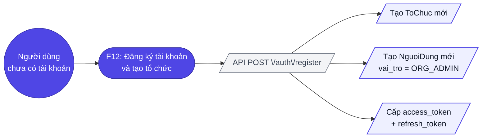
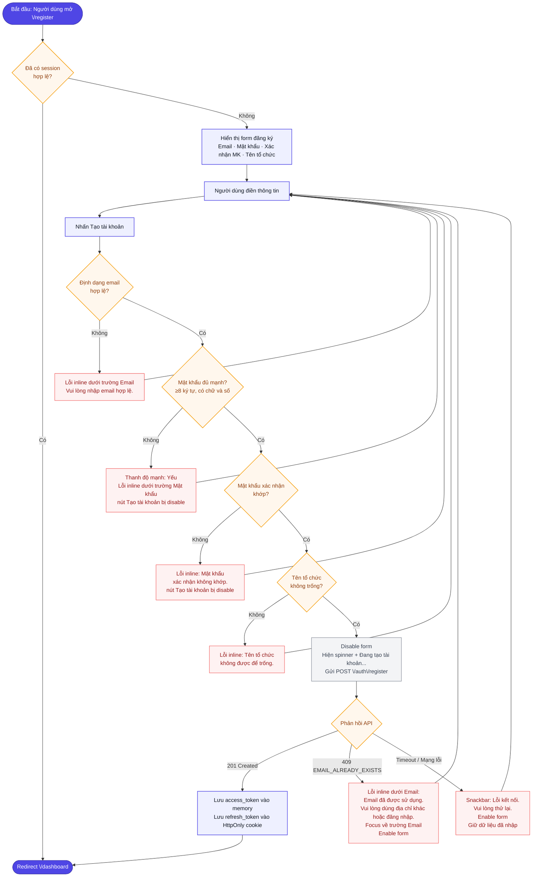
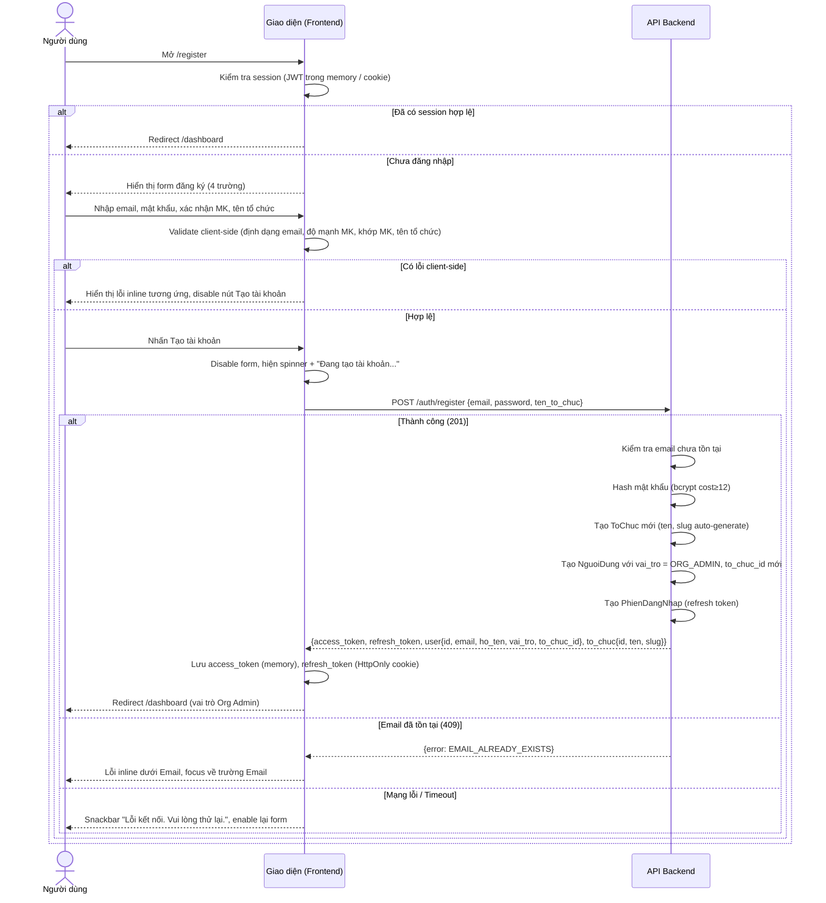
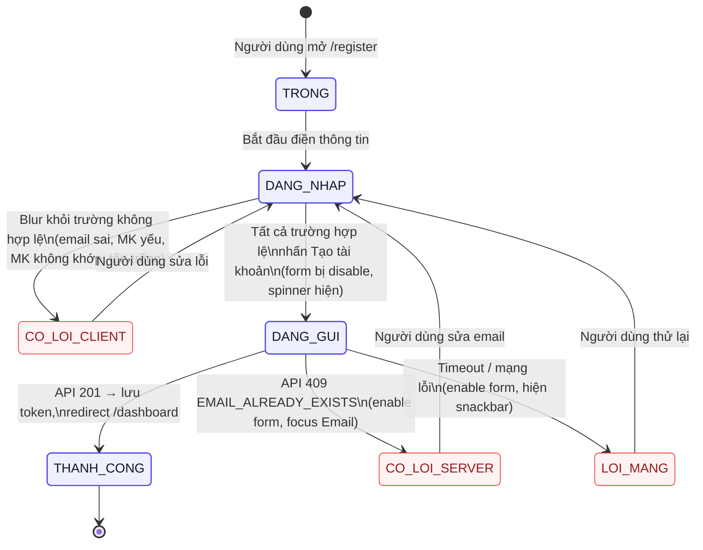
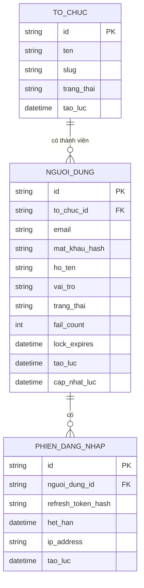

# Đặc tả yêu cầu — Đăng ký (Mã màn: S06)

## Chức năng & truy vết nguồn
Trace: F12 → FR-13 → BR-01, BR-03

## Phạm vi màn

**Màn này lo:** tự đăng ký tài khoản mới, **tạo một tổ chức mới độc lập**, gán người đăng ký làm Org Admin, và tự cấp phiên đăng nhập ngay sau khi tạo.

**Màn này KHÔNG lo** *(nêu nơi xử lý thay)*:
- Đăng nhập tài khoản đã có — *thuộc `S01` Đăng nhập (`F01`)*.
- Tham gia một tổ chức **đã tồn tại** — *người có sẵn tổ chức phải được Org Admin mời ở `S05` (`F13`); luồng này luôn tạo tổ chức mới (`BRule-S06-02`)*.
- Xác nhận email sau đăng ký — *ngoài phạm vi giai đoạn 1; tài khoản dùng được ngay*.
- Đổi mật khẩu sau này — *thuộc `S04` Hồ sơ cá nhân*.

## Tác nhân & hệ thống ngoài

| Tác nhân | Loại | Vai trò ở màn này | Trong phạm vi? |
|----------|------|-------------------|----------------|
| Người dùng chưa có tài khoản | người | Điền form, tạo tài khoản + tổ chức, trở thành Org Admin | Có |
| API Backend (nội bộ) | hệ thống | Kiểm email duy nhất toàn hệ thống, tạo tổ chức + tài khoản, cấp token | Có |

> Màn này **không gọi hệ thống bên thứ ba** — giai đoạn 1 không có OAuth/SSO và không gửi email xác nhận (`00-vision.md` §4).

## Yêu cầu chức năng (Functional)

| Mã | Yêu cầu (hệ thống phải...) | Trace F/FR | Nguồn | Lý do (rationale) | Acceptance criteria (đo được) | Kiểm chứng | Ưu tiên |
|----|----------------------------|------------|-------|-------------------|-------------------------------|-----------|---------|
| R-S06-01 | Hiển thị form đăng ký với trường Email, Mật khẩu, Xác nhận mật khẩu, Tên tổ chức khi người dùng chưa xác thực truy cập /register | F12 / FR-13 | brainstorm.md (màn) | Đây là điểm khởi đầu vòng đời sản phẩm; người dùng mới cần một chỗ để tạo tài khoản + tổ chức | Form xuất hiện đầy đủ 4 trường, nút "Tạo tài khoản", và link "Đã có tài khoản? Đăng nhập"; không yêu cầu thông tin nào khác | demonstration | Must |
| R-S06-02 | Validate định dạng email theo RFC 5321 client-side khi người dùng rời khỏi trường Email | F12 / FR-13 | brainstorm.md (màn) | Bắt lỗi định dạng sớm phía client để phản hồi tức thì và tránh gọi API vô ích | Nhập sai định dạng (thiếu @, thiếu domain) → lỗi inline xuất hiện ngay dưới trường; không gọi API | test | Must |
| R-S06-03 | Hiển thị thanh đo độ mạnh mật khẩu theo thời gian thực khi người dùng nhập vào trường Mật khẩu | F12 / FR-13 | brainstorm.md (màn) | Phản hồi trực quan giúp người dùng đặt mật khẩu đủ mạnh, phục vụ bảo mật (BR-03) | Thanh xuất hiện ngay khi gõ ký tự đầu tiên; cập nhật theo mỗi ký tự; phân 3 mức: Yếu / Trung bình / Mạnh | demonstration | Must |
| R-S06-04 | Kiểm tra mật khẩu xác nhận khớp với mật khẩu gốc khi người dùng rời khỏi trường Xác nhận mật khẩu | F12 / FR-13 | brainstorm.md (màn) | Ngăn tạo tài khoản với mật khẩu gõ nhầm mà người dùng không tự nhận ra | Mật khẩu xác nhận khác mật khẩu gốc → lỗi inline "Mật khẩu xác nhận không khớp." xuất hiện; nút Tạo tài khoản không thể nhấn | test | Must |
| R-S06-05 | Validate trường Tên tổ chức bắt buộc không được để trống khi submit | F12 / FR-13 | brainstorm.md (màn) | Tên tổ chức là tên hiển thị của tổ chức mới tạo — không thể để trống | Để trống Tên tổ chức và submit → lỗi inline "Tên tổ chức không được để trống." xuất hiện; không gọi API | test | Must |
| R-S06-06 | Gửi thông tin đăng ký đến API POST /auth/register và nhận kết quả khi nhấn nút "Tạo tài khoản" | F12 / FR-13 | brainstorm.md (màn) | Việc tạo tài khoản + tổ chức thật do backend làm; màn phải gửi dữ liệu và hiện trạng thái chờ để người dùng biết đang xử lý | API được gọi đúng 1 lần; nút chuyển sang trạng thái loading (spinner + "Đang tạo tài khoản..."); tất cả trường bị disabled | test | Must |
| R-S06-07 | Hiển thị lỗi inline dưới trường Email "Email đã được sử dụng. Vui lòng dùng địa chỉ khác hoặc đăng nhập." khi API trả về 409 (email trùng) | F12 / FR-13 | brainstorm.md (màn) | Email là định danh đăng nhập duy nhất; phải chặn trùng và chỉ đường sang đăng nhập nếu là tài khoản của họ (BRule-S06-01) | Thông báo lỗi xuất hiện ngay dưới trường Email; các trường khác giữ nguyên; focus tự động về trường Email | test | Must |
| R-S06-08 | Tạo tổ chức mới, gán người dùng vừa đăng ký làm Org Admin, và tự động đăng nhập sau khi API trả về 201 thành công | F12 / FR-13 | brainstorm.md (màn) | Đưa người mới vào việc ngay với vai trò Org Admin, không bắt đăng nhập lại — giảm ma sát khởi đầu (BRule-S06-05) | Trong vòng 500ms sau response 201: người dùng có session hợp lệ với vai trò Org Admin; trình duyệt điều hướng về /dashboard | test | Must |
| R-S06-09 | Redirect về Dashboard nếu người dùng đã có session hợp lệ và cố mở /register | F12 / FR-13 | brainstorm.md (màn) | Tránh hiển thị lại form đăng ký cho người đã có phiên hợp lệ — bớt bước thừa | Mở /register khi có JWT hợp lệ → redirect /dashboard trong vòng 100ms; form không render | test | Must |
| R-S06-10 | Toggle hiển thị/ẩn nội dung trường Mật khẩu và trường Xác nhận mật khẩu qua icon mắt | F12 / FR-13 | brainstorm.md (màn) | Giúp người dùng kiểm tra mật khẩu đã gõ đúng chưa, giảm lỗi nhập sai | Nhấn icon mắt trên từng trường → chuyển giữa type=password và type=text; icon đổi trạng thái tương ứng | demonstration | Should |

## Yêu cầu phi chức năng (Non-functional)

| Mã | Loại | Yêu cầu đo được | Trace |
|----|------|-----------------|-------|
| R-S06-N01 | Bảo mật | Mật khẩu phải được hash bằng bcrypt với cost factor ≥ 12 trước khi lưu vào cơ sở dữ liệu; mật khẩu không bao giờ lưu dưới dạng plaintext | NFR-02 / BR-03 |
| R-S06-N02 | Bảo mật | Mật khẩu tối thiểu 8 ký tự, phải chứa ít nhất một chữ cái và một chữ số; mật khẩu "Mạnh" yêu cầu thêm ký tự đặc biệt hoặc ≥ 12 ký tự | NFR-02 / BR-03 |
| R-S06-N03 | Bảo mật | API /auth/register phản hồi HTTP 429 khi cùng IP gửi > 10 request/phút (rate limit chống spam đăng ký) | NFR-02 / BR-01 |
| R-S06-N04 | Bảo mật | Mật khẩu không bao giờ log ra console hay gửi trong URL; chỉ gửi qua HTTPS trong request body | NFR-02 / BR-03 |
| R-S06-N05 | Hiệu năng | Thời gian từ nhấn nút "Tạo tài khoản" đến khi redirect Dashboard ≤ 3 giây ở điều kiện mạng bình thường (bao gồm tạo org và auto-login) | NFR-01 / BR-01 |
| R-S06-N06 | Khả năng sử dụng | Thứ tự focus mặc định: Email → Mật khẩu → Xác nhận mật khẩu → Tên tổ chức → Nút Tạo tài khoản (Tab key) | NFR-05 / BR-01 |
| R-S06-N07 | Khả năng tiếp cận | Tất cả trường input và thông báo lỗi có label/aria-label rõ ràng; tương phản màu nền/chữ ≥ 4.5:1 (WCAG AA); role="alert" cho thông báo lỗi | NFR-07 / BR-01 |

## Quy tắc nghiệp vụ

| Mã | Quy tắc | Kích hoạt khi | Trace |
|----|---------|---------------|-------|
| BRule-S06-01 | Email phải **duy nhất toàn hệ thống** — một địa chỉ email chỉ gắn với một tài khoản | Khi kiểm email lúc rời trường và khi nhận `POST /auth/register` | R-S06-07 / FR-13 |
| BRule-S06-02 | Người tự đăng ký tạo ra **một tổ chức mới và độc lập**; không gộp vào tổ chức có sẵn qua luồng này (cô lập dữ liệu). Người mới trở thành Org Admin của tổ chức đó | Khi xử lý đăng ký thành công | R-S06-01 / BR-03 |
| BRule-S06-03 | Mật khẩu phải đạt tối thiểu mức "Trung bình" (≥ 8 ký tự, có chữ và số) trước khi cho submit | Mỗi lần người dùng gõ vào ô Mật khẩu và khi bấm Tạo tài khoản | R-S06-03 / BR-03 |
| BRule-S06-04 | Tên tổ chức không được để trống, tối đa 100 ký tự; cho phép tiếng Việt có dấu, số và ký tự thông thường | Khi rời trường Tên tổ chức và khi submit | R-S06-05 |
| BRule-S06-05 | Đăng ký thành công thì **tự cấp session** — người dùng không phải đăng nhập lại thủ công | Ngay sau khi `POST /auth/register` trả 201 | R-S06-06 |
| BRule-S06-06 | *(CR-04)* Thời hạn token theo chính sách chung: access token 8 giờ, refresh token 30 ngày, phiên kết thúc khi chạm mốc sớm hơn giữa **7 ngày không hoạt động** và **trần 30 ngày** (nhất quán `BRule-S01-06` — đó là nơi giữ luật, mục này chỉ tham chiếu) | Khi cấp token lúc đăng ký thành công | R-S06-06 / NFR-02 |

## Bảng mô tả chi tiết phần tử màn hình
| # | Tên phần tử | Control type | Data Type | Bắt buộc | Mô tả | Trace |
|---|-------------|--------------|-----------|----------|-------|-------|
| 1 | Logo & tên sản phẩm | Label | String | — | Nhận diện thương hiệu TeamTasks | R-S06-01 |
| 2 | Email | Input | String | Có | Email tạo tài khoản; báo lỗi nếu đã dùng | R-S06-02 |
| 3 | Mật khẩu | Input | String | Có | Mật khẩu mới của tài khoản | R-S06-03 |
| 4 | Thanh độ mạnh mật khẩu | Label | Enum | — | Yếu / Trung bình / Mạnh, cập nhật khi gõ | R-S06-04 |
| 5 | Xác nhận mật khẩu | Input | String | Có | Nhập lại mật khẩu để đối chiếu | R-S06-05 |
| 6 | Tên tổ chức | Input | String | Có | Tên tổ chức được tạo cùng tài khoản | R-S06-06 |
| 7 | Hiện/ẩn mật khẩu | Button | Action | — | Bật tắt hiển thị cho cả hai ô mật khẩu | R-S06-03 |
| 8 | Tạo tài khoản | Button | Action | — | Gửi đăng ký; disable + spinner khi đang gọi API | R-S06-07 |
| 9 | Liên kết Đăng nhập | Link | Action | — | Chuyển sang màn đăng nhập cho người đã có tài khoản | R-S06-08 |

## Yêu cầu dữ liệu

- **Đầu vào:**
  - `email`: chuỗi, định dạng RFC 5321, tối đa 254 ký tự, bắt buộc, duy nhất toàn hệ thống
  - `password`: chuỗi, 8–128 ký tự, bắt buộc, phải chứa ≥1 chữ cái và ≥1 chữ số
  - `confirm_password`: chuỗi, phải khớp với `password`, chỉ validate client-side (không gửi lên API)
  - `ten_to_chuc`: chuỗi, 1–100 ký tự, bắt buộc
- **Đầu ra (khi thành công — HTTP 201):**
  - `access_token`: JWT chuỗi, hết hạn sau 8 giờ
  - `refresh_token`: chuỗi opaque, hết hạn sau 30 ngày
  - `user.id`, `user.ho_ten` (từ email), `user.email`, `user.vai_tro` = "OrgAdmin", `user.to_chuc_id`
  - `to_chuc.id`, `to_chuc.ten`, `to_chuc.slug` (auto-generated từ tên)
- **Dữ liệu lưu client:**
  - Access token: memory (không localStorage)
  - Refresh token: HttpOnly cookie (không truy cập JS)

## Ma trận lỗi

| Mã | Lỗi | Xảy ra khi | Mức | Trace | Người dùng thấy gì | Lối thoát |
|----|-----|-----------|-----|-------|--------------------|-----------|
| E-S06-01 | Email sai định dạng | Rời trường Email với giá trị không đúng RFC 5321 | minor | R-S06-02 | Lỗi inline "Vui lòng nhập địa chỉ email hợp lệ."; **không có network request** | Sửa email tại chỗ |
| E-S06-02 | Thiếu trường bắt buộc | Submit khi Email hoặc Mật khẩu rỗng | minor | R-S06-01 | Lỗi validation trường bắt buộc; không gọi API | Điền nốt trường còn thiếu |
| E-S06-03 | Email đã được sử dụng | API trả `409` — email đã tồn tại trong hệ thống | major | R-S06-07 / BRule-S06-01 | Lỗi inline dưới trường Email: "Email đã được sử dụng. Vui lòng dùng địa chỉ khác hoặc đăng nhập."; các trường khác giữ nguyên; focus về ô Email | Dùng email khác, **hoặc** sang `S01` đăng nhập nếu đó là tài khoản của mình |
| E-S06-04 | Mật khẩu không đạt chính sách | Mật khẩu < 8 ký tự, hoặc thiếu chữ/số | minor | R-S06-N02 / BRule-S06-03 | Thanh độ mạnh hiển thị "Yếu" + lỗi inline "Mật khẩu phải có ít nhất 8 ký tự, bao gồm chữ cái và chữ số."; nút disable | Đặt mật khẩu đạt mức "Trung bình" trở lên |
| E-S06-05 | Xác nhận mật khẩu không khớp | Ô Xác nhận khác ô Mật khẩu | minor | R-S06-04 | Lỗi inline "Mật khẩu xác nhận không khớp." dưới trường Xác nhận; nút "Tạo tài khoản" disable | Nhập lại cho khớp |
| E-S06-06 | Thiếu tên tổ chức | Submit với Tên tổ chức rỗng | minor | R-S06-05 / BRule-S06-04 | Lỗi inline "Tên tổ chức không được để trống."; không gọi API | Nhập tên tổ chức |
| E-S06-07 | Vượt hạn mức đăng ký từ một IP | Cùng IP gửi > 10 request/phút tới `/auth/register` | major | R-S06-N03 | HTTP 429 Too Many Requests | Chờ hết cửa sổ 1 phút rồi thử lại |
| E-S06-08 | Mất kết nối khi đang tạo tài khoản | Mạng ngắt lúc gọi `POST /auth/register` | major | R-S06-06 | Thông báo lỗi kết nối; form **giữ nguyên** dữ liệu đã nhập; nút enable lại | Bấm "Tạo tài khoản" lại khi có mạng — **không tạo tài khoản trùng** |

## Phụ thuộc ngoài

| Phụ thuộc | Ai sở hữu | Chặn gì nếu chưa sẵn sàng |
|-----------|-----------|---------------------------|
| API `POST /auth/register` (`06-api-spec.md`) | Đội backend nội bộ | Toàn màn không dùng được — không ai vào được hệ thống lần đầu |
| Ràng buộc email duy nhất ở tầng dữ liệu (`BRule-S06-01`) | Đội backend nội bộ | Có thể sinh **hai tài khoản cùng email** → hỏng định danh đăng nhập của `S01` |

*(Không phụ thuộc dịch vụ bên thứ ba nào.)*

## Giả định & Ràng buộc

> 29148 tách **giả định** (điều ta *tin là đúng* nhưng chưa xác nhận — sai thì yêu cầu lung lay) khỏi **ràng buộc** (giới hạn *bắt buộc tuân*, không thương lượng). Khác "Phụ thuộc ngoài" (thứ bên khác *sở hữu* mà màn cần).

**Giả định** *(mỗi cái trạng thái `Đề xuất → Đã xác nhận / Đã sửa / Đã bỏ / 🔓 Chấp nhận rủi ro`; còn `⚠️ chưa xác nhận` → `ba-review` chấm 🟠, `Mốc = ba-build`)*

| Mã | Giả định | Vì sao cần | Ảnh hưởng nếu sai | Trạng thái |
|----|----------|-----------|-------------------|-----------|
| GĐ-S06-01 | Tên tổ chức **không cần duy nhất** toàn hệ thống ở giai đoạn 1 (hai tổ chức có thể trùng tên, phân biệt bằng slug/id) | `BRule-S06-04` chỉ kiểm rỗng + độ dài, **không** kiểm trùng tên | Sai → cần thêm luật kiểm trùng tên tổ chức + thông báo lỗi khi trùng | ⚠️ chưa xác nhận *(brainstorm câu hỏi mở: "Tên tổ chức có phải duy nhất không?")* |

**Ràng buộc** *(giới hạn bắt buộc — không phải BRule/NFR)*

| Mã | Ràng buộc | Nguồn | Ảnh hưởng tới thiết kế màn |
|----|-----------|-------|----------------------------|
| RB-S06-01 | Giai đoạn 1 chỉ đăng ký bằng email + mật khẩu, **không OAuth/SSO** và **không xác nhận email** (tài khoản dùng được ngay) | `00-vision.md` §4 — đã nêu trong "Phạm vi màn" và "Tác nhân & hệ thống ngoài" | Form không có nút "đăng ký với Google/GitHub"; không có bước gửi/verify email; auto-login thẳng sau 201 |

## Quét yêu cầu ngầm

> 9 chiều không ai viết ra cho tới khi hỏng — mỗi chiều rơi vào mã đã viết ở trên, `n/a — lý do`, hoặc câu hỏi mở `OQ-S06-..` (template `ba-screen-spec`, soát bởi `ba-feasible` luật 9).

| Chiều | Rơi vào đâu |
|-------|-------------|
| Kiểm dữ liệu vào | `R-S06-02` · `R-S06-04` · `R-S06-05` · `BRule-S06-04` · `E-S06-04` — định dạng email, khớp mật khẩu xác nhận, tên tổ chức 1–100 ký tự, chính sách mật khẩu; kiểm phía client trước khi gọi API |
| Kiểu hỏng | `E-S06-08` — mất kết nối giữa lúc tạo tài khoản: form giữ nguyên dữ liệu, nút enable lại |
| Gửi lặp / thử lại | `R-S06-06` · `R-S06-N03` — API gọi đúng 1 lần, mọi trường disable khi đang chờ; cùng IP > 10 request/phút nhận `429` · `OQ-S06-02` (thử lại sau khi response bị mất) |
| Phân quyền | `R-S06-09` · `BRule-S06-02` — người đã có phiên không vào lại /register; người tự đăng ký chỉ thành Org Admin của tổ chức mới, không chen vào tổ chức có sẵn |
| Đồng thời / thứ tự | `OQ-S06-01` |
| Vòng đời dữ liệu | `BRule-S06-06` — token cấp lúc đăng ký theo chính sách chung: access 8 giờ · refresh 7 ngày không hoạt động / trần 30 ngày |
| Hệ ngoài chết | n/a — màn không gọi hệ thống của bên thứ ba (`RB-S06-01`: giai đoạn 1 không OAuth/SSO, không gửi email xác nhận); backend nội bộ không phản hồi đã nằm ở chiều Kiểu hỏng |
| Chuyển trạng thái | `BRule-S06-05` · `R-S06-08` — chưa có tài khoản → tài khoản + tổ chức mới + phiên Org Admin ngay sau `201`, điều hướng /dashboard |
| Quan sát / log | `R-S06-N04` (cấm ghi mật khẩu vào log/URL) · `OQ-S06-03` (ghi vết đăng ký cho vận hành) |

**Câu hỏi mở từ quét**

| Mã | Câu hỏi | Chiều | Ai trả lời |
|----|---------|-------|-----------|
| OQ-S06-01 | Hai yêu cầu đăng ký **cùng một email** tới gần như cùng lúc (hai tab/hai thiết bị): `BRule-S06-01` + ràng buộc duy nhất ở tầng dữ liệu bảo đảm chỉ một tài khoản, nhưng bên thua nhận `409` hay lỗi khác — và **tổ chức đã tạo dở** cho bên thua có được huỷ cùng (tạo tổ chức + tài khoản là một giao dịch) hay để lại tổ chức mồ côi? srs không nói thứ tự tạo | Đồng thời / thứ tự | PO + đội backend |
| OQ-S06-02 | Request đầu đã tạo xong tài khoản nhưng response mất trên đường về (`E-S06-08`); người dùng bấm lại thì `BRule-S06-01` trả `409` "Email đã được sử dụng" cho chính tài khoản vừa tạo. Chấp nhận để người dùng tự sang `S01` đăng nhập, hay cần cơ chế nhận diện lần gửi lặp (khoá idempotency) để trả lại kết quả `201` ban đầu? | Gửi lặp / thử lại | PO + đội backend |
| OQ-S06-03 | Có cần ghi vết mỗi lần đăng ký (thời điểm, IP, tổ chức tạo ra) và các lần bị chặn `429` để vận hành phát hiện đăng ký rác / tổ chức ảo không? Hiện chỉ có luật cấm log mật khẩu, không yêu cầu nào nói phải ghi gì | Quan sát / log | PO + vận hành |

## Sơ đồ luồng (Flow)

### 1. Tổng quan tác nhân ↔ chức năng (Use case)

### 2. Quy trình đăng ký — nhánh thành công và các nhánh lỗi (Activity)

### 3. Trao đổi người dùng ↔ giao diện ↔ hệ thống khi đăng ký (Sequence)

### 4. Trạng thái biểu mẫu đăng ký (State)

### Trạng thái giao diện — người dùng thấy gì ở mỗi trạng thái

> Sơ đồ trên mô tả **máy trạng thái** của form. Bảng này là mặt còn lại: ở mỗi trạng thái, người dùng nhìn thấy gì và làm được gì. Thiếu bảng này thì hành vi chỉ tồn tại trong nhãn cạnh của sơ đồ — nơi mà người viết code giao diện không đọc, và không TC nào kiểm.

| Trạng thái | Người dùng thấy | Thao tác được phép | Trace |
|---|---|---|---|
| `TRONG` | Form rỗng, không lỗi nào hiện, nút "Tạo tài khoản" **disable** | Nhập bất kỳ trường nào | `R-S06-01` |
| `DANG_NHAP` | Form có dữ liệu, chưa lỗi; nút enable khi đủ trường hợp lệ | Nhập tiếp · submit | `R-S06-01` |
| `CO_LOI_CLIENT` | Lỗi inline ngay dưới trường sai; nút **disable**; focus giữ ở trường lỗi | Sửa trường sai | `E-S06-01…04` |
| `DANG_GUI` | Spinner trên nút, chữ "Đang tạo tài khoản…"; **toàn bộ trường disable** | Không thao tác được — chặn submit lần hai | `R-S06-06` |
| `CO_LOI_SERVER` | Lỗi dưới trường Email: "Email này đã được đăng ký."; form enable lại, con trỏ về ô Email | Sửa email · submit lại | `E-S06-05` |
| `LOI_MANG` | Snackbar "Lỗi kết nối. Vui lòng thử lại."; form enable lại, **giữ nguyên mọi giá trị đã nhập** | Thử lại | `E-S06-06` |
| `THANH_CONG` | Không render gì thêm — chuyển ngay sang `/dashboard` | — | `R-S06-07` |

## Mô hình dữ liệu màn hình (ERD)

Các thực thể mà màn Đăng ký (S06) đụng tới: **TO_CHUC** (tạo mới) và **NGUOI_DUNG** (tạo mới với vai_tro = ORG_ADMIN, liên kết với TO_CHUC vừa tạo). Màn này cũng khởi tạo **PHIEN_DANG_NHAP** đầu tiên cho người dùng (auto-login sau đăng ký thành công).

## Microcopy — câu chữ hiện cho người dùng
> Nguồn cho mục wording của `design-spec.md`. Mỗi câu phải nói rõ **hiện khi nào** và **trace về đâu**: câu chữ đứng một mình trong bản thiết kế thì lúc code không ai biết điều kiện hiển thị, và câu nào hàm ý một luật thì luật đó phải tồn tại ở trên.

| Câu (nguyên văn) | Hiện khi nào | Trace |
|---|---|---|
| `Tên tổ chức không được vượt quá 100 ký tự.` | Rời trường Tên tổ chức với giá trị > 100 ký tự | `BRule-S06-04` |

## Thuật ngữ
| Thuật ngữ | Giải thích |
|---|---|
| SRS (Software Requirements Specification) | Đặc tả yêu cầu chi tiết cho một màn hình |
| R-S.. | Mã yêu cầu cấp màn; `-N..` là yêu cầu phi chức năng của màn |
| BRule (Business Rule) | Quy tắc nghiệp vụ ràng buộc hành vi màn này |
| E-S (lỗi cấp màn) | Một cách màn này hỏng (E-S06-01…) — kèm mức, thông báo nguyên văn và lối thoát |
| UI State | Trạng thái giao diện (mặc định, đang tải, lỗi, rỗng…) |
| Validation | Luật kiểm tra dữ liệu nhập (bắt buộc, định dạng, min-max) |
| Enum | Tập giá trị định sẵn của một trường |

> Từ điển đầy đủ toàn dự án: `docs/00-glossary.md`.
