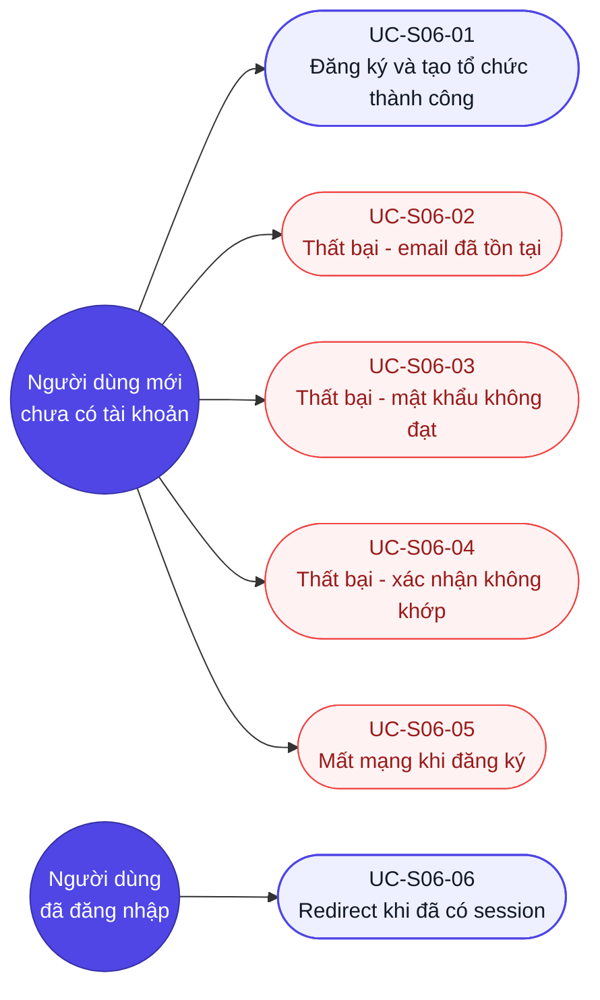

# Use case — Đăng ký (Mã màn: S06)

## Sơ đồ Use case (tổng quan)
> Tác nhân ↔ use case của màn Đăng ký. Bốn UC thất bại tô màu lỗi; `UC-S06-06` thuộc tác nhân **đã đăng nhập** — không phải người dùng mới.

---

## UC-S06-01: Đăng ký tài khoản và tạo tổ chức thành công
- **Tác nhân (actor):** Người dùng mới chưa có tài khoản
- **Trigger (kích hoạt):** Người dùng truy cập /register hoặc nhấn link "Đăng ký" từ màn Đăng nhập
- **Tiền điều kiện:** Người dùng chưa có tài khoản; chưa đăng nhập; email chưa tồn tại trong hệ thống
- **Luồng chính (happy path):**
  1. Hệ thống hiển thị form đăng ký với 4 trường: Email, Mật khẩu, Xác nhận mật khẩu, Tên tổ chức.
  2. Người dùng nhập địa chỉ email hợp lệ vào trường Email.
  3. Người dùng nhập mật khẩu đủ mạnh (≥ 8 ký tự, có chữ và số) vào trường Mật khẩu; thanh đo độ mạnh cập nhật theo thời gian thực.
  4. Người dùng nhập lại cùng mật khẩu vào trường Xác nhận mật khẩu.
  5. Người dùng nhập tên tổ chức vào trường Tên tổ chức.
  6. Người dùng nhấn nút "Tạo tài khoản".
  7. Hệ thống validate toàn bộ client-side — hợp lệ.
  8. Hệ thống disable tất cả trường và nút, hiển thị spinner + "Đang tạo tài khoản...".
  9. Hệ thống gửi POST /auth/register với `{email, password, ten_to_chuc}`.
  10. API trả về 201 với access_token, refresh_token, thông tin user (vai trò OrgAdmin) và thông tin tổ chức vừa tạo.
  11. Hệ thống lưu access_token vào memory, refresh_token vào HttpOnly cookie.
  12. Hệ thống redirect về /dashboard — người dùng bắt đầu sử dụng với vai trò Org Admin.
- **Luồng thay thế / ngoại lệ:**
  - **[2a] Email sai định dạng:** Hệ thống hiển thị lỗi inline "Vui lòng nhập địa chỉ email hợp lệ." ngay dưới trường Email khi blur; không gọi API; quay lại bước 2.
  - **[3a] Mật khẩu quá yếu (< 8 ký tự hoặc thiếu chữ số):** Thanh độ mạnh hiển thị "Yếu" màu đỏ; lỗi inline dưới trường Mật khẩu; nút "Tạo tài khoản" không thể nhấn; quay lại bước 3.
  - **[4a] Mật khẩu xác nhận không khớp:** Lỗi inline "Mật khẩu xác nhận không khớp." xuất hiện dưới trường Xác nhận mật khẩu khi blur; nút Tạo tài khoản disable; quay lại bước 4.
  - **[5a] Tên tổ chức để trống:** Lỗi inline "Tên tổ chức không được để trống." xuất hiện khi blur; không gọi API; quay lại bước 5.
  - **[9a] Mất mạng khi gửi request:** API không phản hồi (timeout 10s); hệ thống hiển thị snackbar "Lỗi kết nối. Vui lòng thử lại."; enable lại form; dữ liệu đã nhập được giữ nguyên.
- **Hậu điều kiện (postcondition):** Tài khoản mới được tạo; tổ chức mới được tạo với người dùng là Org Admin; người dùng có session hợp lệ; trình duyệt ở Dashboard.
- **Đảm bảo (guarantees):** Thành công — người dùng có tài khoản và tổ chức mới, truy cập được Dashboard; Tối thiểu — không có dữ liệu nhạy cảm (mật khẩu) lộ trong URL hay log; mật khẩu được hash bcrypt trước khi lưu.
- **Trace:** R-S06-01, R-S06-06, R-S06-08, F12, FR-13

---

## UC-S06-02: Đăng ký thất bại — email đã tồn tại
- **Tác nhân:** Người dùng mới
- **Trigger:** Người dùng điền email đã có tài khoản trong hệ thống và submit form
- **Tiền điều kiện:** Email đã được đăng ký bởi tài khoản khác; người dùng hiện chưa đăng nhập
- **Luồng chính:**
  1. Người dùng điền email đã tồn tại, mật khẩu hợp lệ, xác nhận khớp, tên tổ chức hợp lệ.
  2. Người dùng nhấn "Tạo tài khoản".
  3. Hệ thống validate client-side — hợp lệ; gửi POST /auth/register.
  4. API trả về 409 với `{error: "EMAIL_ALREADY_EXISTS"}`.
  5. Hệ thống hiển thị lỗi inline ngay dưới trường Email: "Email đã được sử dụng. Vui lòng dùng địa chỉ khác hoặc đăng nhập."
  6. Hệ thống enable lại form; focus tự động về trường Email.
  7. Các trường Mật khẩu, Xác nhận mật khẩu, Tên tổ chức giữ nguyên (không xoá).
- **Luồng thay thế / ngoại lệ:** *(không có)*
- **Hậu điều kiện:** Không tạo tài khoản hay tổ chức mới; người dùng nhìn thấy thông báo lỗi rõ ràng và link điều hướng về Đăng nhập.
- **Đảm bảo:** Thành công — người dùng biết email đã được dùng và biết cần làm gì tiếp; Tối thiểu — không tiết lộ thông tin chi tiết về tài khoản hiện hữu (email có tồn tại hay không chỉ biết sau khi submit, không có API check trước khi submit).
- **Trace:** R-S06-07, BRule-S06-01, F12, FR-13

---

## UC-S06-03: Đăng ký thất bại — mật khẩu không đạt yêu cầu
- **Tác nhân:** Người dùng mới
- **Trigger:** Người dùng nhập mật khẩu không đủ mạnh và cố submit form
- **Tiền điều kiện:** Người dùng chưa đăng nhập; form đang hiển thị
- **Luồng chính:**
  1. Người dùng nhập mật khẩu chỉ có chữ cái (không có số) hoặc ít hơn 8 ký tự.
  2. Thanh độ mạnh hiển thị "Yếu" ngay khi nhập.
  3. Khi blur khỏi trường Mật khẩu: lỗi inline "Mật khẩu phải có ít nhất 8 ký tự, bao gồm chữ cái và chữ số." xuất hiện.
  4. Nút "Tạo tài khoản" bị disable (không cho submit).
  5. Người dùng cần sửa mật khẩu đạt mức "Trung bình" trở lên để nút được enable.
- **Luồng thay thế / ngoại lệ:** *(không có)*
- **Hậu điều kiện:** Không gọi API; người dùng nhìn thấy phản hồi trực quan về độ mạnh mật khẩu.
- **Đảm bảo:** Tối thiểu — mật khẩu yếu không bao giờ được gửi lên server; người dùng hiểu yêu cầu tối thiểu của mật khẩu.
- **Trace:** R-S06-03, R-S06-04, R-S06-N02, BRule-S06-03, NFR-02

---

## UC-S06-04: Đăng ký thất bại — mật khẩu xác nhận không khớp
- **Tác nhân:** Người dùng mới
- **Trigger:** Người dùng nhập mật khẩu xác nhận khác với mật khẩu gốc và blur khỏi trường
- **Tiền điều kiện:** Trường Mật khẩu đã điền hợp lệ; trường Xác nhận mật khẩu vừa blur
- **Luồng chính:**
  1. Người dùng nhập mật khẩu gốc hợp lệ.
  2. Người dùng nhập mật khẩu xác nhận khác với mật khẩu gốc.
  3. Khi blur khỏi trường Xác nhận mật khẩu: lỗi inline "Mật khẩu xác nhận không khớp." xuất hiện.
  4. Nút "Tạo tài khoản" bị disable cho đến khi 2 trường mật khẩu khớp nhau.
- **Luồng thay thế / ngoại lệ:** *(không có)*
- **Hậu điều kiện:** Không gọi API.
- **Đảm bảo:** Tối thiểu — người dùng không thể tạo tài khoản với mật khẩu không rõ ràng.
- **Trace:** R-S06-04, F12

---

## UC-S06-05: Mất mạng trong quá trình đăng ký
- **Tác nhân:** Người dùng mới
- **Trigger:** Kết nối mạng bị ngắt sau khi nhấn "Tạo tài khoản"
- **Tiền điều kiện:** Form hợp lệ; đã nhấn submit; mạng bị ngắt trước khi API phản hồi
- **Luồng chính:**
  1. Người dùng điền đầy đủ thông tin hợp lệ và nhấn "Tạo tài khoản".
  2. Hệ thống gửi POST /auth/register nhưng request timeout (10 giây).
  3. Hệ thống hiển thị snackbar "Lỗi kết nối. Vui lòng thử lại." ở đáy màn hình.
  4. Hệ thống enable lại form; dữ liệu đã nhập giữ nguyên; nút được enable lại.
  5. Người dùng có thể thử lại khi mạng khôi phục.
- **Luồng thay thế / ngoại lệ:**
  - **[3a] Tài khoản đã được tạo phía server trước khi timeout xảy ra:** Khi người dùng thử lại, API trả về 409 (email đã tồn tại) — hệ thống hiển thị lỗi email trùng; người dùng nên dùng luồng Đăng nhập thay thế.
- **Hậu điều kiện:** Không xác định (có thể tài khoản đã tạo hoặc chưa); dữ liệu form không mất.
- **Đảm bảo:** Tối thiểu — dữ liệu đã nhập không bị mất; người dùng nhận được phản hồi rõ ràng.
- **Trace:** R-S06-06, UC-S06-01 [9a]

---

## UC-S06-06: Redirect khi đã có session hợp lệ
- **Tác nhân:** Người dùng đã đăng nhập
- **Trigger:** Người dùng gõ /register trực tiếp hoặc nhấn Back về /register sau khi đã đăng ký
- **Tiền điều kiện:** Có JWT hợp lệ trong bộ nhớ / refresh token còn hiệu lực trong cookie
- **Luồng chính:**
  1. Trình duyệt tải /register.
  2. Hệ thống kiểm tra session — còn hiệu lực.
  3. Hệ thống redirect về /dashboard ngay lập tức (không render form đăng ký).
- **Hậu điều kiện:** Người dùng ở Dashboard mà không thấy form Đăng ký.
- **Trace:** R-S06-09
