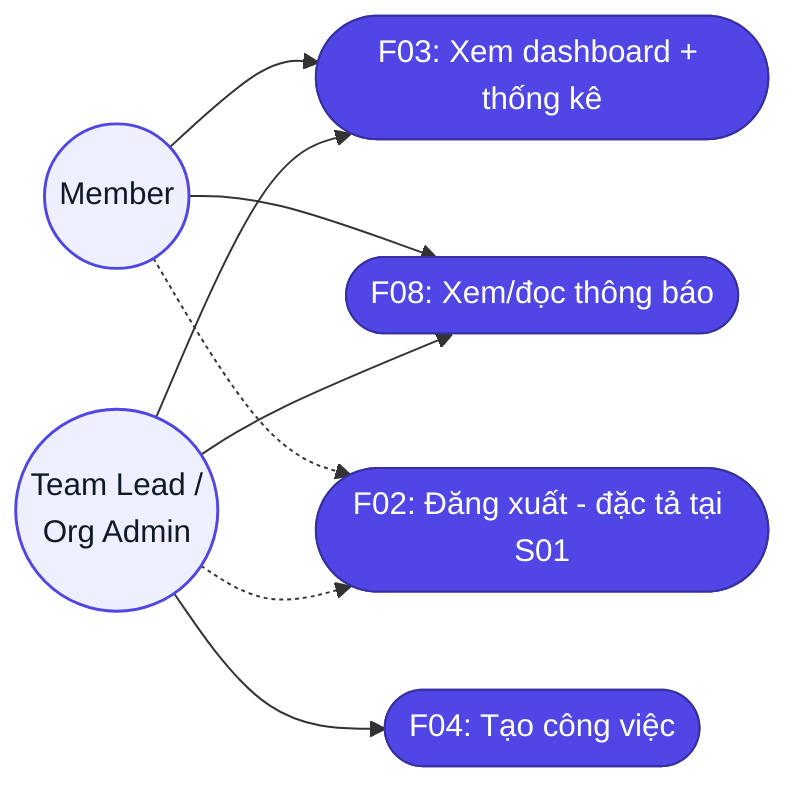
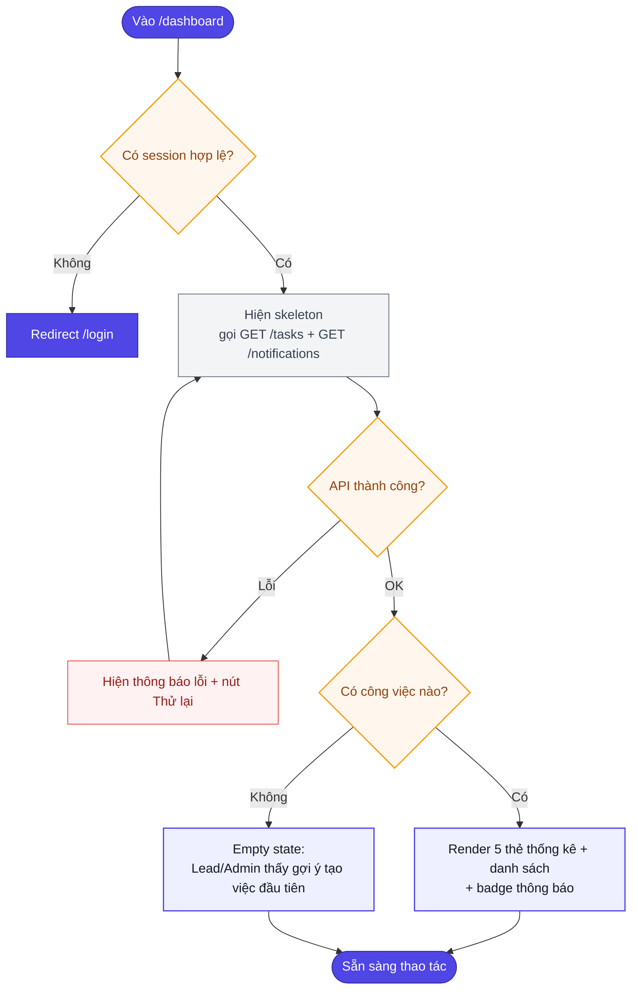
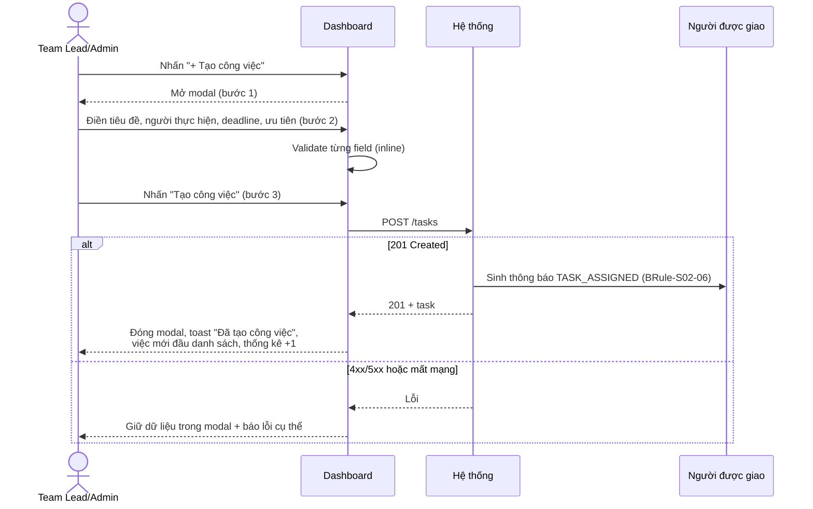
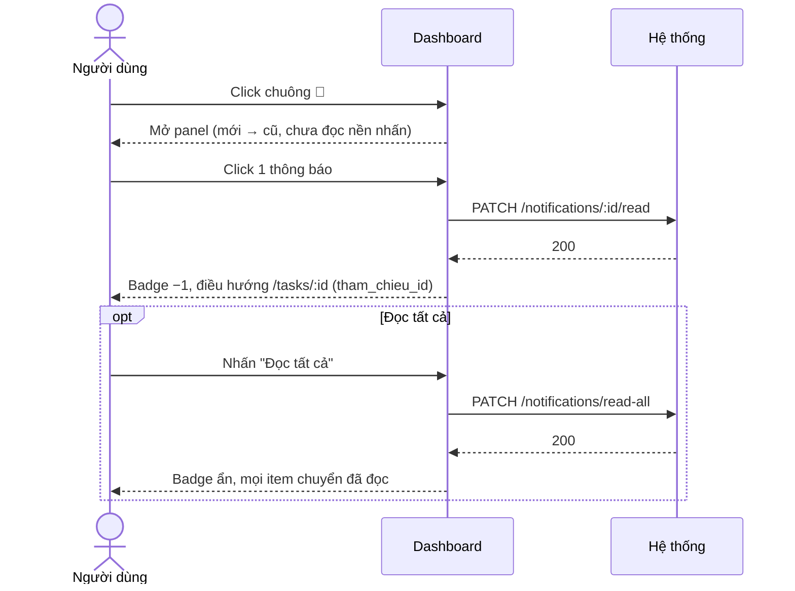
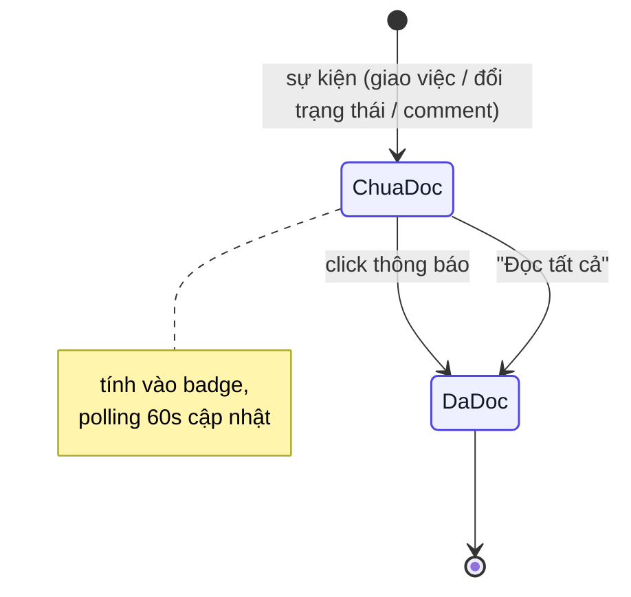
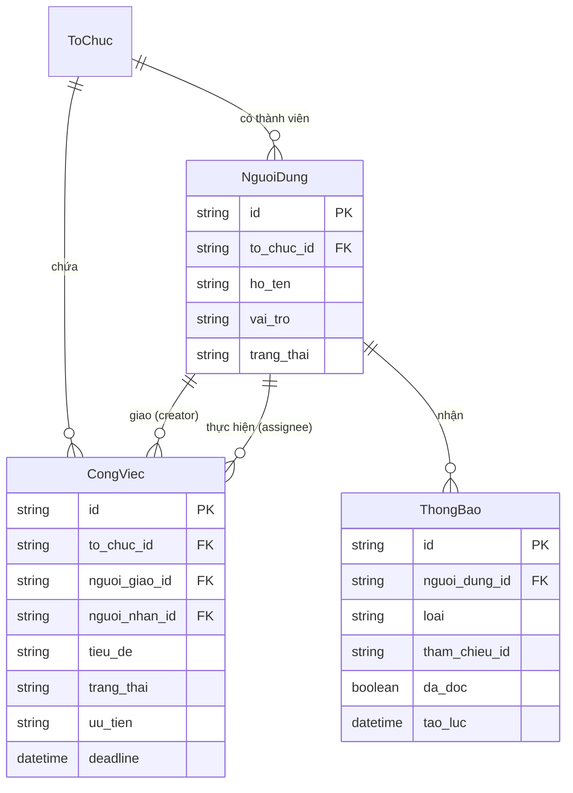

# Đặc tả yêu cầu — Dashboard (Mã màn: S02)

## Chức năng & truy vết nguồn
Trace: F03 → FR-03 → BR-01, BR-04 | F04 → FR-04, FR-05 → BR-01, BR-02 | F08 → FR-09 → BR-05.
Nút Đăng xuất trên header thuộc F02 — đã đặc tả tại S01 (R-S01-09), màn này chỉ đặt điểm truy cập.

## Phạm vi màn

**Màn này lo:** tổng quan công việc theo phạm vi vai trò (thẻ thống kê + danh sách), **tạo & giao công việc mới**, trung tâm thông báo in-app, và **xuất báo cáo tiến độ** (`CR-01`).

**Màn này KHÔNG lo** *(nêu nơi xử lý thay)*:
- Đổi trạng thái, bình luận, sửa/huỷ một công việc — *thuộc `S03` Chi tiết công việc (`F05`, `F06`, `F07`)*.
- Quản trị thành viên (mời, đổi vai trò, vô hiệu hoá) — *thuộc `S05` Tổ chức (`F13`)*.
- Nhắc deadline qua email — *`F09` chạy nền, không có màn (`03-overview.md`)*.

## Tác nhân & hệ thống ngoài

| Tác nhân | Loại | Vai trò ở màn này | Trong phạm vi? |
|----------|------|-------------------|----------------|
| Member | người | Xem công việc của mình, đọc thông báo | Có |
| Team Lead / Org Admin | người | Xem toàn tổ chức, tạo & giao việc, xuất báo cáo | Có |
| API Backend (nội bộ) | hệ thống | Trả danh sách/thống kê theo phạm vi vai trò, tạo công việc, sinh tệp báo cáo | Có |

> Màn này **không gọi hệ thống bên thứ ba**.

## Yêu cầu chức năng (Functional)

| Mã | Yêu cầu (hệ thống phải...) | Trace F/FR | Nguồn | Lý do (rationale) | Acceptance criteria (đo được) | Kiểm chứng | Ưu tiên |
|----|----------------------------|------------|-------|-------------------|-------------------------------|-----------|---------|
| R-S02-01 | Hiển thị 5 thẻ thống kê (Tổng, Cần làm, Đang làm, Hoàn thành, Quá hạn) tính theo phạm vi vai trò khi tải Dashboard | F03 / FR-03 | brainstorm.md (màn) | Cho người dùng nắm nhanh tình hình công việc theo phạm vi của mình ngay khi vừa vào (F03 tổng quan) | 5 thẻ hiện đủ với số đếm đúng theo dữ liệu GET /tasks; Member chỉ đếm việc mình liên quan, Lead/Admin đếm cả tổ chức | test | Must |
| R-S02-02 | Hiển thị danh sách công việc (tiêu đề, người thực hiện, deadline, ưu tiên, trạng thái) theo phạm vi vai trò, sắp theo deadline gần nhất trước | F03 / FR-03 | brainstorm.md (màn) · UE-11 | Danh sách chi tiết để theo dõi và chọn việc; sắp deadline gần trước để ưu tiên việc gấp | Danh sách trả từ GET /tasks đúng phạm vi; mặc định sắp deadline tăng dần; mỗi dòng đủ 5 cột thông tin | test | Must |
| R-S02-03 | Cho phép lọc danh sách theo trạng thái, mức ưu tiên và tìm kiếm theo tiêu đề | F03 / FR-03 | brainstorm.md (màn) | Giúp tìm nhanh việc cần trong danh sách dài mà không phải tải lại trang | Chọn bộ lọc/nhập từ khoá (debounce 300ms) → danh sách cập nhật không reload trang; kết hợp được nhiều điều kiện | test | Must |
| R-S02-04 | Click một thẻ thống kê thì lọc danh sách theo trạng thái tương ứng của thẻ | F03 / FR-03 | brainstorm.md (màn) | Cho phép lọc nhanh theo trạng thái bằng một cú click vào thẻ — thao tác tự nhiên | Click "Đang làm" → danh sách chỉ còn IN_PROGRESS; thẻ đang chọn có viền nhấn; click lại = bỏ lọc | test | Should |
| R-S02-05 | Đánh dấu công việc quá hạn: deadline < hiện tại và trạng thái ∉ {DONE, CANCELLED} | F03 / FR-03 | brainstorm.md (màn) · UE-11 | Làm nổi việc trễ hạn để người dùng xử lý kịp; đồng bộ với thẻ Quá hạn (BR-01 hiệu quả) | Dòng quá hạn có deadline tô đỏ + icon ⚠; số thẻ Quá hạn khớp số dòng quá hạn | test | Must |
| R-S02-06 | Click một dòng công việc thì điều hướng đến màn Chi tiết công việc (S03) của việc đó | F03 / FR-03 | brainstorm.md (màn) | Đưa người dùng tới nơi thao tác chi tiết một việc (S03) — Dashboard chỉ tổng quan | Click dòng bất kỳ → URL /tasks/:id của đúng việc; thời gian điều hướng ≤ 300ms | test | Must |
| R-S02-07 | Hiển thị nút "+ Tạo công việc" CHỈ với vai trò Team Lead và Org Admin; mở modal tạo việc khi nhấn | F04 / FR-04 | brainstorm.md (màn) | Chỉ Lead/Admin được giao việc (BRule-S02-03); ẩn nút với Member để tránh thao tác không được phép | Đăng nhập Member → nút không render trong DOM; Lead/Admin → nút hiện, click mở modal trong ≤ 200ms | test | Must |
| R-S02-08 | Modal tạo việc gồm: Tiêu đề, Mô tả, Người thực hiện, Deadline, Mức ưu tiên (mặc định Trung bình); validate theo bảng Validation bên dưới | F04 / FR-04 | brainstorm.md (màn) | Thu thập đủ thông tin tối thiểu để tạo một việc hợp lệ; validate sớm để giảm lỗi khi gửi | Đủ 5 trường; trường lỗi báo inline ngay khi blur; nút "Tạo công việc" disable khi còn lỗi/thiếu trường bắt buộc | test | Must |
| R-S02-09 | Dropdown "Người thực hiện" chỉ liệt kê thành viên trạng thái ACTIVE thuộc cùng tổ chức, kèm tìm theo tên | F04 / FR-05 | brainstorm.md (màn) | Chỉ giao được cho thành viên ACTIVE cùng tổ chức (BRule-S02-05); cô lập dữ liệu tổ chức (BR-03) | Thành viên INACTIVE/khoá không xuất hiện; gõ tên → lọc realtime; chọn 1 người duy nhất | test | Must |
| R-S02-10 | Gửi POST /tasks khi nhấn "Tạo công việc"; thành công thì đóng modal, toast "Đã tạo công việc", việc mới hiện đầu danh sách và thống kê cập nhật | F04 / FR-04 | brainstorm.md (màn) | Hoàn tất việc tạo và phản hồi ngay để người giao yên tâm việc đã vào hệ thống | API gọi đúng 1 lần; sau response 201: modal đóng, toast hiện ≤ 300ms, dòng mới ở đầu danh sách, thẻ Tổng/Cần làm +1 | test | Must |
| R-S02-11 | Khi tạo việc thất bại (4xx/5xx/mất mạng), giữ nguyên dữ liệu đã nhập trong modal và báo lỗi cụ thể | F04 / FR-04 | brainstorm.md (màn) | Không để người dùng mất công nhập lại khi lỗi tạm thời — giữ dữ liệu trong modal | Modal không đóng; mọi giá trị đã nhập còn nguyên; thông báo lỗi hiện trên modal theo mã lỗi API | test | Must |
| R-S02-12 | Hiển thị badge số thông báo chưa đọc trên chuông header; hơn 99 hiển thị "99+" | F08 / FR-09 | brainstorm.md (màn) | Cho người dùng biết có việc/thông báo mới cần chú ý mà không phải mở panel | Badge = số item da_doc=false từ GET /notifications; 0 → ẩn badge; 100 → "99+" | test | Must |
| R-S02-13 | Click chuông mở panel thông báo: danh sách mới → cũ, dòng chưa đọc nền nhấn, có nút "Đọc tất cả" | F08 / FR-09 | brainstorm.md (màn) | Nơi đọc chi tiết các thông báo, phân biệt chưa đọc để không bỏ sót | Panel mở ≤ 200ms; thứ tự giảm dần theo tao_luc; item chưa đọc phân biệt được bằng mắt với đã đọc | test | Must |
| R-S02-14 | Click một thông báo: gọi PATCH /notifications/:id/read rồi điều hướng đến công việc liên quan (tham_chieu_id) | F08 / FR-09 | brainstorm.md (màn) | Đưa người dùng thẳng tới việc liên quan thông báo, tiết kiệm thao tác tìm | Sau click: item chuyển đã đọc, badge giảm 1, điều hướng /tasks/:id đúng việc | test | Must |
| R-S02-15 | Nút "Đọc tất cả" gọi PATCH /notifications/read-all; badge về 0 và mọi item chuyển đã đọc | F08 / FR-09 | brainstorm.md (màn) | Cho người dùng dọn nhanh mọi thông báo khi đã nắm — giảm nhiễu badge | 1 lần gọi API; badge ẩn; không còn item nền nhấn trong panel | test | Should |
| R-S02-16 | Tự làm mới số thông báo chưa đọc theo chu kỳ 60 giây (polling) khi tab đang mở | F08 / FR-09 | brainstorm.md (màn) | Cập nhật thông báo gần thời gian thực ở giai đoạn 1 không dùng WebSocket (GĐ-S02-01) | Có thông báo mới ở server → badge cập nhật trong ≤ 60 giây mà không cần reload | test | Should |
| R-S02-17 | *(CR-01)* Hiển thị nút "Xuất báo cáo" trên dashboard **chỉ với Team Lead và Org Admin**; Member không thấy nút (không render, không phải làm mờ) | F14 / FR-14 | **CR-01** (đã duyệt) | Chỉ Lead/Admin được xuất báo cáo (BRule-S02-08); ẩn nút với Member và chặn cả ở server | Đăng nhập Member → nút không tồn tại trong DOM; Team Lead/Org Admin → nút hiện; gọi thẳng API xuất bằng token Member trả 403 (`R-S02-N07`) | test | Should |
| R-S02-18 | *(CR-01)* Cho phép xuất **thống kê + danh sách công việc theo đúng bộ lọc đang xem** ra PDF hoặc Excel qua `POST /reports/export` | F14 / FR-14 | **CR-01** (đã duyệt) | Đáp ứng nhu cầu SH-05 xuất báo cáo tiến độ (BR-04), phản ánh đúng bộ lọc đang xem | Chọn định dạng (PDF/Excel) → tải về tệp phản ánh **đúng bộ lọc trạng thái/ưu tiên/từ khoá hiện tại** và đúng phạm vi dữ liệu theo vai trò (`BRule-S02-01`); nội dung khớp bảng đang hiển thị | test | Should |
| R-S02-19 | Hỏi xác nhận trước khi đóng modal Tạo công việc nếu người dùng **đã nhập ít nhất một trường** (nút ✕, phím Esc, hoặc click ra nền) | F04 / FR-04 | `design-spec.md` §wording — **nâng từ bản thiết kế lên yêu cầu 31/08/2026** (câu chữ đã được chốt ở đó nhưng chưa yêu cầu nào mô tả hành vi) | Gõ nửa chừng rồi lỡ tay đóng modal là mất hết dữ liệu đã nhập; `R-S02-11` đã bảo vệ trường hợp lỗi mạng, nhưng không bảo vệ trường hợp người dùng tự đóng | Nhập tiêu đề rồi nhấn Esc → hộp xác nhận "Bỏ nội dung đã nhập?" hiện; chọn Huỷ → ở lại modal, mọi giá trị còn nguyên; chọn Đồng ý → modal đóng, không gọi API. Modal **trống hoàn toàn** thì đóng thẳng, không hỏi | test | Should |

## Yêu cầu phi chức năng (Non-functional)

| Mã | Loại | Yêu cầu đo được | Trace |
|----|------|-----------------|-------|
| R-S02-N01 | Hiệu năng | Tải Dashboard (thống kê + trang đầu danh sách) hoàn tất ≤ 2 giây ở p95 với 200 người dùng đồng thời | NFR-01 / BR-01 |
| R-S02-N02 | Khả năng sử dụng | Luồng tạo và giao công việc hoàn tất trong ≤ 3 bước từ Dashboard: (1) nhấn "+ Tạo công việc" → (2) điền form → (3) nhấn "Tạo công việc" | NFR-05 / BR-04 |
| R-S02-N03 | Bảo mật / dữ liệu | Mọi dữ liệu (công việc, thành viên, thông báo) chỉ thuộc tổ chức của người dùng đang đăng nhập — không truy cập được dữ liệu tổ chức khác | NFR-06 / BR-03 |
| R-S02-N04 | Bảo mật | Truy cập /dashboard khi chưa xác thực → redirect /login trong ≤ 100ms; phân quyền nút tạo việc kiểm tra lại ở server (POST /tasks trả 403 với Member) | NFR-02 / BR-03 |
| R-S02-N05 | Khả năng tiếp cận | Badge, thẻ thống kê, dòng công việc có aria-label; tương phản chữ/nền ≥ 4.5:1; thao tác được hoàn toàn bằng bàn phím (Tab/Enter) | NFR-07 / BR-01 |
| R-S02-N06 | Hiệu năng | Danh sách phân trang 20 dòng/lần; "Tải thêm" phản hồi ≤ 1 giây ở điều kiện mạng bình thường | NFR-01 / BR-01 |
| R-S02-N07 | Bảo mật | *(CR-01)* `POST /reports/export` kiểm quyền ở máy chủ: gọi bằng token Member trả `403` dù giao diện không hiện nút; báo cáo không bao giờ chứa công việc ngoài phạm vi vai trò/tổ chức của người gọi | NFR-02 / BR-03 |

## Quy tắc nghiệp vụ (Business Rules)

| Mã | Quy tắc | Kích hoạt khi | Trace |
|----|---------|---------------|-------|
| BRule-S02-01 | Phạm vi dữ liệu theo vai trò: Member thấy công việc mình là người thực hiện HOẶC người giao; Team Lead và Org Admin thấy toàn bộ công việc tổ chức | Mỗi lần tải Dashboard hoặc gọi API danh sách công việc | R-S02-01, R-S02-02 |
| BRule-S02-02 | Công việc "quá hạn" = deadline < thời điểm hiện tại VÀ trạng thái ∉ {DONE, CANCELLED} | Khi tính thẻ thống kê "Quá hạn" và khi tô đỏ deadline trong danh sách | R-S02-01, R-S02-05 |
| BRule-S02-03 | Chỉ Team Lead và Org Admin được tạo công việc; Member không thấy nút và server từ chối (403) nếu Member gọi thẳng API | Khi render nút "+ Tạo công việc" và khi nhận `POST /tasks` | R-S02-07, R-S02-N04 |
| BRule-S02-04 | Deadline khi tạo công việc phải ≥ thời điểm hiện tại (không tạo việc với deadline quá khứ) | Khi người dùng chọn deadline trong modal Tạo công việc và khi submit | R-S02-08 |
| BRule-S02-05 | Người thực hiện phải là thành viên ACTIVE cùng tổ chức với người tạo | Khi nạp danh sách chọn người thực hiện và khi validate `POST /tasks` | R-S02-09 |
| BRule-S02-06 | Tạo công việc thành công thì sinh thông báo TASK_ASSIGNED cho người được giao (trừ khi tự giao cho mình) | Ngay sau khi tạo công việc thành công (giao cho người khác) | R-S02-10 |
| BRule-S02-07 | Mỗi công việc có đúng 1 người thực hiện chính (giả định toàn dự án) | Khi tạo công việc — chỉ nhận đúng một `nguoi_nhan_id` | R-S02-09 |
| BRule-S02-08 | *(CR-01)* Báo cáo xuất ra chịu **cùng ranh giới quyền và phạm vi dữ liệu** như dashboard: chỉ Team Lead/Org Admin xuất được (như `BRule-S02-03` cho tạo việc), và nội dung lọc theo vai trò (`BRule-S02-01`) — Member trong tổ chức không lấy được dữ liệu ngoài phạm vi mình qua đường xuất báo cáo | Khi render nút "Xuất báo cáo" và khi nhận `POST /reports/export` | R-S02-17, R-S02-18 |

## Bảng mô tả chi tiết phần tử màn hình
| # | Tên phần tử | Control type | Data Type | Bắt buộc | Mô tả | Trace |
|---|-------------|--------------|-----------|----------|-------|-------|
| 1 | Thanh điều hướng trên | Tab | List | — | Logo, chuông thông báo kèm số, menu tài khoản | R-S02-01 |
| 2 | Lời chào người dùng | Label | String | — | Chào theo tên người đang đăng nhập | R-S02-02 |
| 3 | Tạo công việc | Button | Action | — | Mở modal tạo công việc; **chỉ Team Lead / Org Admin thấy** | R-S02-03 |
| 4 | Thẻ chỉ số | Card | List | — | Tổng, Cần làm, Đang làm, Hoàn thành, Quá hạn | R-S02-04 |
| 5 | Lọc trạng thái | Select | Enum | Không | Lọc danh sách theo trạng thái công việc | R-S02-05 |
| 6 | Lọc ưu tiên | Select | Enum | Không | Lọc theo mức ưu tiên | R-S02-06 |
| 7 | Tìm theo tiêu đề | Input | String | Không | Tìm công việc theo tiêu đề | R-S02-07 |
| 8 | Bảng công việc | Table | List | — | Cột: Tiêu đề, Người thực hiện, Deadline, Ưu tiên, Trạng thái | R-S02-08 |
| 9 | Tải thêm | Button | Action | — | Tải trang kết quả kế tiếp | R-S02-09 |
| 10 | Modal Tạo công việc | Modal | Object | — | Biểu mẫu tạo công việc mới | R-S02-03 |

## Yêu cầu dữ liệu — Validation từng field (modal Tạo công việc)

| Field | Kiểu | Bắt buộc | Định dạng/Ràng buộc | Min/Max | Thông báo lỗi |
|-------|------|----------|---------------------|---------|---------------|
| tieu_de | chuỗi | Có | không chỉ toàn khoảng trắng | 1–200 ký tự | "Vui lòng nhập tiêu đề" / "Tiêu đề tối đa 200 ký tự" |
| mo_ta | văn bản | Không | — | ≤ 5000 ký tự | "Mô tả tối đa 5000 ký tự" |
| nguoi_nhan_id | chọn 1 (UUID) | Có | thành viên ACTIVE cùng tổ chức | 1 người | "Vui lòng chọn người thực hiện" |
| deadline | datetime | Có | ≥ thời điểm hiện tại (theo giờ máy chủ) | — | "Vui lòng chọn deadline" / "Deadline không được ở quá khứ" |
| uu_tien | enum | Không (mặc định MEDIUM) | LOW / MEDIUM / HIGH / URGENT | — | — |
| Tìm kiếm tiêu đề (bộ lọc) | chuỗi | Không | debounce 300ms, không phân biệt hoa thường | ≤ 200 ký tự | — (quá 200 ký tự thì cắt) |

- **Đầu ra màn hình:** danh sách công việc (mảng CongViec rút gọn), 5 số thống kê, danh sách thông báo (mảng ThongBao), số chưa đọc.
- **API sử dụng:** GET /tasks (lọc/phân trang) · POST /tasks · GET /notifications · PATCH /notifications/:id/read · PATCH /notifications/read-all · *(CR-01)* POST /reports/export.

## Ma trận lỗi

| Mã | Lỗi | Xảy ra khi | Mức | Trace | Người dùng thấy gì | Lối thoát |
|----|-----|-----------|-----|-------|--------------------|-----------|
| E-S02-01 | Không tải được dữ liệu Dashboard | API danh sách/thống kê lỗi hoặc timeout | major | R-S02-01, R-S02-02 | Khối lỗi giữa vùng nội dung + nút "Thử lại"; **không vỡ layout**, header vẫn còn | Bấm "Thử lại" — gọi lại API |
| E-S02-02 | Phiên hết hạn khi đang xem | Access token hết hạn / bị thu hồi lúc gọi API | major | R-S02-N04 | Redirect `/login` trong ≤ 100ms; nội dung Dashboard không kịp render | Đăng nhập lại (`S01`) |
| E-S02-03 | Thiếu tiêu đề công việc | Submit modal Tạo công việc với tiêu đề rỗng | minor | R-S02-08 | Lỗi inline "Vui lòng nhập tiêu đề"; nút Tạo disable | Nhập tiêu đề |
| E-S02-04 | Tiêu đề vượt 200 ký tự | Nhập tiêu đề dài hơn 200 ký tự | minor | R-S02-08 | Lỗi inline "Tiêu đề tối đa 200 ký tự"; nút Tạo disable; không gọi API | Rút ngắn tiêu đề |
| E-S02-05 | Mô tả vượt 5000 ký tự | Nhập mô tả dài hơn 5000 ký tự | minor | R-S02-08 | Lỗi inline "Mô tả tối đa 5000 ký tự"; nút Tạo disable | Rút ngắn mô tả |
| E-S02-06 | Thiếu người thực hiện | Submit mà chưa chọn người thực hiện | minor | R-S02-08 / BRule-S02-07 | Lỗi "Vui lòng chọn người thực hiện"; nút Tạo disable | Chọn một thành viên ACTIVE |
| E-S02-07 | Deadline ở quá khứ | Chọn deadline nhỏ hơn thời điểm hiện tại | minor | BRule-S02-04 | Lỗi inline "Deadline không được ở quá khứ"; nút Tạo disable; không gọi API | Chọn lại deadline từ hiện tại trở đi |
| E-S02-08 | Member cố tạo công việc | Member gọi thẳng `POST /tasks` (nút không có trong DOM) | major | BRule-S02-03 / R-S02-N04 | HTTP 403; không có công việc mới trong dữ liệu | Nhờ Team Lead/Org Admin tạo hộ — Member không có quyền này |
| E-S02-09 | Mất kết nối khi đang tạo công việc | Mạng ngắt lúc submit modal | major | R-S02-11 / UE-05 | Modal **không đóng**, mọi giá trị còn nguyên, hiện "Lỗi kết nối — thử lại" | Bấm Tạo lại khi có mạng — **không sinh công việc trùng** |
| E-S02-10 | Không tải được danh sách thông báo | API thông báo lỗi | minor | R-S02-12 | Vẫn điều hướng được tới công việc (ưu tiên luồng người dùng); badge giữ nguyên | Tự đồng bộ lại ở lần poll sau (60 giây) |
| E-S02-11 | Member cố xuất báo cáo | Member gọi thẳng `POST /reports/export` | major | R-S02-N07 / BRule-S02-08 / CR-01 | HTTP 403; không trả tệp; **không rò công việc ngoài phạm vi** | Nhờ Team Lead/Org Admin xuất hộ |
| E-S02-12 | Lỗi máy chủ khi dựng báo cáo | `POST /reports/export` trả 5xx (server lỗi lúc sinh tệp) — `UC-S02-04 [6a]` | major | R-S02-18 / CR-01 | Toast "Không xuất được báo cáo — thử lại"; **không tải tệp hỏng** | Bấm "Xuất báo cáo" thử lại; lỗi kéo dài → báo quản trị |

## Phụ thuộc ngoài

| Phụ thuộc | Ai sở hữu | Chặn gì nếu chưa sẵn sàng |
|-----------|-----------|---------------------------|
| API danh sách/thống kê công việc + `POST /tasks` (`06-api-spec.md`) | Đội backend nội bộ | Toàn màn không dùng được |
| `POST /reports/export` — sinh tệp PDF/Excel (`CR-01`) | Đội backend nội bộ | Chỉ chặn `F14`; phần còn lại của màn vẫn chạy |
| Danh sách thành viên ACTIVE từ `S05` (`F13`) | Cùng dự án — `S05` | Không chọn được người thực hiện → không tạo được công việc |

*(Không phụ thuộc dịch vụ bên thứ ba nào.)*

## Giả định & Ràng buộc

> 29148 tách **giả định** (điều ta *tin là đúng* nhưng chưa xác nhận — sai thì yêu cầu lung lay) khỏi **ràng buộc** (giới hạn *bắt buộc tuân*, không thương lượng). Khác "Phụ thuộc ngoài" (thứ bên khác *sở hữu* mà màn cần).

**Giả định** *(mỗi cái trạng thái `Đề xuất → Đã xác nhận / Đã sửa / Đã bỏ / 🔓 Chấp nhận rủi ro`; còn `⚠️ chưa xác nhận` → `ba-review` chấm 🟠, `Mốc = ba-build`)*

| Mã | Giả định | Vì sao cần | Ảnh hưởng nếu sai | Trạng thái |
|----|----------|-----------|-------------------|-----------|
| GĐ-S02-01 | Thông báo cập nhật theo **polling 60 giây** ở giai đoạn 1, không real-time qua WebSocket | `R-S02-16` dựa trực tiếp vào chu kỳ polling này | Sai → cần hạ tầng real-time (WebSocket/SSE), đổi cách cập nhật badge | ⚠️ chưa xác nhận *(brainstorm.md — "cần xác nhận")* |
| GĐ-S02-02 | Danh sách công việc **phân trang 20 dòng/lần** | `R-S02-N06` đặt cỡ trang 20 để đạt mục tiêu hiệu năng tải | Sai → đổi cỡ trang, ảnh hưởng hiệu năng và UX "Tải thêm" | ⚠️ chưa xác nhận *(brainstorm.md — "cần xác nhận")* |
| GĐ-S02-03 | Thẻ thống kê + danh sách tính theo **phạm vi vai trò** (Member = việc của mình; Lead/Admin = cả tổ chức) | `R-S02-01`, `R-S02-02` và `BRule-S02-01` dựa vào ranh giới này | Sai → đổi ranh giới dữ liệu hiển thị, ảnh hưởng bảo mật/cô lập dữ liệu (BR-03) | ⚠️ chưa xác nhận *(brainstorm.md — "cần xác nhận với stakeholder")* |

**Ràng buộc** *(giới hạn bắt buộc — không phải BRule/NFR)*

| Mã | Ràng buộc | Nguồn | Ảnh hưởng tới thiết kế màn |
|----|-----------|-------|----------------------------|
| — | Không có ràng buộc riêng của màn (giới hạn giai đoạn 1 về real-time đã ghi ở giả định `GĐ-S02-01`) | — | — |

## Quét yêu cầu ngầm

> 9 chiều không ai viết ra cho tới khi hỏng — mỗi chiều rơi vào mã đã viết ở trên, `n/a — lý do`, hoặc câu hỏi mở `OQ-S02-..` (template `ba-screen-spec`, soát bởi `ba-feasible` luật 9).

| Chiều | Rơi vào đâu |
|-------|-------------|
| Kiểm dữ liệu vào | `E-S02-03` · `E-S02-04` · `E-S02-05` · `E-S02-07` — tiêu đề rỗng/quá 200, mô tả quá 5000, deadline quá khứ bị chặn inline, không gọi API |
| Kiểu hỏng | `E-S02-01` · `E-S02-10` · `E-S02-12` — không tải được dashboard (khối lỗi + Thử lại), lỗi thông báo không chặn luồng, lỗi dựng báo cáo không tải tệp hỏng |
| Gửi lặp / thử lại | `R-S02-10` · `E-S02-09` — `POST /tasks` gọi đúng 1 lần; bấm Tạo lại sau mất mạng không sinh công việc trùng |
| Phân quyền | `BRule-S02-03` · `BRule-S02-08` · `E-S02-08` · `E-S02-11` — chỉ Lead/Admin tạo việc và xuất báo cáo, Member gọi thẳng API nhận `403` |
| Đồng thời / thứ tự | `OQ-S02-01` |
| Vòng đời dữ liệu | `BRule-S02-06` · `BRule-S02-02` — thông báo `TASK_ASSIGNED` sinh ra khi tạo việc; việc tự thành "quá hạn" khi qua deadline mà chưa DONE/CANCELLED |
| Hệ ngoài chết | n/a — màn không gọi hệ thống bên thứ ba (bảng Tác nhân và Phụ thuộc ngoài chỉ có backend nội bộ và `S05`); backend nội bộ lỗi đã nằm ở chiều Kiểu hỏng |
| Chuyển trạng thái | `R-S02-14` · `R-S02-15` — thông báo chuyển chưa đọc → đã đọc (từng cái và "Đọc tất cả"); trạng thái công việc do `S03` đổi, không ở màn này |
| Quan sát / log | `OQ-S02-02` |

**Câu hỏi mở từ quét**

| Mã | Câu hỏi | Chiều | Ai trả lời |
|----|---------|-------|-----------|
| OQ-S02-01 | Khi người khác đổi trạng thái/tạo việc trong lúc Dashboard đang mở, thẻ thống kê và danh sách có tự làm mới không, hay giữ số cũ tới khi người dùng tải lại? `R-S02-16` chỉ polling số thông báo, không nói gì về danh sách công việc; và nếu thành viên bị vô hiệu hoá ở `S05` sau khi dropdown Người thực hiện đã nạp, người tạo thấy gì khi submit? | Đồng thời / thứ tự | PO + đội backend |
| OQ-S02-02 | Mỗi lần xuất báo cáo (`R-S02-18`) có cần ghi vết ai xuất, lúc nào, bộ lọc và định dạng nào để tra khi nghi rò dữ liệu không? Hiện không yêu cầu nào nói tới ghi log ở màn này | Quan sát / log | PO + Org Admin |

## Sơ đồ luồng (Flow)

### 1. Tổng quan tác nhân ↔ chức năng (Use case)

### 2. Tải Dashboard (Activity)

### 3. Tạo công việc từ modal (Sequence)

### 4. Đọc thông báo từ panel (Sequence)

### 5. Vòng đời một thông báo (State)

## Mô hình dữ liệu màn hình (ERD)

Trích từ `05-data-model.md` — các thực thể màn này đụng tới:

## Microcopy — câu chữ hiện cho người dùng
> Nguồn cho mục wording của `design-spec.md`. Mỗi câu phải nói rõ **hiện khi nào** và **trace về đâu**: câu chữ đứng một mình trong bản thiết kế thì lúc code không ai biết điều kiện hiển thị, và câu nào hàm ý một luật thì luật đó phải tồn tại ở trên.

| Câu (nguyên văn) | Hiện khi nào | Trace |
|---|---|---|
| `Bỏ nội dung đã nhập?` | Đóng modal Tạo công việc (nút ✕, Esc, hoặc click nền) khi **đã nhập ít nhất một trường**; đồng ý thì bỏ, huỷ thì ở lại modal | `R-S02-19` |

## Thuật ngữ
| Thuật ngữ | Giải thích |
|---|---|
| SRS (Software Requirements Specification) | Đặc tả yêu cầu chi tiết cho một màn hình |
| R-S.. | Mã yêu cầu cấp màn; `-N..` là yêu cầu phi chức năng của màn |
| BRule (Business Rule) | Quy tắc nghiệp vụ ràng buộc hành vi màn này |
| E-S (lỗi cấp màn) | Một cách màn này hỏng (E-S02-01…) — kèm mức, thông báo nguyên văn và lối thoát |
| UI State | Trạng thái giao diện (mặc định, đang tải, lỗi, rỗng…) |
| Validation | Luật kiểm tra dữ liệu nhập (bắt buộc, định dạng, min-max) |
| Enum | Tập giá trị định sẵn của một trường |

> Từ điển đầy đủ toàn dự án: `docs/00-glossary.md`.
