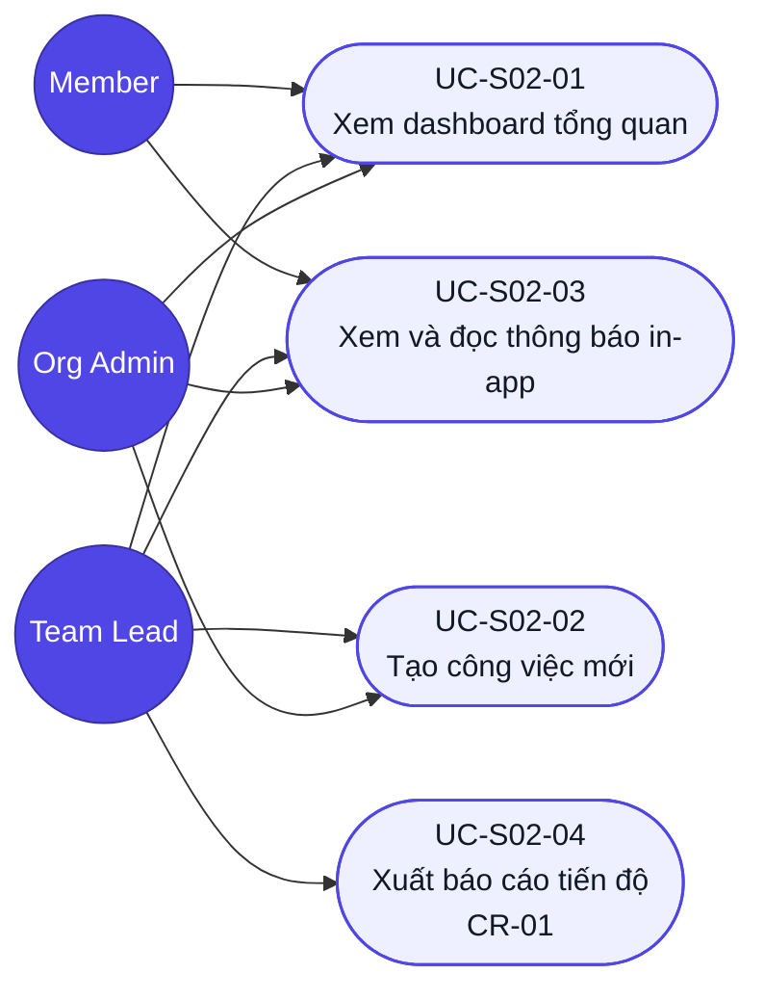

# Use case — Dashboard (Mã màn: S02)

## Sơ đồ Use case (tổng quan)
> Tác nhân ↔ use case của màn Dashboard. **Member không có đường tới UC-S02-02** — đúng `BRule-S02-03` (Member không thấy nút "Tạo công việc", API trả 403).

*Phạm vi dữ liệu mỗi vai trò nhìn thấy ở `UC-S02-01` khác nhau theo `BRule-S02-01` — sơ đồ chỉ thể hiện "ai làm được use case nào", không thể hiện phạm vi dữ liệu.*

---

## UC-S02-01: Xem dashboard tổng quan
- **Tác nhân (actor):** Member, Team Lead, Org Admin (đã xác thực)
- **Trigger:** Người dùng đăng nhập thành công, hoặc mở /dashboard, hoặc click logo
- **Tiền điều kiện:** Có session hợp lệ; thuộc một tổ chức ACTIVE
- **Luồng chính (happy path):**
  1. Người dùng vào /dashboard.
  2. Hệ thống hiện skeleton, gọi GET /tasks và GET /notifications theo phạm vi vai trò (BRule-S02-01).
  3. Hệ thống render 5 thẻ thống kê, danh sách công việc (sắp deadline tăng dần, 20 dòng/trang), badge thông báo chưa đọc.
  4. Người dùng xem tổng quan; có thể lọc theo trạng thái/ưu tiên, tìm theo tiêu đề, hoặc click thẻ thống kê để lọc nhanh.
  5. Người dùng click một dòng → hệ thống điều hướng đến S03 Chi tiết công việc.
- **Luồng thay thế / ngoại lệ:**
  - 2a. Chưa xác thực → redirect /login (≤ 100ms).
  - 2b. API lỗi → hiện thông báo lỗi + nút "Thử lại"; nhấn Thử lại quay về bước 2.
  - 3a. Không có công việc nào → empty state; Team Lead/Admin thấy thêm gợi ý tạo việc đầu tiên.
  - 4a. Lọc/tìm không có kết quả → "Không tìm thấy công việc phù hợp" + nút xoá bộ lọc.
- **Hậu điều kiện (postcondition):** Người dùng nắm được tình hình công việc; bộ lọc đang áp (nếu có) giữ trong phiên xem.
- **Đảm bảo (guarantees):** thành công — dữ liệu hiển thị đúng phạm vi vai trò và tổ chức (NFR-06); tối thiểu — không lộ dữ liệu tổ chức khác kể cả khi API lỗi.
- **Trace:** R-S02-01 … R-S02-06, R-S02-N01, R-S02-N03

## UC-S02-02: Tạo công việc mới
- **Tác nhân (actor):** Team Lead, Org Admin
- **Trigger:** Nhấn nút "+ Tạo công việc" trên Dashboard
- **Tiền điều kiện:** Đã xác thực với vai trò TEAM_LEAD hoặc ORG_ADMIN; tổ chức có ≥ 1 thành viên ACTIVE
- **Luồng chính (happy path):**
  1. Tác nhân nhấn "+ Tạo công việc" → modal mở (bước 1/3).
  2. Tác nhân điền Tiêu đề, chọn Người thực hiện (dropdown chỉ thành viên ACTIVE cùng tổ chức, tìm được theo tên), chọn Deadline, chọn Ưu tiên (mặc định Trung bình), Mô tả tuỳ chọn (bước 2/3).
  3. Hệ thống validate inline từng field theo bảng Validation trong srs; đủ hợp lệ thì nút "Tạo công việc" enable.
  4. Tác nhân nhấn "Tạo công việc" (bước 3/3) → hệ thống gửi POST /tasks.
  5. Hệ thống nhận 201: đóng modal, toast "Đã tạo công việc", việc mới hiện đầu danh sách, thẻ Tổng/Cần làm +1.
  6. Hệ thống sinh thông báo TASK_ASSIGNED cho người được giao (trừ khi tự giao — BRule-S02-06).
- **Luồng thay thế / ngoại lệ:**
  - 2a. Deadline chọn ở quá khứ → lỗi inline "Deadline không được ở quá khứ" (BRule-S02-04); không gửi API.
  - 2b. Tiêu đề rỗng/toàn khoảng trắng hoặc > 200 ký tự → lỗi inline tương ứng; nút Tạo disable.
  - 4a. API trả 4xx/5xx hoặc mất mạng → modal không đóng, dữ liệu giữ nguyên, báo lỗi cụ thể (R-S02-11).
  - 4b. Member gọi thẳng API (bypass UI) → server trả 403 (BRule-S02-03).
  - 1a. Tác nhân nhấn [×] hoặc Huỷ → modal đóng, không lưu gì; nếu đã nhập dữ liệu, hỏi xác nhận "Bỏ nội dung đã nhập?".
- **Hậu điều kiện:** Công việc mới tồn tại với trạng thái TODO, đủ người giao/người nhận/deadline (BR-02).
- **Đảm bảo:** thành công — việc được tạo đúng dữ liệu nhập và người nhận có thông báo; tối thiểu — không tạo bản ghi rác khi API thất bại.
- **Trace:** R-S02-07 … R-S02-11, R-S02-N02, R-S02-N04

## UC-S02-03: Xem và đọc thông báo in-app
- **Tác nhân (actor):** Member, Team Lead, Org Admin
- **Trigger:** Click chuông 🔔 trên header (badge đang hiện số chưa đọc)
- **Tiền điều kiện:** Đã xác thực; có ≥ 0 thông báo
- **Luồng chính (happy path):**
  1. Tác nhân click chuông → panel mở, danh sách thông báo mới → cũ, dòng chưa đọc nền nhấn.
  2. Tác nhân click một thông báo.
  3. Hệ thống gọi PATCH /notifications/:id/read → item chuyển đã đọc, badge −1.
  4. Hệ thống điều hướng đến công việc liên quan (/tasks/:id theo tham_chieu_id).
- **Luồng thay thế / ngoại lệ:**
  - 1a. Không có thông báo nào → panel hiện "Chưa có thông báo".
  - 2a. Tác nhân nhấn "Đọc tất cả" → PATCH /notifications/read-all; badge ẩn, mọi item chuyển đã đọc; panel giữ mở.
  - 3a. API đánh dấu đọc lỗi → vẫn điều hướng đến công việc (ưu tiên luồng người dùng), thử đánh dấu lại ở lần poll sau.
  - 4a. Công việc tham chiếu đã bị xoá/không truy cập được → thông báo "Công việc không còn tồn tại", ở lại Dashboard.
- **Hậu điều kiện:** Thông báo đã click chuyển trạng thái đã đọc; badge phản ánh đúng số chưa đọc.
- **Đảm bảo:** thành công — không mất thông báo nào; tối thiểu — badge không hiển thị sai lệch quá chu kỳ polling 60 giây (R-S02-16).
- **Trace:** R-S02-12 … R-S02-16

---

## UC-S02-04: Xuất báo cáo tiến độ *(CR-01)*
- **Tác nhân (actor):** Team Lead, Org Admin *(Member không có đường tới use case này — `BRule-S02-08`)*
- **Trigger:** Nhấn nút "Xuất báo cáo" trên dashboard
- **Tiền điều kiện:** Đã xác thực với vai trò Team Lead/Org Admin; dashboard đang hiển thị với một bộ lọc bất kỳ
- **Luồng chính (happy path):**
  1. Tác nhân đặt bộ lọc mong muốn (trạng thái/ưu tiên/từ khoá) trên dashboard.
  2. Tác nhân nhấn "Xuất báo cáo".
  3. Hệ thống hỏi định dạng: **PDF** hoặc **Excel**.
  4. Tác nhân chọn định dạng.
  5. Hệ thống gửi `POST /reports/export` kèm **đúng bộ lọc hiện tại**.
  6. Máy chủ dựng báo cáo trong phạm vi dữ liệu theo vai trò (`BRule-S02-01`) và trả tệp.
  7. Trình duyệt tải tệp về; nội dung khớp bảng đang hiển thị.
- **Luồng thay thế / ngoại lệ:**
  - **[2a] Member gọi thẳng API:** máy chủ trả `403` (`R-S02-N07`) — không có nút trên giao diện, nhưng phòng thủ ở server.
  - **[5a] Không có công việc nào khớp bộ lọc:** vẫn xuất được, báo cáo ghi rõ "Không có công việc" thay vì tệp rỗng gây hiểu nhầm.
  - **[6a] Lỗi máy chủ khi dựng báo cáo (5xx):** toast "Không xuất được báo cáo — thử lại"; không tải tệp hỏng.
- **Hậu điều kiện:** Tác nhân có tệp báo cáo phản ánh đúng bộ lọc và phạm vi quyền tại thời điểm xuất.
- **Đảm bảo:** thành công — báo cáo khớp dữ liệu đang xem; tối thiểu — không rò công việc ngoài phạm vi vai trò qua tệp xuất.
- **Trace:** R-S02-17, R-S02-18, R-S02-N07, BRule-S02-08, CR-01

> Đăng xuất từ header thuộc UC của màn S01 (R-S01-09) — Dashboard chỉ là điểm truy cập.
