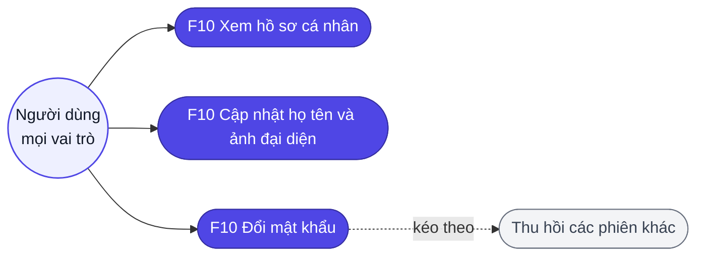
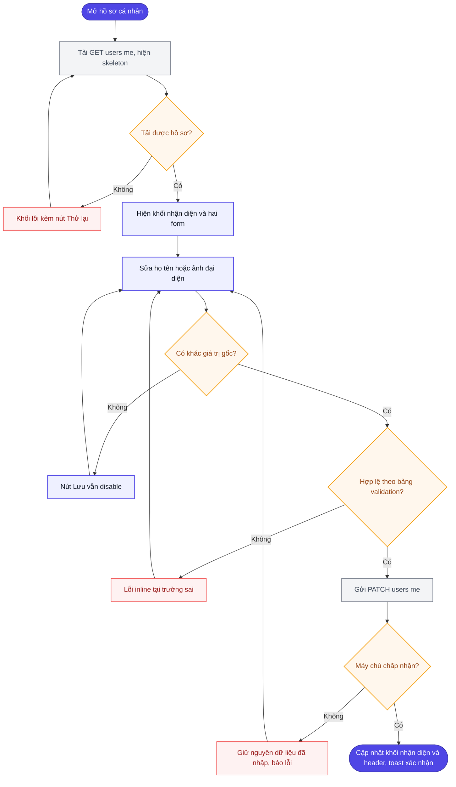
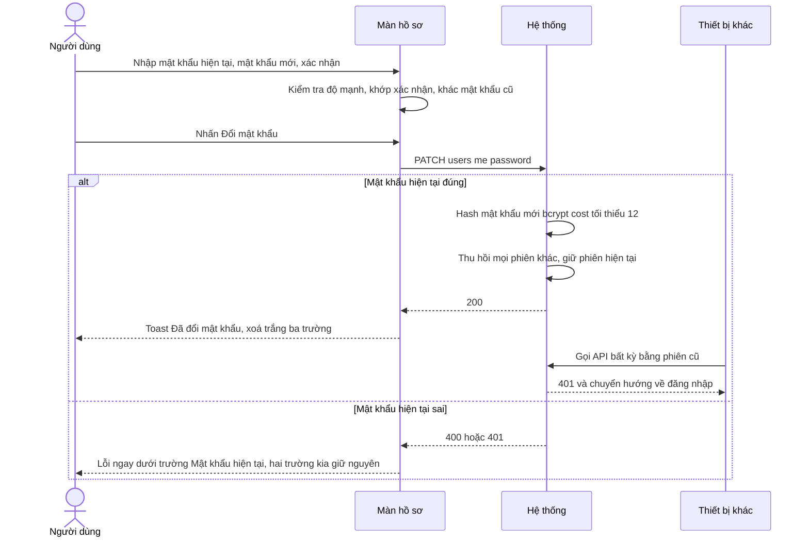
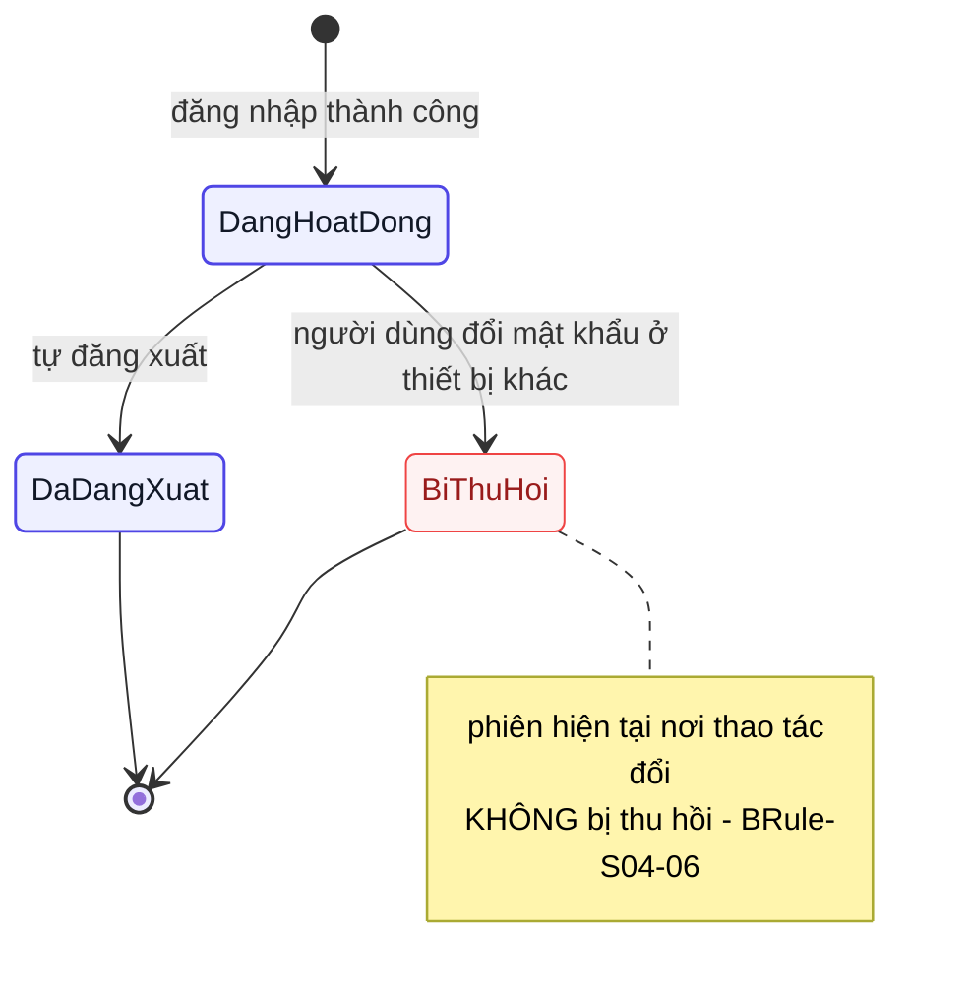
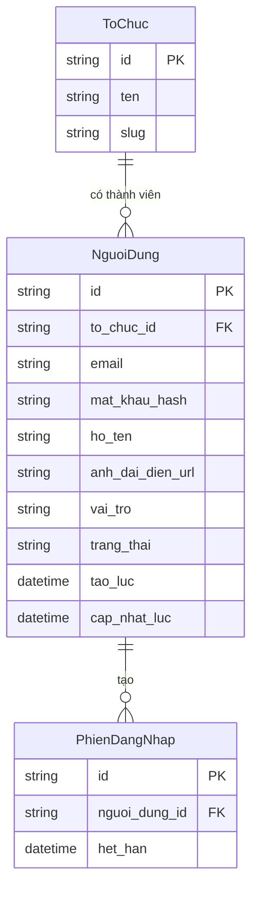

# Đặc tả yêu cầu — Hồ sơ cá nhân (Mã màn: S04)

## Chức năng & truy vết nguồn
Trace: F10 → FR-11 → BR-03.
Màn tự phục vụ: mọi thao tác chỉ tác động lên hồ sơ của **chính người đang đăng nhập** (`/users/me`). Quản trị người khác (đổi vai trò, vô hiệu hoá) thuộc **F13**, đặc tả tại **S05**.

> **Phạm vi ảnh đại diện.** `05-data-model.md` định nghĩa `anh_dai_dien_url` là **URL** và `06-api-spec.md` không có endpoint tải tệp lên nào. Màn này đặc tả **nhập đường dẫn ảnh**, không tải tệp — xem `GĐ-01` trong `brainstorm.md`.

## Phạm vi màn

**Màn này lo:** xem và sửa hồ sơ **của chính mình** (họ tên, ảnh đại diện), **đổi mật khẩu**, và là nơi gỡ cờ buộc đổi mật khẩu của `CR-02`.

**Màn này KHÔNG lo** *(nêu nơi xử lý thay)*:
- Sửa hồ sơ **người khác**, đổi vai trò, vô hiệu hoá tài khoản — *thuộc `S05` Tổ chức (`F13`), quyền Org Admin*.
- Đổi email — *ngoài phạm vi giai đoạn 1 (`BRule-S04-02`): email là định danh đăng nhập*.
- Khôi phục mật khẩu khi quên — *ngoài phạm vi giai đoạn 1; Org Admin reset thủ công ở `S05`*.

## Tác nhân & hệ thống ngoài

| Tác nhân | Loại | Vai trò ở màn này | Trong phạm vi? |
|----------|------|-------------------|----------------|
| Người dùng đã đăng nhập (mọi vai trò) | người | Xem/sửa hồ sơ của mình, đổi mật khẩu | Có |
| API Backend (nội bộ) | hệ thống | Đọc/ghi `/users/me`, xác minh mật khẩu hiện tại, thu hồi phiên khác | Có |

> Màn này **không gọi hệ thống bên thứ ba**. Ảnh đại diện chỉ nhận **đường dẫn `https://` do người dùng tự cung cấp** — hệ thống không lưu trữ tệp ảnh, nên không phụ thuộc dịch vụ lưu trữ nào.

## Yêu cầu chức năng (Functional)

| Mã | Yêu cầu (hệ thống phải...) | Trace F/FR | Nguồn | Lý do (rationale) | Acceptance criteria (đo được) | Kiểm chứng | Ưu tiên |
|----|----------------------------|------------|-------|-------------------|-------------------------------|-----------|---------|
| R-S04-01 | Hiển thị hồ sơ người đang đăng nhập từ `GET /users/me`: ảnh đại diện, họ tên, email, vai trò, tổ chức, ngày tham gia | F10 / FR-11 | brainstorm.md (màn) | Cho người dùng xem thông tin tài khoản của chính mình (F10 tự phục vụ) | Đủ 6 thông tin, giá trị khớp response API; không có lời gọi nào tới hồ sơ người khác | test | Must |
| R-S04-02 | Hiển thị chữ cái đầu của họ tên trên nền màu khi `anh_dai_dien_url` rỗng | F10 / FR-11 | brainstorm.md (màn) | Luôn có ảnh đại diện nhận diện được kể cả khi chưa đặt ảnh (GĐ-S04-01) | `anh_dai_dien_url` rỗng → hiện đúng ký tự đầu (viết hoa) của họ tên; màu nền sinh ổn định từ họ tên (cùng tên cho cùng màu) | test | Should |
| R-S04-03 | Cho phép sửa **Họ tên** trong form Thông tin cá nhân | F10 / FR-11 | brainstorm.md (màn) | Cho phép người dùng tự cập nhật họ tên hiển thị | Trường sửa được, ràng buộc theo bảng Validation; bộ đếm ký tự `n/100` hiển thị realtime | test | Must |
| R-S04-04 | Cho phép sửa **Ảnh đại diện** bằng cách nhập đường dẫn ảnh | F10 / FR-11 | brainstorm.md (màn) | Cho phép người dùng tự đặt ảnh đại diện bằng đường dẫn — giai đoạn 1 không tải tệp lên (GĐ-S04-01) | Trường nhận chuỗi URL bắt đầu `https://`; bỏ trống hợp lệ (quay về chữ cái đầu) | test | Should |
| R-S04-05 | Hiển thị **Email, Vai trò, Tổ chức** ở chế độ chỉ đọc, kèm biểu tượng khoá và một câu giải thích vì sao không sửa được | F10 / FR-11 | brainstorm.md (màn) | Email/vai trò/tổ chức do hệ thống/Org Admin quản, không cho tự đổi để giữ toàn vẹn định danh và phân quyền (GĐ-S04-02, GĐ-S04-05, BR-03) | Ba giá trị không nằm trong bất kỳ ô nhập nào; mỗi giá trị có chú thích ngắn (vd "do quản trị viên đặt") | demonstration | Must |
| R-S04-06 | Chỉ bật nút "Lưu thay đổi" khi có ít nhất một trường khác giá trị gốc | F10 / FR-11 | brainstorm.md (màn) | Tránh gọi API và ghi lịch sử vô ích khi không có thay đổi thực sự | Mở màn → nút disable; sửa rồi hoàn tác về giá trị cũ → nút disable lại; không gọi API khi không có thay đổi | test | Should |
| R-S04-07 | Lưu thông tin cá nhân qua `PATCH /users/me`; thành công thì cập nhật khối nhận diện và hiện thông báo xác nhận | F10 / FR-11 | brainstorm.md (màn) | Lưu thay đổi hồ sơ và phản hồi để người dùng biết đã cập nhật | API gọi đúng 1 lần, chỉ gửi trường đã đổi; sau 200: tên trên khối nhận diện và trên header đổi theo, toast "Đã cập nhật hồ sơ" | test | Must |
| R-S04-08 | Giữ nguyên dữ liệu đã nhập và báo lỗi cụ thể khi lưu thất bại | F10 / FR-11 | brainstorm.md (màn) | Không để người dùng mất công nhập lại khi lỗi tạm thời | Form không reset; mọi giá trị đã nhập còn nguyên; thông báo lỗi hiện trên form theo mã lỗi API | test | Must |
| R-S04-09 | Cảnh báo trước khi rời màn nếu còn thay đổi chưa lưu | F10 / FR-11 | brainstorm.md (màn) | Tránh mất thay đổi ngoài ý muốn khi rời màn | Có thay đổi chưa lưu + nhấn điều hướng đi → hộp "Bạn có thay đổi chưa lưu" với hai lựa chọn Ở lại / Rời đi | test | Could |
| R-S04-10 | Cung cấp form Đổi mật khẩu gồm ba trường: Mật khẩu hiện tại, Mật khẩu mới, Xác nhận mật khẩu mới — tách riêng khỏi form Thông tin cá nhân | F10 / FR-11 | brainstorm.md (màn) | Tách form đổi mật khẩu để thao tác nhạy cảm không lẫn với sửa thông tin thường | Ba trường + nút "Đổi mật khẩu" riêng; sửa họ tên **không** yêu cầu nhập mật khẩu | test | Must |
| R-S04-11 | Hiển thị thanh đo độ mạnh mật khẩu theo thời gian thực cho trường Mật khẩu mới, cùng 3 mức với S06 | F10 / FR-11 | brainstorm.md (màn) | Giúp người dùng đặt mật khẩu mới đủ mạnh (BR-03), nhất quán với S06 | Thanh hiện ngay ký tự đầu tiên, cập nhật mỗi ký tự, phân mức Yếu / Trung bình / Mạnh giống `R-S06-03` | demonstration | Should |
| R-S04-12 | Kiểm tra Xác nhận mật khẩu mới khớp Mật khẩu mới khi rời khỏi trường xác nhận | F10 / FR-11 | brainstorm.md (màn) | Ngăn đặt mật khẩu mới gõ nhầm mà người dùng không tự nhận ra | Không khớp → lỗi inline "Mật khẩu xác nhận không khớp."; nút "Đổi mật khẩu" disable | test | Must |
| R-S04-13 | Từ chối mật khẩu mới trùng mật khẩu hiện tại | F10 / FR-11 | brainstorm.md (màn) | Buộc mật khẩu mới khác cũ để việc đổi thực sự có ý nghĩa bảo mật (BRule-S04-05) | Nhập mật khẩu mới giống hiện tại → lỗi "Mật khẩu mới phải khác mật khẩu hiện tại"; không gọi API | test | Must |
| R-S04-14 | Đổi mật khẩu qua `PATCH /users/me/password`; sai mật khẩu hiện tại thì báo lỗi ngay tại trường đó mà **không** xoá các trường còn lại | F10 / FR-11 | brainstorm.md (màn) | Xác minh đúng chủ tài khoản trước khi đổi, chống chiếm phiên bỏ ngỏ rồi đổi mật khẩu (BRule-S04-04) | Sai mật khẩu hiện tại → API trả `400`/`401`, lỗi hiện dưới trường "Mật khẩu hiện tại", hai trường còn lại giữ nguyên giá trị | test | Must |
| R-S04-15 | Sau khi đổi mật khẩu thành công: thu hồi **mọi phiên khác** của người dùng, **giữ nguyên phiên hiện tại** | F10 / FR-11 | brainstorm.md (màn) | Cắt truy cập của kẻ có thể đang giữ phiên cũ sau khi đổi mật khẩu (BRule-S04-06, BR-03); giữ phiên hiện tại để người dùng không bị đá ra | Thiết bị khác bị đăng xuất ở lần gọi API kế tiếp; người dùng vẫn ở lại màn S04, không bị đá về `/login`; toast "Đã đổi mật khẩu" | test | Must |
| R-S04-16 | Xoá trắng cả ba trường mật khẩu sau khi đổi thành công | F10 / FR-11 | brainstorm.md (màn) | Dọn trường nhạy cảm sau khi đổi để không lưu lại mật khẩu trên màn | Ba trường trống, thanh đo độ mạnh biến mất, nút "Đổi mật khẩu" trở lại disable | test | Should |
| R-S04-17 | Cung cấp toggle hiện/ẩn cho từng trường mật khẩu, hoạt động độc lập nhau | F10 / FR-11 | brainstorm.md (màn) | Giúp người dùng kiểm tra từng mật khẩu đã gõ đúng chưa, giảm lỗi nhập | Nhấn 👁 trên một trường chỉ đổi trường đó giữa `type=password` và `type=text`; hai trường kia không đổi | demonstration | Could |

## Yêu cầu phi chức năng (Non-functional)

| Mã | Loại | Yêu cầu đo được | Trace |
|----|------|-----------------|-------|
| R-S04-N01 | Bảo mật | Mật khẩu mới hash bằng bcrypt cost ≥ 12 trước khi lưu; không bao giờ lưu hay ghi log dưới dạng plaintext | NFR-02 / BR-03 |
| R-S04-N02 | Bảo mật | Mật khẩu mới tối thiểu 8 ký tự, chứa ít nhất một chữ cái và một chữ số — cùng luật với `R-S06-N02` | NFR-02 / BR-03 |
| R-S04-N03 | Bảo mật | Mật khẩu hiện tại và mật khẩu mới không xuất hiện trong URL, query string, log ứng dụng hay báo cáo lỗi | NFR-02 / BR-03 |
| R-S04-N04 | Bảo mật | Giới hạn số lần thử đổi mật khẩu sai: 5 lần sai trong 15 phút → chặn thao tác đổi mật khẩu 15 phút, cùng ngưỡng 5 lần/15 phút với `NFR-03`, nhưng chỉ chặn thao tác đổi mật khẩu (không khoá đăng nhập) | NFR-03 / BR-03 |
| R-S04-N05 | Bảo mật / dữ liệu | Màn chỉ đọc và ghi được hồ sơ của chính người đăng nhập; không tồn tại đường nào đọc hồ sơ người khác từ màn này | NFR-06 / BR-03 |
| R-S04-N06 | Khả năng tiếp cận | Mọi ô nhập có nhãn liên kết; lỗi công bố qua `role="alert"`; trường bắt buộc có `aria-required`; thao tác đủ bằng bàn phím; tương phản ≥ 4.5:1 | NFR-07 / BR-01 |
| R-S04-N07 | Hiệu năng | Tải màn hồ sơ hoàn tất ≤ 2 giây ở p95 với 200 người dùng đồng thời | NFR-01 / BR-01 |

## Quy tắc nghiệp vụ (Business Rules)

| Mã | Quy tắc | Kích hoạt khi | Trace |
|----|---------|---------------|-------|
| BRule-S04-01 | Người dùng chỉ xem và sửa được hồ sơ **của chính mình** — mọi lời gọi đi qua `/users/me`, không nhận tham số id người khác | Mọi lời gọi đọc/ghi hồ sơ từ màn này | R-S04-01, R-S04-N05 |
| BRule-S04-02 | **Email không sửa được** ở giai đoạn 1 — email là định danh đăng nhập và duy nhất toàn hệ thống (`FR-13`) | Khi render form hồ sơ (ô Email ở trạng thái chỉ đọc) và khi nhận `PATCH /users/me` | R-S04-05 |
| BRule-S04-03 | **Vai trò không tự sửa được** — chỉ Org Admin đổi vai trò người khác tại S05 (`F13`); nếu không, mọi Member đều tự nâng quyền | Khi render form hồ sơ (ô Vai trò chỉ đọc) và khi nhận `PATCH /users/me` | R-S04-05 |
| BRule-S04-04 | Đổi mật khẩu **bắt buộc** nhập đúng mật khẩu hiện tại — chống việc chiếm phiên bỏ ngỏ rồi đổi mật khẩu | Khi người dùng submit form đổi mật khẩu | R-S04-14 |
| BRule-S04-05 | Mật khẩu mới **phải khác** mật khẩu hiện tại | Khi validate mật khẩu mới lúc submit đổi mật khẩu | R-S04-13 |
| BRule-S04-06 | Đổi mật khẩu thành công → **thu hồi mọi phiên khác**, giữ phiên hiện tại (chú thích ⁶ của `02-functions.md`) | Ngay sau khi đổi mật khẩu thành công | R-S04-15 |
| BRule-S04-07 | Ảnh đại diện rỗng → hiển thị chữ cái đầu họ tên; màu nền sinh **ổn định** từ họ tên để cùng một người luôn cùng một màu | Khi render ảnh đại diện mà trường ảnh rỗng | R-S04-02 |
| BRule-S04-08 | Ảnh đại diện chỉ nhận đường dẫn `https://` — không nhận `http://` (nội dung hỗn hợp) lẫn `data:` (nhúng dữ liệu tuỳ ý) | Khi người dùng nhập/dán đường dẫn ảnh đại diện và khi nhận `PATCH /users/me` | R-S04-04 |

## Bảng mô tả chi tiết phần tử màn hình
| # | Tên phần tử | Control type | Data Type | Bắt buộc | Mô tả | Trace |
|---|-------------|--------------|-----------|----------|-------|-------|
| 1 | Quay lại Dashboard | Link | Action | — | Trở về danh sách công việc | R-S04-01 |
| 2 | Khối nhận diện | Card | Object | — | Ảnh đại diện, tên, email, vai trò, tổ chức, ngày tham gia | R-S04-02 |
| 3 | Họ tên | Input | String | Có | Tên hiển thị; kèm bộ đếm ký tự | R-S04-03 |
| 4 | Ảnh đại diện | Input | String | Không | Đường dẫn ảnh công khai (https); bỏ trống thì dùng chữ cái đầu tên | R-S04-04 |
| 5 | Email | Label | String | — | Email tài khoản, **không sửa được** | R-S04-05 |
| 6 | Lưu thay đổi | Button | Action | — | Ghi thông tin cá nhân vừa sửa | R-S04-06 |
| 7 | Huỷ | Button | Action | — | Bỏ thay đổi, trả form về giá trị ban đầu | R-S04-07 |

## Yêu cầu dữ liệu — Validation từng field

**Form "Thông tin cá nhân" (`PATCH /users/me`)**

| Field | Kiểu | Bắt buộc | Định dạng/Ràng buộc | Min/Max | Thông báo lỗi |
|-------|------|----------|---------------------|---------|---------------|
| ho_ten | chuỗi | Có | không chỉ toàn khoảng trắng; cắt khoảng trắng thừa hai đầu trước khi lưu | 1–100 ký tự | "Vui lòng nhập họ tên" / "Họ tên tối đa 100 ký tự" |
| anh_dai_dien_url | chuỗi | Không | phải bắt đầu `https://`; là URL hợp lệ; bỏ trống = xoá ảnh | ≤ 2048 ký tự | "Đường dẫn ảnh phải bắt đầu bằng https://" / "Đường dẫn ảnh không hợp lệ" |

**Form "Đổi mật khẩu" (`PATCH /users/me/password`)**

| Field | Kiểu | Bắt buộc | Định dạng/Ràng buộc | Min/Max | Thông báo lỗi |
|-------|------|----------|---------------------|---------|---------------|
| mat_khau_hien_tai | chuỗi | Có | đối chiếu hash ở máy chủ | 8–128 ký tự | "Vui lòng nhập mật khẩu hiện tại" / "Mật khẩu hiện tại không đúng." |
| mat_khau_moi | chuỗi | Có | ≥1 chữ cái + ≥1 chữ số; phải khác `mat_khau_hien_tai` | 8–128 ký tự | "Mật khẩu tối thiểu 8 ký tự gồm chữ và số" / "Mật khẩu mới phải khác mật khẩu hiện tại" |
| xac_nhan_mat_khau_moi | chuỗi | Có | trùng khớp `mat_khau_moi` | 8–128 ký tự | "Mật khẩu xác nhận không khớp." |

- **Đầu ra màn hình:** một bản ghi `NguoiDung` của chính người đăng nhập (không gồm `mat_khau_hash`).
- **API sử dụng:** `GET /users/me` · `PATCH /users/me` · `PATCH /users/me/password`.

## Ma trận lỗi

| Mã | Lỗi | Xảy ra khi | Mức | Trace | Người dùng thấy gì | Lối thoát |
|----|-----|-----------|-----|-------|--------------------|-----------|
| E-S04-01 | Phiên hết hạn khi mở hồ sơ | Access token hết hạn lúc tải trang | major | R-S04-N05 | Chuyển `/login`; **không thông tin cá nhân nào kịp render** | Đăng nhập lại (`S01`) |
| E-S04-02 | Không tải được hồ sơ | API `/users/me` lỗi/timeout | major | R-S04-01 | Khối lỗi + nút "Thử lại"; header vẫn còn | Bấm "Thử lại" |
| E-S04-03 | Cố xem/sửa hồ sơ người khác | Gọi endpoint có id người khác | major | R-S04-N05 / BRule-S04-01 | Trả `404`/`405` — màn **chỉ** gọi `/users/me`, không endpoint nào nhận id người khác | Không có — hành vi bảo mật có chủ đích |
| E-S04-04 | Họ tên rỗng hoặc toàn khoảng trắng | Submit form hồ sơ với họ tên rỗng | minor | R-S04-03 | Lỗi "Vui lòng nhập họ tên"; nút "Lưu thay đổi" disable | Nhập họ tên |
| E-S04-05 | Họ tên vượt 100 ký tự | Nhập họ tên dài hơn 100 ký tự | minor | R-S04-03 | Lỗi "Họ tên tối đa 100 ký tự"; bộ đếm `101/100` đỏ; nút Lưu disable | Rút ngắn họ tên |
| E-S04-06 | Đường dẫn ảnh không phải `https://` | Nhập ảnh đại diện dạng `http://` hoặc `data:` | minor | R-S04-04 / BRule-S04-08 | Lỗi "Đường dẫn ảnh phải bắt đầu bằng https://"; nút Lưu disable; không gọi API | Dùng đường dẫn `https://` |
| E-S04-07 | Mất kết nối khi lưu hồ sơ | Mạng ngắt lúc submit | major | R-S04-08 / UE-05 | Giá trị vừa nhập **còn nguyên** trong ô, thông báo lỗi kết nối trên form, **form không reset về giá trị cũ** | Bấm Lưu lại khi có mạng |
| E-S04-08 | Cố sửa trường không cho phép | Gửi `email` hoặc `vai_tro` trong `PATCH /users/me` | major | BRule-S04-02, BRule-S04-03 | Máy chủ **bỏ qua** trường không cho sửa; chỉ `ho_ten` được áp dụng | Không có — đổi email/vai trò phải qua `S05` |
| E-S04-09 | Mật khẩu hiện tại không đúng | Đổi mật khẩu với mật khẩu hiện tại sai | major | R-S04-14 / BRule-S04-04 | API `400`/`401`; lỗi "Mật khẩu hiện tại không đúng." hiện **ngay dưới trường Mật khẩu hiện tại** | Nhập lại đúng mật khẩu hiện tại |
| E-S04-10 | Mật khẩu mới trùng mật khẩu cũ | Nhập mật khẩu mới giống mật khẩu hiện tại | minor | R-S04-13 / BRule-S04-05 | Lỗi "Mật khẩu mới phải khác mật khẩu hiện tại"; nút disable; **không** gọi API | Chọn mật khẩu khác |
| E-S04-11 | Xác nhận mật khẩu không khớp | Hai ô mật khẩu mới khác nhau | minor | R-S04-12 | Lỗi "Mật khẩu xác nhận không khớp."; nút "Đổi mật khẩu" disable | Nhập lại cho khớp |
| E-S04-12 | Mật khẩu mới không đạt chính sách | Mật khẩu mới < 8 ký tự hoặc thiếu chữ/số | minor | R-S04-N02 | Lỗi "Mật khẩu tối thiểu 8 ký tự gồm chữ và số"; nút disable | Đặt mật khẩu đạt chính sách |
| E-S04-13 | Bị chặn đổi mật khẩu do thử sai nhiều lần | Nhập sai mật khẩu hiện tại 5 lần | major | R-S04-N04 | Thao tác đổi mật khẩu bị chặn 15 phút; thông báo ghi rõ **thời gian còn lại**; lần thứ 6 dù đúng cũng bị chặn | Chờ hết 15 phút rồi thử lại |
| E-S04-14 | Mất kết nối khi đổi mật khẩu | Mạng ngắt lúc submit form đổi mật khẩu (`UC-S04-03` 4a) | major | R-S04-N04 / UC-S04-03 | Giữ nguyên 3 trường mật khẩu; hiện "Lỗi kết nối — thử lại"; không gọi máy chủ | Bấm Đổi mật khẩu lại khi có mạng |

## Phụ thuộc ngoài

| Phụ thuộc | Ai sở hữu | Chặn gì nếu chưa sẵn sàng |
|-----------|-----------|---------------------------|
| API `GET/PATCH /users/me` · `PATCH /users/me/password` (`06-api-spec.md`) | Đội backend nội bộ | Toàn màn không dùng được |
| Cơ chế thu hồi phiên (`BRule-S04-06`) | Đội backend nội bộ | Đổi mật khẩu vẫn chạy nhưng **phiên cũ không bị thu hồi** — hở bảo mật `BR-03` |

*(Không phụ thuộc dịch vụ bên thứ ba nào — ảnh đại diện là đường dẫn ngoài do người dùng tự cung cấp.)*

## Giả định & Ràng buộc

> 29148 tách **giả định** (điều ta *tin là đúng* nhưng chưa xác nhận — sai thì yêu cầu lung lay) khỏi **ràng buộc** (giới hạn *bắt buộc tuân*, không thương lượng). Khác "Phụ thuộc ngoài" (thứ bên khác *sở hữu* mà màn cần).

**Giả định** *(mỗi cái trạng thái `Đề xuất → Đã xác nhận / Đã sửa / Đã bỏ / 🔓 Chấp nhận rủi ro`; còn `⚠️ chưa xác nhận` → `ba-review` chấm 🟠, `Mốc = ba-build`)*

| Mã | Giả định | Vì sao cần | Ảnh hưởng nếu sai | Trạng thái |
|----|----------|-----------|-------------------|-----------|
| GĐ-S04-01 | **Ảnh đại diện nhập bằng URL, không tải tệp lên** — giai đoạn 1 người dùng dán một đường dẫn ảnh công khai | `05-data-model.md` định nghĩa `anh_dai_dien_url` là URL; `06-api-spec.md` không có endpoint tải tệp | Sai → phải thêm endpoint upload + nơi lưu trữ + luật dung lượng/định dạng/quét mã độc → chạm `06-api-spec.md`, `10-architecture.md` | Đã xác nhận (2026-07-22) *(brainstorm GĐ-01)* |
| GĐ-S04-02 | **Email không đổi được** ở giai đoạn 1 — hiển thị chỉ đọc | Email là định danh đăng nhập và duy nhất toàn hệ thống (`FR-13`); không có luồng đổi email | Sai → phải thêm luồng xác minh email mới, trạng thái chờ xác minh, xử lý email mới đã tồn tại | Đã xác nhận (2026-07-22) *(brainstorm GĐ-02)* |
| GĐ-S04-03 | Người dùng **không tự xoá được tài khoản** của mình | Không `FR` nào nhắc tới; chỉ Admin "vô hiệu hoá" người khác | Sai → cần luật xử lý công việc đang gán cho người rời đi và ai kế thừa dữ liệu của họ | Đã xác nhận (2026-07-22) *(brainstorm GĐ-03)* |
| GĐ-S04-04 | **Không gửi email thông báo** khi mật khẩu vừa bị đổi | `F09` (email) giai đoạn 1 chỉ nhắc deadline; hạ tầng gửi mail còn chờ chốt (ADR Draft) | Sai → người dùng không được cảnh báo khi tài khoản bị chiếm và đổi mật khẩu → mở `CR` khi hạ tầng email sẵn sàng | Đã xác nhận (2026-07-22) *(brainstorm GĐ-04)* |
| GĐ-S04-05 | Vai trò và tổ chức hiển thị **chỉ đọc**; người dùng không tự đổi vai trò của mình | `F13` giao quyền đổi vai trò cho Org Admin (tại S05); nếu tự đổi được thì mọi Member tự nâng thành Org Admin | Sai (nếu thực ra cho phép) → thủng toàn bộ mô hình phân quyền `BR-03` | Đã xác nhận (2026-07-22) *(brainstorm GĐ-05)* |

**Ràng buộc** *(giới hạn bắt buộc — không phải BRule/NFR)*

| Mã | Ràng buộc | Nguồn | Ảnh hưởng tới thiết kế màn |
|----|-----------|-------|----------------------------|
| — | Không có ràng buộc riêng của màn (giới hạn "chỉ nhận URL ảnh, không upload" đã ghi ở giả định `GĐ-S04-01`) | — | — |

## Quét yêu cầu ngầm

> 9 chiều không ai viết ra cho tới khi hỏng — mỗi chiều rơi vào mã đã viết ở trên, `n/a — lý do`, hoặc câu hỏi mở `OQ-S04-..` (template `ba-screen-spec`, soát bởi `ba-feasible` luật 9).

| Chiều | Rơi vào đâu |
|-------|-------------|
| Kiểm dữ liệu vào | `E-S04-04` · `E-S04-05` · `E-S04-06` · `E-S04-12` — họ tên rỗng/quá 100 ký tự, ảnh không phải `https://`, mật khẩu mới không đạt chính sách; chặn trước khi gọi API |
| Kiểu hỏng | `E-S04-02` · `E-S04-07` · `E-S04-14` — tải hồ sơ lỗi có "Thử lại"; mất kết nối khi lưu hồ sơ và khi đổi mật khẩu đều giữ nguyên dữ liệu đã nhập |
| Gửi lặp / thử lại | `R-S04-07` (lưu hồ sơ gọi API đúng 1 lần) · `OQ-S04-01` (bấm "Đổi mật khẩu" hai lần) |
| Phân quyền | `BRule-S04-01` · `BRule-S04-03` · `E-S04-08` — chỉ đọc/ghi qua `/users/me`; không tự nâng vai trò, máy chủ bỏ qua `email`/`vai_tro` gửi lên |
| Đồng thời / thứ tự | `OQ-S04-02` |
| Vòng đời dữ liệu | `R-S04-N01` · `R-S04-16` · `GĐ-S04-03` — mật khẩu chỉ lưu dạng hash; ba trường mật khẩu dọn trắng sau khi đổi; tài khoản không tự xoá được (kết thúc vòng đời thuộc Org Admin ở `S05`) |
| Hệ ngoài chết | n/a — màn không gọi hệ thống bên thứ ba; ảnh đại diện là đường dẫn `https://` người dùng tự dán, hệ thống không lưu tệp nên không phụ thuộc dịch vụ lưu trữ nào; backend nội bộ không phản hồi đã nằm ở chiều Kiểu hỏng |
| Chuyển trạng thái | `R-S04-N04` · `E-S04-13` — đổi mật khẩu bình thường → bị chặn 15 phút sau 5 lần sai → mở lại khi hết hạn · `OQ-S04-03` (gỡ cờ buộc đổi mật khẩu của `CR-02`) |
| Quan sát / log | `R-S04-N03` (cấm mật khẩu trong URL/log/báo cáo lỗi) · `OQ-S04-04` (ghi vết lần đổi mật khẩu) |

**Câu hỏi mở từ quét**

| Mã | Câu hỏi | Chiều | Ai trả lời |
|----|---------|-------|-----------|
| OQ-S04-01 | Bấm "Đổi mật khẩu" hai lần liền (hoặc mạng chập chờn tự gửi lại): lần 1 đổi thành công thì lần 2 mang "mật khẩu hiện tại" đã cũ → `400`/`401` và **bị đếm vào 5 lần sai** của `R-S04-N04`. Nút có disable trong lúc chờ như `R-S01-03` không, và lần gửi trùng có được loại khỏi bộ đếm không? `R-S04-14` không nói | Gửi lặp / thử lại | PO + đội backend |
| OQ-S04-02 | Cùng một người mở hồ sơ ở hai tab/thiết bị và lưu gần như cùng lúc — bản sau ghi đè bản trước im lặng, hay báo "hồ sơ đã bị thay đổi, tải lại"? Và nếu Org Admin đổi vai trò/vô hiệu hoá người này ở `S05` trong lúc họ đang mở `S04`, màn hiển thị gì? Không yêu cầu nào nói thứ tự | Đồng thời / thứ tự | PO + đội backend |
| OQ-S04-03 | Phạm vi màn nói `S04` là nơi gỡ cờ `phai_doi_mat_khau` của `CR-02`, nhưng không `R-S04-..` nào nói **khi nào** cờ chuyển `true → false` (ngay khi `PATCH /users/me/password` trả 200?) và người đang mang cờ có được sửa họ tên trước khi đổi mật khẩu không | Chuyển trạng thái | PO (chủ `CR-02`) |
| OQ-S04-04 | Đổi mật khẩu thành công/thất bại và việc thu hồi phiên khác (`BRule-S04-06`) có cần ghi vết (ai, lúc nào, từ IP nào) để tra khi nghi tài khoản bị chiếm không? `GĐ-S04-04` đã bỏ email báo, nên nếu không ghi vết thì không còn dấu nào | Quan sát / log | PO + Org Admin |

## Sơ đồ luồng (Flow)

### 1. Tổng quan tác nhân ↔ chức năng (Use case)

### 2. Cập nhật thông tin cá nhân (Activity — một tác nhân)

### 3. Đổi mật khẩu và thu hồi phiên (Sequence)

### 4. Vòng đời một phiên đăng nhập khi đổi mật khẩu (State)

## Mô hình dữ liệu màn hình (ERD)

Trích từ `05-data-model.md` — các thực thể màn này đụng tới:

## Đối chiếu coverage sơ đồ

| Mục kiểm | Kết quả |
|---|---|
| Vai trò trong fact-list | Màn **một tác nhân** (người dùng thao tác trên chính mình) → dùng `flowchart TD` cho luồng cập nhật là đúng, **không** cần swimlane |
| Luồng đổi mật khẩu có bên thứ ba (thiết bị khác bị thu hồi) | Có — sơ đồ 3 thêm `participant TB`, thể hiện hệ quả thu hồi phiên |
| Mỗi điểm quyết định có ≥2 hướng ra có nhãn | Đạt — sơ đồ 2: `C` (2), `G` (2), `I` (2), `L` (2); sơ đồ 3 dùng `alt/else` (2 nhánh) |
| Không dead-end | Đạt — mọi nhánh lỗi quay lại `F` hoặc `B`; nhánh thành công kết ở `N` |
| Trạng thái phiên có đủ lối ra | Đạt — cả 3 state đều dẫn tới `[*]` |
| Mỗi thực thể ERD có PK, mỗi quan hệ có cardinality | Đạt — 3 thực thể có `PK`, 2 quan hệ ghi `||--o{` |
| Ngưỡng gate sơ đồ phức tạp (≥3 vai trò / ≥5 quyết định / có loop) | **Dưới ngưỡng** (1 tác nhân chính, 4 quyết định) → tự đối chiếu theo checklist là đủ, không cần `ba-review diagram` |

## Microcopy — câu chữ hiện cho người dùng
> Nguồn cho mục wording của `design-spec.md`. Mỗi câu phải nói rõ **hiện khi nào** và **trace về đâu**: câu chữ đứng một mình trong bản thiết kế thì lúc code không ai biết điều kiện hiển thị, và câu nào hàm ý một luật thì luật đó phải tồn tại ở trên.

| Câu (nguyên văn) | Hiện khi nào | Trace |
|---|---|---|
| `Dán đường dẫn ảnh công khai (https). Bỏ trống để dùng chữ cái đầu tên bạn.` | Gợi ý dưới trường Ảnh đại diện, hiện thường trực | `R-S04-04` |
| `Tối thiểu 8 ký tự, gồm ít nhất một chữ cái và một chữ số.` | Gợi ý dưới trường Mật khẩu mới, hiện thường trực | `R-S04-10` |
| `Đổi mật khẩu sẽ đăng xuất bạn khỏi mọi thiết bị khác.` | Trong form Đổi mật khẩu, trước khi submit — báo trước hệ quả của `R-S04-15` | `R-S04-15` |
| `Rời khỏi trang này sẽ mất các thay đổi chưa được lưu.` | Hộp xác nhận khi rời màn mà còn thay đổi chưa lưu | `R-S04-09` |

## Thuật ngữ
| Thuật ngữ | Giải thích |
|---|---|
| SRS (Software Requirements Specification) | Đặc tả yêu cầu chi tiết cho một màn hình |
| R-S.. | Mã yêu cầu cấp màn; `-N..` là yêu cầu phi chức năng của màn |
| BRule (Business Rule) | Quy tắc nghiệp vụ ràng buộc hành vi màn này |
| E-S (lỗi cấp màn) | Một cách màn này hỏng (E-S04-01…) — kèm mức, thông báo nguyên văn và lối thoát |
| Tự phục vụ (self-service) | Người dùng tự thao tác trên dữ liệu của chính mình, không cần quản trị viên |
| Thu hồi phiên (session revocation) | Vô hiệu hoá phiên đăng nhập đang mở, buộc thiết bị đó đăng nhập lại |
| bcrypt | Thuật toán băm mật khẩu có chi phí tính toán điều chỉnh được (cost factor) |
| Nội dung hỗn hợp (mixed content) | Trang `https` nhúng tài nguyên `http` — trình duyệt chặn hoặc cảnh báo |
| Validation | Luật kiểm tra dữ liệu nhập (bắt buộc, định dạng, min-max) |
| Enum | Tập giá trị định sẵn của một trường |

> Từ điển đầy đủ toàn dự án: `docs/00-glossary.md`.
