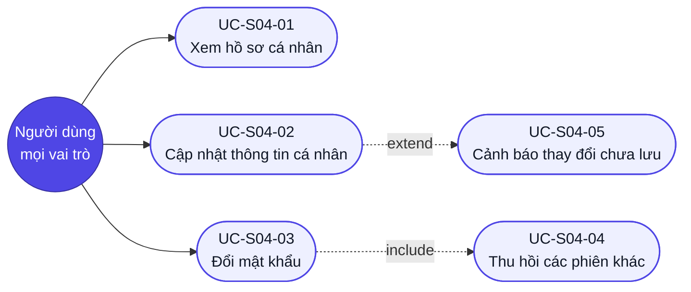

# Use case — Hồ sơ cá nhân

## Sơ đồ Use case (tổng quan)

> Màn tự phục vụ: chỉ **một tác nhân người** — chính người đang đăng nhập. `UC-S04-04` không do người dùng kích hoạt trực tiếp mà được `UC-S04-03` kéo theo.

## UC-S04-01: Xem hồ sơ cá nhân

- **Tác nhân (actor):** người dùng đã đăng nhập (mọi vai trò).
- **Trigger (kích hoạt):** chọn "Hồ sơ cá nhân" trong menu avatar, hoặc mở trực tiếp `/profile`.
- **Tiền điều kiện:** đã đăng nhập với phiên hợp lệ.
- **Luồng chính (happy path):**
  1. Người dùng mở màn hồ sơ.
  2. Hệ thống hiện skeleton và gọi `GET /users/me`.
  3. Hệ thống hiển thị khối nhận diện: ảnh đại diện, họ tên, email, vai trò, tổ chức, ngày tham gia.
  4. Hệ thống điền sẵn form Thông tin cá nhân bằng giá trị hiện tại và hiển thị form Đổi mật khẩu trống.
  5. Nút "Lưu thay đổi" ở trạng thái disable (chưa có thay đổi nào).
- **Luồng thay thế / ngoại lệ:**
  - 2a. Chưa đăng nhập hoặc phiên hết hạn → chuyển hướng `/login`.
  - 2b. `GET /users/me` trả `5xx` → khối lỗi + nút "Thử lại"; nhấn "Thử lại" gọi lại API.
  - 3a. `anh_dai_dien_url` rỗng → hiển thị chữ cái đầu họ tên trên nền màu sinh ổn định từ tên (`BRule-S04-07`).
  - 3b. Đường dẫn ảnh tồn tại nhưng tải thất bại (ảnh chết, máy chủ ngoài lỗi) → **rơi về** chữ cái đầu họ tên, không hiện ô ảnh vỡ.
- **Hậu điều kiện (postcondition):** màn sẵn sàng thao tác; không dữ liệu nào bị thay đổi.
- **Đảm bảo (guarantees):** thành công — người dùng thấy đúng hồ sơ của chính mình; tối thiểu — không bao giờ hiển thị hồ sơ người khác (`BRule-S04-01`).
- **Trace:** R-S04-01, R-S04-02, R-S04-05, R-S04-06, R-S04-N05, R-S04-N07.

## UC-S04-02: Cập nhật thông tin cá nhân

- **Tác nhân:** người dùng đã đăng nhập.
- **Trigger:** sửa trường Họ tên hoặc Ảnh đại diện rồi nhấn "Lưu thay đổi".
- **Tiền điều kiện:** màn hồ sơ đã tải xong; có ít nhất một trường khác giá trị gốc.
- **Luồng chính:**
  1. Người dùng sửa Họ tên và/hoặc Ảnh đại diện.
  2. Hệ thống bật nút "Lưu thay đổi" ngay khi phát hiện khác giá trị gốc.
  3. Hệ thống kiểm tra từng trường theo bảng Validation.
  4. Người dùng nhấn "Lưu thay đổi" → hệ thống gọi `PATCH /users/me`, **chỉ gửi trường đã đổi**.
  5. Hệ thống cập nhật khối nhận diện, tên hiển thị trên header, và hiện toast "Đã cập nhật hồ sơ".
- **Luồng thay thế / ngoại lệ:**
  - 1a. Xoá trắng Họ tên hoặc nhập toàn khoảng trắng → lỗi "Vui lòng nhập họ tên", nút Lưu disable.
  - 1b. Họ tên vượt 100 ký tự → lỗi "Họ tên tối đa 100 ký tự", bộ đếm chuyển đỏ, nút Lưu disable.
  - 1c. Đường dẫn ảnh không bắt đầu `https://` → lỗi "Đường dẫn ảnh phải bắt đầu bằng https://" (`BRule-S04-08`).
  - 1d. Xoá trắng đường dẫn ảnh → hợp lệ; lưu xong quay về hiển thị chữ cái đầu họ tên.
  - 2a. Sửa rồi hoàn tác về đúng giá trị gốc → nút "Lưu thay đổi" disable trở lại; nhấn "Huỷ" cũng khôi phục giá trị gốc.
  - 4a. Lời gọi API thất bại (mất mạng, `5xx`) → **giữ nguyên mọi giá trị đã nhập**, báo lỗi trên form (`R-S04-08`).
  - 4b. Người dùng cố sửa email/vai trò/tổ chức bằng cách gọi thẳng API → máy chủ **bỏ qua** các trường đó, chỉ áp dụng `ho_ten` và `anh_dai_dien_url` (`BRule-S04-02`, `BRule-S04-03`).
- **Hậu điều kiện:** bản ghi `NguoiDung` cập nhật đúng các trường đã đổi; `cap_nhat_luc` được làm mới.
- **Đảm bảo:** thành công — tên mới hiển thị nhất quán ở mọi nơi (header, bình luận, dòng công việc); tối thiểu — thất bại thì dữ liệu người dùng đã gõ không bị mất.
- **Trace:** R-S04-03, R-S04-04, R-S04-06, R-S04-07, R-S04-08.

## UC-S04-03: Đổi mật khẩu

- **Tác nhân:** người dùng đã đăng nhập.
- **Trigger:** điền ba trường trong form Đổi mật khẩu rồi nhấn "Đổi mật khẩu".
- **Tiền điều kiện:** màn hồ sơ đã tải xong; người dùng biết mật khẩu hiện tại.
- **Luồng chính:**
  1. Người dùng nhập Mật khẩu hiện tại.
  2. Người dùng nhập Mật khẩu mới; hệ thống hiện thanh đo độ mạnh cập nhật theo từng ký tự.
  3. Người dùng nhập Xác nhận mật khẩu mới; hệ thống kiểm tra khớp khi rời khỏi trường.
  4. Người dùng nhấn "Đổi mật khẩu" → hệ thống gọi `PATCH /users/me/password`.
  5. Máy chủ đối chiếu mật khẩu hiện tại, hash mật khẩu mới bằng bcrypt cost ≥ 12.
  6. Máy chủ **thu hồi mọi phiên khác**, giữ phiên hiện tại (`include UC-S04-04`).
  7. Màn hiện toast "Đã đổi mật khẩu" và xoá trắng cả ba trường; người dùng **vẫn ở lại** màn hồ sơ.
- **Luồng thay thế / ngoại lệ:**
  - 2a. Mật khẩu mới không đạt luật tối thiểu (dưới 8 ký tự, thiếu chữ hoặc thiếu số) → lỗi inline, nút disable (`R-S04-N02`).
  - 2b. Mật khẩu mới trùng mật khẩu hiện tại → lỗi "Mật khẩu mới phải khác mật khẩu hiện tại", **không gọi API** (`BRule-S04-05`).
  - 3a. Xác nhận không khớp → lỗi "Mật khẩu xác nhận không khớp.", nút disable.
  - 5a. Mật khẩu hiện tại sai → API trả `400`/`401`; lỗi hiện **ngay dưới trường Mật khẩu hiện tại**; hai trường còn lại **giữ nguyên giá trị** (`R-S04-14`).
  - 5b. Sai mật khẩu hiện tại 5 lần trong 15 phút → chặn thao tác đổi mật khẩu 15 phút (`R-S04-N04`).
  - 4a. Mất mạng → giữ nguyên ba trường đã nhập, báo lỗi kết nối, không đổi gì ở máy chủ.
- **Hậu điều kiện:** `mat_khau_hash` được thay bằng hash của mật khẩu mới; các phiên khác không dùng được nữa.
- **Đảm bảo:** thành công — chỉ người biết mật khẩu cũ mới đổi được, và mọi thiết bị khác bị đẩy ra; tối thiểu — thất bại thì mật khẩu cũ vẫn còn hiệu lực, không có trạng thái nửa vời.
- **Trace:** R-S04-10…R-S04-17, R-S04-N01…R-S04-N04; `BRule-S04-04`, `BRule-S04-05`.

## UC-S04-04: Thu hồi các phiên khác *(use case dùng chung — include)*

- **Tác nhân:** hệ thống.
- **Trigger:** đổi mật khẩu thành công (`UC-S04-03` bước 6).
- **Tiền điều kiện:** mật khẩu mới đã được lưu.
- **Luồng chính:**
  1. Hệ thống liệt kê mọi `PhienDangNhap` của người dùng.
  2. Hệ thống loại **phiên hiện tại** ra khỏi danh sách (`BRule-S04-06`).
  3. Hệ thống thu hồi toàn bộ phiên còn lại (huỷ refresh token).
  4. Thiết bị mang phiên đã thu hồi nhận `401` ở lời gọi API kế tiếp và bị chuyển về `/login`.
- **Luồng thay thế / ngoại lệ:**
  - 1a. Người dùng chỉ có đúng một phiên (chính phiên đang thao tác) → không thu hồi gì cả, luồng vẫn thành công.
  - 3a. Thu hồi thất bại một phần → ghi log; **không** cuộn ngược việc đổi mật khẩu (mật khẩu mới đã có hiệu lực là điều quan trọng hơn).
- **Hậu điều kiện:** chỉ còn phiên hiện tại hợp lệ.
- **Đảm bảo:** thành công — thiết bị bị mất hoặc bị chiếm không còn truy cập được; tối thiểu — phiên người dùng đang thao tác không bao giờ bị thu hồi nhầm.
- **Trace:** R-S04-15; `BRule-S04-06`.

## UC-S04-05: Cảnh báo thay đổi chưa lưu *(mở rộng — extend)*

- **Tác nhân:** người dùng đã đăng nhập.
- **Trigger:** điều hướng rời màn (nhấn "Quay lại Dashboard", đổi trang, đóng tab) khi form Thông tin cá nhân còn thay đổi chưa lưu.
- **Tiền điều kiện:** có ít nhất một trường khác giá trị gốc và chưa nhấn "Lưu thay đổi".
- **Luồng chính:**
  1. Người dùng kích hoạt một hành động điều hướng.
  2. Hệ thống chặn điều hướng và hiện hộp "Bạn có thay đổi chưa lưu".
  3. Người dùng chọn "Ở lại" → đóng hộp, giữ nguyên form và mọi giá trị đã nhập.
- **Luồng thay thế / ngoại lệ:**
  - 3a. Chọn "Rời đi" → điều hướng tiếp, thay đổi bị bỏ.
  - 1a. Không có thay đổi nào chưa lưu → điều hướng đi thẳng, **không** hiện hộp (không làm phiền vô cớ).
  - 1b. Chỉ có thay đổi ở form Đổi mật khẩu (chưa nhấn nút) → **không** cảnh báo; mật khẩu gõ dở không phải dữ liệu cần cứu.
- **Hậu điều kiện:** người dùng không mất thay đổi ngoài ý muốn.
- **Đảm bảo:** thành công — chọn "Ở lại" thì mọi giá trị còn nguyên; tối thiểu — không chặn điều hướng khi thực sự không có gì để mất.
- **Trace:** R-S04-09.
