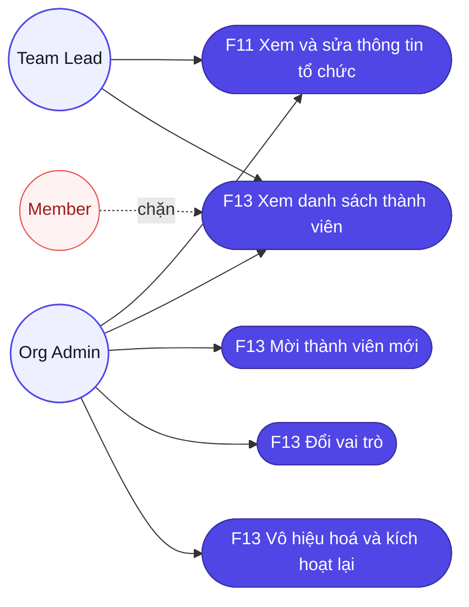
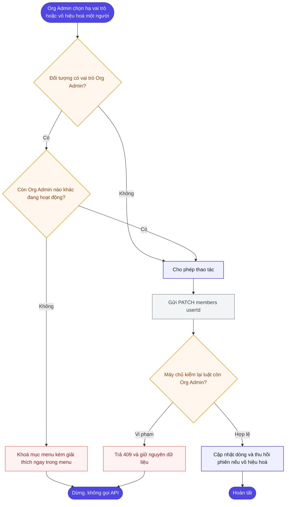
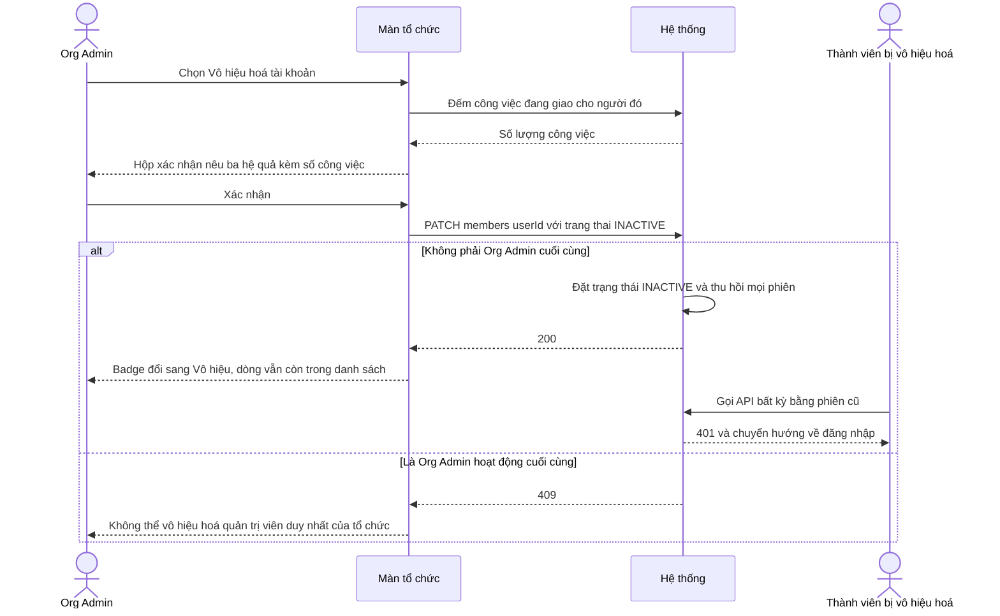
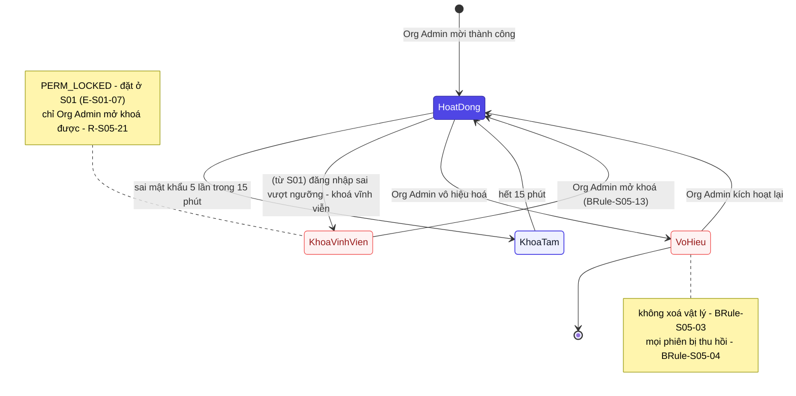
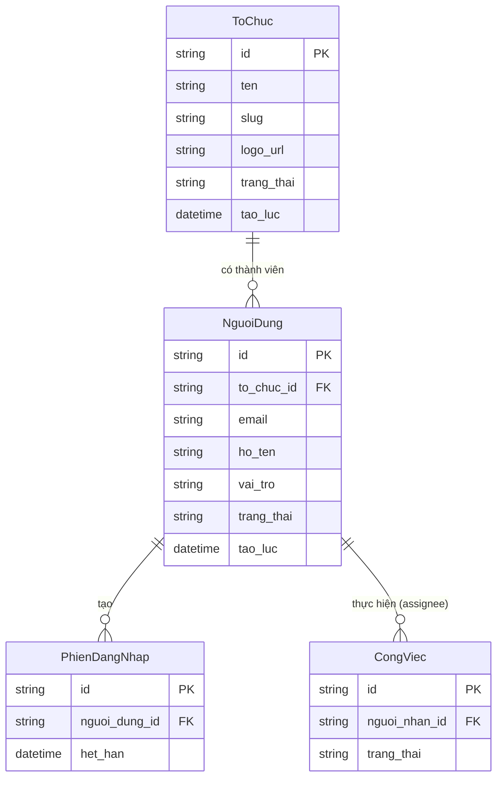

# Đặc tả yêu cầu — Tổ chức (Mã màn: S05)

## Chức năng & truy vết nguồn
Trace: F11 → FR-12 → BR-03 | F13 → FR-02 → BR-03.

Màn gom **hai chức năng có mức quyền khác nhau** — đây là đặc điểm chi phối toàn bộ đặc tả:

| Nhóm | Chức năng | Team Lead | Org Admin |
|---|---|---|---|
| Thông tin tổ chức | F11 — xem và sửa tên, logo | ✅ | ✅ |
| Thành viên — xem | F13 — xem danh sách, tìm, lọc | ✅ *(chỉ đọc)* | ✅ |
| Thành viên — thao tác | F13 — mời, đổi vai trò, vô hiệu hoá | ⛔ | ✅ |

> **Phạm vi logo.** Cùng vấn đề với ảnh đại diện ở S04: `06-api-spec.md` không có endpoint tải tệp lên, `05-data-model.md` định nghĩa `logo_url` là **URL**. Màn này đặc tả **nhập đường dẫn ảnh**, không tải tệp. Nếu dự án chốt cho tải tệp thì **S04 và S05 phải đổi cùng lúc** — xem `GĐ-01` của S04.

## Phạm vi màn

**Màn này lo:** xem/sửa thông tin tổ chức (tên, logo — `F11`) và **quản trị thành viên** (`F13`): mời người mới kèm mật khẩu tạm, đổi vai trò, vô hiệu hoá và kích hoạt lại tài khoản.

**Màn này KHÔNG lo** *(nêu nơi xử lý thay)*:
- Người dùng tự sửa hồ sơ của mình — *thuộc `S04` Hồ sơ cá nhân (`F10`)*.
- Tạo tổ chức mới — *thuộc `S06` Đăng ký (`F12`); màn này chỉ sửa tổ chức đang có*.
- Đổi slug tổ chức — *ngoài phạm vi giai đoạn 1 (`BRule-S05-02`): đổi slug làm hỏng đường dẫn đã chia sẻ*.
- Gửi email mời thành viên — *ngoài phạm vi giai đoạn 1 (`BRule-S05-07`): Org Admin tự chuyển mật khẩu tạm bằng kênh ngoài*.
- Chuyển giao công việc của người bị vô hiệu hoá — *`BRule-S05-08` chỉ cảnh báo; chuyển giao làm thủ công ở `S03`*.

## Tác nhân & hệ thống ngoài

| Tác nhân | Loại | Vai trò ở màn này | Trong phạm vi? |
|----------|------|-------------------|----------------|
| Org Admin | người | Toàn quyền: sửa tổ chức + mọi thao tác thành viên | Có |
| Team Lead | người | Sửa thông tin tổ chức; **xem** danh sách thành viên, không thao tác | Có |
| Member | người | Không truy cập được màn này | Không — *bị chặn ở tầng điều hướng (`R-S05-N05`)* |
| API Backend (nội bộ) | hệ thống | Kiểm quyền hai tầng, đảm bảo ràng buộc "còn ít nhất một Org Admin", thu hồi phiên khi vô hiệu hoá | Có |

> Màn này **không gọi hệ thống bên thứ ba** — mật khẩu tạm chuyển tay ngoài hệ thống (`BRule-S05-07`), không qua dịch vụ email.

## Yêu cầu chức năng (Functional)

### Nhóm A — Thông tin tổ chức (F11)

| Mã | Yêu cầu (hệ thống phải...) | Trace F/FR | Nguồn | Lý do (rationale) | Acceptance criteria (đo được) | Kiểm chứng | Ưu tiên |
|----|----------------------------|------------|-------|-------------------|-------------------------------|-----------|---------|
| R-S05-01 | Hiển thị thông tin tổ chức từ `GET /organizations/me`: logo, tên, slug, ngày tạo, tổng số thành viên | F11 / FR-12 | brainstorm.md (màn) | Cho Team Lead/Org Admin xem thông tin tổ chức của mình (F11) | Đủ 5 thông tin, giá trị khớp response API | test | Must |
| R-S05-02 | Cho phép Team Lead và Org Admin sửa **Tên tổ chức** | F11 / FR-12 | brainstorm.md (màn) | Cho phép cập nhật tên tổ chức khi có thay đổi | Trường sửa được, ràng buộc theo bảng Validation; bộ đếm `n/100` realtime | test | Must |
| R-S05-03 | Cho phép sửa **Logo** bằng cách nhập đường dẫn ảnh; bỏ trống thì hiển thị chữ cái đầu tên tổ chức | F11 / FR-12 | brainstorm.md (màn) | Cho phép đặt logo tổ chức bằng đường dẫn — giai đoạn 1 không tải tệp lên (GĐ-S05-01 · như logo/ảnh S04) | Trường nhận chuỗi bắt đầu `https://`; bỏ trống hợp lệ → hiện chữ cái đầu tên tổ chức | test | Should |
| R-S05-04 | Hiển thị **slug** ở chế độ chỉ đọc kèm biểu tượng khoá và giải thích ngắn | F11 / FR-12 | brainstorm.md (màn) | Slug là định danh trong đường dẫn, không cho đổi để không hỏng link đã chia sẻ (GĐ-S05-01, BRule-S05-02) | Slug không nằm trong ô nhập nào; có chú thích "không đổi được" | demonstration | Must |
| R-S05-05 | Lưu thông tin tổ chức qua `PATCH /organizations/me`; chỉ bật nút "Lưu thay đổi" khi có trường khác giá trị gốc | F11 / FR-12 | brainstorm.md (màn) | Lưu thay đổi và tránh gọi API vô ích khi không có thay đổi thực sự | Mở màn → nút disable; API gọi 1 lần chỉ với trường đã đổi; sau 200: logo và tên trên màn cập nhật, toast "Đã cập nhật thông tin tổ chức" | test | Must |
| R-S05-06 | Giữ nguyên dữ liệu đã nhập và báo lỗi cụ thể khi lưu thất bại | F11 / FR-12 | brainstorm.md (màn) | Không để mất dữ liệu đã nhập khi lỗi tạm thời | Form không reset; giá trị đã nhập còn nguyên; lỗi hiện trên form | test | Must |

### Nhóm B — Xem danh sách thành viên (F13, chỉ đọc)

| Mã | Yêu cầu (hệ thống phải...) | Trace F/FR | Nguồn | Lý do (rationale) | Acceptance criteria (đo được) | Kiểm chứng | Ưu tiên |
|----|----------------------------|------------|-------|-------------------|-------------------------------|-----------|---------|
| R-S05-07 | Hiển thị danh sách thành viên từ `GET /organizations/me/members`: họ tên, email, vai trò, trạng thái, ngày tham gia | F13 / FR-02 | brainstorm.md (màn) | Cho quản trị xem ai đang trong tổ chức để quản lý (F13) | Mỗi dòng đủ 5 cột; tổng số hiển thị ở tiêu đề khối; **chỉ** thành viên cùng tổ chức | test | Must |
| R-S05-08 | Cho phép tìm theo tên hoặc email và lọc theo vai trò, theo trạng thái; các điều kiện kết hợp được với nhau | F13 / FR-02 | brainstorm.md (màn) | Tìm nhanh thành viên trong tổ chức đông người | Gõ từ khoá (debounce 300ms) → danh sách cập nhật không reload; chọn thêm bộ lọc → giao của các điều kiện | test | Should |
| R-S05-09 | Hiển thị trạng thái rỗng riêng khi bộ lọc không khớp ai, kèm nút "Xoá bộ lọc" | F13 / FR-02 | brainstorm.md (màn) | Cho biết bộ lọc không khớp ai và cách quay lại danh sách đầy đủ | Lọc không khớp → "Không tìm thấy thành viên phù hợp" + nút xoá bộ lọc; danh sách gốc **không bao giờ rỗng** | test | Should |
| R-S05-10 | Phân trang danh sách 20 dòng mỗi lần, có nút "Tải thêm" | F13 / FR-02 | brainstorm.md (màn) | Tải danh sách theo trang để giữ hiệu năng với tổ chức đông (GĐ-S05-07 giới hạn 200 thành viên/tổ chức) | Tổ chức >20 thành viên → hiện đúng 20 dòng + nút "Tải thêm"; nhấn → thêm 20 dòng kế | test | Could |

### Nhóm C — Quản trị thành viên (F13, chỉ Org Admin)

| Mã | Yêu cầu (hệ thống phải...) | Trace F/FR | Nguồn | Lý do (rationale) | Acceptance criteria (đo được) | Kiểm chứng | Ưu tiên |
|----|----------------------------|------------|-------|-------------------|-------------------------------|-----------|---------|
| R-S05-11 | Hiển thị nút "+ Mời thành viên" và cụm hành động mỗi dòng **chỉ với Org Admin** | F13 / FR-02 | brainstorm.md (màn) | Chỉ Org Admin được thao tác thành viên (BRule-S05-01); ẩn nút với Team Lead (GĐ-S05-06) | Đăng nhập Team Lead → nút và cột hành động **không tồn tại trong DOM**; đăng nhập Org Admin → hiện đủ | test | Must |
| R-S05-12 | Cho phép Org Admin mời thành viên mới qua modal gồm Email, Họ tên, Vai trò, Mật khẩu tạm; gửi `POST /organizations/me/members` | F13 / FR-02 | **CR-02** (đã duyệt) | Cho Org Admin thêm thành viên mới vào tổ chức; buộc đổi mật khẩu lần đầu để mật khẩu Admin biết không tồn tại lâu (CR-02, GĐ-S05-03 đã sửa) | Modal đủ 4 trường; validate theo bảng Validation; sau `201`: người mới xuất hiện trong danh sách, tổng số +1; tài khoản tạo ra mang cờ `phai_doi_mat_khau = true` *(CR-02)* — buộc đổi ở lần đăng nhập đầu (thực thi ở S01, `R-S01-11`) | test | Must |
| R-S05-13 | Hiển thị mật khẩu tạm **một lần duy nhất** sau khi tạo tài khoản thành công, kèm nút sao chép và cảnh báo sẽ không hiện lại | F13 / FR-02 | brainstorm.md (màn) | Mật khẩu tạm chuyển tay ngoài hệ thống nên phải cho Org Admin xem/sao chép một lần (GĐ-S05-02, BRule-S05-07); không lưu lại để bảo mật | Sau `201`: hộp xác nhận hiện mật khẩu + nút "Sao chép" + cảnh báo; đóng hộp rồi thì **không đường nào xem lại được** | test | Must |
| R-S05-14 | Báo lỗi ngay tại trường Email khi email đã tồn tại trong hệ thống (`409`) và giữ nguyên dữ liệu đã nhập trong modal | F13 / FR-02 | brainstorm.md (màn) | Email là định danh duy nhất toàn hệ thống; báo trùng ngay và giữ dữ liệu đã nhập (BRule-S05-06) | API trả `409` → lỗi "Email này đã được sử dụng." dưới trường Email; ba trường còn lại giữ nguyên; modal không đóng | test | Must |
| R-S05-15 | Cho phép Org Admin đổi vai trò một thành viên qua `PATCH /organizations/me/members/:userId` | F13 / FR-02 | brainstorm.md (màn) | Cho Org Admin điều chỉnh vai trò thành viên khi cơ cấu tổ chức thay đổi | Chọn vai trò mới → API gọi 1 lần → badge vai trò trên dòng đó đổi ngay; quyền mới có hiệu lực ở lời gọi API kế tiếp của người đó | test | Must |
| R-S05-16 | Cho phép Org Admin vô hiệu hoá một thành viên (`trang_thai = INACTIVE`), qua hộp xác nhận nêu rõ hệ quả và **số công việc đang giao cho người đó** | F13 / FR-02 | brainstorm.md (màn) · UE-09 | Ngừng quyền truy cập của người rời đi mà không xoá dữ liệu/lịch sử (BRule-S05-03); cảnh báo số việc đang giao (BRule-S05-08) | Hộp xác nhận liệt kê 3 hệ quả + số công việc; đồng ý → badge trạng thái đổi "Vô hiệu"; tài khoản **không bị xoá khỏi danh sách** | test | Must |
| R-S05-17 | Thu hồi **mọi phiên đăng nhập** của người vừa bị vô hiệu hoá | F13 / FR-02 | brainstorm.md (màn) | Cắt ngay mọi phiên của người bị vô hiệu để họ không còn truy cập được (BRule-S05-04, BR-03) | Người đó nhận `401` ở lời gọi API kế tiếp và bị chuyển về `/login`; không đăng nhập lại được | test | Must |
| R-S05-18 | Cho phép Org Admin kích hoạt lại tài khoản đã vô hiệu hoá (INACTIVE → ACTIVE) | F13 / FR-02 | brainstorm.md (màn) | Cho phép phục hồi tài khoản khi người cũ quay lại, giữ nguyên lịch sử (GĐ-S05-05) | Menu của dòng INACTIVE chỉ có "Kích hoạt lại"; sau khi kích hoạt, người đó đăng nhập được bằng mật khẩu cũ | test | Should |
| R-S05-19 | **Chặn** thao tác hạ vai trò hoặc vô hiệu hoá khi đối tượng là **Org Admin đang hoạt động duy nhất** của tổ chức — chặn ở cả giao diện lẫn máy chủ | F13 / FR-02 | brainstorm.md (màn) | Không để tổ chức mất quản trị viên cuối cùng dẫn tới khoá chết (BRule-S05-05) | Giao diện: hai mục menu bị khoá kèm giải thích ngay trong menu; máy chủ: gọi thẳng API trả `409`/`422` và dữ liệu không đổi | test | Must |
| R-S05-20 | Loại thành viên `INACTIVE` khỏi mọi danh sách chọn người thực hiện công việc | F13 / FR-02 | brainstorm.md (màn) | Không giao việc mới cho người đã vô hiệu (BRule-S05-09, nhất quán BRule-S02-05) | Vô hiệu hoá một người → dropdown "Người thực hiện" ở S02 và S03 không còn người đó — nhất quán với `BRule-S02-05` | test | Must |
| R-S05-21 | Cho phép **Org Admin mở khoá** một tài khoản đang `PERM_LOCKED` (khoá vĩnh viễn do quá nhiều lần đăng nhập sai ở S01) trở lại `ACTIVE` | F13 / FR-02 | S01 `E-S01-07` (phụ thuộc ngoài) · UE-02 | S01 `E-S01-07` phụ thuộc thao tác này; không có thì người dùng kẹt vĩnh viễn | Tài khoản `PERM_LOCKED` → sau thao tác "Mở khoá" chuyển `ACTIVE`; người đó **đăng nhập lại được**; hệ thống **ghi 1 dòng nhật ký/audit** "Org Admin mở khoá tài khoản" | test | Must |

## Yêu cầu phi chức năng (Non-functional)

| Mã | Loại | Yêu cầu đo được | Trace |
|----|------|-----------------|-------|
| R-S05-N01 | Bảo mật / dữ liệu | Danh sách thành viên **chỉ** chứa người thuộc tổ chức của người đăng nhập; không đường nào đọc được thành viên tổ chức khác | NFR-06 / BR-03 |
| R-S05-N02 | Bảo mật | Mọi ràng buộc phân quyền kiểm lại ở máy chủ: Team Lead hoặc Member gọi thẳng API mời/đổi vai trò/vô hiệu hoá đều trả `403` dù giao diện không hiện nút | NFR-02 / BR-03 |
| R-S05-N03 | Bảo mật | Mật khẩu tạm được hash bằng bcrypt cost ≥ 12 trước khi lưu; không lưu và không ghi log dưới dạng plaintext | NFR-02 / BR-03 |
| R-S05-N04 | Bảo mật | Mật khẩu tạm chỉ xuất hiện đúng một lần trong phản hồi tạo tài khoản; không endpoint nào đọc lại được sau đó | NFR-02 / BR-03 |
| R-S05-N05 | Bảo mật | Truy cập `/organization` với vai trò Member → chặn ngay, không render danh sách thành viên dù chỉ trong khoảnh khắc | NFR-02 / BR-03 |
| R-S05-N06 | Hiệu năng | Tải màn (thông tin tổ chức + trang đầu danh sách 20 thành viên) hoàn tất ≤ 2 giây ở p95 với 200 người dùng đồng thời | NFR-01 / BR-01 |
| R-S05-N07 | Khả năng tiếp cận | Badge vai trò và trạng thái phân biệt được không chỉ bằng màu; bảng có tiêu đề cột liên kết đúng; thao tác đủ bằng bàn phím; tương phản ≥ 4.5:1 | NFR-07 / BR-01 |

## Quy tắc nghiệp vụ (Business Rules)

| Mã | Quy tắc | Kích hoạt khi | Trace |
|----|---------|---------------|-------|
| BRule-S05-01 | **Phân quyền hai tầng:** sửa thông tin tổ chức (F11) = Team Lead + Org Admin; thao tác thành viên (F13) = **chỉ Org Admin**. Team Lead xem được danh sách nhưng không thao tác | Khi render các nút thao tác của màn và khi nhận mỗi yêu cầu API tương ứng | R-S05-02, R-S05-11, R-S05-N02 |
| BRule-S05-02 | **Slug không sửa được** ở giai đoạn 1 — đổi slug làm hỏng mọi đường dẫn đã chia sẻ | Khi render form thông tin tổ chức (ô Slug chỉ đọc) và khi nhận yêu cầu cập nhật tổ chức | R-S05-04 |
| BRule-S05-03 | **"Xoá" thành viên = vô hiệu hoá**, không xoá vật lý — tài khoản chuyển `trang_thai = INACTIVE` và vẫn còn trong danh sách, giữ nguyên lịch sử công việc đã giao (chú thích ³ của `02-functions.md`) | Khi Org Admin xác nhận "Vô hiệu hoá" một thành viên | R-S05-16, R-S05-18 |
| BRule-S05-04 | Vô hiệu hoá một tài khoản → **thu hồi mọi phiên** của người đó (chú thích ⁷ của `02-functions.md`) | Ngay sau khi một tài khoản chuyển sang `INACTIVE` | R-S05-17 |
| BRule-S05-05 | **Tổ chức phải luôn còn ít nhất một Org Admin đang hoạt động.** Cấm hạ vai trò hoặc vô hiệu hoá Org Admin cuối cùng — nếu không, tổ chức bị khoá chết vĩnh viễn | Trước khi thực hiện hạ vai trò hoặc vô hiệu hoá một Org Admin | R-S05-19 |
| BRule-S05-06 | **Email duy nhất toàn hệ thống** — mời người có email đã tồn tại (kể cả ở tổ chức khác) đều bị từ chối `409`, nhất quán với `FR-13` | Khi Org Admin submit form mời thành viên mới | R-S05-14 |
| BRule-S05-07 | Mật khẩu tạm do Org Admin đặt và **tự chuyển cho người mới bằng kênh ngoài hệ thống** — hệ thống không gửi email mời ở giai đoạn 1. Người mới **bắt buộc đổi mật khẩu ở lần đăng nhập đầu** *(CR-02)* — tài khoản tạo qua `POST /organizations/me/members` mang cờ `phai_doi_mat_khau = true`; luồng thực thi nằm ở S01 | Khi tạo tài khoản mới cho thành viên được mời | R-S05-12, R-S05-13 |
| BRule-S05-08 | Vô hiệu hoá **không tự chuyển** công việc đang gán — công việc giữ nguyên người thực hiện; hộp xác nhận chỉ **cảnh báo số lượng** để người quản trị tự quyết định giao lại qua S03 | Khi vô hiệu hoá một thành viên còn công việc đang gán | R-S05-16 |
| BRule-S05-09 | Thành viên `INACTIVE` **không xuất hiện** trong mọi danh sách chọn người thực hiện — cùng luật với `BRule-S02-05` | Khi nạp mọi danh sách chọn người thực hiện (S02, S03, S05) | R-S05-20 |
| BRule-S05-10 | Logo tổ chức chỉ nhận đường dẫn `https://` — không nhận `http://` (nội dung hỗn hợp) lẫn `data:` (dữ liệu nhúng tuỳ ý); cùng luật với `BRule-S04-08` | Khi người dùng nhập/dán đường dẫn logo và khi nhận yêu cầu cập nhật tổ chức | R-S05-03 |
| BRule-S05-11 | Đổi vai trò có hiệu lực **ngay ở lời gọi API kế tiếp** của người bị đổi — không cần họ đăng nhập lại | Ngay ở lời gọi API kế tiếp của người vừa bị đổi vai trò | R-S05-15 |
| BRule-S05-12 | Org Admin **được** vô hiệu hoá chính mình nếu tổ chức còn Org Admin hoạt động khác; sau khi xác nhận thì bị đăng xuất ngay | Khi Org Admin chọn vô hiệu hoá chính tài khoản mình | R-S05-16, R-S05-19 |
| BRule-S05-13 | **Chỉ Org Admin được mở khoá** tài khoản `PERM_LOCKED` (khoá vĩnh viễn) — Team Lead/Member không thấy nút và gọi thẳng API cũng bị `403` | Khi bấm "Mở khoá" trên dòng thành viên `PERM_LOCKED` | R-S05-21 |

## Bảng mô tả chi tiết phần tử màn hình
| # | Tên phần tử | Control type | Data Type | Bắt buộc | Mô tả | Trace |
|---|-------------|--------------|-----------|----------|-------|-------|
| 1 | Quay lại Dashboard | Link | Action | — | Trở về danh sách công việc | R-S05-01 |
| 2 | Tên tổ chức | Input | String | Có | Tên hiển thị của tổ chức; kèm bộ đếm ký tự | R-S05-02 |
| 3 | Logo tổ chức | Input | String | Không | Đường dẫn ảnh logo | R-S05-03 |
| 4 | Định danh (slug) | Label | String | — | Định danh tổ chức, **không sửa được** | R-S05-04 |
| 5 | Ngày tạo / Tổng thành viên | Label | String | — | Thông tin chỉ đọc của tổ chức | R-S05-05 |
| 6 | Lưu thay đổi | Button | Action | — | Ghi thông tin tổ chức vừa sửa | R-S05-06 |
| 7 | Huỷ | Button | Action | — | Bỏ thay đổi thông tin tổ chức | R-S05-07 |
| 8 | Tìm thành viên | Input | String | Không | Tìm theo tên hoặc email | R-S05-08 |
| 9 | Lọc vai trò | Select | Enum | Không | Lọc danh sách thành viên theo vai trò | R-S05-09 |
| 10 | Lọc trạng thái | Select | Enum | Không | Lọc theo trạng thái thành viên | R-S05-10 |
| 11 | Mời thành viên | Button | Action | — | Mở biểu mẫu mời; chỉ Org Admin thấy | R-S05-11 |
| 12 | Bảng thành viên | Table | List | — | Danh sách thành viên kèm vai trò, trạng thái, thao tác | R-S05-12 |

## Yêu cầu dữ liệu — Validation từng field

**Form "Thông tin tổ chức" (`PATCH /organizations/me`)**

| Field | Kiểu | Bắt buộc | Định dạng/Ràng buộc | Min/Max | Thông báo lỗi |
|-------|------|----------|---------------------|---------|---------------|
| ten | chuỗi | Có | không chỉ toàn khoảng trắng; cắt khoảng trắng thừa hai đầu | 1–100 ký tự | "Vui lòng nhập tên tổ chức" / "Tên tổ chức tối đa 100 ký tự" |
| logo_url | chuỗi | Không | phải bắt đầu `https://`; URL hợp lệ; bỏ trống = xoá logo | ≤ 2048 ký tự | "Đường dẫn logo phải bắt đầu bằng https://" / "Đường dẫn logo không hợp lệ" |

**Modal "Mời thành viên" (`POST /organizations/me/members`)**

| Field | Kiểu | Bắt buộc | Định dạng/Ràng buộc | Min/Max | Thông báo lỗi |
|-------|------|----------|---------------------|---------|---------------|
| email | chuỗi | Có | đúng định dạng email; duy nhất toàn hệ thống (kiểm ở máy chủ) | ≤ 254 ký tự | "Email không hợp lệ" / "Email này đã được sử dụng." |
| ho_ten | chuỗi | Có | không chỉ toàn khoảng trắng | 1–100 ký tự | "Vui lòng nhập họ tên" / "Họ tên tối đa 100 ký tự" |
| vai_tro | enum | Có | MEMBER / TEAM_LEAD / ORG_ADMIN; mặc định MEMBER | — | "Vui lòng chọn vai trò" |
| mat_khau_tam | chuỗi | Có | ≥1 chữ cái + ≥1 chữ số — cùng luật với `R-S06-N02`; có nút sinh ngẫu nhiên | 8–64 ký tự | "Mật khẩu tối thiểu 8 ký tự gồm chữ và số" |

**Thao tác đổi vai trò / trạng thái (`PATCH /organizations/me/members/:userId`)**

| Field | Kiểu | Bắt buộc | Định dạng/Ràng buộc | Min/Max | Thông báo lỗi |
|-------|------|----------|---------------------|---------|---------------|
| vai_tro | enum | Không | MEMBER / TEAM_LEAD / ORG_ADMIN; chặn nếu vi phạm `BRule-S05-05` | — | "Không thể hạ vai trò quản trị viên duy nhất của tổ chức." |
| trang_thai | enum | Không | ACTIVE / INACTIVE; chặn nếu vi phạm `BRule-S05-05` | — | "Không thể vô hiệu hoá quản trị viên duy nhất của tổ chức." |

- **Đầu ra màn hình:** một bản ghi `ToChuc`, một mảng `NguoiDung` (không gồm `mat_khau_hash`), tổng số thành viên.
- **API sử dụng:** `GET /organizations/me` · `PATCH /organizations/me` · `GET /organizations/me/members` · `POST /organizations/me/members` · `PATCH /organizations/me/members/:userId`.

## Ma trận lỗi

| Mã | Lỗi | Xảy ra khi | Mức | Trace | Người dùng thấy gì | Lối thoát |
|----|-----|-----------|-----|-------|--------------------|-----------|
| E-S05-01 | Member cố mở màn Tổ chức | Member điều hướng tới `/organization` | major | R-S05-N05 | Bị chặn ngay (về Dashboard hoặc trang "Không có quyền truy cập"); **danh sách thành viên không kịp render** | Nhờ Org Admin thao tác hộ |
| E-S05-02 | Không tải được thông tin tổ chức | API tổ chức lỗi/timeout | major | R-S05-01 | Khối lỗi + nút "Thử lại" | Bấm "Thử lại" |
| E-S05-03 | Tên tổ chức rỗng | Submit form tổ chức với tên rỗng | minor | R-S05-02 | Lỗi "Vui lòng nhập tên tổ chức"; nút Lưu disable | Nhập tên tổ chức |
| E-S05-04 | Tên tổ chức vượt 100 ký tự | Nhập tên dài hơn 100 ký tự | minor | R-S05-02 | Lỗi "Tên tổ chức tối đa 100 ký tự"; bộ đếm `101/100` đỏ; nút Lưu disable | Rút ngắn tên |
| E-S05-05 | Đường dẫn logo không phải `https://` | Nhập logo dạng `http://` hoặc `data:` | minor | R-S05-03 / BRule-S05-10 | Lỗi "Đường dẫn logo phải bắt đầu bằng https://"; nút Lưu disable | Dùng đường dẫn `https://` |
| E-S05-06 | Mất kết nối khi lưu thông tin tổ chức | Mạng ngắt lúc submit | major | R-S05-06 / UE-05 | Giá trị đã nhập **còn nguyên**; thông báo lỗi kết nối; **form không reset về tên cũ** | Bấm Lưu lại khi có mạng |
| E-S05-07 | Cố sửa slug | Gửi `slug` trong yêu cầu cập nhật tổ chức | minor | BRule-S05-02 | Máy chủ bỏ qua trường không cho sửa; chỉ `ten` được áp dụng | Không có — slug cố định ở giai đoạn 1 |
| E-S05-08 | Email mời đã tồn tại | Mời người có email đã có trong hệ thống (kể cả ở tổ chức khác) | major | R-S05-14 / BRule-S05-06 | API `409`; lỗi "Email này đã được sử dụng." hiện **dưới trường Email**; **ba trường còn lại giữ nguyên** | Dùng email khác — email duy nhất **toàn hệ thống** |
| E-S05-09 | Email mời sai định dạng | Nhập email không hợp lệ ở form mời | minor | R-S05-12 | Lỗi "Email không hợp lệ"; nút "Tạo tài khoản" disable; không gọi API | Sửa email |
| E-S05-10 | Mật khẩu tạm không đạt chính sách | Đặt mật khẩu tạm < 8 ký tự hoặc thiếu chữ/số | minor | R-S05-12 | Lỗi "Mật khẩu tối thiểu 8 ký tự gồm chữ và số"; nút disable | Đặt mật khẩu đạt chính sách |
| E-S05-11 | Không xem lại được mật khẩu tạm | Đóng hộp thoại rồi muốn xem lại mật khẩu vừa tạo | major | R-S05-N04 | **Không đường nào** trong giao diện xem lại được; response API không chứa mật khẩu lẫn hash | Org Admin **đặt lại mật khẩu tạm mới** cho người đó |
| E-S05-12 | Team Lead cố thao tác thành viên | Team Lead gọi API mời/đổi vai trò/vô hiệu hoá | major | R-S05-N02 / BRule-S05-01 | Nút "+ Mời thành viên" và cột `[⋮]` **không tồn tại trong DOM**; gọi thẳng API thì `403`, dữ liệu không đổi | Nhờ Org Admin thao tác |
| E-S05-13 | Thao tác lên người của tổ chức khác | Gửi yêu cầu đổi vai trò/vô hiệu hoá với id người tổ chức khác | major | R-S05-N01 / BRule-S05-06 | HTTP `404` (**không phải `403`**) — không lộ sự tồn tại của người thuộc tổ chức khác; dữ liệu không đổi | Không có — hành vi bảo mật có chủ đích |
| E-S05-14 | Hạ vai trò Org Admin cuối cùng | Đổi vai trò Org Admin duy nhất đang hoạt động | blocker | R-S05-19 / BRule-S05-05 | Thao tác **bị khoá (mờ)** kèm giải thích; gọi thẳng API thì `409` "Không thể hạ vai trò quản trị viên duy nhất của tổ chức."; vai trò không đổi | **Bổ nhiệm thêm một Org Admin trước**, rồi mới hạ người kia |
| E-S05-15 | Vô hiệu hoá Org Admin cuối cùng | Vô hiệu hoá Org Admin duy nhất đang hoạt động | blocker | R-S05-19 / BRule-S05-05 | Tương tự trên; API `409` "Không thể vô hiệu hoá quản trị viên duy nhất của tổ chức."; trạng thái không đổi | Bổ nhiệm Org Admin khác trước — nếu không, tổ chức sẽ **khoá chết** |
| E-S05-16 | Mất kết nối khi mời thành viên | Mạng ngắt lúc submit modal Mời (`UC-S05-03` 4b) | major | R-S05-12 / UC-S05-03 4b | Giữ nguyên mọi giá trị trong modal Mời; hiện "Lỗi kết nối — thử lại"; không gọi máy chủ | Bấm Mời lại khi có mạng |

## Phụ thuộc ngoài

| Phụ thuộc | Ai sở hữu | Chặn gì nếu chưa sẵn sàng |
|-----------|-----------|---------------------------|
| API tổ chức + thành viên (`06-api-spec.md`) | Đội backend nội bộ | Toàn màn không dùng được |
| Cơ chế thu hồi phiên khi vô hiệu hoá (`BRule-S05-04`) | Đội backend nội bộ | Người bị vô hiệu hoá **vẫn dùng được phiên cũ** — hở bảo mật `BR-03`, đúng nỗi đau của `PS-03` |
| Kênh chuyển mật khẩu tạm (ngoài hệ thống) | Org Admin (nghiệp vụ) | Người được mời không nhận được mật khẩu → không đăng nhập lần đầu được |

*(Không phụ thuộc dịch vụ bên thứ ba nào — giai đoạn 1 không gửi email mời.)*

## Giả định & Ràng buộc

> 29148 tách **giả định** (điều ta *tin là đúng* nhưng chưa xác nhận — sai thì yêu cầu lung lay) khỏi **ràng buộc** (giới hạn *bắt buộc tuân*, không thương lượng). Khác "Phụ thuộc ngoài" (thứ bên khác *sở hữu* mà màn cần).

**Giả định** *(mỗi cái trạng thái `Đề xuất → Đã xác nhận / Đã sửa / Đã bỏ / 🔓 Chấp nhận rủi ro`; còn `⚠️ chưa xác nhận` → `ba-review` chấm 🟠, `Mốc = ba-build`)*

| Mã | Giả định | Vì sao cần | Ảnh hưởng nếu sai | Trạng thái |
|----|----------|-----------|-------------------|-----------|
| GĐ-S05-01 | **Slug tổ chức không sửa được** ở giai đoạn 1 — hiển thị chỉ đọc | `05-data-model.md` định nghĩa `slug` là duy nhất/URL-friendly; `F11` chỉ nói sửa "tên, logo" | Sai → đổi slug làm hỏng mọi đường dẫn đã chia sẻ, phải thêm luật chuyển hướng từ slug cũ | Đã xác nhận (2026-07-22) *(brainstorm GĐ-01)* |
| GĐ-S05-02 | **Mật khẩu tạm do Org Admin đặt và tự chuyển cho người mới bằng kênh ngoài** (nhắn tin, gặp trực tiếp) — hệ thống **không gửi email mời** | `06-api-spec.md` yêu cầu trường `mat_khau_tam` trong body mời (Admin đặt); hạ tầng email còn chờ chốt (ADR Draft) | Sai → cần luồng gửi email mời + token kích hoạt + hạn dùng, phụ thuộc hạ tầng email chưa sẵn sàng | Đã xác nhận (2026-07-22) *(brainstorm GĐ-02)* |
| GĐ-S05-03 | ~~Không buộc đổi mật khẩu tạm ở lần đăng nhập đầu~~ → **CÓ buộc đổi** ở lần đăng nhập đầu | Mật khẩu do Admin biết không được tồn tại vô thời hạn trên tài khoản người khác — rủi ro bảo mật `BR-03` | (Đã xử lý) mật khẩu tạm tồn tại vô thời hạn nếu không buộc đổi | **Đã sửa** (2026-07-22) — triển khai qua **`CR-02`** *(brainstorm GĐ-03)* |
| GĐ-S05-04 | Vô hiệu hoá một người **không tự chuyển** công việc đang gán — công việc giữ nguyên người thực hiện, chỉ cảnh báo số lượng | Không tài liệu nào quy định chuyển giao; chú thích ³ của `02-functions.md` chỉ nói giữ lịch sử | Sai → công việc mồ côi không ai làm (chọi `BR-02`), hoặc hệ thống tự gán bừa cho người khác | Đã xác nhận (2026-07-22) *(brainstorm GĐ-04)* |
| GĐ-S05-05 | Người đã vô hiệu hoá **kích hoạt lại được** (INACTIVE → ACTIVE) bằng mật khẩu cũ | `05-data-model.md` cho `trang_thai` nhận INACTIVE nhưng không nói chiều ngược; "không xoá vật lý" → hàm ý phục hồi được | Sai → nhân viên nghỉ rồi quay lại phải tạo tài khoản mới, mất toàn bộ lịch sử công việc gắn với tài khoản cũ | Đã xác nhận (2026-07-22) *(brainstorm GĐ-05)* |
| GĐ-S05-06 | **Team Lead xem được** danh sách thành viên nhưng **không thao tác** được | Ma trận phân quyền cho Team Lead ✅ ở F11 và ⛔ ở F13, nhưng không nói rõ Team Lead có *thấy* danh sách không | Sai (nếu phải ẩn hẳn) → phải tách màn hoặc ẩn cả khối Thành viên với Team Lead | Đã xác nhận (2026-07-22) *(brainstorm GĐ-06)* |
| GĐ-S05-07 | **Giới hạn 200 thành viên/tổ chức (giai đoạn 1)** theo `00-vision.md` (GĐ-04) | `00-vision.md` (GĐ-04) chốt mỗi tổ chức tối đa 200 thành viên ở giai đoạn 1; không `FR`/`NFR` màn nào nêu lại hạn mức này | Sai (nếu trần khác 200) → phải chỉnh luật chặn khi chạm trần và thông báo "đã đạt 200 thành viên" theo hạn mức đúng | Đã sửa 2026-08-06 (theo vision) *(brainstorm GĐ-07)* |

**Ràng buộc** *(giới hạn bắt buộc — không phải BRule/NFR)*

| Mã | Ràng buộc | Nguồn | Ảnh hưởng tới thiết kế màn |
|----|-----------|-------|----------------------------|
| — | Không có ràng buộc riêng của màn (các giới hạn giai đoạn 1 — slug cố định, không email mời, logo chỉ nhận URL — đã ghi ở giả định `GĐ-S05-01`/`GĐ-S05-02` và `BRule-S05-10`) | — | — |

## Quét yêu cầu ngầm

> 9 chiều không ai viết ra cho tới khi hỏng — mỗi chiều rơi vào mã đã viết ở trên, `n/a — lý do`, hoặc câu hỏi mở `OQ-S05-..` (template `ba-screen-spec`, soát bởi `ba-feasible` luật 9).

| Chiều | Rơi vào đâu |
|-------|-------------|
| Kiểm dữ liệu vào | `E-S05-03` · `E-S05-04` · `E-S05-05` · `E-S05-09` · `E-S05-10` — tên tổ chức rỗng/quá 100 ký tự, logo không phải `https://`, email mời sai định dạng, mật khẩu tạm không đạt chính sách |
| Kiểu hỏng | `E-S05-02` · `E-S05-06` · `E-S05-16` — tải tổ chức lỗi có "Thử lại"; mất kết nối khi lưu tổ chức và khi mời đều giữ nguyên dữ liệu đã nhập |
| Gửi lặp / thử lại | `R-S05-05` · `R-S05-15` (lưu tổ chức, đổi vai trò gọi API đúng 1 lần) · `OQ-S05-01` (bấm "Tạo tài khoản" hai lần) |
| Phân quyền | `BRule-S05-01` · `R-S05-N02` · `E-S05-13` — hai tầng quyền Team Lead/Org Admin kiểm lại ở máy chủ (`403`); người tổ chức khác trả `404` không lộ sự tồn tại |
| Đồng thời / thứ tự | `OQ-S05-02` |
| Vòng đời dữ liệu | `BRule-S05-03` · `R-S05-N04` — "xoá" thành viên chỉ là vô hiệu hoá, giữ lịch sử; mật khẩu tạm xuất hiện đúng một lần rồi không đọc lại được |
| Hệ ngoài chết | n/a — màn không gọi hệ thống bên thứ ba: mật khẩu tạm chuyển tay ngoài hệ thống, không qua dịch vụ email; logo là đường dẫn `https://` người dùng tự dán, hệ thống không lưu tệp; backend nội bộ không phản hồi đã nằm ở chiều Kiểu hỏng |
| Chuyển trạng thái | `R-S05-16` · `R-S05-18` · `R-S05-21` — `ACTIVE → INACTIVE` qua hộp xác nhận, `INACTIVE → ACTIVE` kích hoạt lại, `PERM_LOCKED → ACTIVE` mở khoá |
| Quan sát / log | `R-S05-N03` (cấm log mật khẩu tạm dạng plaintext) · `OQ-S05-03` (ghi vết mời/đổi vai trò/vô hiệu hoá) |

**Câu hỏi mở từ quét**

| Mã | Câu hỏi | Chiều | Ai trả lời |
|----|---------|-------|-----------|
| OQ-S05-01 | Bấm "Tạo tài khoản" hai lần liền (hoặc mạng chập chờn tự gửi lại): lần 1 tạo xong, lần 2 nhận `409` "Email này đã được sử dụng." — Org Admin thấy lỗi trùng email thay vì hộp mật khẩu tạm của lần 1, trong khi `R-S05-13` nói mật khẩu chỉ hiện **một lần**. Nút có disable trong lúc chờ không, và nếu lỡ mất hộp thì xử lý thế nào (đặt lại mật khẩu tạm như `E-S05-11`)? | Gửi lặp / thử lại | PO + đội backend |
| OQ-S05-02 | Tổ chức có đúng hai Org Admin, **cùng lúc** mỗi người hạ vai trò (hoặc vô hiệu hoá) người kia — mỗi yêu cầu lúc kiểm đều thấy "còn một Org Admin khác" nên cả hai có thể lọt, tổ chức còn 0 Org Admin, trái `BRule-S05-05`. Máy chủ có phải tuần tự hoá kiểm tra này không? Tương tự: Team Lead và Org Admin cùng sửa tên tổ chức thì bản sau ghi đè im lặng hay báo xung đột? | Đồng thời / thứ tự | PO + đội backend |
| OQ-S05-03 | Mời thành viên, đổi vai trò, vô hiệu hoá/kích hoạt lại có cần ghi vết (ai làm, với ai, lúc nào) như thao tác mở khoá ở `R-S05-21` không? Hiện chỉ mở khoá có audit, nên không tra được ai đã nâng một người lên Org Admin | Quan sát / log | PO + Org Admin |

## Sơ đồ luồng (Flow)

### 1. Tổng quan tác nhân ↔ chức năng (Use case)



### 2. Mời thành viên mới — luồng 3 vai trò (Swimlane)

> Ba vai trò có bàn giao thật sự: Org Admin tạo tài khoản → hệ thống sinh tài khoản và trả mật khẩu tạm **một lần** → Org Admin chuyển mật khẩu cho người mới bằng kênh ngoài (`BRule-S05-07`) → người mới đăng nhập. Bàn giao ngoài hệ thống chính là chỗ dễ hỏng nhất nên phải vẽ ra.

```mermaid
swimlane-beta TD
  subgraph OA[Org Admin]
    A([Nhấn Mời thành viên]):::startend --> B[Điền email, họ tên, vai trò, mật khẩu tạm]:::task
    F[Sao chép mật khẩu tạm]:::task --> G[Chuyển cho người mới qua kênh ngoài]:::external
    H[Sửa lại email]:::task --> B
  end
  subgraph HT[Hệ thống]
    C{"Email đã tồn tại?"}:::decision
    D["Trả lỗi 409 Email đã được sử dụng"]:::error
    E[Tạo tài khoản và trả mật khẩu tạm một lần]:::task
  end
  subgraph NM[Người mới]
    I([Đăng nhập lần đầu tại S01]):::startend
  end
  B --> C
  C -->|Có| D
  D --> H
  C -->|Không| E
  E --> F
  G --> I
  classDef task fill:#EEF0FF,stroke:#4F46E5,stroke-width:1.5px,color:#111827
  classDef decision fill:#FFF7ED,stroke:#F59E0B,stroke-width:1.5px,color:#92400E
  classDef startend fill:#4F46E5,stroke:#3730A3,color:#FFFFFF
  classDef external fill:#F3F4F6,stroke:#6B7280,color:#374151
  classDef error fill:#FEF2F2,stroke:#EF4444,color:#991B1B
```

### 3. Chặn khoá chết tổ chức (Activity) — `BRule-S05-05`



### 4. Vô hiệu hoá và thu hồi phiên (Sequence)



### 5. Vòng đời trạng thái tài khoản thành viên (State)



## Mô hình dữ liệu màn hình (ERD)

Trích từ `05-data-model.md` — các thực thể màn này đụng tới:



## Đối chiếu coverage sơ đồ

| Mục kiểm | Kết quả |
|---|---|
| Vai trò trong fact-list (Team Lead · Org Admin · Member · người mới · hệ thống) | Đủ — sơ đồ 1 có 3 tác nhân người; sơ đồ 2 có 3 lane gồm cả người mới; sơ đồ 4 có 2 actor + hệ thống |
| Luồng mời có bàn giao **ngoài hệ thống** (`BRule-S05-07`) | Có — sơ đồ 2, nút `G` gắn `:::external`, nối sang lane Người mới |
| Luật chặn khoá chết tổ chức (`BRule-S05-05`) kiểm ở **cả hai tầng** | Có — sơ đồ 3 tách rõ chặn ở giao diện (`B`,`C`) và kiểm lại ở máy chủ (`H`) |
| Mỗi điểm quyết định có ≥2 hướng ra có nhãn | Đạt — sơ đồ 2: `C` (2); sơ đồ 3: `B` (2), `C` (2), `H` (2); sơ đồ 4 dùng `alt/else` (2) |
| Vòng lặp sửa lại khi email trùng | Có — sơ đồ 2 (`D → H → B`) |
| Không dead-end | Đạt — mọi nhánh dẫn tới `I`/`K`/`E` (điểm dừng có chủ đích) |
| Trạng thái tài khoản có đủ lối vào/ra | Đạt — 4 state, gồm chiều phục hồi `VoHieu → HoatDong` (`GĐ-05`) và mở khoá `KhoaVinhVien → HoatDong` (`R-S05-21`, PERM_LOCKED từ S01) |
| Mỗi thực thể ERD có PK, mỗi quan hệ có cardinality | Đạt — 4 thực thể có `PK`, 3 quan hệ ghi `||--o{` |
| Ngưỡng gate sơ đồ phức tạp (≥3 vai trò / ≥5 quyết định / có loop) | **Vượt ngưỡng** — nên chạy `ba-review diagram` cho file này để soát độc lập trước khi chốt |

## Microcopy — câu chữ hiện cho người dùng
> Nguồn cho mục wording của `design-spec.md`. Mỗi câu phải nói rõ **hiện khi nào** và **trace về đâu**: câu chữ đứng một mình trong bản thiết kế thì lúc code không ai biết điều kiện hiển thị, và câu nào hàm ý một luật thì luật đó phải tồn tại ở trên.

| Câu (nguyên văn) | Hiện khi nào | Trace |
|---|---|---|
| `Bạn cần tự chuyển mật khẩu này cho người mới. Hệ thống không gửi email.` | Trong hộp thoại hiện mật khẩu tạm, ngay sau khi tạo tài khoản thành công | `BRule-S05-07` |
| `Mật khẩu này sẽ KHÔNG hiển thị lại sau khi bạn đóng hộp thoại. Hãy sao chép ngay.` | Cùng hộp thoại trên, nhấn mạnh tính một-lần | `R-S05-13` |
| `Tài khoản không bị xoá, có thể kích hoạt lại.` | Trong hộp xác nhận Vô hiệu hoá thành viên | `R-S05-16` |
| `Đây là quản trị viên duy nhất đang hoạt động. Hãy chỉ định một quản trị viên khác trước.` | Khi cố hạ vai trò/vô hiệu hoá Org Admin cuối cùng — chặn thao tác | `E-S05-14` |

## Thuật ngữ
| Thuật ngữ | Giải thích |
|---|---|
| SRS (Software Requirements Specification) | Đặc tả yêu cầu chi tiết cho một màn hình |
| R-S.. | Mã yêu cầu cấp màn; `-N..` là yêu cầu phi chức năng của màn |
| BRule (Business Rule) | Quy tắc nghiệp vụ ràng buộc hành vi màn này |
| E-S (lỗi cấp màn) | Một cách màn này hỏng (E-S05-01…) — kèm mức, thông báo nguyên văn và lối thoát |
| Slug | Chuỗi định danh ngắn dùng trong đường dẫn (vd `acme`), chỉ gồm chữ thường, số và gạch nối |
| Vô hiệu hoá (deactivate) | Chuyển tài khoản sang `INACTIVE` — không đăng nhập được nữa nhưng **không xoá** dữ liệu |
| Khoá chết tổ chức (admin lockout) | Tình trạng tổ chức không còn quản trị viên nào — không ai mời người hay đổi vai trò được nữa |
| Thu hồi phiên (session revocation) | Vô hiệu hoá phiên đăng nhập đang mở, buộc thiết bị đó đăng nhập lại |
| Mật khẩu tạm | Mật khẩu do quản trị viên đặt khi tạo tài khoản, chuyển cho người mới qua kênh ngoài hệ thống |
| Nội dung hỗn hợp (mixed content) | Trang `https` nhúng tài nguyên `http` — trình duyệt chặn hoặc cảnh báo |
| Validation | Luật kiểm tra dữ liệu nhập (bắt buộc, định dạng, min-max) |
| Enum | Tập giá trị định sẵn của một trường |

> Từ điển đầy đủ toàn dự án: `docs/00-glossary.md`.
