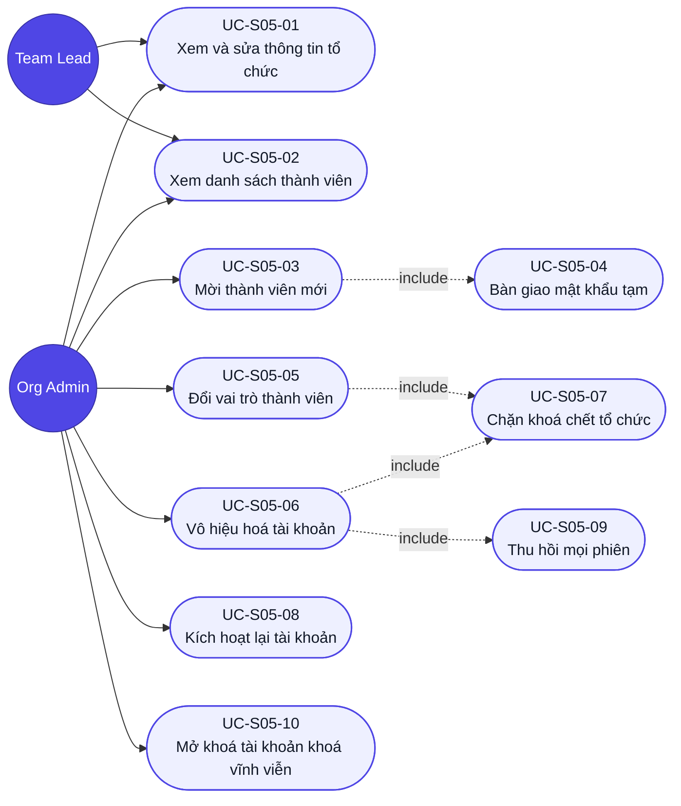

# Use case — Tổ chức

## Sơ đồ Use case (tổng quan)

> Hai tác nhân có phạm vi khác nhau: **Team Lead** chỉ chạm được `UC-S05-01` và `UC-S05-02`; **Org Admin** chạm được tất cả. `UC-S05-07` (chặn khoá chết tổ chức) là luật dùng chung, được cả `UC-S05-05` và `UC-S05-06` gọi vào.

## UC-S05-01: Xem và sửa thông tin tổ chức

- **Tác nhân (actor):** Team Lead hoặc Org Admin.
- **Trigger (kích hoạt):** chọn "Tổ chức" trong menu avatar, hoặc mở `/organization`.
- **Tiền điều kiện:** đã đăng nhập với vai trò Team Lead hoặc Org Admin.
- **Luồng chính (happy path):**
  1. Người dùng mở màn tổ chức.
  2. Hệ thống gọi `GET /organizations/me` và hiển thị logo, tên, slug, ngày tạo, tổng số thành viên.
  3. Người dùng sửa Tên tổ chức và/hoặc Logo.
  4. Hệ thống bật nút "Lưu thay đổi" khi phát hiện khác giá trị gốc và kiểm tra theo bảng Validation.
  5. Người dùng nhấn "Lưu thay đổi" → hệ thống gọi `PATCH /organizations/me` chỉ với trường đã đổi.
  6. Hệ thống cập nhật logo và tên hiển thị, hiện toast "Đã cập nhật thông tin tổ chức".
- **Luồng thay thế / ngoại lệ:**
  - 1a. Người dùng có vai trò **Member** → chặn ngay, chuyển về Dashboard hoặc trang "Không có quyền truy cập"; không render danh sách thành viên dù chỉ trong khoảnh khắc (`R-S05-N05`).
  - 1b. Chưa đăng nhập → chuyển hướng `/login`.
  - 2a. `GET /organizations/me` trả `5xx` → khối lỗi + nút "Thử lại".
  - 3a. Xoá trắng Tên tổ chức hoặc nhập toàn khoảng trắng → lỗi "Vui lòng nhập tên tổ chức", nút Lưu disable.
  - 3b. Tên tổ chức vượt 100 ký tự → lỗi, bộ đếm chuyển đỏ, nút Lưu disable.
  - 3c. Logo không bắt đầu `https://` → lỗi "Đường dẫn logo phải bắt đầu bằng https://" (`BRule-S05-10`).
  - 3d. Xoá trắng Logo → hợp lệ; hiển thị chữ cái đầu tên tổ chức.
  - 4a. Sửa rồi hoàn tác về giá trị gốc → nút Lưu disable trở lại.
  - 5a. Lời gọi thất bại → **giữ nguyên giá trị đã nhập**, báo lỗi trên form (`R-S05-06`).
  - 5b. Người dùng cố sửa `slug` bằng cách gọi thẳng API → máy chủ bỏ qua trường đó (`BRule-S05-02`).
- **Hậu điều kiện (postcondition):** bản ghi `ToChuc` cập nhật đúng trường đã đổi.
- **Đảm bảo (guarantees):** thành công — tên và logo mới hiển thị nhất quán; tối thiểu — slug không bao giờ đổi, Member không bao giờ vào được màn.
- **Trace:** R-S05-01 … R-S05-06, R-S05-N05, R-S05-N06.

## UC-S05-02: Xem danh sách thành viên

- **Tác nhân:** Team Lead (chỉ đọc) hoặc Org Admin.
- **Trigger:** màn tổ chức tải xong, hoặc người dùng nhập từ khoá / đổi bộ lọc.
- **Tiền điều kiện:** đã vào được màn tổ chức.
- **Luồng chính:**
  1. Hệ thống gọi `GET /organizations/me/members` và hiển thị 20 dòng đầu.
  2. Mỗi dòng hiển thị họ tên, email, badge vai trò, badge trạng thái, ngày tham gia.
  3. Người dùng gõ từ khoá vào ô tìm (debounce 300ms) và/hoặc chọn bộ lọc vai trò, trạng thái.
  4. Hệ thống cập nhật danh sách theo **giao** của các điều kiện, không tải lại trang.
- **Luồng thay thế / ngoại lệ:**
  - 1a. Người dùng là **Team Lead** → danh sách hiển thị bình thường nhưng nút "+ Mời thành viên" và cột hành động **không render** (`BRule-S05-01`).
  - 1b. Tổ chức có hơn 20 thành viên → hiện 20 dòng + nút "Tải thêm"; nhấn → thêm 20 dòng kế.
  - 3a. Bộ lọc không khớp ai → "Không tìm thấy thành viên phù hợp" + nút "Xoá bộ lọc"; nhấn → danh sách đầy đủ trở lại.
  - 1c. Danh sách gốc **không bao giờ rỗng** — luôn có ít nhất người đang đăng nhập, nên không có trạng thái rỗng ngoài kết quả lọc.
  - 1d. `GET .../members` lỗi → lỗi cục bộ trong khối Thành viên; khối Thông tin tổ chức vẫn dùng được.
- **Hậu điều kiện:** không dữ liệu nào bị thay đổi.
- **Đảm bảo:** thành công — thấy đúng và đủ thành viên của tổ chức mình; tối thiểu — không bao giờ thấy thành viên tổ chức khác (`R-S05-N01`).
- **Trace:** R-S05-07 … R-S05-11, R-S05-N01.

## UC-S05-03: Mời thành viên mới

- **Tác nhân:** Org Admin.
- **Trigger:** nhấn "+ Mời thành viên".
- **Tiền điều kiện:** đăng nhập với vai trò Org Admin.
- **Luồng chính:**
  1. Org Admin nhấn "+ Mời thành viên" → hệ thống mở modal 4 trường, vai trò mặc định "Thành viên".
  2. Org Admin điền Email, Họ tên, chọn Vai trò, đặt Mật khẩu tạm (hoặc nhấn `⟳` để sinh ngẫu nhiên).
  3. Hệ thống kiểm tra từng trường theo bảng Validation.
  4. Org Admin nhấn "Tạo tài khoản" → hệ thống gọi `POST /organizations/me/members`.
  5. Hệ thống tạo tài khoản trạng thái ACTIVE, hash mật khẩu tạm bằng bcrypt cost ≥ 12.
  6. Hệ thống hiện hộp xác nhận kèm **mật khẩu tạm hiển thị một lần duy nhất** và nút "Sao chép" (`include UC-S05-04`).
  7. Người mới xuất hiện trong danh sách, tổng số thành viên +1.
- **Luồng thay thế / ngoại lệ:**
  - 3a. Email sai định dạng → lỗi "Email không hợp lệ", nút "Tạo tài khoản" disable.
  - 3b. Mật khẩu tạm dưới 8 ký tự hoặc thiếu chữ/số → lỗi, nút disable.
  - 5a. Email đã tồn tại trong hệ thống (kể cả ở tổ chức khác) → API trả `409`; lỗi "Email này đã được sử dụng." hiện dưới trường Email; **ba trường còn lại giữ nguyên**; modal không đóng (`BRule-S05-06`).
  - 4a. Người gọi không phải Org Admin (gọi thẳng API) → `403` (`R-S05-N02`).
  - 4b. Mất mạng → giữ nguyên mọi giá trị trong modal, báo lỗi kết nối.
  - 6a. Org Admin đóng hộp xác nhận mà chưa sao chép → **mật khẩu không xem lại được**; phải đặt lại mật khẩu cho người đó bằng cách khác (ngoài phạm vi giai đoạn 1 — ghi nhận là hạn chế đã biết).
- **Hậu điều kiện:** một bản ghi `NguoiDung` mới thuộc tổ chức hiện tại, trạng thái ACTIVE.
- **Đảm bảo:** thành công — người mới đăng nhập được ngay bằng mật khẩu tạm; tối thiểu — không bao giờ tạo trùng email, và mật khẩu tạm không lưu dạng plaintext.
- **Trace:** R-S05-12, R-S05-13, R-S05-14, R-S05-N02, R-S05-N03, R-S05-N04.

## UC-S05-04: Bàn giao mật khẩu tạm *(use case dùng chung — include)*

- **Tác nhân:** Org Admin (thao tác ngoài hệ thống).
- **Trigger:** tạo tài khoản thành công (`UC-S05-03` bước 6).
- **Tiền điều kiện:** tài khoản mới đã được tạo.
- **Luồng chính:**
  1. Hệ thống hiển thị mật khẩu tạm kèm nút "Sao chép" và cảnh báo sẽ không hiện lại.
  2. Org Admin sao chép mật khẩu.
  3. Org Admin chuyển mật khẩu cho người mới **qua kênh ngoài hệ thống** (nhắn tin, gặp trực tiếp) — hệ thống **không gửi email** (`BRule-S05-07`).
  4. Người mới đăng nhập lần đầu tại S01 bằng email và mật khẩu tạm.
- **Luồng thay thế / ngoại lệ:**
  - 1a. Org Admin đóng hộp mà chưa sao chép → mật khẩu mất vĩnh viễn (`R-S05-N04`); đây là **hạn chế đã biết** của giai đoạn 1, không phải lỗi.
  - 3a. Kênh bàn giao không an toàn (gửi qua chat công khai) → rủi ro lộ mật khẩu; **hệ thống không kiểm soát được** — là lý do `GĐ-03` (buộc đổi mật khẩu lần đầu) được đề xuất mở `CR`.
  - 4a. Người mới không đổi mật khẩu tạm → mật khẩu do Org Admin biết tồn tại vô thời hạn (rủi ro đã ghi nhận ở `GĐ-03`).
- **Hậu điều kiện:** người mới truy cập được hệ thống.
- **Đảm bảo:** thành công — người mới đăng nhập được; tối thiểu — mật khẩu tạm không bao giờ đọc lại được qua bất kỳ endpoint nào sau lần hiển thị đầu.
- **Trace:** R-S05-13, R-S05-N04; `BRule-S05-07`.

## UC-S05-05: Đổi vai trò thành viên

- **Tác nhân:** Org Admin.
- **Trigger:** mở menu `[⋮]` của một dòng và chọn "Đổi vai trò".
- **Tiền điều kiện:** đăng nhập với vai trò Org Admin; đối tượng thuộc cùng tổ chức.
- **Luồng chính:**
  1. Org Admin mở menu hành động của một thành viên và chọn vai trò mới.
  2. Hệ thống kiểm tra luật còn Org Admin (`include UC-S05-07`).
  3. Hệ thống gọi `PATCH /organizations/me/members/:userId` với `vai_tro` mới.
  4. Badge vai trò trên dòng đó đổi ngay.
  5. Quyền mới có hiệu lực với người bị đổi **ở lời gọi API kế tiếp** của họ, không cần đăng nhập lại (`BRule-S05-11`).
- **Luồng thay thế / ngoại lệ:**
  - 2a. Đối tượng là Org Admin **đang hoạt động duy nhất** và vai trò mới thấp hơn → mục menu **bị khoá kèm giải thích ngay trong menu**, không gọi API (`BRule-S05-05`).
  - 3a. Vượt qua giao diện bằng cách gọi thẳng API trong tình huống 2a → máy chủ trả `409` với thông báo "Không thể hạ vai trò quản trị viên duy nhất của tổ chức."; dữ liệu không đổi.
  - 3b. Người gọi không phải Org Admin → `403`.
  - 3c. `userId` thuộc tổ chức khác → `404` (không lộ sự tồn tại — cùng tinh thần `BRule-S03-11`).
  - 1a. Chọn đúng vai trò đang có → không gọi API, đóng menu.
- **Hậu điều kiện:** trường `vai_tro` của đối tượng cập nhật; tổ chức vẫn còn ≥1 Org Admin hoạt động.
- **Đảm bảo:** thành công — quyền mới áp dụng ngay; tối thiểu — tổ chức **không bao giờ** rơi vào trạng thái không còn quản trị viên.
- **Trace:** R-S05-15, R-S05-19, R-S05-N02; `BRule-S05-05`, `BRule-S05-11`.

## UC-S05-06: Vô hiệu hoá tài khoản

- **Tác nhân:** Org Admin.
- **Trigger:** mở menu `[⋮]` của một dòng và chọn "Vô hiệu hoá tài khoản".
- **Tiền điều kiện:** đối tượng đang ở trạng thái ACTIVE và thuộc cùng tổ chức.
- **Luồng chính:**
  1. Org Admin chọn "Vô hiệu hoá tài khoản".
  2. Hệ thống kiểm tra luật còn Org Admin (`include UC-S05-07`).
  3. Hệ thống đếm số công việc đang giao cho người đó và hiện hộp xác nhận nêu **ba hệ quả** kèm con số đó.
  4. Org Admin xác nhận → hệ thống gọi `PATCH /organizations/me/members/:userId` với `trang_thai = INACTIVE`.
  5. Hệ thống thu hồi **mọi phiên** của người đó (`include UC-S05-09`).
  6. Badge trạng thái đổi thành "Vô hiệu"; dòng **vẫn còn** trong danh sách (`BRule-S05-03`).
  7. Người đó biến mất khỏi mọi danh sách chọn người thực hiện ở S02 và S03 (`BRule-S05-09`).
- **Luồng thay thế / ngoại lệ:**
  - 2a. Đối tượng là Org Admin hoạt động duy nhất → mục menu bị khoá kèm giải thích; gọi thẳng API trả `409`.
  - 3a. Org Admin chọn "Huỷ bỏ" → không gọi API, trạng thái giữ nguyên.
  - 4a. Org Admin vô hiệu hoá **chính mình** (tổ chức còn Org Admin khác) → cho phép; sau khi xác nhận thì bị đăng xuất ngay và chuyển về `/login` (`BRule-S05-12`).
  - 4b. Người gọi không phải Org Admin → `403`.
  - 5a. Thu hồi phiên thất bại một phần → ghi log; **không** cuộn ngược việc đổi trạng thái (tài khoản đã INACTIVE là điều quan trọng hơn).
  - 6a. Công việc đang giao cho người đó **giữ nguyên người thực hiện**, không tự chuyển cho ai (`BRule-S05-08`).
- **Hậu điều kiện:** `trang_thai = INACTIVE`; mọi phiên bị thu hồi; dữ liệu và lịch sử công việc còn nguyên.
- **Đảm bảo:** thành công — người bị vô hiệu hoá mất truy cập ngay lập tức; tối thiểu — không bao giờ xoá vật lý, luôn khôi phục lại được.
- **Trace:** R-S05-16, R-S05-17, R-S05-19, R-S05-20; `BRule-S05-03`, `BRule-S05-04`, `BRule-S05-08`, `BRule-S05-12`.

## UC-S05-07: Chặn khoá chết tổ chức *(use case dùng chung — include)*

- **Tác nhân:** hệ thống.
- **Trigger:** trước mỗi thao tác hạ vai trò (`UC-S05-05`) hoặc vô hiệu hoá (`UC-S05-06`).
- **Tiền điều kiện:** đã xác định được đối tượng bị tác động.
- **Luồng chính:**
  1. Hệ thống kiểm tra đối tượng có vai trò `ORG_ADMIN` không. Không phải → cho qua.
  2. Nếu phải, hệ thống đếm số Org Admin **đang hoạt động** (`ACTIVE`) khác trong tổ chức.
  3. Còn ≥1 người khác → cho qua.
  4. Không còn ai khác → **chặn**: giao diện khoá mục menu kèm giải thích; máy chủ trả `409` nếu bị gọi thẳng.
- **Luồng thay thế / ngoại lệ:**
  - 2a. Org Admin khác tồn tại nhưng đang `INACTIVE` → **không tính**; vẫn chặn (người INACTIVE không đăng nhập được nên không cứu được tổ chức).
  - 4a. Hai Org Admin cùng lúc tự hạ vai trò ở hai phiên khác nhau → kiểm tra ở máy chủ phải chạy trong một giao dịch, người thứ hai nhận `409`; **không được** để cả hai cùng thành công.
- **Hậu điều kiện:** tổ chức luôn còn ít nhất một Org Admin `ACTIVE`.
- **Đảm bảo:** thành công — thao tác hợp lệ đi qua bình thường; tối thiểu — **không tồn tại chuỗi thao tác nào** dẫn tới tổ chức không còn quản trị viên.
- **Trace:** R-S05-19; `BRule-S05-05`.

## UC-S05-08: Kích hoạt lại tài khoản

- **Tác nhân:** Org Admin.
- **Trigger:** mở menu `[⋮]` của một dòng đang `INACTIVE` và chọn "Kích hoạt lại".
- **Tiền điều kiện:** đối tượng ở trạng thái `INACTIVE` và thuộc cùng tổ chức.
- **Luồng chính:**
  1. Org Admin chọn "Kích hoạt lại".
  2. Hệ thống gọi `PATCH /organizations/me/members/:userId` với `trang_thai = ACTIVE`.
  3. Badge trạng thái đổi thành "Hoạt động".
  4. Người đó đăng nhập lại được bằng **mật khẩu cũ** và xuất hiện trở lại trong danh sách chọn người thực hiện.
- **Luồng thay thế / ngoại lệ:**
  - 1a. Menu của dòng `INACTIVE` **chỉ có** mục "Kích hoạt lại" — không hiện "Đổi vai trò" hay "Vô hiệu hoá".
  - 2a. Người gọi không phải Org Admin → `403`.
  - 4a. Tài khoản đang `TEMP_LOCKED` (khoá do sai mật khẩu) → **không** phải tình huống của use case này; trạng thái đó tự hết sau 15 phút theo `NFR-03`.
- **Hậu điều kiện:** `trang_thai = ACTIVE`; mọi lịch sử công việc gắn với tài khoản còn nguyên.
- **Đảm bảo:** thành công — nhân sự quay lại dùng đúng tài khoản cũ, không mất lịch sử; tối thiểu — kích hoạt lại không cấp thêm quyền nào ngoài vai trò cũ.
- **Trace:** R-S05-18, R-S05-20; `BRule-S05-03`.

## UC-S05-09: Thu hồi mọi phiên *(use case dùng chung — include)*

- **Tác nhân:** hệ thống.
- **Trigger:** vô hiệu hoá một tài khoản thành công (`UC-S05-06` bước 5).
- **Tiền điều kiện:** `trang_thai` đã chuyển `INACTIVE`.
- **Luồng chính:**
  1. Hệ thống liệt kê mọi `PhienDangNhap` của người bị vô hiệu hoá.
  2. Hệ thống thu hồi **toàn bộ** (khác `UC-S04-04` của màn S04 — ở đó giữ lại phiên hiện tại, ở đây **không giữ lại gì**).
  3. Thiết bị của người đó nhận `401` ở lời gọi API kế tiếp và bị chuyển về `/login`.
  4. Người đó đăng nhập lại thất bại vì tài khoản `INACTIVE`.
- **Luồng thay thế / ngoại lệ:**
  - 1a. Người đó không có phiên nào đang mở → không thu hồi gì, luồng vẫn thành công.
  - 2a. Org Admin tự vô hiệu hoá chính mình → phiên **của chính Org Admin đó** cũng bị thu hồi, họ bị đăng xuất ngay (`BRule-S05-12`).
- **Hậu điều kiện:** không còn phiên hợp lệ nào của người bị vô hiệu hoá.
- **Đảm bảo:** thành công — mất truy cập tức thì, không chờ hết hạn token; tối thiểu — thu hồi lỗi không làm hỏng việc đổi trạng thái tài khoản.
- **Trace:** R-S05-17; `BRule-S05-04`.

## UC-S05-10: Mở khoá tài khoản khoá vĩnh viễn

- **Tác nhân:** Org Admin.
- **Trigger:** mở menu `[⋮]` của một dòng đang `PERM_LOCKED` (khoá vĩnh viễn) và chọn "Mở khoá".
- **Tiền điều kiện:** đối tượng ở trạng thái `PERM_LOCKED` và thuộc cùng tổ chức; đăng nhập với vai trò Org Admin. *(Trạng thái `PERM_LOCKED` do S01 đặt khi người dùng đăng nhập sai vượt ngưỡng — `E-S01-07`; tài khoản khoá vĩnh viễn **không tự phục hồi**, chỉ Org Admin mở khoá được.)*
- **Luồng chính:**
  1. Org Admin chọn "Mở khoá".
  2. Hệ thống hiện hộp xác nhận nêu rõ hệ quả (tài khoản khoá lại được đăng nhập).
  3. Org Admin xác nhận → hệ thống gọi `PATCH /organizations/me/members/:userId` với `trang_thai = ACTIVE`.
  4. Badge trạng thái đổi thành "Hoạt động"; hệ thống ghi **một dòng nhật ký/audit** "Org Admin mở khoá tài khoản".
  5. Người đó **đăng nhập lại được** (bộ đếm đăng nhập sai được đặt lại theo S01).
- **Luồng thay thế / ngoại lệ:**
  - 1a. Menu của dòng `PERM_LOCKED` **chỉ có** mục "Mở khoá" — không hiện "Đổi vai trò"/"Vô hiệu hoá"/"Kích hoạt lại".
  - 2a. Org Admin chọn "Huỷ bỏ" → không gọi API, trạng thái giữ nguyên `PERM_LOCKED`.
  - 3a. Người gọi **không phải Org Admin** → nút "Mở khoá" **không render**; gọi thẳng API trả `403`, trạng thái không đổi (`BRule-S05-13`, `R-S05-N02`).
  - 3b. `userId` thuộc tổ chức khác → `404` (không lộ sự tồn tại — cùng tinh thần `UC-S05-05` 3c).
- **Hậu điều kiện:** `trang_thai = ACTIVE`; có một dòng audit ghi lại thao tác mở khoá; mọi lịch sử công việc gắn với tài khoản còn nguyên.
- **Đảm bảo:** thành công — người bị khoá vĩnh viễn quay lại đăng nhập được bằng đúng tài khoản cũ; tối thiểu — không tồn tại trạng thái người dùng **kẹt vĩnh viễn** không có đường phục hồi (khép lại phụ thuộc `E-S01-07` của S01).
- **Trace:** R-S05-21, R-S05-N02; `BRule-S05-13`.
